# Papers Explained 214 - Florence-2

While existing large vision models excel in transfer learning, they struggle to perform a diversity of tasks with simple instructions, Florence-2 was designed to take text-prompt as task instructions and generate desirable results in text forms, whether it be captioning, object detection, grounding or segmentation.

This page ingests the source article into the wiki and connects it to [[Papers Explained Corpus]], [[Computer Vision]], [[Vision Language Models]], [[Synthetic Data]], [[Safety and Alignment]].

## Source Metadata

- Source file: `raw/2024-09-19_Papers-Explained-214--Florence-2-c4e17246d14b.md`
- Source title: Papers Explained 214: Florence-2
- Published: 2024-09-19
- Canonical: [https://medium.com/@ritvik19/papers-explained-214-florence-2-c4e17246d14b](https://medium.com/@ritvik19/papers-explained-214-florence-2-c4e17246d14b)

## Key Ideas

- While existing large vision models excel in transfer learning, they struggle to perform a diversity of tasks with simple instructions, Florence-2 was designed to take text-prompt as task instructions and generate desirable results in text forms, whether it be...
- To meet the demand of such multi task learning FLD-5 Dataset, consisting of 5.4B comprehensive visual annotations on 126M images is curated, using an iterative strategy of automated image annotation and model refinement.
- The models are available at [HuggingFace](https://huggingface.co/collections/microsoft/florence-6669f44df0d87d9c3bfb76de).
- Recommended Reading [Papers Explained 213: Florence](https://ritvik19.medium.com/papers-explained-213-florence-f93a3a7d9ef0)
- The existing three pre-training paradigms: supervised (e.g., ImageNet classification), self-supervised (e.g., SimCLR, MoCo, BEiT, MAE), and weakly supervised (e.g., CLIP, Florence, SAM) capture unique aspects of visual data but are inherently limited by the...

## Notes

While existing large vision models excel in transfer learning, they struggle to perform a diversity of tasks with simple instructions, Florence-2 was designed to take text-prompt as task instructions and generate desirable results in text forms, whether it be captioning, object detection, grounding or segmentation.

To meet the demand of such multi task learning FLD-5 Dataset, consisting of 5.4B comprehensive visual annotations on 126M images is curated, using an iterative strategy of automated image annotation and model refinement.

The models are available at [HuggingFace](https://huggingface.co/collections/microsoft/florence-6669f44df0d87d9c3bfb76de).

Recommended Reading [Papers Explained 213: Florence](https://ritvik19.medium.com/papers-explained-213-florence-f93a3a7d9ef0)

## Rethinking Vision Model Pre-training

The existing three pre-training paradigms: supervised (e.g., ImageNet classification), self-supervised (e.g., SimCLR, MoCo, BEiT, MAE), and weakly supervised (e.g., CLIP, Florence, SAM) capture unique aspects of visual data but are inherently limited by the constraints of single-task learning frameworks. To overcome these limitations, a multitask learning approach is proposed that incorporates three distinct learning objectives:

- Image-level understanding tasks: These tasks capture high-level semantics and enable the model to comprehend the overall context of an image through linguistic descriptions. Examples include image classification, captioning, and visual question answering.

- Region/pixel-level recognition tasks: These tasks facilitate detailed object and entity localization within images, capturing relationships between objects and their spatial context. Examples include object detection, segmentation, and referring expression comprehension.

- Fine-grained visual-semantic alignment tasks: These tasks require fine-grained understanding of both text and image, involving locating the image regions that correspond to text phrases (e.g., objects, attributes, or relations). This challenges the ability to capture local details of visual entities and their semantic contexts.

By combining these three learning objectives in a multitask learning framework, the foundation model learns to handle different levels of detail and semantic understanding.

## Model

*Figure: Florence-2 Model Architecture.*

The Florence-2 model uses a sequence-to-sequence learning paradigm to integrate multiple tasks. It takes images and task prompts as input, and generates text outputs based on those inputs.

Task Formulation

All the following tasks are formulated as a translation problem.

*Figure: Supported Tasks and annotations used for Florence-2 pretraining.*

Depending on the task, the prompt and response can be either text or region

For region-specific tasks, location tokens are added to the tokenizer’s vocabulary list, representing quantized coordinates. 1000 bins are created to represent regions using formats tailored to task requirements:

- Box representation (x0, y0, x1, y1) for object detection and dense region captioning.

- Quad box representation (x0, y0, …, x3, y3) for text detection and recognition tasks.

- Polygon Representation (x0, y0, …, xn, yn) for referring segmentation tasks.

Vision Encoder

DaViT is used as the vision encoder to process an input image I into flattened visual token embeddings V.

Multi-modality encoder decoder

A standard encoder-decoder transformer architecture is used to process visual and language token embeddings. Prompt text embeddings T_prompt are obtained using an extended language tokenizer and word embedding layer. The vision token embeddings are concatenated with prompt embeddings to form the multi-modality encoder module input, X = [V′, T_prompt], where V′ is obtained by applying a linear projection and LayerNorm layer to V for dimensionality alignment.

Optimization objective

Given the input x combined from the image and the prompt, and the target y, the standard language modeling with cross-entropy loss is used for all the tasks.

*Figure: where θ are the network parameters, |y| is the number of target tokens.*

## Data Engine

*Figure: Florence-2 data engine.*

To create a comprehensive dataset for multitask learning, five datasets (ImageNet-22k, Object365, Open Images, Conceptual Captions, and LAION) are curated from classification, object detection, and image captioning tasks. To generate annotations, three categories are used: text, region-text pairs, and text-phrase-region triplets.

The annotation process consists of three phases:

Initial annotation using specialist models: Synthetic labels from pre-trained models are used to start the annotation process for each category. If a dataset already has human annotations, they are merged with the synthetic labels.

Data filtering and enhancement:

- Textual annotations: A spacy based parsing tool is used to extract objects, attributes, and actions, and texts with excessive objects or low complexity are filtered out.

- Region annotations (bounding boxes): Noisy boxes are removed based on a confidence score threshold, and non-maximum suppression is applied to reduce redundant or overlapping bounding boxes.

Iterative data refinement: The filtered initial annotations are used to train a multitask model that processes sequences of data. Upon evaluation, the model shows improved predictions, particularly in instances with inaccurate or noisy labels. This process is repeated iteratively to refine the quality of the training dataset.

Additionally, tasks initially bypassed due to insufficient data for specialist models are pre-trained using the iteratively trained model and then fine-tuned on sparse datasets, resulting in superior performance compared to a model trained from scratch. The fine-tuned model is used as a specialist to annotate an expansive dataset comprising 126 million images, ensuring comprehensive annotation coverage.

### Annotation-specific Variations

Text Annotations

- Three types: brief, detailed, and more detailed.

- Brief text includes one sentence describing the most salient objects and activities.

- Detailed and more detailed texts include multiple sentences describing the image with richer objects, attributes, and actions.

- For brief text, a Florence-2 model is trained on publicly available datasets to generate initial annotations, which are then refined iteratively to minimize noise.

- For detailed text, prompts including existing image annotations are fed to large language models (LLMs) or large multimodal models (LMMs) to generate comprehensive descriptions.

Region-text Pairs

- Provide descriptive textual annotation for semantic regions in the image.

- Semantic regions include visual objects and text regions.

- Each region is represented by a tight bounding box and can be annotated with varying degrees of granularity, including phrases and sentences.

- Region-text pairs are annotated differently for text regions (using Azure AI Services’ OCR API) and visual object regions (initially using DINO object detector).

- Textual annotations for visual object regions are further enriched by brief text generated from an image-to-text model with cropped image regions.

Text-phrase-region Triplets

- Consist of a descriptive text of the image, noun phrases in this text related to image objects, and region annotations for these objects.

- The text includes brief, detailed, and more detailed text generated earlier.

- For each text, the Grounding DINO model identifies noun phrases and creates bounding boxes for them.

- The SAM model generates segmentation masks for each box, offering more precise object localization.

- Data filtering is applied to ensure relevance, including a confidence score threshold and a blacklist to exclude irrelevant noun phrases like pronouns and abstract concepts.

*Figure: An illustrative example of an image and its corresponding annotations in FLD-5B dataset.*

FLD-5B has several advantages over the previous ones, such as having more annotations in total and per image. Moreover, the annotations in the data set span multiple levels of spatial and semantic granularity, which allows for more diverse and comprehensive visual understanding tasks.

*Figure: Comparison with datasets in vision foundation model training.*

## Experiment Setup

Two models, Florence-2-B and Florence-2-L are trained on FLD-5B to learn a universal image representation having 232M and 771M parameters respectively.

*Figure: Model configuration of different size.*

The experiments are conducted in three parts:

- Zero-shot performance: The models’ ability to handle multiple tasks without fine-tuning is evaluated.

- Adaptability: One single generalist model is further trained with additional supervised data on various tasks, achieving competitive state-of-the-art performance.

- Performance as a backbone: The learned visual representation’s performance on downstream tasks is examined.

*Figure: Collection of dataset for finetuning one single generalist model for downstream tasks evaluation.*

The models are initialized from UniCL and BART, respectively. The models are trained on an image size of 384×384 until reaching 3B effective training samples. Additionally, high-resolution tuning is conducted for 0.5B samples (base) and 0.1B samples (large) at an image size of 768×768.

## Evaluation

### Zero-shot Evaluation Across Tasks

*Figure: Zero-shot performance of generalist vision foundation models.*

Image-Level Captioning: Florence-2-L achieves a 135.6 CIDEr score on the COCO caption benchmark, outperforming the 80B parameter Flamingo model with significantly fewer parameters.

Region-Level Grounding and Referring Expression Comprehension: Florence-2-L sets new zero-shot performance records:

- 5.7 improvement in Flickr30k Recall@1 compared to Kosmos-2.

- Approximately 4%, 8%, and 8% absolute improvements on Refcoco, Refcoco+, and Refcocog, respectively, compared to Kosmos-2.

Referring Expression Segmentation (RES): Florence-2-L achieves a 35.8% mIOU in the Refcoco RES task, a capability not demonstrated by previous foundation models.

### Generalist Model with Public Supervised Data

*Figure: Performance of specialist and generalist models on captioning and VQA tasks.*

*Figure: Performance of specialist and generalist models on region-level tasks.*

- Florence-2-L outperforms PolyFormer on the RefCOCO REC task by 3.0 Accuracy@0.5 and on the RES task by 3.54 mIOU, despite PolyFormer’s specific design for coordinate prediction.

- Florence-2-L also outperforms UNINEXT, which is based on Deformable DETR and DINO, by 0.8 Accuracy@0.5 on the RefCOCO task.

- The model achieves a CIDEr score of 140.0 on the COCO Caption Karpathy test split, outperforming larger models like Flamingo (80B parameters, 138.1 CIDEr score).

- Florence-2-L sets a new state-of-the-art performance with an accuracy of 81.5 in the TextVQA task without any external OCR token input.

### Downstream Tasks Fine-tuning

*Figure: COCO object detection and instance segmentation results using Mask-RCNN framework, and COCO object detection results using DINO-4scale framework.*

*Figure: Downstream task fine-tuning on COCO and ADE20K dataset. COCO object detection using Mask R-CNN and DINO. ADE20K semantic segmentation using UperNet.*

*Figure: ADE20K semantic segmentation results using UperNet.*

Florence-2 pre-training significantly outperforms previous approaches on all tasks:

Object Detection (COCO):

- DaViT-B model with Florence-2 pre-training surpasses ConvNeXt v2-B (pre-trained by FCMAE) by 0.7 APb using Mask R-CNN.

- Achieves a notable improvement of 4.2 AP with DINO framework compared to ViT-B.

Semantic Segmentation (ADE20k):

- Outperforms BEiT-pretrained ViT-B by 1.3 and 1.4 points in single-scale and multi-scale testing protocols, respectively.

Florence-2 pre-training demonstrates higher training efficiency:

- Achieves 4x efficiency compared to models with supervised ImageNet-1k pre-training.

- Significant improvement of 6.9 AP and 5.5 AP with Mask-RCNN and DINO framework, respectively.

## Paper

Florence-2: Advancing a Unified Representation for a Variety of Vision Tasks [2311.06242](https://arxiv.org/abs/2311.06242)

Recommended Reading [Multi Modal Transformers](https://ritvik19.medium.com/list/multi-modal-transformers-67453f215ecf)

## Figures

Figures from the Medium HTML export (`raw/2024-09-19_Papers-Explained-214--Florence-2-c4e17246d14b.md`); local copies under `wiki/assets/papers-explained-214-florence-2/` when download succeeded.

| Figure | Caption |
|--------|---------|
| 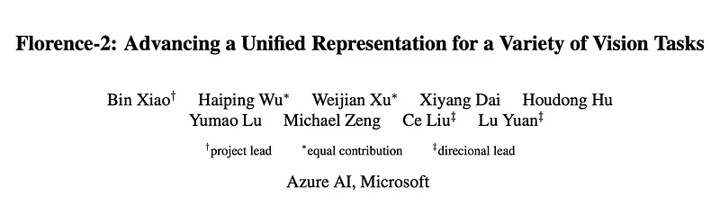 | Florence-2 Overview: A unified vision foundation model for various tasks. |
| 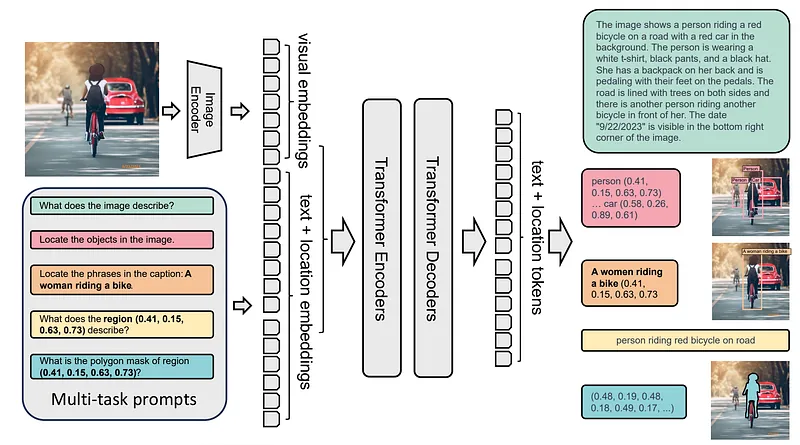 | Florence-2 Model Architecture: A sequence-to-sequence learning paradigm. |
| 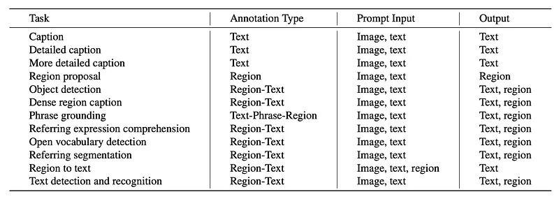 | Supported Tasks and annotations used for Florence-2 pretraining. |
|  | Optimization objective formula using standard language modeling with cross-entropy loss. |
| 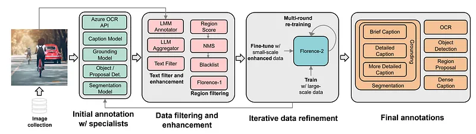 | Florence-2 Data Engine: Iterative annotation and refinement process. |
| 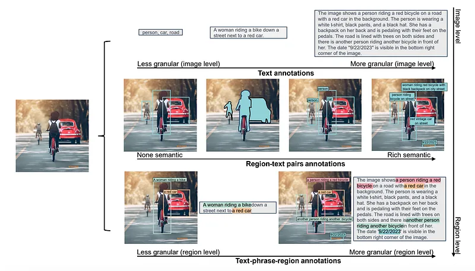 | Illustrative example of an image and its corresponding annotations in FLD-5B dataset. |
| 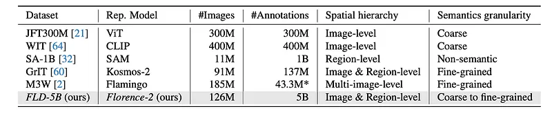 | Comparison with existing datasets in vision foundation model training. |
| 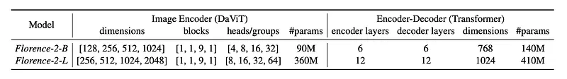 | Model configuration of Florence-2-B and Florence-2-L variants. |
| 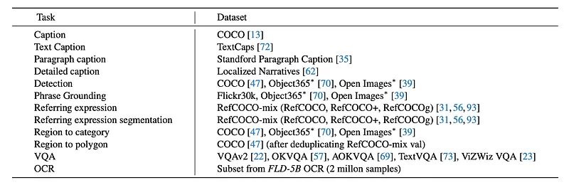 | Collection of datasets used for fine-tuning the generalist model. |
| 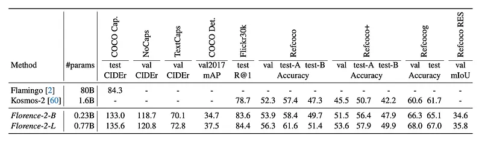 | Zero-shot performance of generalist vision foundation models on various tasks. |
| 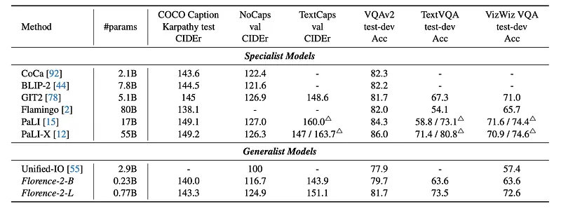 | Performance of specialist and generalist models on captioning and VQA tasks. |
| 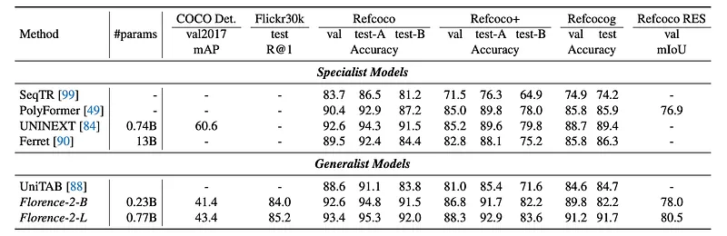 | Performance of specialist and generalist models on region-level tasks. |
| 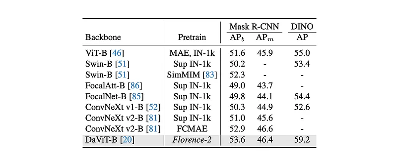 | COCO object detection and instance segmentation results (Mask-RCNN and DINO frameworks). |
| 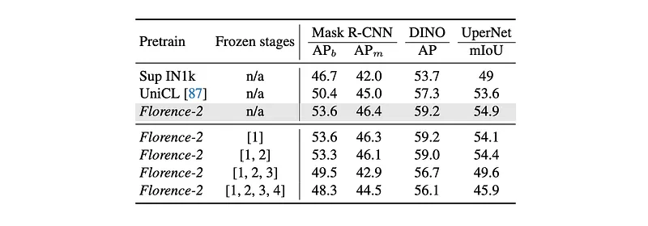 | Downstream task fine-tuning results on COCO and ADE20K datasets. |
| 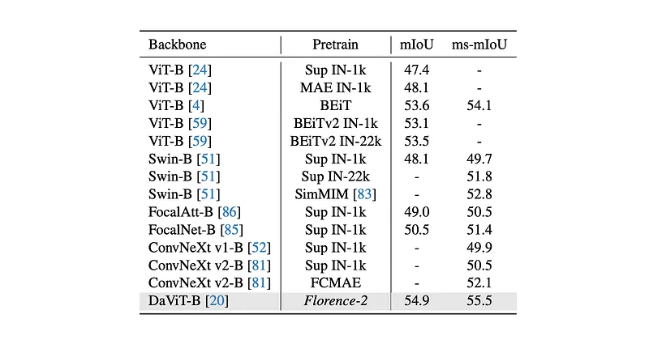 | ADE20K semantic segmentation results using the UperNet framework. |
## Related

- [[Papers Explained Corpus]]
- [[Computer Vision]]
- [[Vision Language Models]]
- [[Synthetic Data]]
- [[Safety and Alignment]]
- [[Papers Explained 213 - Florence]]
- [[Papers Explained 215 - Swin Transformer V2]]

#summary #topic
