# Papers Explained 216 - MobileLLM

Mobile LLM leverages deep and thin architectures, embedding sharing, and grouped-query attention mechanisms to establish a strong baseline network, which achieves a remarkable 2.7%/4.3% accuracy boost over previous state-of-the-art 125M/350M models.

This page ingests the source article into the wiki and connects it to [[Papers Explained Corpus]], [[Model Compression and Efficiency]], [[Embedding and Retrieval]], [[Large Language Models]], [[Synthetic Data]], [[Code Models]].

## Source Metadata

- Source file: `raw/2024-09-23_Papers-Explained-216--MobileLLM-2d7fdd5acd86.md`
- Source title: Papers Explained 216: MobileLLM
- Published: 2024-09-23
- Canonical: [https://medium.com/@ritvik19/papers-explained-216-mobilellm-2d7fdd5acd86](https://medium.com/@ritvik19/papers-explained-216-mobilellm-2d7fdd5acd86)

## Key Ideas

- This work also proposes an immediate block-wise weight-sharing approach with no increase in model size and only marginal latency overhead.
- The pre-training code is available at [Github](https://github.com/facebookresearch/MobileLLM).
- Activation functions commonly used in feed-forward networks are investigated, and the state-of-the-art SwiGLU is found to be beneficial for small models as well.
- A common assumption is that the performance of transformer models is mainly determined by: the number of parameters, the size of the training dataset, and the number of training iterations, suggesting that architectural designs have little to no impact on the...
- However, findings in this study contradict this idea for smaller models with limited capacity. It is found that increasing depth is more important than increasing width for improving performance in small models.

## Notes

Mobile LLM leverages deep and thin architectures, embedding sharing, and grouped-query attention mechanisms to establish a strong baseline network, which achieves a remarkable 2.7%/4.3% accuracy boost over previous state-of-the-art 125M/350M models.

This work also proposes an immediate block-wise weight-sharing approach with no increase in model size and only marginal latency overhead. The resultant models, denoted as MobileLLM-LS, demonstrate a further accuracy enhancement of 0.7%/0.8% than MobileLLM 125M/350M.

The pre-training code is available at [Github](https://github.com/facebookresearch/MobileLLM).

## Approach

*Figure: Design roadmap of MobileLLM.*

### Feed Forward Network Choice

Activation functions commonly used in feed-forward networks are investigated, and the state-of-the-art SwiGLU is found to be beneficial for small models as well.

### Architecture Depth vs Width

A common assumption is that the performance of transformer models is mainly determined by: the number of parameters, the size of the training dataset, and the number of training iterations, suggesting that architectural designs have little to no impact on the model’s performance.

However, findings in this study contradict this idea for smaller models with limited capacity. It is found that increasing depth is more important than increasing width for improving performance in small models.

### Embedding Sharing

In sub-billion scale language models, the embedding layers constitute a significant portion of the parameter count. However, this proportion is considerably lower in larger language models.For instance, an embedding layer with an embedding dimension of 512 and a vocabulary size of 32k accounts for more than 20% of the total parameters of a 125M-parameter model but a mere 0.7% in the LLaMA-70B model. This disparity may explain why embedding sharing was initially proposed and implemented in OPT models, but later abandoned in recent designs of LLMs.

By sharing the embedding, the input embedding weights are reused as the output fully connected layer weights, resulting in a more efficient and compact model architecture. This approach initially results in a marginal accuracy drop which is readily restored by reallocating the saved parameters to add more layers.

### Number of Heads And K-V Heads

Experiments conducted on both the sizes show that using 16 query heads produces the best results. Additionally, reducing the number of key-value heads from 16 to 4 resulted in comparable accuracy for the 125M model and only a 0.2 point accuracy drop in the 350M model with a 10% reduction in model size.

It is also found that adopting GQA and increasing the embedding dimension can further increase the accuracy of the 125M model by 0.4 points, indicating GQA as a favorable method to squeeze out small models’ potential.

### Layer Sharing

The impact of layer depth motivates to investigate layer sharing as a strategy to increase the number of hidden layers without additional model storage cost. This approach is particularly helpful in on-device scenarios where model size is a major constraint.

Three different weight-sharing strategies are examined: immediate block-wise repeat, repeat all-over, and reverse sharing.

*Figure: (a) Baseline model without layer sharing; (b) Immediate block-wise sharing; (c) Repeat-all-over sharing; (d) Reverse sharing. A transformer block contains the multihead self-attention (MHSA) and the feed-forward network (FFN).*

According to the results, the immediate block-wise repeat strategy produces the best performance. However, considering the hardware memory hierarchy, the immediate block-wise sharing strategy is chosen for the model design as the shared weights can stay in the cache and be immediately computed twice.

## Experiment Setup

Quick exploration experiments are performed with 120k iterations on 0.25T tokens and the best models are trained with 480k iterations on 1T tokens.

*Figure: Detailed architecture specifications of MobileLLM.*

The pre-trained models are evaluated on zero-shot common sense reasoning tasks, including ARC-easy, ARCchallenge, BoolQ, PIQA, SIQA, HellaSwag, OBQA, WinoGrande,TQA and RACE dataset.

## Evaluation

### Main Results

*Figure: Zero-shot performance on Common Sense Reasoning tasks.*

*Figure: Performance on Trivia QA and RACE datasets for question answering and reading comprehension tasks.*

- For 125M model size, MobileLLM outperforms previous models such as OPT, GPT-Neo, and Galactica by a significant margin.

- MobileLLM-125M achieves higher accuracy than Pythia-160M and RWKV169M while being smaller.

- Incorporating layer-sharing in MobileLLM-LS125M results in an additional improvement in accuracy.

- For 350M model size, MobileLLM surpasses previous state-of-the-art models by more than 4 points with comparable or smaller model sizes.

- On the TQA question answering benchmark, MobileLLM125M demonstrates a noteworthy improvement of over 4.3 points compared to previous SOTA.

- On the RACE reading comprehension benchmark, the MobileLLM model family exhibits significantly higher scores than previous SOTA.

### Downstream Tasks

Chat

*Figure: Benchmark results on AlpacaEval (Evaluator: GPT4; Reference model: text-davinci-001) and MT-Bench.*

- MobileLLM models significantly outperform previous SoTA sub-billion scale models, surpassing even models with 1 billion parameters.

- MobileLLM-LS-350M achieves a remarkable win rate of 48.2% compared to the baseline GPT-3 model (text-davinci-001).

- The self-win rate of GPT-3 is 50%, making it noteworthy that MobileLLM-LS-350M obtains comparable chat performance as this baseline model.

API Calling

*Figure: API calling evaluation score.*

- MobileLLM-350M demonstrates comparable intent and structure exact match scores to LLaMAv2 7B.

- Intent scores indicate correct prediction of the API user intends to call.

- Structural exact match scores reflect proficiency in predicting content within API functions.

- Rouge scores are lower for MobileLLM-350M compared to 7B models, but API calling prioritizes correct API invocation.

### Compatibility with Quantization

Per-token min-max post-training quantization (PTQ) experiments are conducted on both MobileLLM and MobileLLM-LS models with 125M and 350M model sizes trained on 0.25T tokens.

*Figure: Comparison between BFloat16 model and 8-bit weight 8-bit activation post-training quantized model.*

- Employing W8A8 PTQ yields a modest accuracy reduction of less than 0.5 points and remains compatible with layer sharing.

### Scaling Up to Larger Model Architectures

The design principles — SwiGLU, deeper architecture, grouped-query attention, and embedding sharing — are extended to larger models, pre-training MobileLLM-600M, 1B, and 1.5B variants.

*Figure: Zero-shot performance on Common Sense Reasoning tasks for MobileLLM-600M, 1B and 1.5B.*

- MobileLLM consistently surpasses previous models of similar scale.

- Notably, MobileLLM-1.5B achieves an average accuracy of 59.4 points on zero-shot commonsense reasoning tasks, outperforming the previous state-of-the-art model, Qwen1.5–1.8B, by 2.9 points despite the latter having more parameters.

## Paper

MobileLLM: Optimizing Sub-billion Parameter Language Models for On-Device Use Cases [2402.14905](https://arxiv.org/abs/2402.14905)

Recommended Reading [Small LLMs](https://ritvik19.medium.com/list/small-llms-41124d5c7c80)

## Figures

Figures from the Medium HTML export (`raw/2024-09-23_Papers-Explained-216--MobileLLM-2d7fdd5acd86.md`); local copies under `wiki/assets/papers-explained-216-mobilellm/` when download succeeded.

| Figure | Caption |
|--------|---------|
| 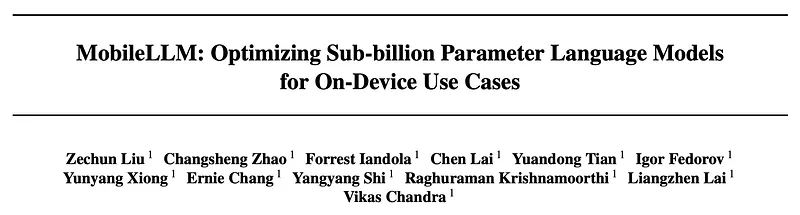 | MobileLLM Overview: Optimizing sub-billion parameter models for on-device use. |
| 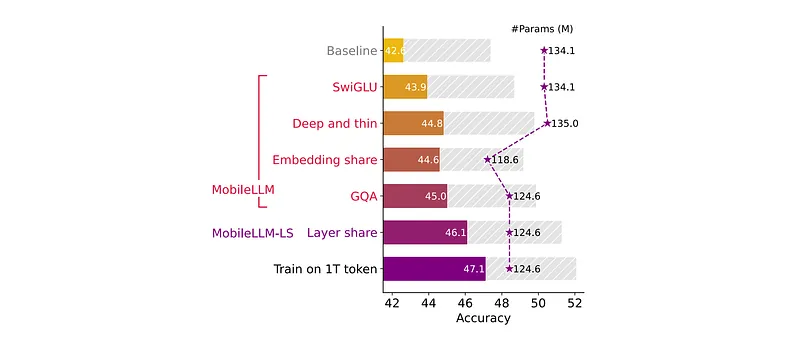 | Design roadmap of MobileLLM development. |
| 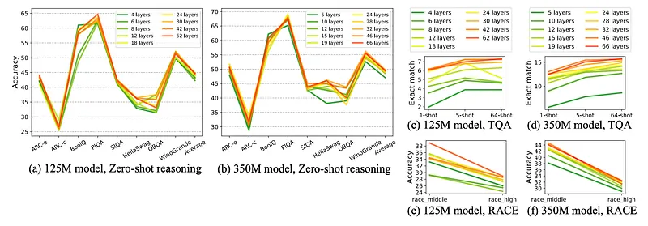 | Architecture Depth vs Width: Performance impact on small models. |
| 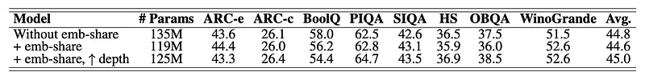 | Embedding Sharing: Parameter efficiency in sub-billion scale models. |
|  | Number of Heads and K-V Heads: Impact on model performance and size. |
| 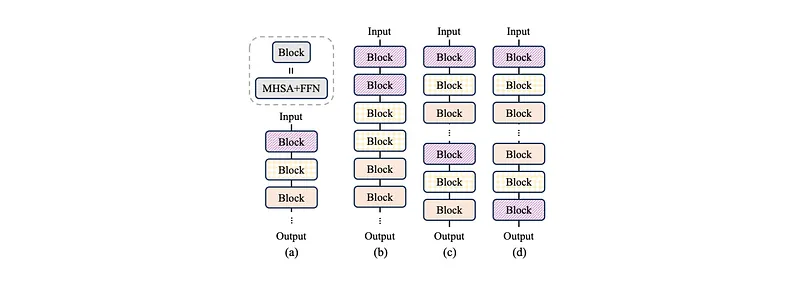 | Weight-sharing strategies: (a) Baseline, (b) Block-wise, (c) Repeat-all-over, (d) Reverse. |
| 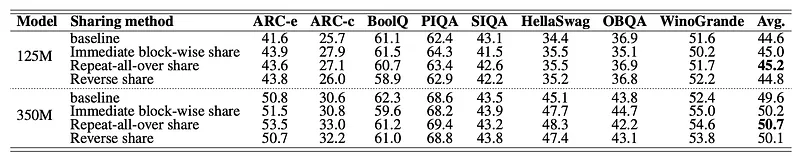 | Performance comparison of different weight-sharing strategies. |
| 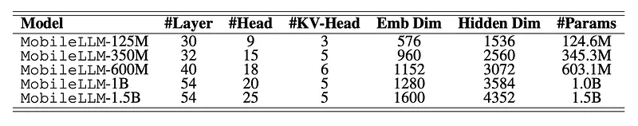 | Detailed architecture specifications of MobileLLM variants. |
| 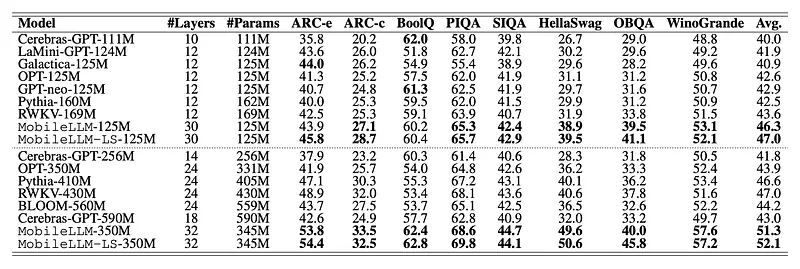 | Zero-shot performance on Common Sense Reasoning tasks. |
| 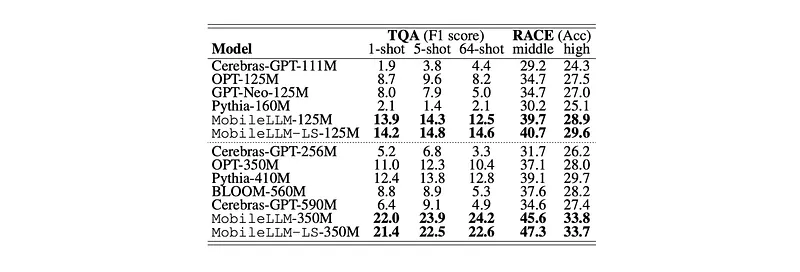 | Performance on Trivia QA and RACE datasets for QA and reading comprehension. |
| 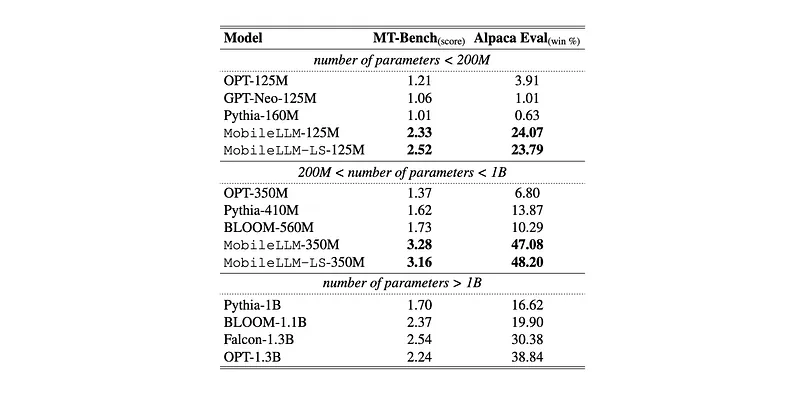 | Benchmark results on AlpacaEval and MT-Bench chat evaluations. |
|  | API calling evaluation scores: Intent and structure exact match results. |
|  | Quantization compatibility: Comparison between BFloat16 and W8A8 PTQ models. |
| 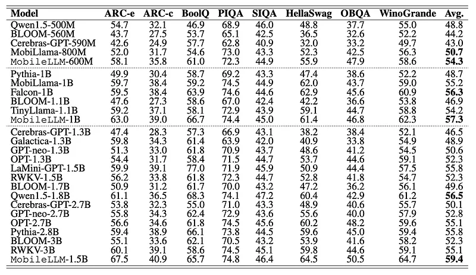 | Scaling performance: Zero-shot reasoning results for 600M to 1.5B variants. |
## Related

- [[Papers Explained Corpus]]
- [[Model Compression and Efficiency]]
- [[Embedding and Retrieval]]
- [[Large Language Models]]
- [[Synthetic Data]]
- [[Code Models]]
- [[Papers Explained 215 - Swin Transformer V2]]
- [[Papers Explained 217 - H2O Danube 3]]

#summary #topic
