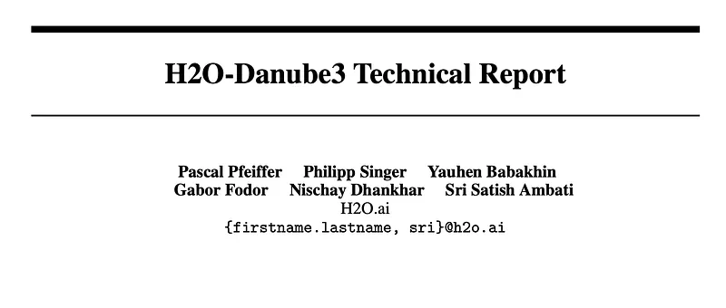
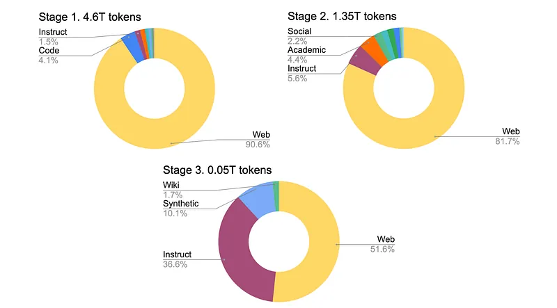
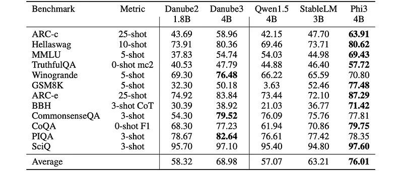
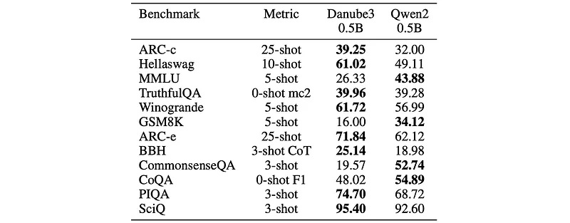
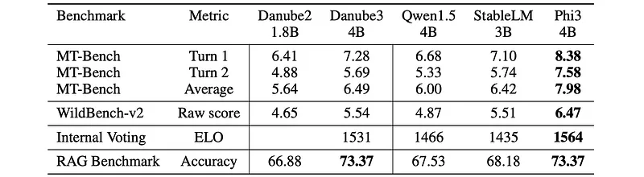
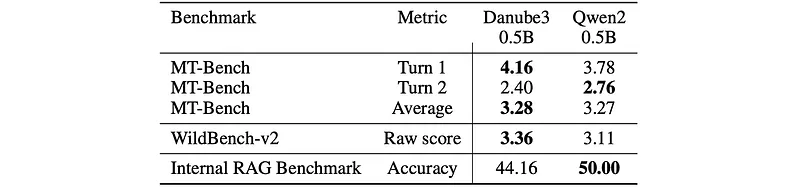
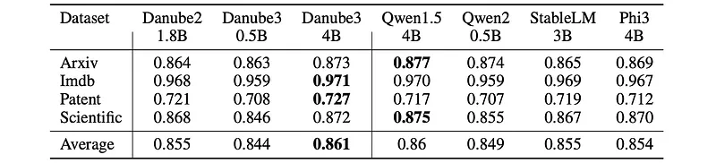
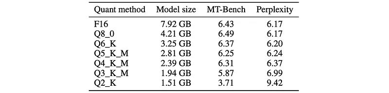

# Papers Explained 217 - H2O Danube 3

H2O-Danube3 is a series of small language models that can be efficiently run on modern smartphones and other edge devices. The models are trained on high-quality Web data and consist of two variants: H2O-Danube3–4B, which was trained on 6T tokens, and H2O-Danube3–500M, which was trained on 4T tokens.

This page ingests the source article into the wiki and connects it to [[Papers Explained Corpus]], [[Model Compression and Efficiency]], [[Large Language Models]], [[Synthetic Data]], [[Reasoning Models]], [[Evaluation and Benchmarks]].

## Source Metadata

- Source file: `raw/2024-09-24_Papers-Explained-217--H2O-Danube-3-917a7b40a79f.md`
- Source title: Papers Explained 217: H2O Danube 3
- Published: 2024-09-24
- Canonical: [https://medium.com/@ritvik19/papers-explained-217-h2o-danube-3-917a7b40a79f](https://medium.com/@ritvik19/papers-explained-217-h2o-danube-3-917a7b40a79f)

## Key Ideas

- H2O-Danube3 is a series of small language models that can be efficiently run on modern smartphones and other edge devices.
- The models are available at [HuggingFace](https://huggingface.co/collections/h2oai/h2o-danube3-6687a993641452457854c609).
- Recommended Reading [Papers Explained 111: H2O Danube 1.8B](https://ritvik19.medium.com/papers-explained-111-h2o-danube-1-8b-b790c073d257)
- H2O-Danube3 uses the general Llama model architecture adopting core principles from Llama 2 and Mistral with custom parameters determining the shape of each layer and total parameter count. The Mistral tokenizer with a vocabulary size of 32k is used.
- Models are primarily trained on English text in three stages with different data mixes. At each stage, the percentage of noisy web data is gradually decreased in favor of higher quality data.

## Notes

H2O-Danube3 is a series of small language models that can be efficiently run on modern smartphones and other edge devices. The models are trained on high-quality Web data and consist of two variants: H2O-Danube3–4B, which was trained on 6T tokens, and H2O-Danube3–500M, which was trained on 4T tokens. The models were pre-trained in three stages with different data mixes before being fine-tuned for a chat version.

The models are available at [HuggingFace](https://huggingface.co/collections/h2oai/h2o-danube3-6687a993641452457854c609).

Recommended Reading [Papers Explained 111: H2O Danube 1.8B](https://ritvik19.medium.com/papers-explained-111-h2o-danube-1-8b-b790c073d257)

## Model Architecture

H2O-Danube3 uses the general Llama model architecture adopting core principles from Llama 2 and Mistral with custom parameters determining the shape of each layer and total parameter count. The Mistral tokenizer with a vocabulary size of 32k is used. The model uses Grouped Query Attention and is optimized towards parameter and compute efficiency resulting in a wide architecture. The model is trained up to a context length of 8,192.

*Figure: Key model parameters.*

## Training

Models are primarily trained on English text in three stages with different data mixes. At each stage, the percentage of noisy web data is gradually decreased in favor of higher quality data. Simultaneously, the share of instruct data, Wikipedia academic texts, synthetic texts and other higher quality textual data is increasing.

*Figure: Data stages for H2O-Danube3–4B.*

## Evaluation

### Academic Benchmarks

*Figure: Academic benchmarks.*

- Danube 3 Achieves very competitive and consistent results across all benchmarks.

- Best-in-class performance on CommonsenseQA, PhysicsQA benchmarks.

- Strong accuracy of 50.14% on the math-centered GSM8K benchmark.

- Ranks second to Phi-3-mini-4k-instruct in most benchmarks.

- Scores over 80% on the 10-shot hellaswag benchmark, closing the gap to larger models.

*Figure: Academic benchmarks for smaller models.*

- Danube-3 500M scores highest in eight out of twelve benchmarks compared to similar-sized Qwen2–0.5B-Instruct.

- Considered a new well-rounded model for its parameter count.

### Chat Benchmarks

*Figure: Chat benchmarks.*

- H2O-Danube3–4B-Chat consistently performs very well across all benchmarks, surpassing other similar sized models and outperforming the previous Danube2 release, while Phi-3-mini takes the top spot.

*Figure: Chat benchmarks for smaller models.*

- The 500M parameter version of the model H2O-Danube3–500M-Chat shows results that are comparable to Qwen2–0.5B-Instruct model.

- In particular, they achieve a close MT-Bench average score (H2O-Danube3–500M-Chat being better in the 1st turn), while H2O-Danube3–500M-Chat produces better results on Wild-Bench benchmark.

### Fine-Tuning Benchmarks

*Figure: Fine-tuning benchmarks.*

- For all models and datasets, the most commonly used settings with LoRA (r = 16, α = 32) and same hyperparameters (bs = 1, epochs = 1, lr = 1e − 4, diff_lr = 1e − 05, max_length = 8192) are used.

- Across all datasets, H2O-Danube3–4B consistently shows leading performance, indicating its strong baseline results with default hyperparameter settings.

- H2O-Danube3–500M exhibit excellent performance on text classification tasks after fine-tuning, demonstrating the effectiveness of fine-tuning for specific use cases.

## Quantization

*Figure: Trade-off between size and quality of the different quantized versions of H2O-Danube3–4B-Chat model.*

To facilitate the use of the models on edge devices, quantized versions of H2O-Danube3–4B-Chat and H2O-Danube3–500M-Chat containing GGUF format model files that were quantized using the llama.cpp framework are also introduced.

## Paper

H2O-Danube3 Technical Report [2407.09276](https://arxiv.org/abs/2407.09276)

Recommended Reading [Small LLMs](https://ritvik19.medium.com/list/small-llms-41124d5c7c80)

## Figures

Figures from the Medium HTML export (`raw/2024-09-24_Papers-Explained-217--H2O-Danube-3-917a7b40a79f.md`); local copies under `wiki/assets/papers-explained-217-h2o-danube-3/` when download succeeded.

| Figure | Caption |
|--------|---------|
|  | H2O Danube 3 Overview: Efficient language models for edge devices. |
|  | Key model parameters for H2O-Danube3-4B and H2O-Danube3-500M variants. |
|  | Data stages for H2O-Danube3-4B: Progressive refinement of data mix. |
|  | Academic benchmarks: Performance comparison on standard reasoning tasks. |
|  | Academic benchmarks for smaller models: H2O-Danube3-500M comparison. |
|  | Chat benchmarks: Performance evaluation of fine-tuned chat models. |
|  | Chat benchmarks for smaller models: H2O-Danube3-500M-Chat evaluation. |
|  | Fine-tuning benchmarks: Leading performance with default hyperparameter settings. |
|  | Quantization: Trade-off between model size and quality for edge deployment. |
## Related

- [[Papers Explained Corpus]]
- [[Model Compression and Efficiency]]
- [[Large Language Models]]
- [[Synthetic Data]]
- [[Reasoning Models]]
- [[Evaluation and Benchmarks]]
- [[Papers Explained 216 - MobileLLM]]
- [[Papers Explained 218 - Idefics 3]]

#summary #topic
