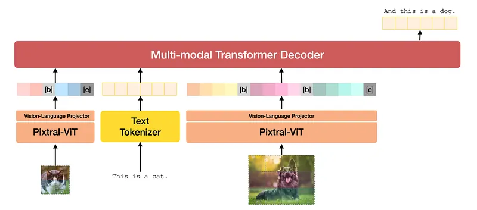
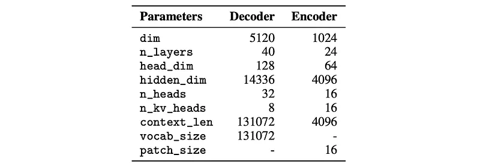
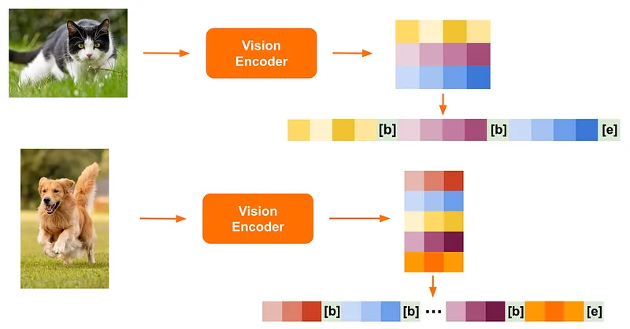
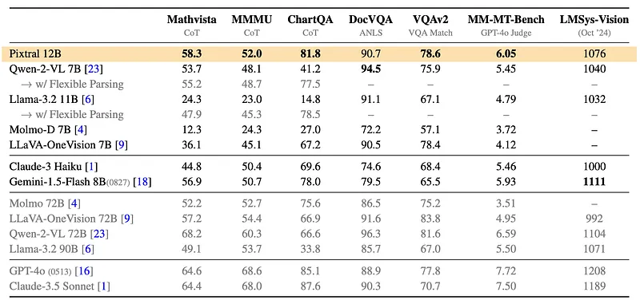
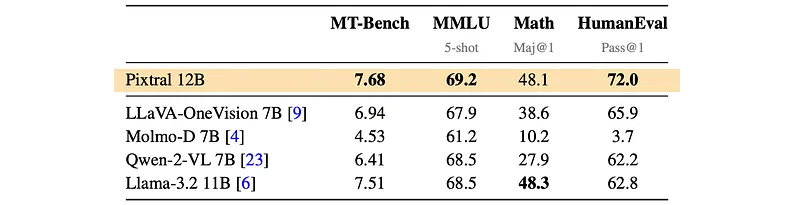
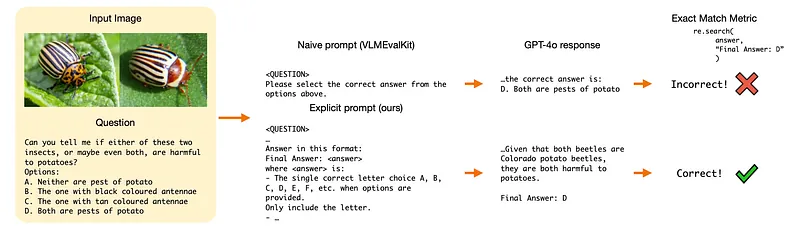
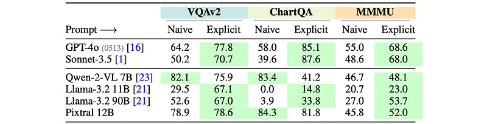
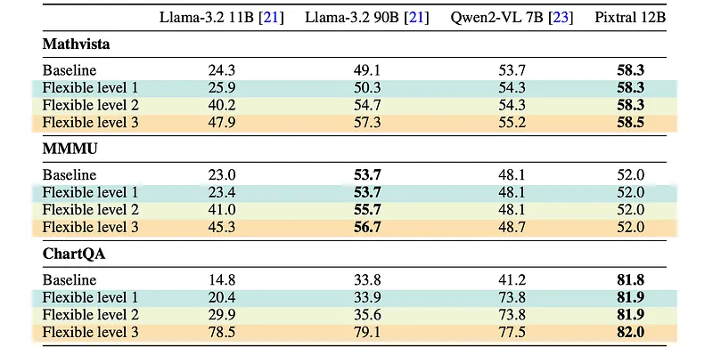
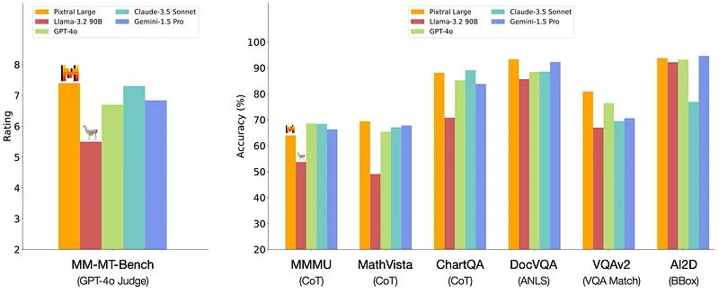
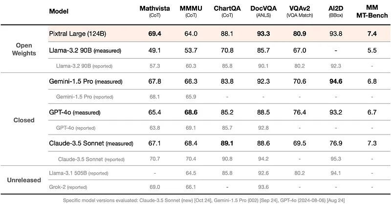

# Papers Explained 219 - Pixtral

Pixtral is a 12B parameter natively multimodal vision-language model based on Mistral Nemo. It is trained with interleaved image and text data demonstrating strong performance on multimodal tasks, and excels in instruction following.

This page ingests the source article into the wiki and connects it to [[Papers Explained Corpus]], [[Vision Language Models]], [[Large Language Models]], [[Embedding and Retrieval]], [[Computer Vision]], [[Reasoning Models]].

## Source Metadata

- Source file: `raw/2024-09-26_Papers-Explained-219--Pixtral-a714f94e59ac.md`
- Source title: Papers Explained 219: Pixtral
- Published: 2024-09-26
- Canonical: [https://medium.com/@ritvik19/papers-explained-219-pixtral-a714f94e59ac](https://medium.com/@ritvik19/papers-explained-219-pixtral-a714f94e59ac)

## Key Ideas

- Pixtral 12B is built on top of Mistral Nemo 12B, a 12B decoder-only language model that achieves strong performance across a range of knowledge and reasoning tasks.
- In order for Pixtral 12B to ingest images, a new a 400 M vision encoder, named Pixtral- ViT, is trained from scratch. It has four key changes over the standard architectures:
- Break tokens are included in order to assist the model in distinguishing between images with the same number of patches but different aspect ratios. [IMAGE BREAK] tokens are included between image rows.
- Instead of a standard feedforward layer in the attention block, gating is used in the hidden layer.
- In order to efficiently process images within a single batch, images are flattened along the sequence dimension and concatenated. A block-diagonal mask is constructed to ensure no attention leakage between patches from different images.

## Notes

Pixtral is a 12B parameter natively multimodal vision-language model based on Mistral Nemo. It is trained with interleaved image and text data demonstrating strong performance on multimodal tasks, and excels in instruction following.

## Architecture

Pixtral 12B is built on top of Mistral Nemo 12B, a 12B decoder-only language model that achieves strong performance across a range of knowledge and reasoning tasks.

In order for Pixtral 12B to ingest images, a new a 400 M vision encoder, named Pixtral- ViT, is trained from scratch. It has four key changes over the standard architectures:

- Break tokens are included in order to assist the model in distinguishing between images with the same number of patches but different aspect ratios. [IMAGE BREAK] tokens are included between image rows. Further, an [IMAGE END] token is included at the end of an image sequence.

- Instead of a standard feedforward layer in the attention block, gating is used in the hidden layer.

- In order to efficiently process images within a single batch, images are flattened along the sequence dimension and concatenated. A block-diagonal mask is constructed to ensure no attention leakage between patches from different images.

- Traditional learned and absolute position embeddings for image patches are replaced with relative, rotary position encodings in the self-attention layers. While learned position embeddings must be interpolated to deal with new image sizes (often at the cost of performance), relative position encodings lend themselves naturally to variable image sizes.

The Pixtral-ViT that natively supports variable image sizes: Images are simply passed through the vision encoder at their native resolution and aspect ratio.

The Pixtral-ViT is linked to the multimodal decoder via a two-layer fully connected network. This network transforms the output of the vision encoder into the input embedding size required by the decoder via an intermediate hidden layer of the same size, employing the GeLU activation. The image tokens are treated identically to the text tokens by the multimodal decoder, including RoPE-1D positional encodings for all tokens. Particularly, the decoder uses a causal self-attention mechanism, smoothly facilitating capabilities such as multi-image conversations.

The model is trained to predict the next text token on interleaved image and text data. This architecture allows Pixtral to process any number of images with arbitrary sizes in its large context window of 128K tokens.

## Evaluations

During evaluation of Pixtral and the baselines, it is found that evaluation protocols for multimodal language models is not standardized, and that small changes in the setup can dramatically change the performance of some models. Specifically, two issues with evaluation are identified:

- Prompts: Several benchmarks have default prompts which are under-specified, and dramatically reduce the performance of leading closed source models compared to reported figures.

- Evaluation Metrics: The official metrics typically require exact match, which score model generations as correct only if they exactly match the reference answer. However, this metric penalizes answers which are substantively correct but in a slightly different format (e.g., “6.0” vs “6”).

To alleviate these issues, Explicit prompts that explicitly specify the format required by the reference answer are proposed.

### Main Results

Multimodal Performance:

- Pixtral significantly outperforms comparable open-source models on multimodal benchmarks like MM-MT-Bench and LMSys Vision Arena.

- Pixtral 12B even approaches the performance of larger open-weights models like Qwen2-VL 72B and Llama-3.2 90B on LMSys Vision Arena.

Language Performance:

- Pixtral 12B maintains strong performance on text-only benchmarks, demonstrating its capability in both text and vision domains.

### Prompt selection

- Commonly used prompts often lack clarity regarding the desired output format.

- Explicitly specifying the output format in prompts significantly improves performance for leading models.

- Smaller models sometimes show reduced performance with explicit prompts, potentially due to differences in training data and prompt styles.

- Pixtral 12B generally benefits from explicit prompts, with a minor exception on the ChartQA benchmark.

### Sensitivity to evaluation metrics

Models’ outputs are evaluated under progressively looser parsing constraints. This means allowing for variations in the format of the response, even if it doesn’t perfectly match the reference answer.

*Figure: Flexible parsing ablations*

- Performance of some models significantly improves with more flexible parsing metrics.

- This suggests that the initial low scores were due to models struggling to adhere to prompt instructions and outputting responses in the correct format.

- Pixtral 12B shows little benefit from flexible parsing, indicating its strong ability to follow instructions.

- Pixtral 12B often outperforms other models even when using stricter metrics.

## Pixtral Large

Pixtral Large is a 124 billion parameter open-weight multimodal model built upon Mistral Large 2. It’s designed for frontier-level image understanding while retaining the text-based capabilities of its predecessor.

It comprises a 123B parameter multimodal decoder and a 1B parameter vision encoder. It supports a Context Window of 128K tokens, accommodating at least 30 high-resolution images.

- On MathVista, Pixtral Large achieves 69.4%, outperforming all other models.

- On ChartQA and DocVQA, Pixtral Large surpasses GPT-4o and Gemini-1.5 Pro.

- Pixtral Large demonstrates competitive capabilities on MM-MT-Bench, outperforming all of Claude-3.5 Sonnet (new), Gemini-1.5 Pro and GPT-4o (latest).

## Paper

- [Announcing Pixtral 12B](https://mistral.ai/news/pixtral-12b/)

- [Pixtral grows up](https://mistral.ai/news/pixtral-large/)

## Figures

Figures from the Medium HTML export (`raw/2024-09-26_Papers-Explained-219--Pixtral-a714f94e59ac.md`); local copies under `wiki/assets/papers-explained-219-pixtral/` when download succeeded.

| Figure | Caption |
|--------|---------|
|  | Title card: Pixtral. |
|  | Pixtral is a 12B parameter natively multimodal vision-language model based on Mistral Nemo. |
|  | In order for Pixtral 12B to ingest images, a new a 400 M vision encoder, named Pixtral- ViT, is trained from scratch. |
|  | In order for Pixtral 12B to ingest images, a new a 400 M vision encoder, named Pixtral- ViT, is trained from scratch. |
|  | Multimodal Performance. |
|  | Language Performance. |
|  | Language Performance. |
|  | Language Performance. |
|  | Flexible parsing ablations. |
|  | It comprises a 123B parameter multimodal decoder and a 1B parameter vision encoder. |
|  | It comprises a 123B parameter multimodal decoder and a 1B parameter vision encoder. |
## Related

- [[Announcing Pixtral 12B]] — official Mistral AI Pixtral 12B launch blog (architecture, benchmarks, Apache 2.0).
- [[Papers Explained Corpus]]
- [[Vision Language Models]]
- [[Large Language Models]]
- [[Embedding and Retrieval]]
- [[Computer Vision]]
- [[Reasoning Models]]
- [[Papers Explained 218 - Idefics 3]]
- [[Papers Explained 220 - EfficientFormer]]

#summary #topic
