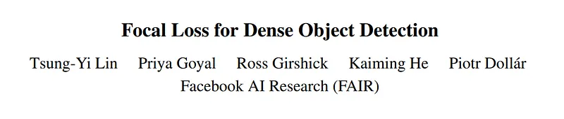
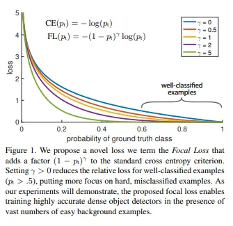
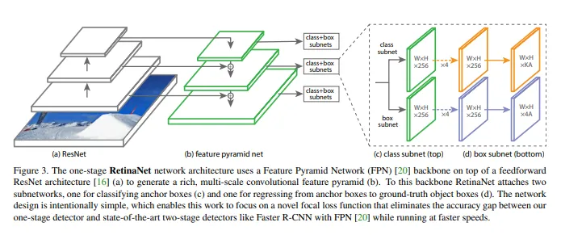

# Papers Explained 22 - Focal Loss for Dense Object Detection (RetinaNet)

The highest accuracy object detectors to date are based on a two-stage approach popularized by R-CNN, where a classifier is applied to a sparse set of candidate object locations.

This page ingests the source article into the wiki and connects it to [[Papers Explained Corpus]], [[Computer Vision]].

## Source Metadata

- Source file: `raw/2023-02-07_Papers-Explained-22--Focal-Loss-for-Dense-Object-Detection--RetinaNet--733b70ce0cb1.md`
- Source title: Papers Explained 22: Focal Loss for Dense Object Detection (RetinaNet)
- Published: 2023-02-07
- Canonical: [https://medium.com/@ritvik19/papers-explained-22-focal-loss-for-dense-object-detection-retinanet-733b70ce0cb1](https://medium.com/@ritvik19/papers-explained-22-focal-loss-for-dense-object-detection-retinanet-733b70ce0cb1)

## Key Ideas

- The central cause for this is the extreme foreground-background class imbalance encountered during training of dense detectors.
- Focal Loss proposes to address this class imbalance by reshaping the standard cross entropy loss such that it down-weights the loss assigned to well-classified examples.
- To evaluate the effectiveness of this loss, the authors design and train a simple dense detector called RetinaNet.
- Lets start from Cross Entropy Loss for binary classification
- CE(p, y) = -log(p) if y = 1 else -log(1-p)

## Notes

The highest accuracy object detectors to date are based on a two-stage approach popularized by R-CNN, where a classifier is applied to a sparse set of candidate object locations. In contrast, one-stage detectors that are applied over a regular, dense sampling of possible object locations have the potential to be faster and simpler, but have trailed the accuracy of two-stage detectors thus far.

The central cause for this is the extreme foreground-background class imbalance encountered during training of dense detectors.

Focal Loss proposes to address this class imbalance by reshaping the standard cross entropy loss such that it down-weights the loss assigned to well-classified examples.

To evaluate the effectiveness of this loss, the authors design and train a simple dense detector called RetinaNet.

## Focal Loss Explained

Lets start from Cross Entropy Loss for binary classification

CE(p, y) = -log(p) if y = 1 else -log(1-p)

where y ∈ {1, -1} specifies the ground truth class and p ∈ [0, 1] is the model’s estimated probability for the class with label y = 1

For notational convenience, we define pt:

pt = p if y = 1 else 1-p

thus

CE(p, y) = CE(pt) = -lop(pt)

One notable property of this loss is that even examples that are easily classified (pt << .5) incur a loss with non-trivial magnitude.
When summed over a large number of easy examples, these small loss values can overwhelm the rare class.

Balanced Cross Entropy

A common method for addressing class imbalance is to introduce a weighting factor α ∈ [0, 1] for class 1 and 1−α for class −1. In practice α may be set by inverse class frequency or treated as a hyperparameter to set by cross validation. For notational convenience, we define αt analogously to how we defined pt . We write the α-balanced CE loss as:

CE(pt) = −αt log(pt)

Focal Loss Definition

While α balances the importance of positive/negative examples, it does not differentiate between easy/hard examples. The authors propose to add a modulating factor (1 − pt)^γ to the cross entropy loss, with tunable focusing parameter γ ≥ 0.

Thus focal loss can be defined as:

FL(pt) = −(1 − pt)^γ log(pt)

Two properties of the focal loss:

- When an example is misclassified and pt is small, the modulating factor is near 1 and the loss is unaffected. As pt → 1, the factor goes to 0 and the loss for well-classified examples is down-weighted.

- The focusing parameter γ smoothly adjusts the rate at which easy examples are downweighted. When γ = 0, FL is equivalent to CE, and as γ is increased the effect of the modulating factor is likewise increased (γ = 2 to worked best in the experiments and the RetinaNet is relatively robust to γ ∈ [0.5, 5]).

In practice an α-balanced variant of the focal loss is used:
FL(pt) = −αt(1 − pt)^γ log(pt).

## RetinaNet Detector

RetinaNet is a single, unified network composed of a backbone network and two task-specific subnetworks. The backbone is responsible for computing a convolutional feature map over an entire input image and is an off-the-self convolutional network. The first subnet performs convolutional object classification on the backbone’s output; the second subnet performs convolutional bounding box regression.

Feature Pyramid Network Backbone

In brief, FPN augments a standard convolutional network with a top-down pathway and lateral connections so the network efficiently constructs a rich, multi-scale feature pyramid from a single resolution input image. Each level of the pyramid can be used for detecting objects at a different scale.

Classification Subnet

The classification subnet predicts the probability of object presence at each spatial position for each of the A anchors and K object classes.

Box Regression Subnet

In parallel with the object classification subnet, we attach another small FCN to each pyramid level for the purpose of regressing the offset from each anchor box to a nearby ground-truth object, if one exists.

## Paper

Feature Pyramid Networks for Object Detection [1708.02002](https://arxiv.org/abs/1708.02002)

## Figures

Figures from the Medium HTML export (`raw/2023-02-07_Papers-Explained-22--Focal-Loss-for-Dense-Object-Detection--RetinaNet--733b70ce0cb1.md`); local copies under `wiki/assets/papers-explained-22-focal-loss-for-dense-object-detection-retinanet/` when download succeeded.

| Figure | Caption |
|--------|---------|
|  | Title card: Focal Loss for Dense Object Detection (RetinaNet). |
|  | To evaluate the effectiveness of this loss, the authors design and train a simple dense detector called RetinaNet. |
|  | In practice an α-balanced variant of the focal loss is used: FL(pt) = −αt(1 − pt)^γ log(pt). |
## Related

- [[Papers Explained Corpus]]
- [[Computer Vision]]
- [[Papers Explained 21 - Feature Pyramid Network]]
- [[Papers Explained 23 - Structural LM]]
- [[Object Detection Part 4]] — focal loss and RetinaNet walkthrough (Weng).

#summary #topic
