# Papers Explained 220 - EfficientFormer

Efficient Former is a family of models optimized for inference speed. The paper revisits the design principles of ViT and its variants through latency analysis and identifies inefficient designs and operators in ViT to propose a new dimension consistent design paradigm for vision transformers and a simple yet effective latency-driven...

This page ingests the source article into the wiki and connects it to [[Papers Explained Corpus]], [[Model Compression and Efficiency]], [[Computer Vision]], [[Code Models]], [[Embedding and Retrieval]].

## Source Metadata

- Source file: `raw/2024-09-27_Papers-Explained-220--EfficientFormer-97c91540af19.html`
- Source title: Papers Explained 220: EfficientFormer
- Published: 2024-09-27
- Canonical: [https://medium.com/@ritvik19/papers-explained-220-efficientformer-97c91540af19](https://medium.com/@ritvik19/papers-explained-220-efficientformer-97c91540af19)

## Key Ideas

- Efficient Former is a family of models optimized for inference speed. The paper revisits the design principles of ViT and its variants through latency analysis and identifies inefficient designs and operators in ViT to propose a new dimension consistent...
- Code and models are available at [GitHub](https://github.com/snap-research/EfficientFormer).
- Observation 1: Patch embedding with large kernel and stride is a speed bottleneck on mobile devices.
- The initial observation highlights that the conventional patch embedding technique, often employing non-overlapping convolutions with large kernel sizes and strides, poses a bottleneck for speed on mobile devices.
- Observation 2: Consistent feature dimension is important for the choice of token mixer. MHSA is not necessarily a speed bottleneck.

## Notes

Efficient Former is a family of models optimized for inference speed. The paper revisits the design principles of ViT and its variants through latency analysis and identifies inefficient designs and operators in ViT to propose a new dimension consistent design paradigm for vision transformers and a simple yet effective latency-driven slimming method to optimize for inference speed.

Code and models are available at [GitHub](https://github.com/snap-research/EfficientFormer).

## On-Device Latency Analysis of Vision Transformers

*Figure: Latency profiling. Results are obtained on iPhone 12 with CoreML.*

Observation 1: Patch embedding with large kernel and stride is a speed bottleneck on mobile devices.

The initial observation highlights that the conventional patch embedding technique, often employing non-overlapping convolutions with large kernel sizes and strides, poses a bottleneck for speed on mobile devices. While previously believed to have negligible computational costs, these large-kernel convolutions aren’t efficiently supported by most compilers. The suggestion is to replace them with a convolution stem comprising several hardware-efficient 3x3 convolutions for faster downsampling.

Observation 2: Consistent feature dimension is important for the choice of token mixer. MHSA is not necessarily a speed bottleneck.

The choice of token mixer, crucial in ViT-based models, significantly affects performance. The comparison between different mixers like MHSA (Multi-Head Self-Attention) and pooling reveals that while MHSA itself isn’t necessarily a bottleneck, its implementation, particularly in models like LeViT-256, causes latency due to frequent reshaping operations. Pooling, on the other hand, suits certain network implementations better, leading to faster inference. Consistency in feature dimensions plays a vital role in the efficiency of token mixers.

Observation 3: CONV-BN is more latency-favorable than LN (GN)-Linear and the accuracy drawback is generally acceptable.

The type of MLP (Multi-Layer Perceptron) implementation, specifically between CONV-BN (Convolution with Batch Normalization) and LN (Layer Normalization) with Linear projection, impacts latency. CONV-BN proves to be more latency-favorable as BN can be fused with the preceding convolution for speed enhancement. LN and other dynamic normalizations contribute to latency as they collect running statistics during inference. The trade-off here is between latency and accuracy, where CONV-BN slightly downgrades performance but yields significant latency gains.

Observation 4: The latency of nonlinearity is hardware and compiler dependent.

GeLU, previously considered inefficient, surprisingly performs well on some hardware (e.g., iPhone 12). Conversely, HardSwish exhibits unexpected slowness in experiments, possibly due to compiler support. The conclusion drawn is that the choice of activation function should consider specific hardware and compiler support.

## Design of EfficientFormer

### Dimension-Consistent Design

*Figure: Overview of EfficientFormer.*

The network consists of a patch embedding (PatchEmbed) and stack of meta transformer blocks, denoted as MB:

where X0 is the input image with batch size as B and spatial size as [H,W], Y is the desired output, and m is the total number of blocks (depth). MB consists of unspecified token mixer (TokenMixer) followed by a MLP block and can be expressed as follows:

A Stage (or S) is a stack of several MetaBlocks that processes the features with the same spatial size. The network includes 4 Stages. Among each Stage, there is an embedding operation to project embedding dimension and downsample token length.

The network is split into a 4D partition where operators are implemented in CONV-net style in the beginning and a 3D partition where linear projections and attentions are performed over 3D tensor to enjoy the global modeling power of MHSA without sacrificing efficiency in the later stages.

First, input images are processed by a CONV stem with two 3 × 3 convolutions with stride 2 as patch embedding,

where Cj is the channel number (width) of the j th stage. Then the network starts with MB4D with a simple Pool mixer to extract low level features,

where ConvB,G refers to whether the convolution is followed by BN and GeLU, respectively. Note here Group or Layer Normalization (LN) is not and before the Pool mixer, since the 4D partition is CONV-BN based design, thus there exists a BN in front of each Pool mixer.

After processing all the MB4D blocks, a one-time reshaping is performed to transform the features size and enter the 3D partition. MB3D follows conventional ViT structure. Formally,

where LinearG denotes the Linear followed by GeLU, and

where Q,K,V represents query, key, and values learned by the linear projection, and b is parameterized attention bias as position encodings.

### Latency Driven Slimming

The supernet is designed based on the concept of a MetaPath (MP) that represents different possible blocks within each stage of the network. The MetaPath determines the choices of blocks available at each stage of the network architecture.

where I represents the identity path, j denotes the j th Stage, and i denotes the i th block.

Search Space Parameters:

- Cj: Width of each stage.

- Nj: Number of blocks in each stage (depth).

- N: blocks to apply MB3D.

Searching Algorithm

A gradient-based search algorithm is used for efficiency without deploying each candidate in hardware.

The algorithm involves three major steps:

- Training the supernet using Gumbel Softmax sampling to obtain importance scores for the blocks within each MetaPath.

- Building a latency lookup table by collecting on-device latencies of different block configurations (MB4D and MB3D with various widths).

- Network slimming based on latency evaluation using the lookup table. This involves iteratively evaluating and reducing the width and importance of blocks and stages to achieve a target latency.

## Experiments

### Image Classification

*Figure: Comparison results on ImgeNet-1K.*

- EfficientFormer models trained from scratch on ImageNet-1K dataset.

- Standard image size (224 × 224) used for training and testing.

- Training recipe from DeiT followed with 300 training epochs.

- Teacher model for distillation is RegNetY-16GF with 82.9% top-1 accuracy.

Performance Comparisons:

- Compared to CNNs, EfficientFormer achieves better accuracy-latency trade-offs on various devices.

- EfficientFormer models show superior performance compared to EfficientNet and MobileNet models across different layers and inference speeds.

- Demonstrated better performance on iPhone Neural Engine and desktop GPU (A100) compared to established models.

Comparison to ViTs:

- EfficientFormer performs competitively with transformer models while having significantly faster inference times.

- Outperforms recent transformer variants like PoolFormer in both accuracy and speed across different hardware.

Hybrid Designs vs. Pure Transformer Models:

- Hybrid designs struggle with latency but fail to surpass lightweight CNNs in both speed and accuracy.

- EfficientFormer, as a pure transformer-based model, maintains high performance while achieving ultra-fast inference speed.

- Outperforms MobileViT models across various hardware setups with significant accuracy margins.

### EfficientFormer as Backbone

*Figure: Comparison results using EfficientFormer as backbone.*

Object Detection and Instance Segmentation:

- Utilized Mask-RCNN with EfficientFormer initialized with ImageNet-1K pre-trained weights, as the backbone on COCO2017 dataset, comprising 118K training and 5K validation images.

- Input size is set at 1333 × 800.

- EfficientFormer outperformed CNN (ResNet) and transformer (PoolFormer) backbones consistently.

- EfficientFormer-L3 surpassed the ResNet50 backbone by 3.4 box AP and 3.7 mask AP.

- Outperformed PoolFormer-S24 by 1.3 box AP and 1.1 mask AP, highlighting EfficientFormer’s robustness as a backbone in vision tasks.

Semantic Segmentation:

- Utilized EfficientFormer initialized with ImageNet-1K pre-trained weights with Semantic FPN as the segmentation decoder on the ADE20K dataset for semantic segmentation consisting of 20K training images and 2K validation images across 150 class categories.

- Input images resized and cropped to 512 × 512 for training and 512 on the shorter side for testing/validation.

- EfficientFormer consistently outperformed both CNN- and transformer-based backbones by a significant margin within a similar computation budget.

- EfficientFormer-L3 outperformed PoolFormer-S24 by 3.2 mIoU, showcasing its ability to learn long-term dependencies effectively through global attention, beneficial for high-resolution dense prediction tasks.

## Paper

EfficientFormer: Vision Transformers at MobileNet Speed [2206.01191](https://arxiv.org/abs/2206.01191)

Recommended Reading [Vision Transformers](https://ritvik19.medium.com/list/vision-transformers-61e6836230f1)

## Figures

Figures from the Medium HTML export (`raw/2024-09-27_Papers-Explained-220--EfficientFormer-97c91540af19.html`); local copies under `wiki/assets/papers-explained-220-efficientformer/` when download succeeded.

| Figure | Caption |
|--------|---------|
| 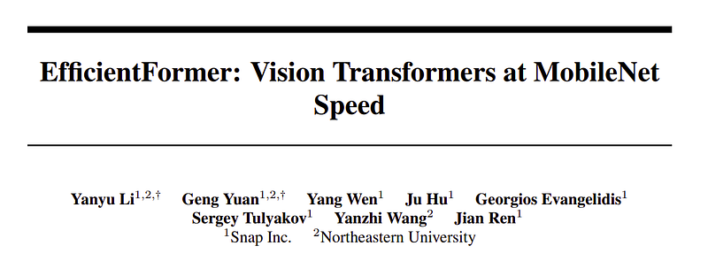 | Title card: EfficientFormer. |
| 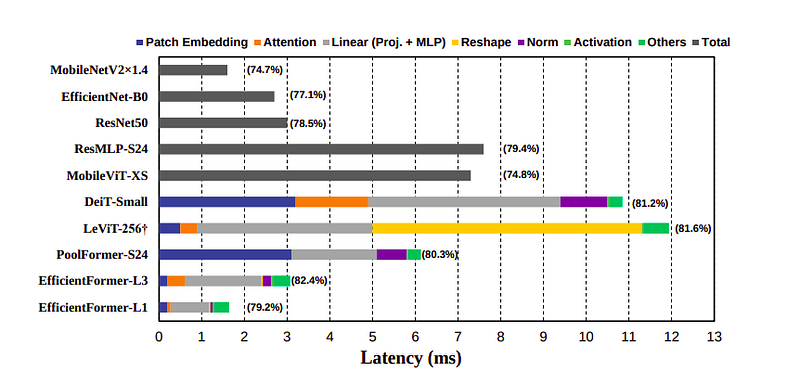 | Latency profiling. Results are obtained on iPhone 12 with CoreML. |
| 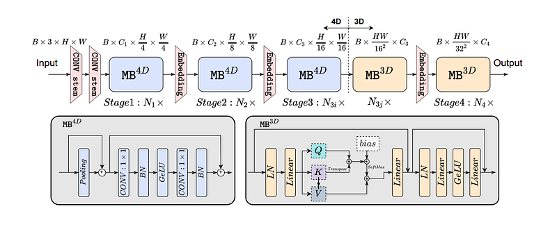 | Overview of EfficientFormer. |
| 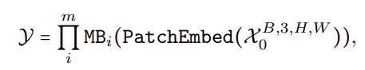 | The network consists of a patch embedding (PatchEmbed) and stack of meta transformer blocks, denoted as MB. |
| 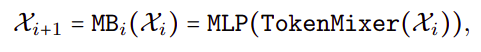 | where X0 is the input image with batch size as B and spatial size as [H,W], Y is the desired output, and m is the total number of blocks... |
| 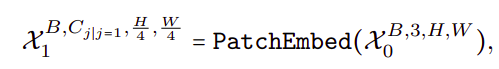 | First, input images are processed by a CONV stem with two 3 × 3 convolutions with stride 2 as patch embedding,. |
| 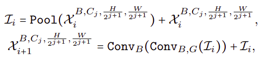 | where Cj is the channel number (width) of the j th stage. |
| 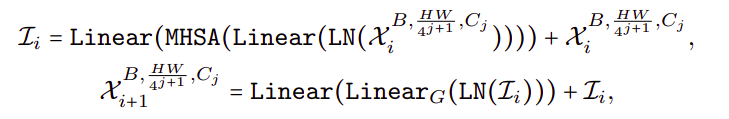 | After processing all the MB4D blocks, a one-time reshaping is performed to transform the features size and enter the 3D partition. |
| 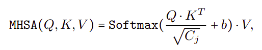 | where LinearG denotes the Linear followed by GeLU, and. |
| 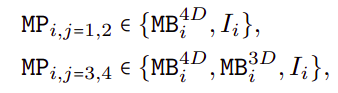 | The supernet is designed based on the concept of a MetaPath (MP) that represents different possible blocks within each stage of the network. |
| 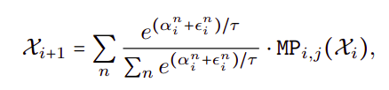 | The algorithm involves three major steps. |
| 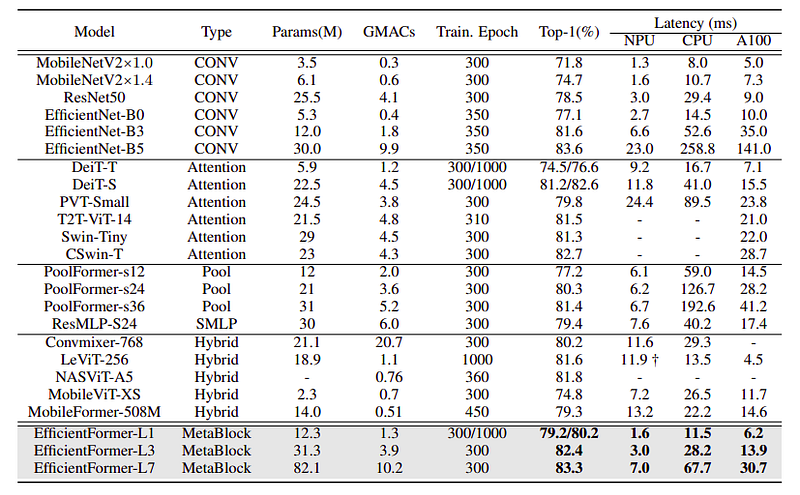 | Comparison results on ImgeNet-1K. |
| 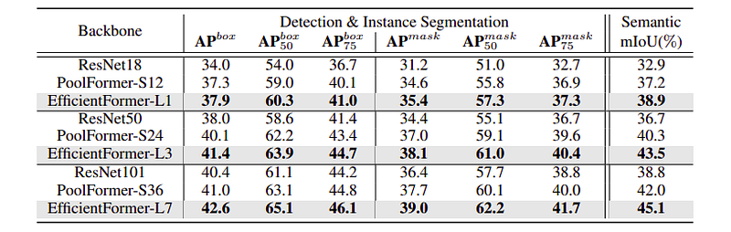 | Comparison results using EfficientFormer as backbone. |
## Related

- [[Papers Explained Corpus]]
- [[Model Compression and Efficiency]]
- [[Computer Vision]]
- [[Code Models]]
- [[Embedding and Retrieval]]
- [[Papers Explained 219 - Pixtral]]
- [[Papers Explained 221 - Reader-LM]]

#summary #topic
