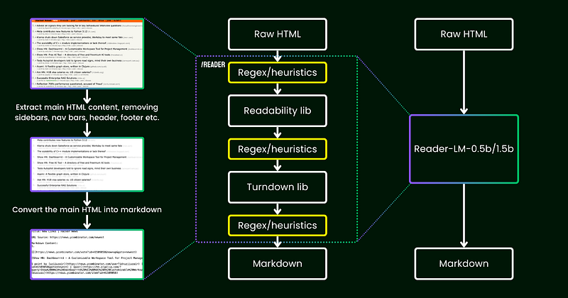
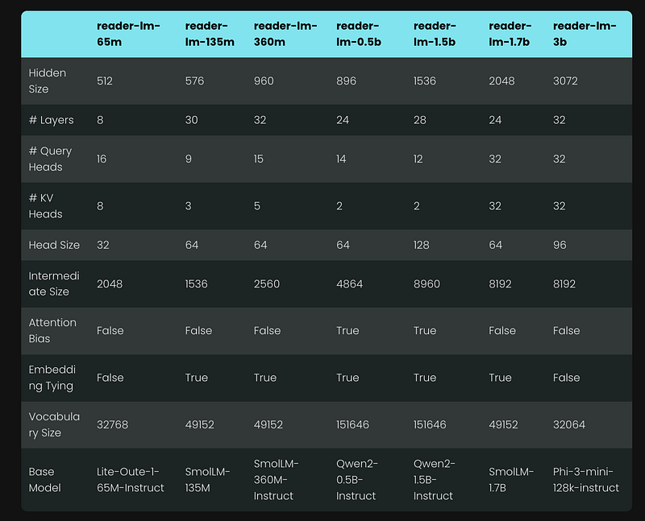
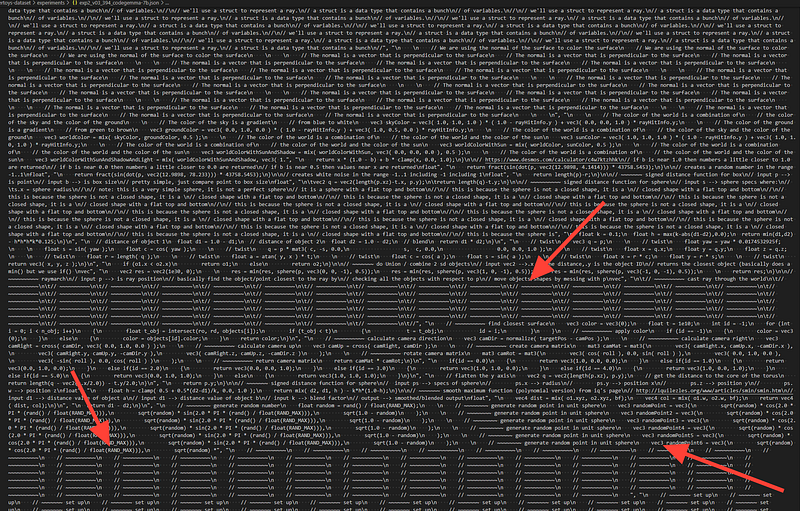
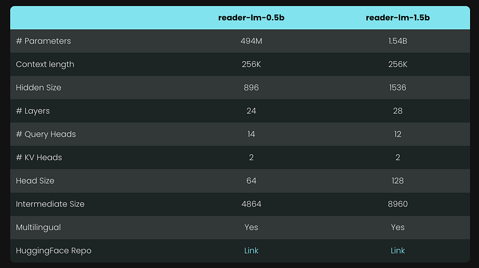
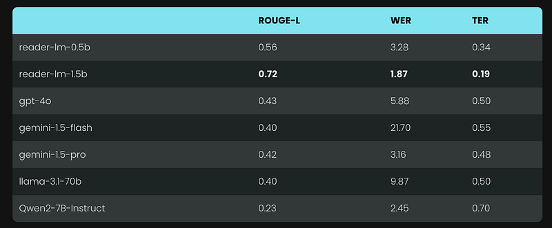

# Papers Explained 221 - Reader-LM

reader-lm-0.5b and reader-lm-1.5b are two SLMs specifically trained to generate clean markdown directly from noisy raw HTML. Both models are multilingual and support a context length of up to 256K tokens.

This page ingests the source article into the wiki and connects it to [[Papers Explained Corpus]], [[Document AI]], [[Multilingual Models]], [[Reasoning Models]], [[Large Language Models]], [[Agentic AI]].

## Source Metadata

- Source file: `raw/2024-09-30_Papers-Explained-221--Reader-LM-7382b9eb6ed9.html`
- Source title: Papers Explained 221: Reader-LM
- Published: 2024-09-30
- Canonical: [https://medium.com/@ritvik19/papers-explained-221-reader-lm-7382b9eb6ed9](https://medium.com/@ritvik19/papers-explained-221-reader-lm-7382b9eb6ed9)

## Key Ideas

- The models are available at HuggingFace: [reader-lm-0.5b](https://huggingface.co/jinaai/reader-lm-0.5b) and [reader-lm-1.5b](https://huggingface.co/jinaai/reader-lm-1.5b).
- Jina Reader, released in April 2024 is a simple API that converts any URL into LLM-friendly markdown with just a simple prefix: r.jina.ai.
- A headless Chrome browser is used to fetch the source of the webpage.
- Mozilla’s Readability package is leveraged to extract the main content, removing elements like headers, footers, navigation bars, and sidebars.
- The cleaned-up HTML is converted into markdown using regex and the Turndown library.

## Notes

reader-lm-0.5b and reader-lm-1.5b are two SLMs specifically trained to generate clean markdown directly from noisy raw HTML. Both models are multilingual and support a context length of up to 256K tokens.

The models are available at HuggingFace: [reader-lm-0.5b](https://huggingface.co/jinaai/reader-lm-0.5b) and [reader-lm-1.5b](https://huggingface.co/jinaai/reader-lm-1.5b).

## Background

Jina Reader, released in April 2024 is a simple API that converts any URL into LLM-friendly markdown with just a simple prefix: r.jina.ai.

### How it works:

- A headless Chrome browser is used to fetch the source of the webpage.

- Mozilla’s Readability package is leveraged to extract the main content, removing elements like headers, footers, navigation bars, and sidebars.

- The cleaned-up HTML is converted into markdown using regex and the Turndown library.

- The result is a well-structured markdown file, ready to be used for grounding, summarizing, and reasoning.

### Can the problem be solved end to end with Encoder-Only Model

This task appears to be primarily a “selective-copy” task, where given a training pair (raw HTML and markdown), tokens that exist in both the input and output can be labeled as 1, while the rest are labeled as 0. This converts the problem into a token classification task, similar to what is used in Named Entity Recognition.

However, this approach presented significant challenges in practice:

- Raw HTML from real-world sources is extremely noisy and long, making the 1 labels extremely sparse and difficult for the model to learn.

- Encoding special markdown syntax in a 0–1 schema proved problematic, as symbols like ## title, *bold*, and | table | do not exist in the raw HTML input.

- The output tokens do not always strictly follow the order of the input. Minor reordering often occurs, particularly with tables and links, making it difficult to represent such reordering behaviors in a simple 0–1 schema.

### Can the problem be solved end to end with LLMs?

- The task isn’t as creative or complex as typical LLM tasks. In the case of converting HTML to markdown, the model primarily needs to selective-copy from the input to the output (i.e., skipping over HTML markup, sidebars, headers, footers), with minimal effort spent on generating new content (mostly inserting markdown syntax).

- The task also requires prioritizing long-context support. Modern HTML often contains much more noise than simple 
 markup. Inline CSS and scripts can easily balloon the code to hundreds of thousands of tokens. For an SLM to be practical in this scenario, the context length must be sufficiently large. Token-lengths like 8K or 16K is not useful at all.

*Figure: Illustration of reader-lm.*

A shallow LM should suffice the task, Shallow in the sense that the task is primarily simple “copy-paste”, hence fewer transformer blocks are needed; and wide in the sense that it requires long context support to be practical, so attention mechanism needs some care.

## Data Preparation

SLMs are particularly sensitive to the quality of the training data. A data pipeline is built to ensure only high-quality markdown entries were included in the training set, utilizing Jina Reader API.

Some synthetic HTML and their markdown counterparts, generated by GPT-4o, were also added. Compared to real-world HTML, synthetic data tends to be much shorter, with simpler and more predictable structures, and a significantly lower noise level.

The HTML and markdown were concatenated using a chat template. The final training data is formatted as follows:

> <|im_start|>system

> You are a helpful assistant.<|im_end|>

> <|im_start|>user

> {{RAW_HTML}}<|im_end|>

> <|im_start|>assistant

> {{MARKDOWN}}<|im_end|>

## Training

The model training is conducted in two stages.

- In the first stage, the maximum sequence length is set to 32K tokens, with a total of 1.5B training tokens.

- In the second stage, the sequence length is extended to 128K tokens, with 1.2B training tokens. To handle this longer sequence length, the zigzag-ring-attention mechanism is implemented.

Since the training data included sequences of up to 128K tokens, it is believed that the model can support up to 256K tokens without issue. However, handling 512K tokens may be challenging, as extending RoPE positional embeddings to four times the training sequence length could result in performance degradation.

For the 65M and 135M parameter models, reasonable “copy” behavior was observed for short sequences (fewer than 1K tokens). However, as the input length increased, these models struggled to produce any reasonable output.

### Degeneration and Dull Loops

*Figure: An example of degeneration occurs when the model begins with normal markdown generation but suddenly gets stuck in “dull loops,” as indicated by the red arrows.*

One of the major challenges encountered was degeneration, particularly in the form of repetition and looping. After generating some tokens, the model would begin to generate the same token repeatedly or get stuck in a loop, continuously repeating a short sequence of tokens until reaching the maximum allowed output length.

To address this issue, contrastive search is applied as a decoding method and incorporated contrastive loss during training. This method effectively reduced repetitive generation in practice. A simple repetition stop criterion is also implemented within the transformer pipeline. This criterion automatically detects when the model begins to repeat tokens and stops decoding early to avoid dull loops.

## Experiments

Two models are developed of sizes 0.5B and 1.5B:

To quantitatively evaluate the performance of Reader-LM, we compared it with several large language models, including: GPT-4o, Gemini-1.5-Flash, Gemini-1.5-Pro, LLaMA-3.1–70B, Qwen2–7B-Instruct.

The models were assessed using the following metrics:

- ROUGE-L (higher is better)

- Token Error Rate (TER, lower is better)

- Word Error Rate (WER, lower is better)

The following uniform instruction is used as the prefix prompt:

> Your task is to convert the content of the provided HTML file into the corresponding markdown file. You need to convert the structure, elements, and attributes of the HTML into equivalent representations in markdown format, ensuring that no important information is lost. The output should strictly be in markdown format, without any additional explanations.

## Paper

[Reader-LM: Small Language Models for Cleaning and Converting HTML to Markdown](https://jina.ai/news/reader-lm-small-language-models-for-cleaning-and-converting-html-to-markdown/)

## Figures

Figures from the Medium HTML export (`raw/2024-09-30_Papers-Explained-221--Reader-LM-7382b9eb6ed9.html`); local copies under `wiki/assets/papers-explained-221-reader-lm/` when download succeeded.

| Figure | Caption |
|--------|---------|
|  | Title card: Reader-LM. |
|  | Illustration of reader-lm. |
|  | The model training is conducted in two stages. |
|  | An example of degeneration occurs when the model begins with normal markdown generation but suddenly gets stuck in “dull loops,” as indicated by the red arrows. |
|  | Two models are developed of sizes 0.5B and 1.5B. |
|  | The following uniform instruction is used as the prefix prompt. |
## Related

- [[Papers Explained Corpus]]
- [[Document AI]]
- [[Multilingual Models]]
- [[Reasoning Models]]
- [[Large Language Models]]
- [[Agentic AI]]
- [[Papers Explained 220 - EfficientFormer]]
- [[Papers Explained 222 - Apple Intelligence Foundation Language Models]]

#summary #topic
