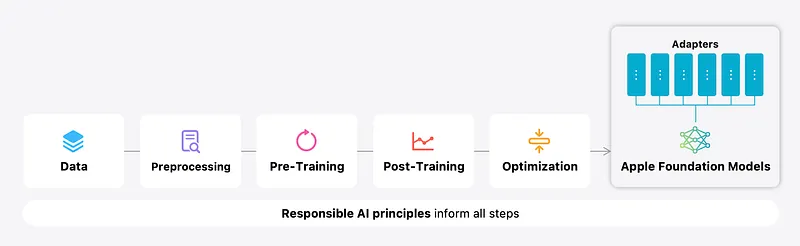
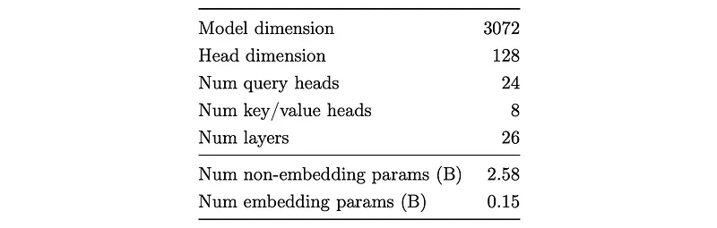
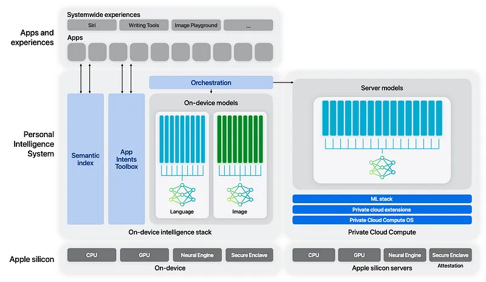
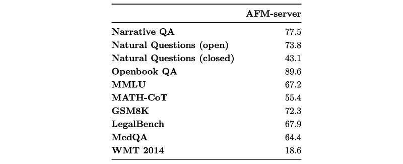
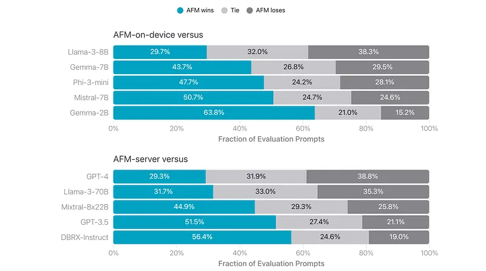
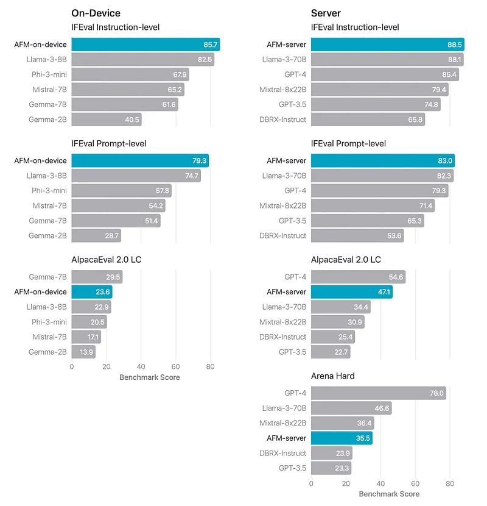
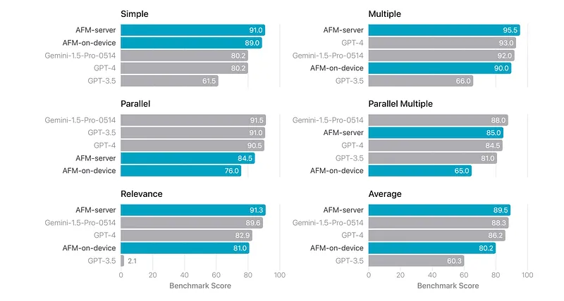
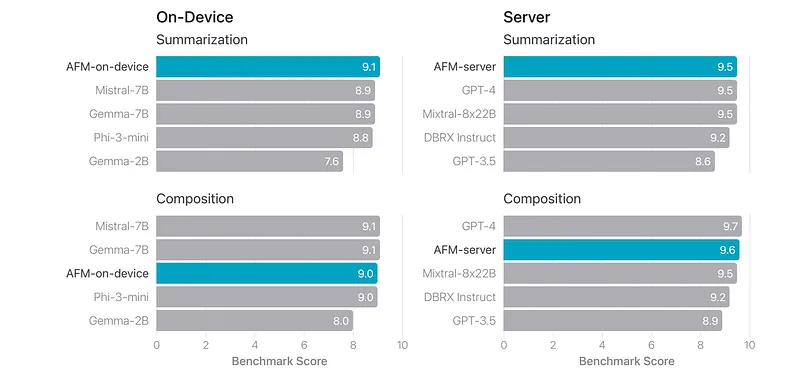
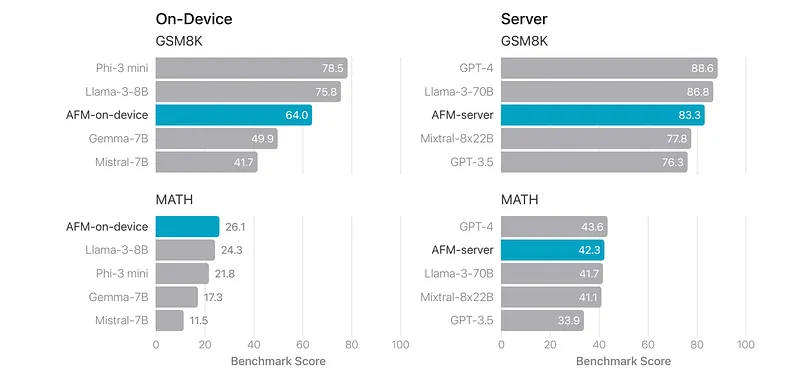

# Papers Explained 222 - Apple Intelligence Foundation Language Models

Apple Foundation Models are developed as part of Apple Intelligence, a personal intelligence system integrated into iOS 18, iPadOS 18, and macOS Sequoia. The AFM models are designed to perform various tasks efficiently, accurately, and responsibly. Apple Intelligence includes two models:

This page ingests the source article into the wiki and connects it to [[Papers Explained Corpus]], [[Large Language Models]], [[Embedding and Retrieval]].

## Source Metadata

- Source file: `raw/2024-10-01_Papers-Explained-222--Apple-Intelligence-Foundation-Language-Models-2b8a41371a42.md`
- Source title: Papers Explained 222: Apple Intelligence Foundation Language Models
- Published: 2024-10-01
- Canonical: [https://medium.com/@ritvik19/papers-explained-222-apple-intelligence-foundation-language-models-2b8a41371a42](https://medium.com/@ritvik19/papers-explained-222-apple-intelligence-foundation-language-models-2b8a41371a42)

## Key Ideas

- Apple Foundation Models are developed as part of Apple Intelligence, a personal intelligence system integrated into iOS 18, iPadOS 18, and macOS Sequoia. The AFM models are designed to perform various tasks efficiently, accurately, and responsibly.
- AFM-on-device: A ∼3 B parameter language model designed to run efficiently on devices.
- AFM-server: A larger server-based language model for Private Cloud Compute.
- The AFM base models are dense decoder-only models that build on the Transformer architecture with the following design choices:
- A shared input/output embedding matrix to reduce memory usage for parameters.

## Notes

Apple Foundation Models are developed as part of Apple Intelligence, a personal intelligence system integrated into iOS 18, iPadOS 18, and macOS Sequoia. The AFM models are designed to perform various tasks efficiently, accurately, and responsibly. Apple Intelligence includes two models:

- AFM-on-device: A ∼3 B parameter language model designed to run efficiently on devices.

- AFM-server: A larger server-based language model for Private Cloud Compute.

*Figure: Modeling overview for the Apple foundation models.*

## Architecture

The AFM base models are dense decoder-only models that build on the Transformer architecture with the following design choices:

- A shared input/output embedding matrix to reduce memory usage for parameters.

- Pre-Normalization with RMSNorm for training stability.

- Query/key normalization to improve training stability.

- Grouped-query attention (GQA) with 8 key-value heads to reduce the KV-cache memory footprint.

- SwiGLU activation for higher efficiency.

- RoPE positional embeddings with the base frequency set to 500k for long-context support.

*Figure: AFM-on-device dimensions.*

## Pre-Training

### Data

The AFM pre-training dataset consists of a diverse and high quality data mixture:

- Web pages: Crawled using Applebot, respecting publishers’ rights to opt out. The data is filtered to exclude profanity, unsafe material, personally identifiable information (PII), and processed through a pipeline that performs quality filtering, plain-text extraction, and decontamination against 811 common pre-training benchmarks.

- Licensed datasets: High-quality data licensed from publishers, providing diverse and long-context data for continued and context-lengthening stages of pre-training. The data is decontaminated in the same way as web pages.

- Code: Obtained from license-filtered open-source repositories on GitHub, covering 14 common programming languages. The data is de-duplicated, filtered for PII and quality, and decontaminated in the same fashion as web pages.

- Public datasets: High-quality publicly-available datasets with licenses permitting use for training language models. The datasets are filtered to remove PII before being included in the pre-training mixture.

- Math: Two categories of high-quality data sourced from the web:

- Math Q&A dataset: 3 billion tokens from 20 web domains rich in math content, extracted by identifying relevant tags from HTML pages.

- Collection of 14 billion tokens from web pages such as math forums, blogs, tutorials, and seminars. The data is filtered using a specialized pipeline that includes math tag filters, symbol filters, quality filters powered by language models, and domain filters processed by humans.

### Tokenizer

Byte-pair encoding (BPE) Tokenizers are developed with vocabulary size of 100k and 49k tokens for AFM-server and AFM-on-device, respectively.

All numbers are split into individual digits and byte-fallback is used to decompose unknown UTF-8 characters into byte tokens. Unicode normalization is not enabled.

### Recipe

AFM pre-training is performed three stages:

- core: consumes most of the compute budget

- continued: the lower quality bulk web-crawl data is weighed down, favoring a higher code and math weight instead combined with inclusion of the licensed data

- context-lengthening: similar to another continued pre-training stage, but conducted at longer sequence length and with synthetic long-context data included in the mixture.

Core Pre-Training

AFM-server core training is conducted from scratch for 6.3T tokens, using a sequence length of 4096

AFM-on-device is distilled and pruned from a larger model.

These two methods are complementary to each other and work in different ways.

AFM-on-device is initialized from a pruned 6.4B model (trained from scratch using the same recipe as AFM-server), using pruning masks. Then, during the core pre-training, a distillation loss is used by replacing the target labels with a convex combination of the true labels and the teacher model’s top-1 predictions, (with 0.9 weight assigned to the teacher’s labels), training for a full 6.3T tokens.

Continued Pre-Training

For both models continued pre-training is performed at a sequence length of 8192, with another 1T tokens. Distillation loss wasn’t found to be helpful here for AFM-on-device, unlike in core pre-training, so the recipe is identical to that used for AFM-server.

Context Lengthening

A further 100B tokens of continued pre-training at a sequence length of 32768 tokens is conducted, using the data mixture from the continued pre-training stage, augmented with synthetic long-context Q&A data. The RoPE base frequency is increased from 500k to 6315089.

## Post-Training

While Apple Intelligence features are powered through adapters on top of the base model, empirically it is found that improving the general-purpose post-training lifts the performance of all features, as the models have stronger capabilities on instruction following, reasoning, and writing.

### Data

The post-training pipeline for AFM uses a hybrid data strategy that combines human-annotated and synthetic data.

Human Annotations

- Demonstration data: High-quality, dialogue-style data with system-level and task-level instructions, as well as their corresponding responses.

- Human preference feedback: Side-by-side preference labels and single-side questions to guide the process of collecting feedback for reinforcement learning.

Synthetic Data

Mathematics: Synthetic math problems are generated through two primary stages:

- Problem rephrase and reversion: AFM is prompted to rephrase seed math questions and curate reverse questions.

- Problem evolution: AFM generates distinct sets of math problems, including in-depth and in-breadth evolutions.

Tool use: A mixture of synthetic and human data is used to develop tool-use capabilities, such as function call, code interpreter, and browsing.

Coding: Synthetic coding dataset generation involves a self-instruct method with rejection sampling:

- Initial pool of coding interview-like questions are generated.

- Potential solutions are generated for each question, and the best solution is chosen through execution-based rejection sampling.

### Supervised Fire-Tuning

A series of quality guards are established before data is onboarded for model training. These include ratings from in-house human labelers, automatic model-based filtering techniques, and deduplication with text embeddings.

To tune the mixture weight, it is treated as an optimization problem. Specifically, given a set of weights (w1, w2, …, wn) where wi represents the ratio of a specific component in the mixture, a model is trained with wi → wi ± ∆wi and evaluated on a set of benchmarks.

The evaluation metrics fluctuate across different checkpoints, so checkpoint selection is based on automatic evaluation benchmarks and best-of-N selection with reward models to test the headroom for RL.

### Reinforcement Learning from Human Feedback

Reinforcement learning is used to improve model performance and quality, utilizing collected human preference data. This process involves training a robust reward model and applying it through two algorithms: iTeC and MDLOO.

Reward Modeling:

Reward Modeling follows the standard practice of reward modeling in RLHF with two main innovations.:

- A soft label loss function is designed that takes into account the level of human preference.

- Additionally, single-sided gradings are incorporated as regularization terms in reward modeling.

Iterative teaching committee (iTeC)

An iterative framework called iTeC is proposed which combines various preference optimization algorithms, including Rejection Sampling (RS), Direct Preference Optimization (DPO), and online Reinforcement Learning (RL).

Iterative Committee:

For each batch of human preference data collection, a committee is set up consisting of the latest promising models trained using SFT, RS, DPO/IPO, and RL, as well as the best models from previous iterations. Pairwise human preferences are collected on responses sampled from the model committee.

After acquiring each batch of human preference data, the reward model is refreshed, and a new set of models is trained using the collection of preference optimization algorithms.

The process continues with a new model committee for the next round of iterative RLHF data collection.

Committee distillation:

Rejection sampling (distillation) is run from the model committee with the latest reward model as a reranker. Instead of reranking at global-level, i.e., picking a single best performing model from the committee and using it as a teacher model, responses are reranked at the prompt-level. This allows combining the advantages of models trained by different preference optimization algorithms.

Scaling up distillation:

For larger models, careful iteration of data and model quality is more important than data quantity.

Smaller models can achieve tremendous improvement when the number of prompts for distillation is scaled up.

Online RLHF algorithm: Mirror Descent with Leave-OneOut estimation (MDLOO)

The commonly adopted RLHF objective that maximizes the KLpenalized reward function is used :

*Figure: where D is the prompt distribution, DKL(·∥·) denotes the Kullback-Leibler divergence between two distributions, and β is the coefficient that controls the divergence between the behavior policy πθ and a reference policy πref, which is typically a model trained by SFT.*

In the RL training, the reward function is used :

Similar to commonly used RLHF algorithms such as PPO, a trust-region based policy iteration algorithm is employed. Two main design choices were made in the online RL algorithm:

- The Leave-One-Out (LOO) estimator is used to estimate the advantage of a prompt-response pair.

- Mirror Descent Policy Optimization (MDPO) is utilized to optimize the policy, differing from the more commonly used clipping-based PPO method.

During the decoding stage of the algorithm, multiple responses are decoded for each prompt, and the advantage of each response is assigned as the difference between the reward of the (prompt, response) pair and the mean reward of the other responses generated by the same prompt. This estimator aims to measure how much better a response is compared to a typical response. The advantage estimator is found to be crucial for stabilizing the algorithm and achieving strong results. Additionally, a KL-regularization-based trust region method, known as MDPO, is used to control the policy change in each iteration.

## Powering Apple Intelligence features

*Figure: Architecture of Apple Intelligence with adapters for the language on-device and server models and the image models.*

The performance of small models can be elevated to best-in-class performance through task-specific fine-tuning hence an architecture is developed, based on runtime-swappable adapters, to enable the single foundation model to be specialized for dozens of such tasks. The foundation models are fine-tuned for users’ everyday activities using LoRA.

The optimal tradeoff between model capacity and inference performance is achieved with an adapter rank of 16. However, a suite of accuracy-recovery adapters in different ranks {8, 16, 32} is provided to offer flexibility for various use cases.

The values of the adapter parameters are represented using 16 bits, and for the ∼3 B parameter on-device model, the parameters for a rank 16 adapter typically require 10s of megabytes. The adapter models can be dynamically loaded, temporarily cached in memory, and swapped — giving the foundation model the ability to specialize itself on the fly for the task at hand.

To achieve near-lossless quantization that is on average less than 4 bit-per-weight, state-of-the-art quantization methods and a framework that utilizes accuracy-recovery adapters have been developed. This provides flexible quantization scheme choices.

Residual connections exist in every transformer block and every layer in AFM. It is unlikely that all layers have equal importance, following this intuition, some layers are pushed to use 2-bit quantization to further reduce memory usage. On average, AFM-on-device can be compressed to only about 3.5 bits per weight without significant quality loss. A compression rate of 3.7 bits per weight is chosen for production as it already meets the memory requirements.

## Evaluation

### Pre-training evaluation

*Figure: HELM MMLU-5s v1.5.0 evaluation results.*

*Figure: A subset of Open LLM Leaderboard V1 evaluation results.*

*Figure: HELM-Lite v1.5.0 pre-training evaluation results.*

- The results indicate that AFM pre-trained models are well-suited for post-training and feature fine-tuning tasks.

### Human evaluation

*Figure: Side-by-side evaluation of AFM-on-device and AFM-server against comparable models.*

- AFM-on-device achieved a 47.7% win rate against Phi-3-mini, despite being 25% smaller.

- AFM-on-device also outperformed larger open-source models like Gemma-7B and Mistral-7B.

- AFM-server achieved competitive performance against GPT-3.5, with a win rate of over 50% and a tie rate of 27.4%.

### Instruction following

*Figure: Instruction-following capability (measured with IFEval) for AFM models and relevant comparison models (higher is better).*

- AFM models demonstrate superior performance on both instruction-level and prompt-level accuracy in the IFEval benchmark.

- AFM models show highly competitive performance on the AlpacaEval 2.0 LC benchmark, indicating strong general instruction-following capabilities.

### Tool use

*Figure: Berkeley Function Calling Leaderboard Benchmark evaluation results on Function Calling API.*

- AFM-server achieves the highest overall accuracy, surpassing Gemini-1.5-Pro-Preview-0514 and GPT-4.

### Writing

*Figure: Writing ability on internal summarization and composition benchmarks (higher is better) for AFM-on-device and AFM-server alongside relevant sampled comparisons.*

- AFM-on-device achieved comparable or better performance than Gemma-7B and Mistral-7B on the benchmarks.

- AFM-server significantly outperformed DBRX-Instruct and GPT3.5, and was comparable to GPT-4.

### Math

*Figure: Math benchmarks for AFM-on-device and AFM-server alongside relevant sampled comparisons. GSM8K is 8-shot and MATH is 4-shot.*

- The AFM-on-device significantly outperforms Mistral-7B and Gemma-7B on both benchmarks, despite being smaller in size.

## Paper

Apple Intelligence Foundation Language Models [2407.21075](https://arxiv.org/abs/2407.21075)

## Figures

Figures from the Medium HTML export (`raw/2024-10-01_Papers-Explained-222--Apple-Intelligence-Foundation-Language-Models-2b8a41371a42.md`); local copies under `wiki/assets/papers-explained-222-apple-intelligence-foundation-language-models/` when download succeeded.

| Figure | Caption |
|--------|---------|
|  | Title card: Apple Intelligence Foundation Language Models. |
|  | Modeling overview for the Apple foundation models. |
|  | AFM-on-device dimensions. |
|  | where D is the prompt distribution, DKL(·∥·) denotes the Kullback-Leibler divergence between two distributions, and β is the coefficient that controls the divergence between the behavior policy πθ and a reference policy πref, which is typically a model trained by SFT. |
|  | In the RL training, the reward function is used. |
|  | Architecture of Apple Intelligence with adapters for the language on-device and server models and the image models. |
|  | HELM MMLU-5s v1.5.0 evaluation results. |
|  | A subset of Open LLM Leaderboard V1 evaluation results. |
|  | HELM-Lite v1.5.0 pre-training evaluation results. |
|  | Side-by-side evaluation of AFM-on-device and AFM-server against comparable models. |
|  | Instruction-following capability (measured with IFEval) for AFM models and relevant comparison models (higher is better). |
|  | Berkeley Function Calling Leaderboard Benchmark evaluation results on Function Calling API. |
|  | Writing ability on internal summarization and composition benchmarks (higher is better) for AFM-on-device and AFM-server alongside relevant sampled comparisons. |
|  | Math benchmarks for AFM-on-device and AFM-server alongside relevant sampled comparisons. GSM8K is 8-shot and MATH is 4-shot. |
## Related

- [[Papers Explained Corpus]]
- [[Large Language Models]]
- [[Embedding and Retrieval]]
- [[Papers Explained 221 - Reader-LM]]
- [[Papers Explained 223 - LLM Compiler]]

#summary #topic
