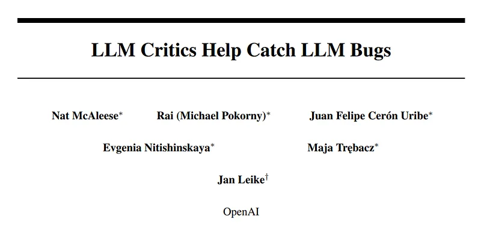
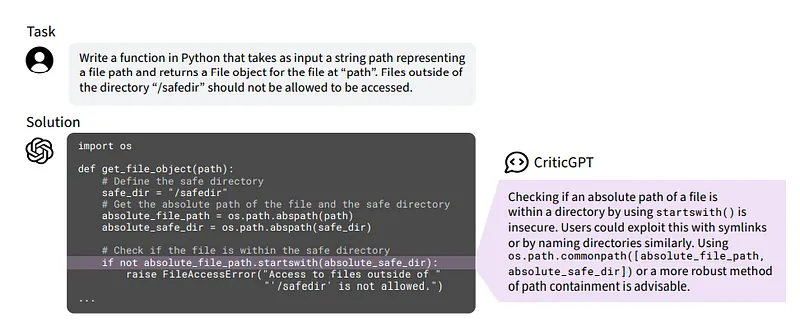
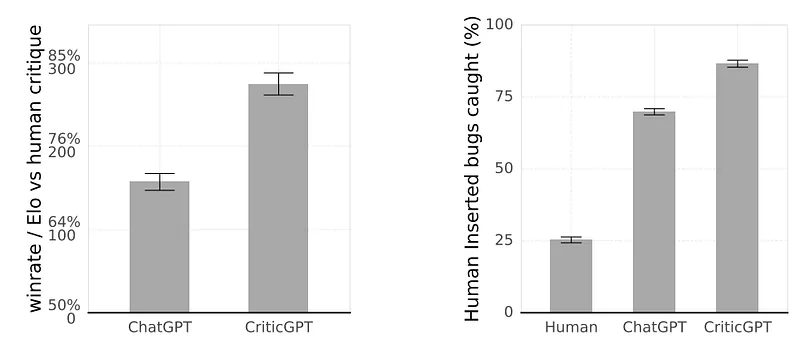
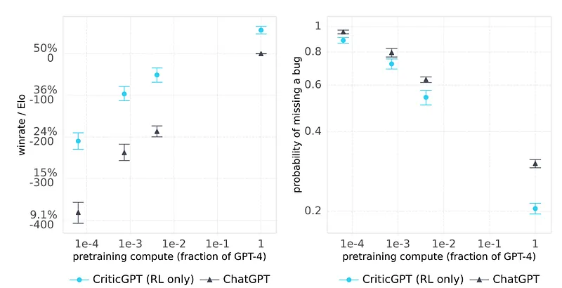
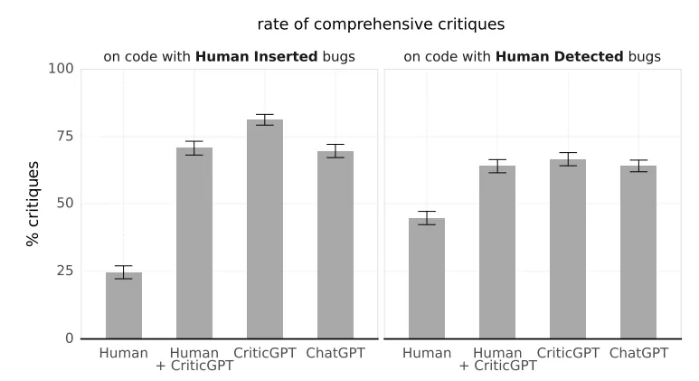
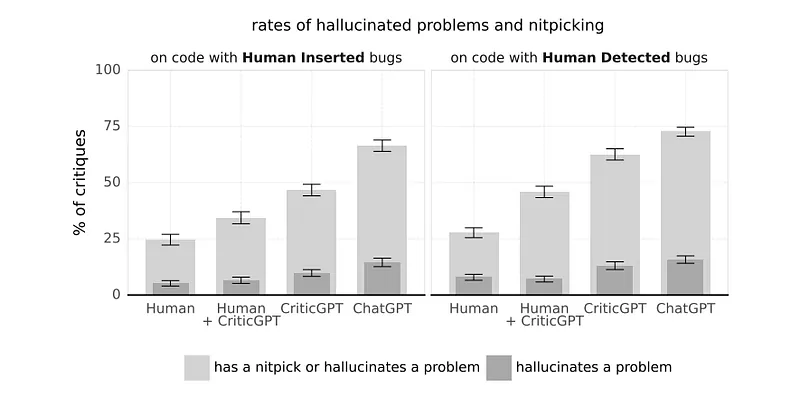
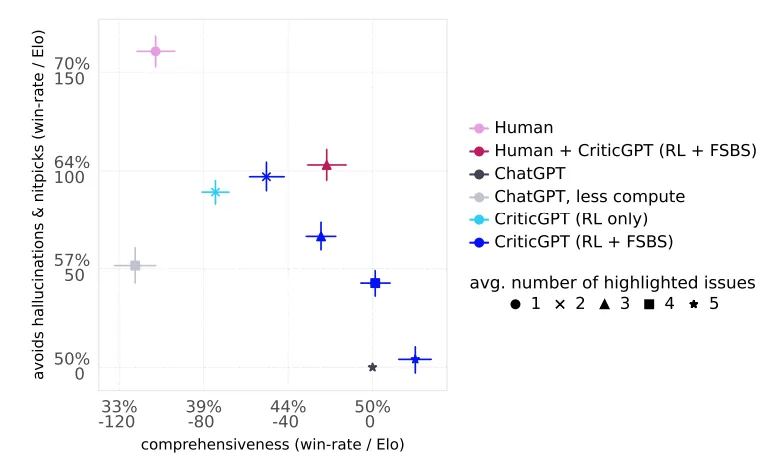

# Papers Explained 224 - CriticGPT

RLHF is fundamentally limited by the capacity of humans to correctly evaluate model output. To improve human evaluation ability and overcome that limitation this work trains “critic” models i.e.

This page ingests the source article into the wiki and connects it to [[Papers Explained Corpus]], [[Reinforcement Learning Topic]], [[Evaluation and Benchmarks]], [[Code Models]], [[Reinforcement Learning]].

## Source Metadata

- Source file: `raw/2024-10-03_Papers-Explained-224--CriticGPT-6d9af57451fa.md`
- Source title: Papers Explained 224: CriticGPT
- Published: 2024-10-03
- Canonical: [https://medium.com/@ritvik19/papers-explained-224-criticgpt-6d9af57451fa](https://medium.com/@ritvik19/papers-explained-224-criticgpt-6d9af57451fa)

## Key Ideas

- The Critics are trained or prompted to accept a (question, answer) pair as input. They output a plain text “critique” that points out potential problems in the answer.
- To assess the quality of these critiques, contractors were asked to rate the following attributes:
- Comprehensiveness: Whether the critique omitted any clear and severe issues.
- Critique-bug inclusion (CBI): Whether the critique caught a particular bug specified a priori.
- Hallucinated bugs or nitpicks: Whether the critique included any incorrect or minor issues.

## Notes

RLHF is fundamentally limited by the capacity of humans to correctly evaluate model output. To improve human evaluation ability and overcome that limitation this work trains “critic” models i.e. LLMs trained with RLHF to write natural language feedback highlighting problems in code from real-world assistant tasks, and help humans to more accurately evaluate model-written code.

## Method

The Critics are trained or prompted to accept a (question, answer) pair as input. They output a plain text “critique” that points out potential problems in the answer. The critiques output by the model follow a particular format by attaching comments to quotes from the answer, each critique can contain multiple such quotes with comments about each problem.

### Evaluation

To assess the quality of these critiques, contractors were asked to rate the following attributes:

- Comprehensiveness: Whether the critique omitted any clear and severe issues.

- Critique-bug inclusion (CBI): Whether the critique caught a particular bug specified a priori.

- Hallucinated bugs or nitpicks: Whether the critique included any incorrect or minor issues.

- Overall helpfulness: A subjective rating that accounts for the above attributes, as well as style and general usefulness.

Contractors rated each attribute on a 1–7 ordinal scale. The first two attributes (CBI and comprehensiveness) are similar to recall, and longer critics tend to increase these ratings. However, longer critiques are also more likely to include hallucinations and nitpicks. The contractors were instructed to favor critiques that are: Accurate, Comprehensive, Concise, Avoid nitpicks in their overall rating.

Contractors are asked to rate model-written critiques as part of a comparison task, where they see four critiques of the same problem simultaneously and are blind to the source of the critique. The contractors’ scores are used to calculate a preference rate for each attribute. The preference rates are then used to estimate the Elo scores of each model, which represent the probability of a contractor preferring a response from one model over another. The Elo scores are calculated using a pairwise model fit to the comparisons from the data collection.

In addition to rating model-written critiques, contractors are also asked to write their own critiques in response to a problem. The contractors are drawn from the same pool used for ChatGPT training and have a median of five years of experience with Python.

The contractors’ critiques are evaluated similarly to the LLM critiques. However, to avoid overestimation of quality, contractors are not allowed to rate their own critiques.

### Training

An RLHF pipeline similar to ChatGPT is followed to train the LLM critics:

Step 1: Several critiques are sampled for each (question, answer) pair in the dataset.

Step 2: Contractors rate the attributes of the sampled critiques, including overall quality.

Step 3: A reward model is trained to predict the human overall quality rankings.

Step 4: A policy is optimized against the reward model using PPO.

Step 5: An inference-time sampling strategy called Force Sampling Beam Search (FSBS) is applied .

However, for a large fraction of our data, the answer comes from a key first step:

Step 0: Tampering

Contractors were asked to introduce subtle bugs into model-written answers by editing them. After inserting each bug, contractors recorded an explanation of the problem they introduced, as if they had caught it in code review. The bugs were collected adversarially, meaning contractors had access to an LLM critic and were asked to verify that it missed each bug in at least one out of three samples. This constraint increased the subtlety of the introduced bugs, making them harder to find for both the research team and LLM critics.

This approach provides a source of high-quality, difficult reference bugs that ground the ranking task and allow contractors to easily discriminate between critiques that catch and miss problems. This approach also ensures that the majority of the data are collected on buggy code that is similar to the LLM distribution, unlike alternative options such as finding a pre-existing dataset of bugs.

Force Sampling Beam Search (FSBS)

FSBS allows to generate critiques that are longer and more comprehensive with a reduced rate of hallucinations or nitpicks.

In FSBS critiques are searched over by forcing the model to produce highlighted sections with constrained sampling and then select the best-scoring critiques according to the expression rm_score + LENGTH_MODIFIER * num_highlights.

4 values of LENGTH_MODIFIER are explored that map to the the 10th, 25th, 50th and 75th percentile of critique lengths sampled during the search. In this Work CriticGPT uses RL+FSBS at the 50th percentile (producing four highlights on average).

## Results

- LLM critiques are often preferred over human critiques and catch more inserted bugs.

- Tamper+RLHF pipeline greatly improves the rate at which inserted bugs are caught, with both LLM critics (prompted ChatGPT and CriticGPT) catching many more bugs than the human annotators.

- CriticGPT RL training improves models across pre-training scales.

- Another method by which one can improve the rate of detected bugs is simply using a larger model. (The sizes are recorded as the fraction of GPT-4 compute used in pre-training).

- Humans write substantially more comprehensive critiques with help from LLM critics.

- Human machine teams do not increase comprehensiveness, but have a positive impact on hallucination rate.

- Human critiques contain many fewer nitpicks and hallucinations than LLM critiques.

- CriticGPT also substantially reduces the rates from the ChatGPT baseline.

- Human-machine teams hallucinate and nitpick less than both CriticGPT and ChatGPT.

- FSBS allows to navigate tradeoffs between comprehensiveness and hallucinations.

## Paper

[Finding GPT-4’s mistakes with GPT-4](https://openai.com/index/finding-gpt4s-mistakes-with-gpt-4/)

[LLM Critics Help Catch LLM Bugs](https://cdn.openai.com/llm-critics-help-catch-llm-bugs-paper.pdf)

## Figures

Figures from the Medium HTML export (`raw/2024-10-03_Papers-Explained-224--CriticGPT-6d9af57451fa.md`); local copies under `wiki/assets/papers-explained-224-criticgpt/` when download succeeded.

| Figure | Caption |
|--------|---------|
|  | Title card: CriticGPT. |
|  | RLHF is fundamentally limited by the capacity of humans to correctly evaluate model output. |
|  | 4 values of LENGTH_MODIFIER are explored that map to the the 10th, 25th, 50th and 75th percentile of critique lengths sampled during the... |
|  | 4 values of LENGTH_MODIFIER are explored that map to the the 10th, 25th, 50th and 75th percentile of critique lengths sampled during the... |
|  | 4 values of LENGTH_MODIFIER are explored that map to the the 10th, 25th, 50th and 75th percentile of critique lengths sampled during the... |
|  | 4 values of LENGTH_MODIFIER are explored that map to the the 10th, 25th, 50th and 75th percentile of critique lengths sampled during the... |
|  | 4 values of LENGTH_MODIFIER are explored that map to the the 10th, 25th, 50th and 75th percentile of critique lengths sampled during the... |
## Related

- [[Papers Explained Corpus]]
- [[Reinforcement Learning Topic]]
- [[Evaluation and Benchmarks]]
- [[Code Models]]
- [[Reinforcement Learning]]
- [[Papers Explained 223 - LLM Compiler]]
- [[Papers Explained 225 - FastViT]]

#summary #topic
