# Papers Explained 225 - FastViT

FastViT is a hybrid vision transformer architecture featuring a novel token mixing operator called RepMixer, which significantly improves model efficiency, achieving faster inference speeds with minimal impact on accuracy compared to other state-of-the-art models.

This page ingests the source article into the wiki and connects it to [[Papers Explained Corpus]], [[Computer Vision]], [[Model Compression and Efficiency]], [[Large Language Models]], [[Agentic AI]], [[Embedding and Retrieval]].

## Source Metadata

- Source file: `raw/2024-10-04_Papers-Explained-225--FastViT-f1568536ed34.md`
- Source title: Papers Explained 225: FastViT
- Published: 2024-10-04
- Canonical: [https://medium.com/@ritvik19/papers-explained-225-fastvit-f1568536ed34](https://medium.com/@ritvik19/papers-explained-225-fastvit-f1568536ed34)

## Key Ideas

- FastViT is a hybrid vision transformer architecture featuring a novel token mixing operator called RepMixer, which significantly improves model efficiency, achieving faster inference speeds with minimal impact on accuracy compared to other state-of-the-art...
- FastViT is a hybrid transformer and has four distinct
- stages which operate at different scales. It uses RepMixer, a token mixer that reparameterizes a skip connection, which helps in alleviating memory access cost.
- To further improve efficiency and performance, the dense k×k convolutions commonly found in stem and patch embedding layers were replaced with its factorized version that uses train-time overparameterization.
- Self-attention token mixers are computationally expensive, especially at higher resolutions, hince large kernel convolutions are used as an efficient alternative to improve receptive field in early stages of the network architecture.

## Notes

FastViT is a hybrid vision transformer architecture featuring a novel token mixing operator called RepMixer, which significantly improves model efficiency, achieving faster inference speeds with minimal impact on accuracy compared to other state-of-the-art models.

## Architecture

*Figure: (a) Overview of FastViT architecture which decouples train-time and inference-time architecture. (b) Architecture of the convolutional stem. (c)Architecture of convolutional-FFN (d) Overview of RepMixer block, which reparameterizes a skip connection at inference.*

FastViT is a hybrid transformer and has four distinct

stages which operate at different scales. It uses RepMixer, a token mixer that reparameterizes a skip connection, which helps in alleviating memory access cost.

To further improve efficiency and performance, the dense k×k convolutions commonly found in stem and patch embedding layers were replaced with its factorized version that uses train-time overparameterization.

Self-attention token mixers are computationally expensive, especially at higher resolutions, hince large kernel convolutions are used as an efficient alternative to improve receptive field in early stages of the network architecture.

*Figure: Analysis of architectural choices made to obtain FastViT-S12 variant, starting from PoolFormer-S12. “LK.” stands for Large Kernel.*

### Reparameterizing Skip Connections

RepMixer Convolutional mixing was first introduced in ConvMixer. For an input tensor X, the mixing block in the layer was implemented as:

where σ is a non-linear activation function.

Meanwhile in RepMixer, the operations are simply rearranged and the non-linear activation function is removed as:

The main benefit of this design is that it can be reparameterized at inference time to a single depthwise convolutional layer as:

Conditional positional encodings that are dynamically generated and conditioned on the local neighborhood of the input tokens are used.

These encodings are generated as a result of a depthwise convolution operator and are added to the patch embeddings.

### Linear Train-time Overparameterization

To further improve efficiency, all dense k × k are replaced with their factorised version i.e. depthwise followed by paintwise convolutions. In order to balance the diminishing capacity , the layers found in the convolutional stem, patch embedding and projection layers are overparameterized at train time.

### Large Kernel Convolutions

To improve the receptive field of early stages, in a computationally efficient approach, depthwise large kernel convolutions are introduced in FFN and patch embedding layers.

## Experiments

*Figure: Architecture details of FastViT variants.*

Models with smaller embedding dimensions, i.e. [64, 128, 256, 512] are prefixed with “S”.

Models that contain SelfAttention layers are prefixed with “SA”.

Models with bigger embedding dimensions, i.e. [76, 152, 304, 608] are prefixed with “M”.

Models with MLP expansion ratio less than 4 are prefixed with “T”.

The number in the notation denotes total number of FastViT blocks.

## Evaluation

### Comparison with SOTA Models

*Figure: Comparison of different state-of-the-art methods on ImageNet-1k classification.*

- FastViT-MA36 is 49.3% smaller and consumes 55.4% less FLOPs than LITv2-B at Top-1 accuracy of 84.9%

- FastViT-S12 is 26.3% faster than MobileOne-S4 on iPhone 12 Pro and 26.9% faster on GPU

- FastViT-MA36 is 1.9× faster than an optimized ConvNeXt-B model on iPhone 12 Pro and 2.0× faster on GPU at Top-1 accuracy of 83.9%

- FastViT-MA36 is just as fast as NFNet-F1 on GPU at Top-1 accuracy of 84.9%

- FastViT-MA36 is 66.7% smaller and uses 50.1% less FLOPs than NFNet-F1 and is 42.8% faster on a mobile device.

### Knowledge distillation

*Figure: Comparison of different state-of-the-art methods on ImageNet-1k classification when trained using distillation objective.*

- FastViT outperforms recent state-of-the-art model EfficientFormer.

- FastViT-SA24 attains similar performance as EfficientFormer-L7 while having 3.8× less parameters, 2.7× less FLOPs and 2.7× lower latency.

### Robustness Evaluation

*Figure: Results on robustness benchmark datasets.*

- ImageNet-A: Contains naturally occurring examples misclassified by ResNets.

- ImageNet-R: Contains natural renditions of ImageNet object classes with different textures and local image statistics.

- ImageNet-Sketch: Contains black and white sketches of all ImageNet classes obtained using Google image queries.

- ImageNet-C: Consists of algorithmically generated corruptions (blur, noise) applied to the ImageNet test-set.

- Architectural choices, such as using large kernel convolutions in FFN and patch-embedding layers in combination with self-attention layers, contribute to improved model robustness.

- FastViT model is highly competitive with RVT and ConvNeXt, with better clean accuracy, better robustness to corruptions, and similar out-of-distribution robustness compared to ConvNeXt-S, which has more parameters and FLOPs.

### 3D Hand mesh estimation

*Figure: Results on the FreiHAND test dataset.*

- FastViT outperforms other real-time methods on all joint and vertex error metrics. It is 1.9× faster than MobileHand and 2.8× faster than the recent state-of-the-art MobRecon method.

### Semantic Segmentation and Object Detection

*Figure: Performance of different backbones on ADE20K semantic segmentation task.*

- FastViT-MA36 outperforms PoolFormer-M36 in mIoU by 5.2% despite having higher FLOPs, parameter count, and latency on desktop GPU and mobile device.

*Figure: Results for object detection and instance segmentation on MS-COCO val2017 split.*

- FastViT-MA36 achieves similar performance to CMT-S but is 2.4× faster on a desktop GPU and 4.3× faster on a mobile device compared to CMT-S.

## Paper

FastViT: A Fast Hybrid Vision Transformer using Structural Reparameterization [2303.14189](https://arxiv.org/abs/2303.14189)

Recommended Reading [Vision Transformers](https://ritvik19.medium.com/list/vision-transformers-61e6836230f1)

## Figures

Figures from the Medium HTML export (`raw/2024-10-04_Papers-Explained-225--FastViT-f1568536ed34.md`); local copies under `wiki/assets/papers-explained-225-fastvit/` when download succeeded.

| Figure | Caption |
|--------|---------|
| 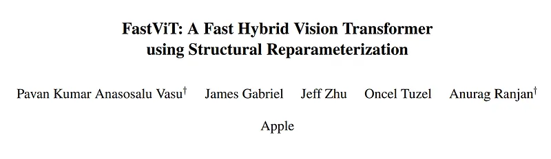 | Title card: FastViT. |
| 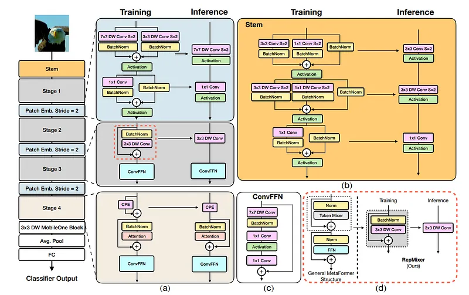 | (a) Overview of FastViT architecture which decouples train-time and inference-time architecture. (b) Architecture of the convolutional stem. (c)Architecture of convolutional-FFN (d) Overview of RepMixer block, which reparameterizes a skip connection at inference. |
| 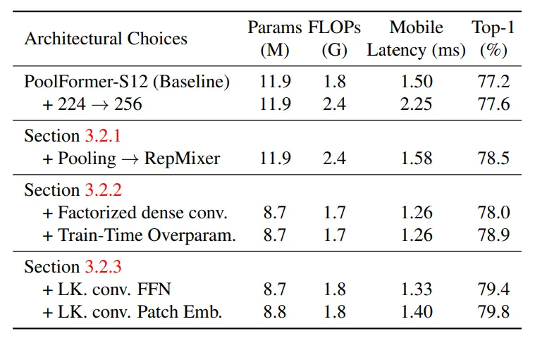 | Analysis of architectural choices made to obtain FastViT-S12 variant, starting from PoolFormer-S12. “LK.” stands for Large Kernel. |
| 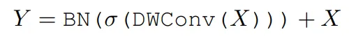 | RepMixer Convolutional mixing was first introduced in ConvMixer. For an input tensor X, the mixing block in the layer was implemented as. |
| 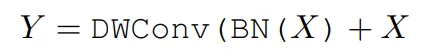 | Meanwhile in RepMixer, the operations are simply rearranged and the non-linear activation function is removed as. |
| 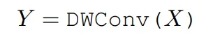 | The main benefit of this design is that it can be reparameterized at inference time to a single depthwise convolutional layer as. |
| 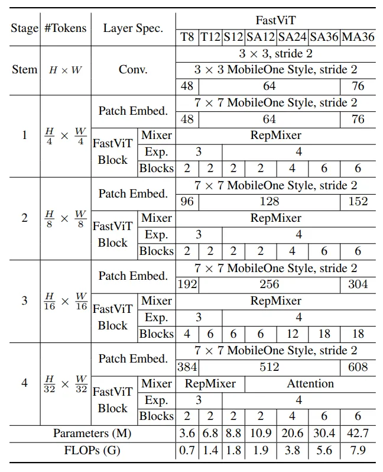 | Architecture details of FastViT variants. |
| 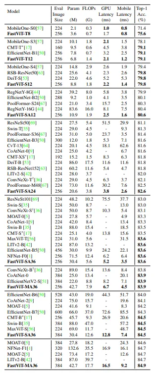 | Comparison of different state-of-the-art methods on ImageNet-1k classification. |
| 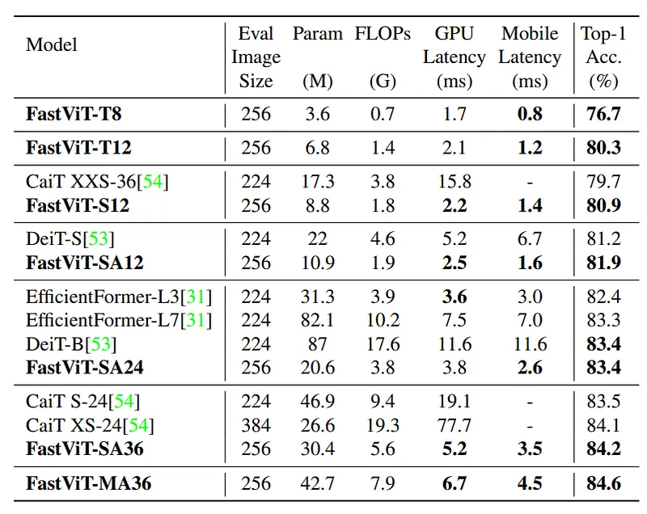 | Comparison of different state-of-the-art methods on ImageNet-1k classification when trained using distillation objective. |
| 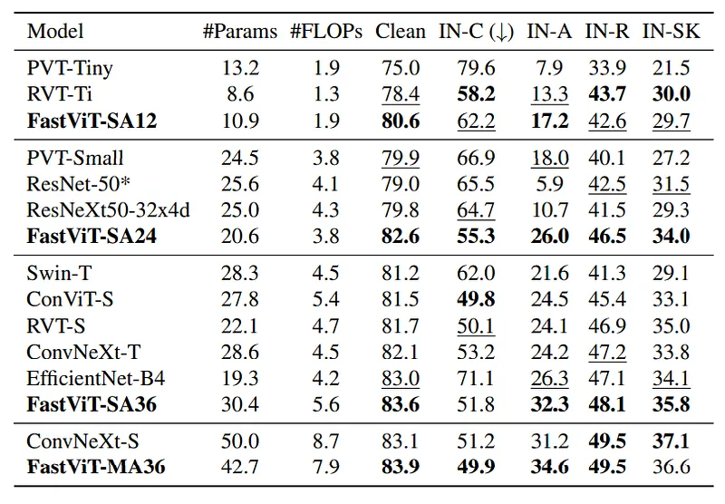 | Results on robustness benchmark datasets. |
| 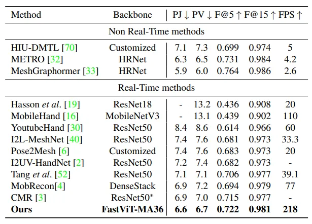 | Results on the FreiHAND test dataset. |
| 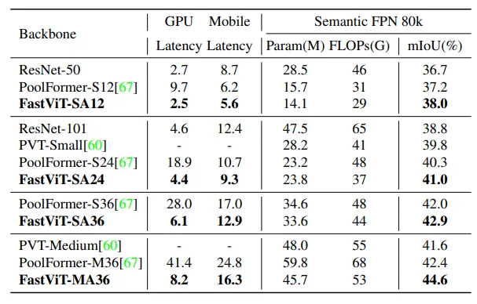 | Performance of different backbones on ADE20K semantic segmentation task. |
| 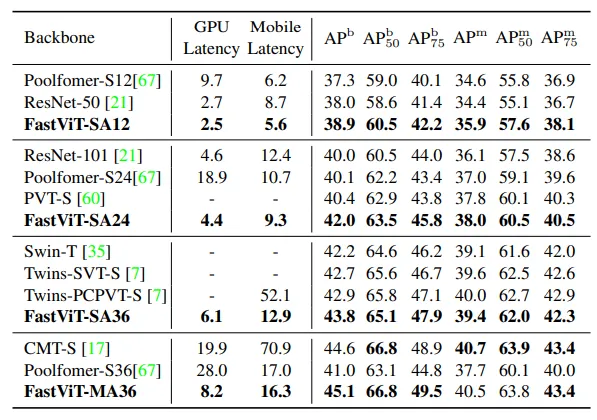 | Results for object detection and instance segmentation on MS-COCO val2017 split. |
## Related

- [[Papers Explained Corpus]]
- [[Computer Vision]]
- [[Model Compression and Efficiency]]
- [[Large Language Models]]
- [[Agentic AI]]
- [[Embedding and Retrieval]]
- [[Papers Explained 224 - CriticGPT]]
- [[Papers Explained 187d - Llama 3.2]]

#summary #topic
