# Papers Explained 226 - RewardBench

RewardBench is a benchmark dataset and code-base for evaluating RMs. The dataset consists of prompt-win-lose trios spanning chat, reasoning, and safety, and is designed to benchmark how RMs perform on challenging, structured, and out-of-distribution queries.

This page ingests the source article into the wiki and connects it to [[Papers Explained Corpus]], [[Evaluation and Benchmarks]], [[Synthetic Data]], [[Reinforcement Learning Topic]], [[Safety and Alignment]], [[Code Models]], [[Reinforcement Learning]].

## Source Metadata

- Source file: `raw/2024-10-08_Papers-Explained-226--RewardBench-31c79c15eb52.html`
- Source title: Papers Explained 226: RewardBench
- Published: 2024-10-08
- Canonical: [https://medium.com/@ritvik19/papers-explained-226-rewardbench-31c79c15eb52](https://medium.com/@ritvik19/papers-explained-226-rewardbench-31c79c15eb52)

## Key Ideas

- The RewardBench leaderboard evaluates RMs trained with various methods, such as direct MLE training of classifiers and Direct Preference Optimization (DPO).
- The dataset includes a combination of existing and curated prompt-completion pairs, covering various metrics such as chat, instruction following, coding, and safety.
- The accuracy of the reward model is evaluated by computing its score for each prompt and categorizing it as a “win” if the score for the chosen completion is higher than the score for the rejected completion.
- The accuracy of the model is reported as the percentage of wins, with the average score being weighted per-prompt in most sections of the dataset, except for the Prior Sets.
- Chat: tests the RM’s ability to distinguish a correct and thorough chat response in open-ended generation. It uses prompts and examples from AlpacaEval and MT Bench.

## Notes

RewardBench is a benchmark dataset and code-base for evaluating RMs. The dataset consists of prompt-win-lose trios spanning chat, reasoning, and safety, and is designed to benchmark how RMs perform on challenging, structured, and out-of-distribution queries.

The RewardBench leaderboard evaluates RMs trained with various methods, such as direct MLE training of classifiers and Direct Preference Optimization (DPO).

## The RewardBench Benchmark

*Figure: The scoring method of the RewardBench evaluation suite.*

The dataset includes a combination of existing and curated prompt-completion pairs, covering various metrics such as chat, instruction following, coding, and safety.

The accuracy of the reward model is evaluated by computing its score for each prompt and categorizing it as a “win” if the score for the chosen completion is higher than the score for the rejected completion.

The accuracy of the model is reported as the percentage of wins, with the average score being weighted per-prompt in most sections of the dataset, except for the Prior Sets.

*Figure: Summary of the dataset used.*

- Chat: tests the RM’s ability to distinguish a correct and thorough chat response in open-ended generation. It uses prompts and examples from AlpacaEval and MT Bench.

- Chat Hard: tests the RM’s ability to understand trick questions and subtle differences in instruction responses. It uses adversarial data and examples from MT Bench and LLMBar.

- Safety: tests the model’s tendency to refuse dangerous content and avoid incorrect refusals to similar trigger words. It uses examples from XSTest, Do-Not-Answer, and an in-development refusals dataset at AI2.

- Reasoning: evaluates the model’s code and reasoning abilities. It uses reformatted examples from HumanEvalPack and incorrect model generations from the PRM800k dataset.

- Prior Sets: used for consistency with recent work on training reward models and averages performance over test sets from existing preference datasets, including the Anthropic Helpful split, the Anthropic HHH subset of BIG-Bench, a curated subset of the test set from the Stanford Human Preferences (SHP) Dataset, and OpenAI’s Learning to Summarize Dataset.

## Evaluation Results

### Comparing State-of-the-art Reward Models

*Figure: Top-20 Leaderboard results.*

- The large models are the only models capable of consistent high performance on the Chat Hard and Reasoning sections, with the model Starling-RM-34B (81.5) being state-ofthe-art.

- The changes in base model size and quality have a direct impact on the model’s performance, and this impact is consistent with the benchmark test.

The Impacts of Different Base Models

*Figure: Results for two model groups.*

- In general, Llama 2 shows a clear improvement with scaling across all sections, but Qwen 1.5 shows less monotonic improvement

*Figure: Comparing all 7B class models.*

- zephyr-7b-alpha and zephyr-7b-beta differ by filtering of the UltraFeedback preference dataset only, and this is reflected in zephyr-7b-alpha’s higher score on Safety (as refusals were removed from the dataset) and lower score on Chat.

- tulu-2-dpo-7b shows the difference from the Mistral 7B to the Llama 2 7B base models and a different supervised fine-tuning dataset, as regressions on Chat Hard and Reasoning, but improvements on Safety.

- zephyr-7b-gemma-v0.1 shows the regression when switching to Gemma base model across many categories.

Different Shapes of Reward Functions

*Figure: The distribution of rewards outputted by reward models for the chosen and rejected responses.*

- Some top scoring models, such as Starling and UltraRM show an increased margin between the mean of the chosen and rejected samples.

### Limits of Current Reward Models

Evaluating across Chat Hard Categories

*Figure: Different categories of performance on the Chat Hard category.*

- Most reward models struggle to pick up differences in hard prompts, especially when the questions involve slight variations in subjects or contexts.

- The Chat Hard section shows that DPO (Differential Privacy Optimization) models perform better in handling these hard prompts, even those with lower average performance overall.

- The Qwen Chat Models, despite their low overall performance, dominate in the hard prompts category.

Evaluating across Reasoning Categories

*Figure: Results for the Reasoning category.*

- The results show a significant variation in the performance of reasoning models.

- The ceiling on reasoning models is much harder than the adversarially designed data, indicating that these models can reliably identify known bugs in reasoning or code.

Evaluating across Safety Metrics

*Figure: A subset of results for the Safety category grouped by behavior type.*

- Models focused on helpfulness without a strong safety notion (e.g., zephyr-7b-beta, zephyr-7b-gemma-v0.1) perform poorly on the should-refuse subsets of the safety section but highly on XSTest Should Respond.

- Models at the top of the overall leaderboard, which include safety information in the training process, maintain strong performance on trick questions that could induce false refusals (XSTest Should Respond).

- Some models score highly on prompts that they should refuse and poorly on those they should not, indicating a model that is likely to falsely refuse queries (e.g., Qwen chat models)

### Limitations of Prior Test Sets

*Figure: Results for Prior Sets.*

- Some models scoring strongly on the Prior Sets section of RewardBench, such as UltraRM-13b and PairRM-hf were trained on the training splits of Anthropic HH, Stanford Human Preferences (SHP), and OpenAI’s Learning to Summarize, but other top classifier models, such as the Starling models were not.

## Paper

RewardBench: Evaluating Reward Models for Language Modeling [2403.13787](https://arxiv.org/abs/2403.13787)

Recommended Reading [LLM Evaluation](https://ritvik19.medium.com/list/llm-evaluation-a011ddd1a546)

## Figures

Figures from the Medium HTML export (`raw/2024-10-08_Papers-Explained-226--RewardBench-31c79c15eb52.html`); local copies under `wiki/assets/papers-explained-226-rewardbench/` when download succeeded.

| Figure | Caption |
|--------|---------|
| 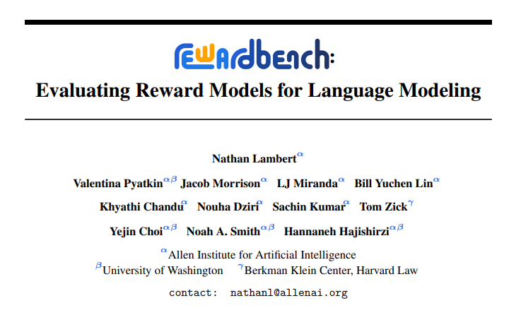 | Title card: RewardBench. |
| 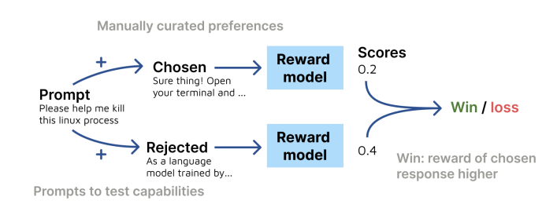 | The scoring method of the RewardBench evaluation suite. |
| 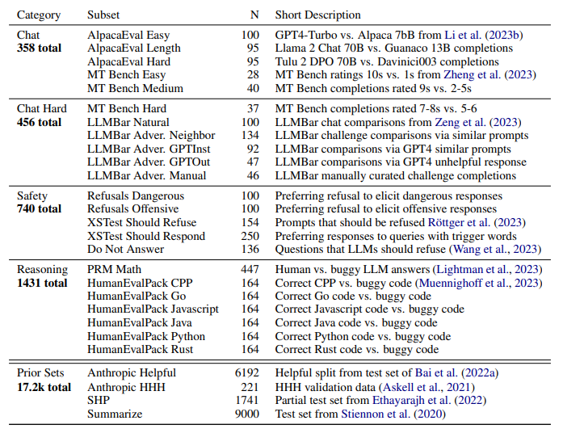 | Summary of the dataset used. |
| 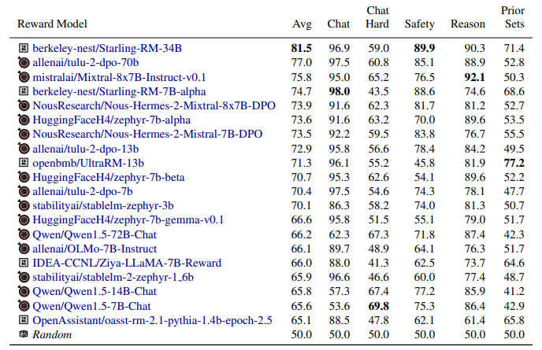 | Top-20 Leaderboard results. |
| 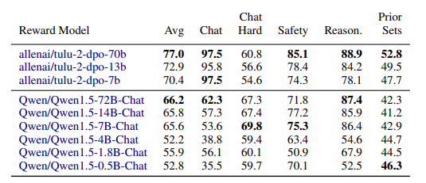 | Results for two model groups. |
| 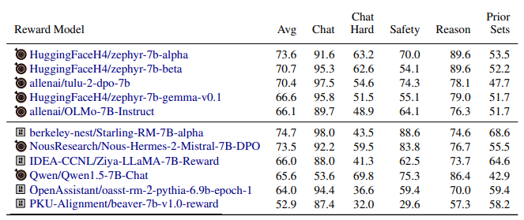 | Comparing all 7B class models. |
| 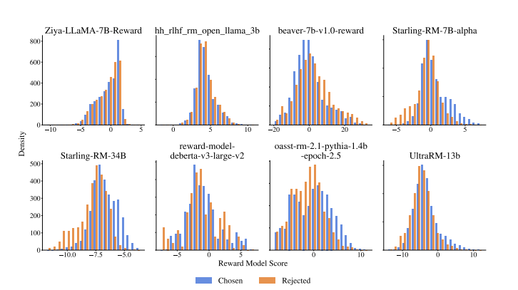 | The distribution of rewards outputted by reward models for the chosen and rejected responses. |
| 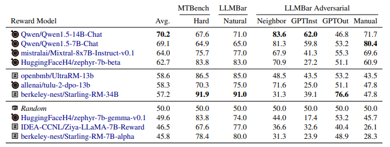 | Different categories of performance on the Chat Hard category. |
| 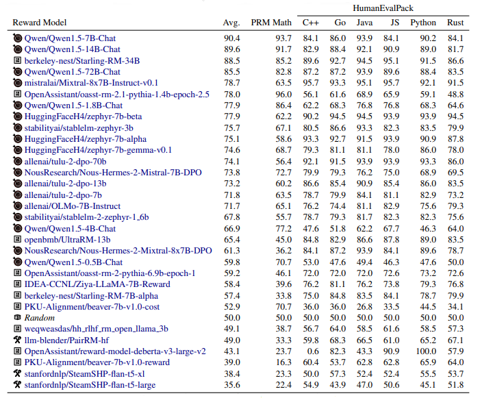 | Results for the Reasoning category. |
| 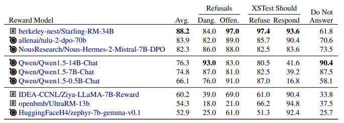 | A subset of results for the Safety category grouped by behavior type. |
| 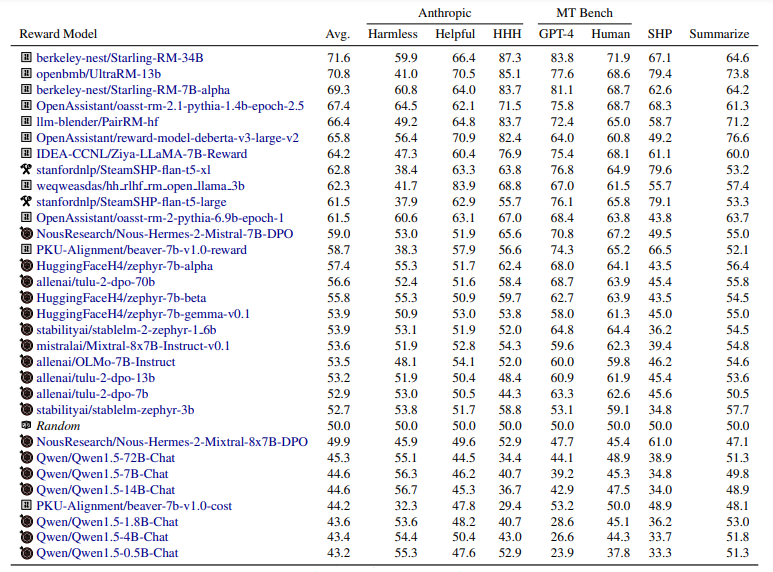 | Results for Prior Sets. |
## Related

- [[Papers Explained Corpus]]
- [[Evaluation and Benchmarks]]
- [[Synthetic Data]]
- [[Reinforcement Learning Topic]]
- [[Safety and Alignment]]
- [[Code Models]]
- [[Reinforcement Learning]]
- [[Papers Explained 187d - Llama 3.2]]
- [[Papers Explained 227 - RAGAS]]

#summary #topic
