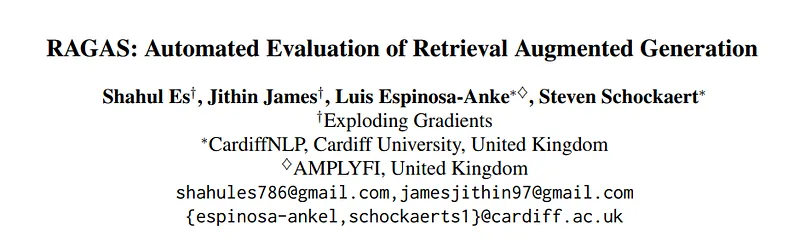
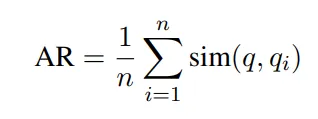
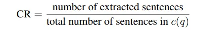
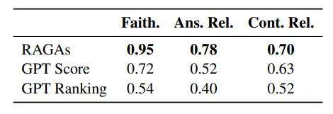

# Papers Explained 227 - RAGAS

Evaluating RAG architectures is challenging because there are several dimensions to consider: the ability of the retrieval system to identify relevant and focused context passages, the ability of the LLM to exploit such passages in a faithful way, or the quality of the generation itself.

This page ingests the source article into the wiki and connects it to [[Papers Explained Corpus]], [[Embedding and Retrieval]], [[Large Language Models]], [[Evaluation and Benchmarks]], [[Verifier-Bounded Learning]].

## Source Metadata

- Source file: `raw/2024-10-09_Papers-Explained-227--RAGAS-4594fc4d96b9.md`
- Source title: Papers Explained 227: RAGAS
- Published: 2024-10-09
- Canonical: [https://medium.com/@ritvik19/papers-explained-227-ragas-4594fc4d96b9](https://medium.com/@ritvik19/papers-explained-227-ragas-4594fc4d96b9)

## Key Ideas

- Evaluating RAG architectures is challenging because there are several dimensions to consider: the ability of the retrieval system to identify relevant and focused context passages, the ability of the LLM to exploit such passages in a faithful way, or the...
- RAGAS is available at [GitHub](https://github.com/explodinggradients/ragas/).
- Faithfulness refers to the idea that the answer a_s(q) should be grounded in the given context c(q).
- To estimate faithfulness, first an LLM is used to extract a set of statements, S(a_s(q)). The aim of this step is to decompose longer sentences into shorter and more focused assertions.
- Given a question and answer, create one or more statements from each sentence in the given answer.
question: [question]
answer: [answer]

## Notes

Evaluating RAG architectures is challenging because there are several dimensions to consider: the ability of the retrieval system to identify relevant and focused context passages, the ability of the LLM to exploit such passages in a faithful way, or the quality of the generation itself. Retrieval Augmented Generation Assessment (RAGAS) is a framework that puts forward a suite of metrics which can be used to evaluate these different dimensions without having to rely on ground truth human annotations.

RAGAS is available at [GitHub](https://github.com/explodinggradients/ragas/).

## Evaluation Strategies

### Faithfulness

Faithfulness refers to the idea that the answer a_s(q) should be grounded in the given context c(q).

To estimate faithfulness, first an LLM is used to extract a set of statements, S(a_s(q)). The aim of this step is to decompose longer sentences into shorter and more focused assertions.

> Given a question and answer, create one or more statements from each sentence in the given answer.
> question: [question]
> answer: [answer]

For each statement s_i in S, the LLM determines if s_i can be inferred from c(q) using a verification function v(s_i, c(q)).

> Consider the given context and following statements, then determine whether they are supported by the information present in the context. Provide a brief explanation for each statement before arriving at the verdict (Yes/No). Provide a final verdict for each statement in order at the end in the given format. Do not deviate from the specified format.
> statement: [statement 1]
> …
> statement: [statement n]

The final faithfulness score, F, is then computed as F = |V| / |S| , where |V| is the number of statements that were supported according to the LLM and |S| is the total number of statements.

### Answer Relevance

Answer Relevance refers to the idea that the generated answer a_s(q) should address the actual question that was provided.

In particular, the assessment of answer relevance does not take into account factuality, but penalizes cases where the answer is incomplete or where it contains redundant information.

The LLM is prompted to generate n potential questions q_i based on a_s(q).

> Generate a question for the given answer.
> answer: [answer]

Then the embeddings for all questions are obtained.

For each q_i, the similarity sim(q, q_i) with the original question q is calculated, as the cosine between the corresponding embeddings. The answer relevance score, AR, for question q is then computed as:

### Context Relevance

Context Relevance refers to the idea that the retrieved context c(q) should be focused, containing as little irrelevant information as possible.

In particular, this metric aims to penalize the inclusion of redundant information.

To estimate context relevance, given a question q and its context c(q), the LLM extracts a subset of sentences, S_ext, from c(q) that are crucial to answer q

> Please extract relevant sentences from the provided context that can potentially help answer the following question. If no relevant sentences are found, or if you believe the question cannot be answered from the given context, return the phrase “Insufficient Information”. While extracting candidate sentences you’re not allowed to make any changes to sentences from given context.

The context relevance score is then computed as:

## The WikiEval Dataset

To evaluate the proposed framework, ideally examples of question-context-answer triples annotated with human judgments are required. Hence the WikiEval dataset is curated.

The dataset is available at [HuggingFace](https://huggingface.co/datasets/explodinggradients/WikiEval).

To construct the dataset, firstly 50 Wikipedia pages covering events that have happened since the reported training cutoff of Chat GPT (Model used in the experiments).

For each of the 50 pages, ChatGPT is then asked to suggest a question that can be answered based on the introductory section of the page

> Your task is to formulate a question from given context satisfying the rules given below:
> 1. The question should be fully answered from the given context.
> 2. The question should be framed from a part that contains non-trivial information.
> 3. The answer should not contain any links.
> 4. The question should be of moderate difficulty.
> 5. The question must be reasonable and must be understood and responded to by humans.
> 6. Do not use phrases that ’provided context’, etc in the question
> context:

ChatGPT is also asked to answer the generated question, when given the corresponding introductory section as context

> Answer the question using the information from the given context.
> question: [question]
> context: [context]

## Experiments

*Figure: Agreement with human annotators in pairwise comparisons of faithfulness, answer relevance and context relevance, using the WikEval dataset (accuracy).*

For the first method, GPT Score, ChatGPT is asked to assign a score between 0 and 10 for the three quality dimensions.

> Faithfulness measures the information consistency of the answer against the given context. Any claims that are made in the answer that cannot be deduced from context should be penalized. Given an answer and context, assign a score for faithfulness in the range 0–10.
> context: [context]
> answer: [answer]

The second baseline, GPT Ranking, instead asks ChatGPT to select the preferred answer/context.

> Answer Relevancy measures the degree to which a response directly addresses and is appropriate for a given question. It penalizes the present of redundant information or incomplete answers given a question. Given an question and answer, rank each answer based on Answer Relevancy.
> question: [question]
> answer 1: [answer 1]
> answer 2: [answer 2]

- The proposed metrics are much closer aligned with the human judgements than the predictions from the two baselines.

- For faithfulness, the RAGAs predictions are in general highly accurate.

- For answer relevance, the agreement is lower, but this is largely due to the fact that the differences between the two candidate answers are often very subtle.

## Paper

RAGAS: Automated Evaluation of Retrieval Augmented Generation [2309.15217](https://arxiv.org/abs/2309.15217)

## Figures

Figures from the Medium HTML export (`raw/2024-10-09_Papers-Explained-227--RAGAS-4594fc4d96b9.md`); local copies under `wiki/assets/papers-explained-227-ragas/` when download succeeded.

| Figure | Caption |
|--------|---------|
|  | Title card: RAGAS. |
|  | For each q_i, the similarity sim(q, q_i) with the original question q is calculated, as the cosine between the corresponding embeddings. |
|  | The context relevance score is then computed as. |
|  | Agreement with human annotators in pairwise comparisons of faithfulness, answer relevance and context relevance, using the WikEval dataset (accuracy). |
## Related

- [[Papers Explained Corpus]]
- [[Embedding and Retrieval]]
- [[Large Language Models]]
- [[Evaluation and Benchmarks]]
- [[Verifier-Bounded Learning]]
- [[Papers Explained 226 - RewardBench]]
- [[Papers Explained 228 - Direct Judgement Preference Optimization]]

#summary #topic
