# Papers Explained 228 - Direct Judgement Preference Optimization

This study investigates the idea of learning from both positive and negative data with preference optimization to enhance the evaluation capabilities of LLM judges across an array of different use cases by employing three approaches (Chain-of-Thought Critique, Standard Judgement and Response Deduction) to collect the preference pairs for...

This page ingests the source article into the wiki and connects it to [[Papers Explained Corpus]], [[Reinforcement Learning Topic]], [[Reasoning Models]], [[Large Language Models]], [[Evaluation and Benchmarks]], [[Supervised Fine-Tuning]].

## Source Metadata

- Source file: `raw/2024-10-10_Papers-Explained-228--Direct-Judgement-Preference-Optimization-6915425402bf.html`
- Source title: Papers Explained 228: Direct Judgement Preference Optimization
- Published: 2024-10-10
- Canonical: [https://medium.com/@ritvik19/papers-explained-228-direct-judgement-preference-optimization-6915425402bf](https://medium.com/@ritvik19/papers-explained-228-direct-judgement-preference-optimization-6915425402bf)

## Key Ideas

- This study investigates the idea of learning from both positive and negative data with preference optimization to enhance the evaluation capabilities of LLM judges across an array of different use cases by employing three approaches (Chain-of-Thought...
- Previous studies focus on supervised fine-tuning, where the generative judge is trained on positive evaluation examples with correct judgments, annotated by either humans or powerful language models like GPT-4.
- The judge only learns to imitate the reasoning form from the positive examples but not necessarily the underlying reasoning skills for deriving the right judgment.
- Since the model does not explicitly learn to avoid generating negative examples with incorrect judgments, the probability of negative examples could also increase along the positive examples during SFT.
- Hence, three types of positive and negative examples are proposed to improve the capability of generative judges from different perspectives.

## Notes

This study investigates the idea of learning from both positive and negative data with preference optimization to enhance the evaluation capabilities of LLM judges across an array of different use cases by employing three approaches (Chain-of-Thought Critique, Standard Judgement and Response Deduction) to collect the preference pairs for different use cases (single rating, pairwise comparison and classification).

## Method

Previous studies focus on supervised fine-tuning, where the generative judge is trained on positive evaluation examples with correct judgments, annotated by either humans or powerful language models like GPT-4. However, SFT for boosting the reasoning capability of a language model can be suboptimal for the following reasons.

- The judge only learns to imitate the reasoning form from the positive examples but not necessarily the underlying reasoning skills for deriving the right judgment.

- Since the model does not explicitly learn to avoid generating negative examples with incorrect judgments, the probability of negative examples could also increase along the positive examples during SFT.

*Figure: Overview of the method.*

Hence, three types of positive and negative examples are proposed to improve the capability of generative judges from different perspectives.

- Chain-of-Thought Critique, which aims to improve the reasoning capability

- Standard Judgement, which aims to provide direct supervision for producing the correct judgment;

- Response Deduction, which aims to further enhance the understanding of good/bad responses in hindsight.

*Figure: The preference data curation and training pipeline.*

### Chain-of-Thought Critique

Given an evaluation protocol p, a task input i and a response r from another model to be evaluated (or a response pair {ra,rb} for pairwise comparison) as input x ∈ X, the judge is trained to generate a free-text evaluation y = {c,j} ∈ Y. The evaluation consists of (1) a Chain-of-Thought (CoT) critique c that provides a detailed analysis of the response(s) and (2) a final judgment j, which could be a single score, a preference over {ra , rb }, or a classification result.

### Standard Judgement

In the CoT critiques, only a few important tokens determine the final judgment while the remaining tokens improve flow of speech and coherence. Thus, the relatively long output sequence may dilute the training signal for these crucial tokens, leading to poor judgment supervision and sub-optimal alignment with human preferences. To mitigate this, the model is trained to generate standard judgements without the CoT critiques as well.

### Response Deduction

Response Deduction is an auxiliary task to help enhance the understanding of what both good and bad responses should look like. In this task, the judge is given as input the original evaluation protocol p, a task input i, and the CoT critique {c, j} that matches the ground-truth given by the teacher model. Besides that, an instruction is provided to deduce the original response(s) based on the CoT critique. Then the judge is trained to generate the original response(s) y = r (or y = {ra,rb}). It is found that such a reverse task helps the model to understand the evaluation task in hindsight, and its effectiveness is validated in experiments.

## Experimental Setup

The training data sources are human-annotated datasets and synthetically generated data. To obtain preference data, a strong teacher model (Llama-3.1–70B-Instruct) is prompted to generate high-quality preference data DCoT. Standard judgment preference DStd is obtained by removing the CoT critiques from DCoT. Weaker models are used to generate deduced responses as negative examples. In total, 680K preference pairs are collected, with a ratio of 70%:15%:15% for D_CoT, D_Std, and D_Ded.

Three models are trained: Llama-3.1–8B-Instruct, NeMo-Instruct-12B, and Llama-3.1–70B-Instruct, yielding SFR-LLaMA-3.1–8B-Judge, SFR-NeMo-12B-Judge, SFR-LLaMA-3.1–70B-Judge, respectively, by employing the DPO training objective. SFT loss is also added in addition to DPO loss.

## Evaluation

### Evaluation Suite

Consists of seven pairwise comparison benchmarks, four single rating benchmarks, and two classification benchmarks, assessing model performance in various judgment scenarios.

- Pairwise comparisons: Datasets like RewardBench, InstruSum, Auto-J, HHH, LFQA, EvalBiasBench, and PreferenceBench are used to assess model performance in reward modeling, summarization, safety, and more.

- Single ratings: BiGGen Bench, FLASK, MT Bench, and FeedbackBench evaluate generation, reasoning, and tool usage across multiple models.

- Classification: LLM-AggreFact and InfoBench are used for coarse and fine-grained classification tasks.

### Comparison Models

Performance compared with baselines like Prometheus 2, Prometheus 2 BGB, Llama-3-OffsetBias, Skywork-Critic-Llama-3.1, Auto-J, and OpenAI’s GPT-4o and GPT-4o-mini.

### Performance

*Figure: Pairwise comparison tasks.*

*Figure: Single rating performance.*

*Figure: Classification performance.*

- SFR-Judge models outperform other models across 10 out of 13 benchmarks.

- SFR-LLaMA-3.1–70B-Judge is the highest-performing model on five of seven pairwise benchmarks.

- SFR models consistently outperform GPT-4o and other specialized judge models on classification tasks like LLM-AggreFact and InfoBench.

*Figure: Detailed generative RewardBench results.*

- RewardBench: SFR-Judges achieve state-of-the-art performance, crossing the 90% accuracy threshold.

*Figure: Bias analysis of generative judge models, with a detailed breakdown of EvalBiasBench (EBB) bias categories and the model pariwise comparison consistency macro-average across the 6 non-RewardBench benchmarks.*

- Bias & Consistency: SFR-Judges are less biased and exhibit higher consistency in pairwise judgments.

*Figure: Influence of various training configurations.*

- Training Tasks Contribution: CoT critique, standard judgment, and response deduction contribute to creating a well-rounded judge model.

*Figure: Average pairwise performance for 3 different prompting approaches: Using a fixed RewardBench prompt (RB), task-specific prompts (TS), and a fixed PRePair-style prompt.*

- Flexible Prompting: The model performs well regardless of the prompting strategy used, showing robustness to different prompt templates.

*Figure: AlpacaEval results.*

- Downstream Model Development: SFR-Judge models improve downstream models by providing feedback and CoT critiques.

## Paper

Direct Judgement Preference Optimization [2409.14664](https://arxiv.org/abs/2409.14664)

## Figures

Figures from the Medium HTML export (`raw/2024-10-10_Papers-Explained-228--Direct-Judgement-Preference-Optimization-6915425402bf.html`); local copies under `wiki/assets/papers-explained-228-direct-judgement-preference-optimization/` when download succeeded.

| Figure | Caption |
|--------|---------|
| 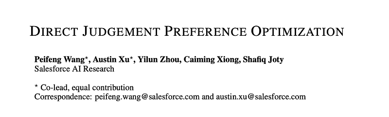 | Title card: Direct Judgement Preference Optimization. |
| 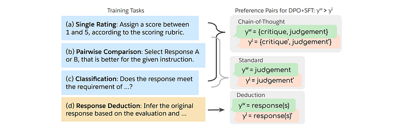 | Overview of the method. |
| 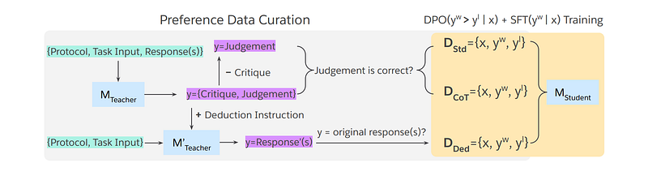 | The preference data curation and training pipeline. |
|  | Experimental Setup. |
| 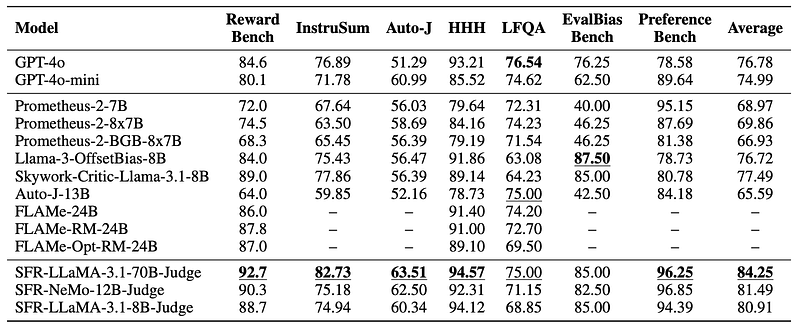 | Pairwise comparison tasks. |
| 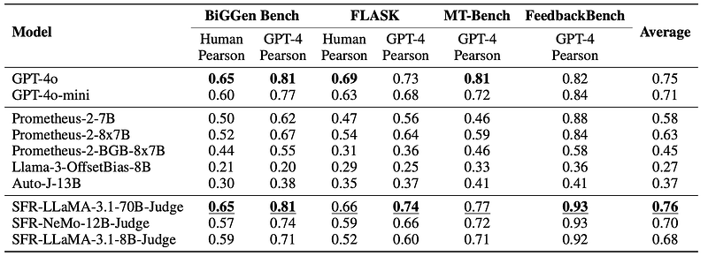 | Single rating performance. |
| 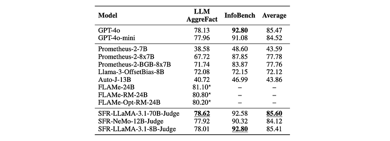 | Classification performance. |
| 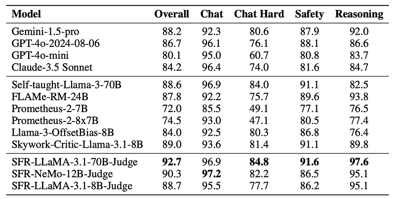 | Detailed generative RewardBench results. |
| 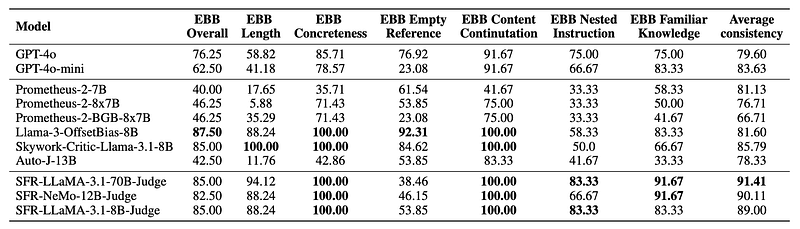 | Bias analysis of generative judge models, with a detailed breakdown of EvalBiasBench (EBB) bias categories and the model pariwise comparison consistency macro-average across the 6 non-RewardBench benchmarks. |
| 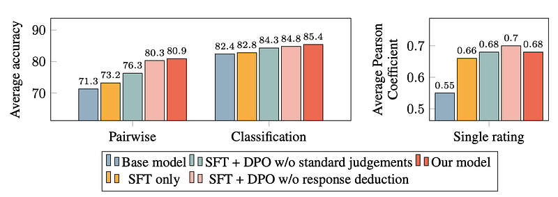 | Influence of various training configurations. |
| 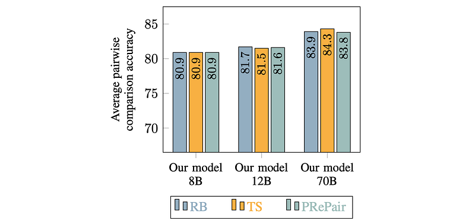 | Average pairwise performance for 3 different prompting approaches: Using a fixed RewardBench prompt (RB), task-specific prompts (TS), and a fixed PRePair-style prompt. |
| 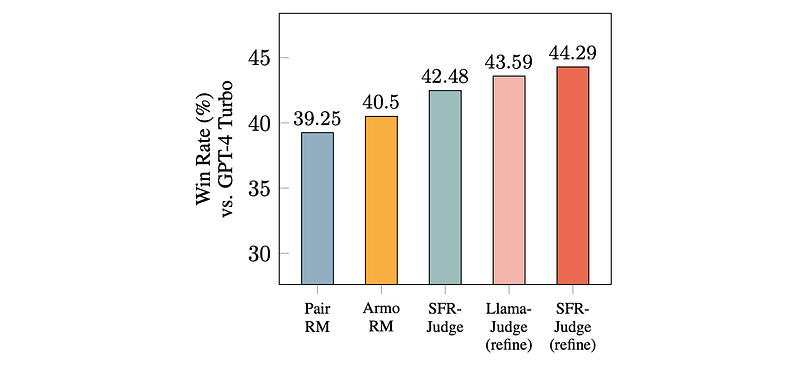 | AlpacaEval results. |
## Related

- [[Papers Explained Corpus]]
- [[Reinforcement Learning Topic]]
- [[Reasoning Models]]
- [[Large Language Models]]
- [[Evaluation and Benchmarks]]
- [[Supervised Fine-Tuning]]
- [[Papers Explained 227 - RAGAS]]
- [[Papers Explained 229 - Efficient ViT]]

#summary #topic
