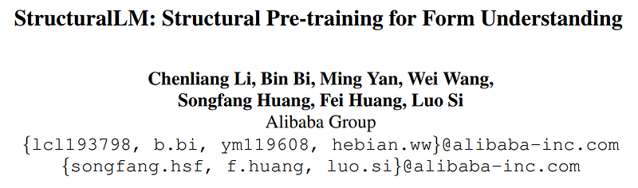
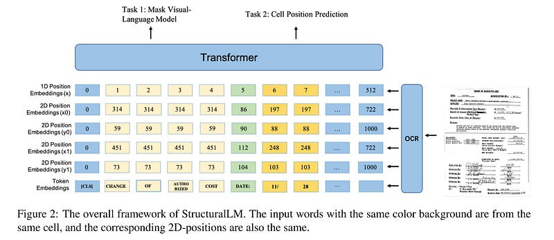
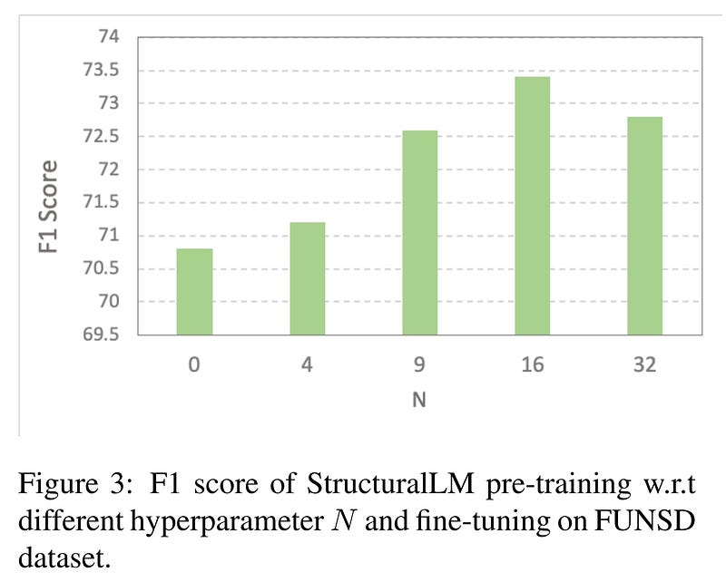

# Papers Explained 23 - Structural LM

Taking advantage of existing pretrained language models and to adapt to document image understanding tasks, Structural LM uses the BERT architecture as the backbone.

This page ingests the source article into the wiki and connects it to [[Papers Explained Corpus]], [[Large Language Models]], [[Document AI]], [[Vision Language Models]], [[Embedding and Retrieval]].

## Source Metadata

- Source file: `raw/2023-02-07_Papers-Explained-23--Structural-LM-36e9df91e7c1.html`
- Source title: Papers Explained 23: Structural LM
- Published: 2023-02-07
- Canonical: [https://medium.com/@ritvik19/papers-explained-23-structural-lm-36e9df91e7c1](https://medium.com/@ritvik19/papers-explained-23-structural-lm-36e9df91e7c1)

## Key Ideas

- Based on the architecture, we propose to utilize the cell-level layout information from document images and incorporate them into the transformer encoder.
- First, given a set of tokens from different cells and the layout information of cells, the cell level input embeddings are computed by summing the corresponding word embeddings, cell-level 2Dposition embeddings, and original 1D-position embeddings.
- Masked Visual-Language Modeling: Some of the input tokens are randomly masked but the corresponding cell-level position embeddings are kept , and then the model is pre-trained to predict the masked tokens.
- Compared with the MVLM in LayoutLM, StructuralLM makes use of the cell-level layout information and predicts the mask tokens more accurately.
- Cell Position Classification: First, the image is split into N areas of the same size. Then the area to which the cell belongs to is calculated through the center 2D-position of the cell.

## Notes

Taking advantage of existing pretrained language models and to adapt to document image understanding tasks, Structural LM uses the BERT architecture as the backbone.

Based on the architecture, we propose to utilize the cell-level layout information from document images and incorporate them into the transformer encoder.

First, given a set of tokens from different cells and the layout information of cells, the cell level input embeddings are computed by summing the corresponding word embeddings, cell-level 2Dposition embeddings, and original 1D-position embeddings. Then, these input embeddings are passed through a bidirectional Transformer encoder that can generate contextualized representations with an attention mechanism.

## Pre Training

Masked Visual-Language Modeling: Some of the input tokens are randomly masked but the corresponding cell-level position embeddings are kept , and then the model is pre-trained to predict the masked tokens.

Compared with the MVLM in LayoutLM, StructuralLM makes use of the cell-level layout information and predicts the mask tokens more accurately.

Cell Position Classification: First, the image is split into N areas of the same size. Then the area to which the cell belongs to is calculated through the center 2D-position of the cell.

Meanwhile, some cells are randomly selected, and the 2D-positions of tokens in the selected cells are replaced with (0; 0; 0; 0). A classification layer is built above the encoder outputs. This layer predicts a label [1,N] of the area where the selected cell is located, and computes the cross-entropy loss.

Following LayoutLM, StructuralLM is pre-trained on the IIT-CDIP Test Collection 1.0.

To take advantage of existing pre-trained models and adapt to document image understanding tasks, the weights of StructuralLM model are initialized with the pre-trained RoBERTa large model except for the 2D-position embedding layers.

## Fine Tuning

- Form and Receipt Understanding: FUNSD dataset

- Document Image Classification: RVL-CDIP dataset

- Document Visual Question Answering: DocVQA dataset

## Paper

StructuralLM: Structural Pre-training for Form Understanding [2105.11210](https://arxiv.org/abs/2105.11210)

## Figures

Figures from the Medium HTML export (`raw/2023-02-07_Papers-Explained-23--Structural-LM-36e9df91e7c1.html`); local copies under `wiki/assets/papers-explained-23-structural-lm/` when download succeeded.

| Figure | Caption |
|--------|---------|
|  | Title card: Structural LM. |
|  | Based on the architecture, we propose to utilize the cell-level layout information from document images and incorporate them into the... |
|  | Meanwhile, some cells are randomly selected, and the 2D-positions of tokens in the selected cells are replaced with (0; 0; 0; 0). |
## Related

- [[Papers Explained Corpus]]
- [[Large Language Models]]
- [[Document AI]]
- [[Vision Language Models]]
- [[Embedding and Retrieval]]
- [[Papers Explained 22 - Focal Loss for Dense Object Detection (RetinaNet)]]
- [[Papers Explained Review 02 - Layout Transformers]]

#summary #topic
