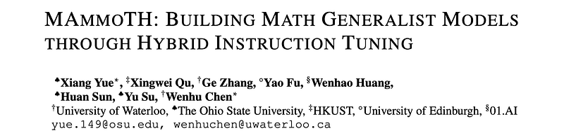
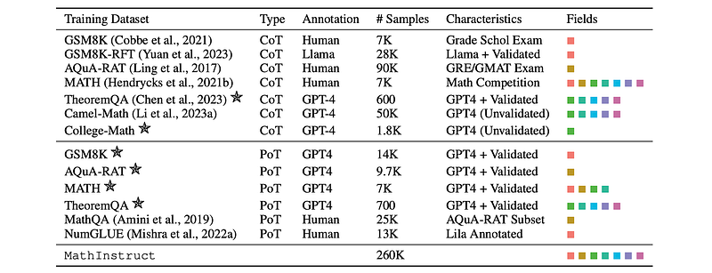
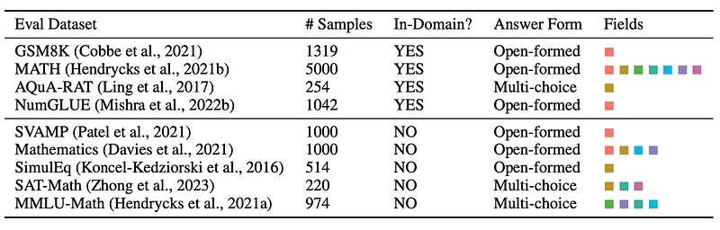
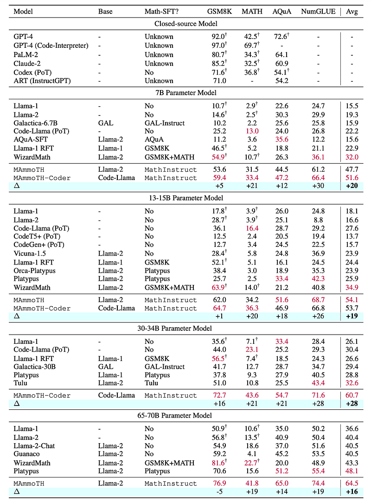
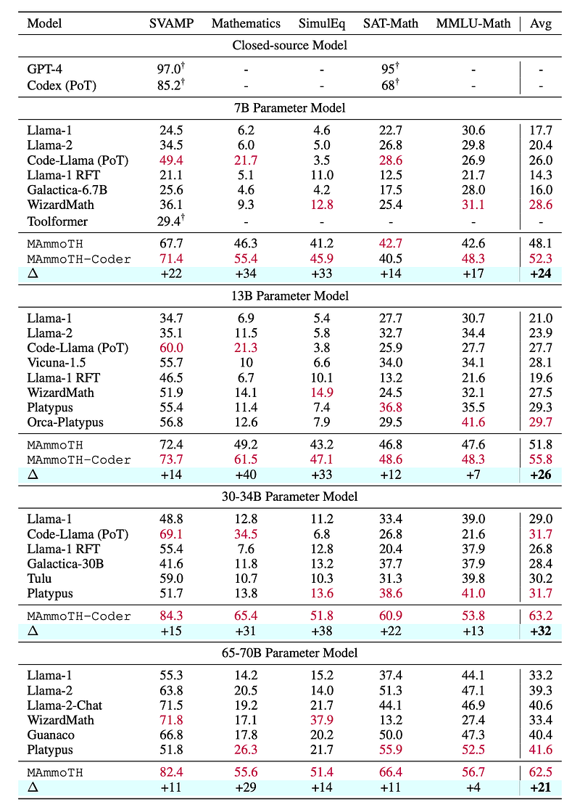
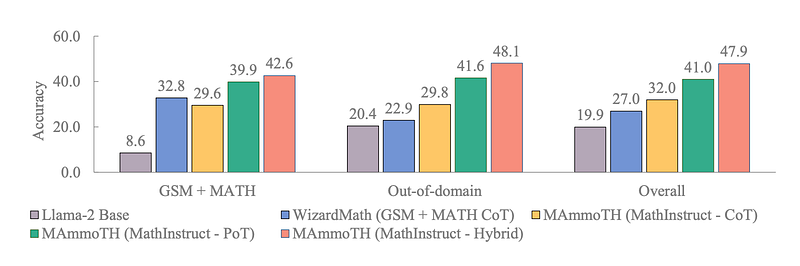

# Papers Explained 230 - MAmmoTH

MAmmoTH is a series of open-source LLMs specifically tailored for general math problem-solving, trained on MathInstruct, a meticulously curated instruction tuning dataset compiled from 13 math datasets with intermediate rationales.

This page ingests the source article into the wiki and connects it to [[Papers Explained Corpus]], [[Reasoning Models]], [[Synthetic Data]], [[Large Language Models]], [[Code Models]], [[Supervised Fine-Tuning]].

## Source Metadata

- Source file: `raw/2024-10-14_Papers-Explained-230--MAmmoTH-06189e929910.html`
- Source title: Papers Explained 230: MAmmoTH
- Published: 2024-10-14
- Canonical: [https://medium.com/@ritvik19/papers-explained-230-mammoth-06189e929910](https://medium.com/@ritvik19/papers-explained-230-mammoth-06189e929910)

## Key Ideas

- The project is available [here](https://tiger-ai-lab.github.io/MAmmoTH/).
- The aim is to compile a list of high-quality and diverse math instruction-tuning dataset, with broad coverage of different mathematical fields and complexity levels, and CoT & PoT rationales.
- To achieve this, high-quality datasets such as GSM8K, MATH, AQuA, Camel, and TheoremQA, which cover different math fields and complexity levels are used.
- To integrate both CoT and PoT rationales into the dataset, GPT-4 to supplement the PoT rationales for datasets that do not have available PoT rationales, including MATH, AQuA, GSM8K, and TheoremQA.
- All the subsets in the MathInstruct are unified to conform to the structure of an Alpaca-like instruction dataset. Llama-2 and Code Llama including 7B, 13B, 34B, and 70B models are used as the base models to fine tune on MathInstruct for three epochs.

## Notes

MAmmoTH is a series of open-source LLMs specifically tailored for general math problem-solving, trained on MathInstruct, a meticulously curated instruction tuning dataset compiled from 13 math datasets with intermediate rationales. It presents a hybrid of chain-of-thought (CoT) and program-of-thought (PoT) rationales allowing different thought processes for different math problems.

The project is available [here](https://tiger-ai-lab.github.io/MAmmoTH/).

## Curating A Diverse And Hybrid Instruction Tuning Dataset

The aim is to compile a list of high-quality and diverse math instruction-tuning dataset, with broad coverage of different mathematical fields and complexity levels, and CoT & PoT rationales.

*Figure: Overview of our MathInstruct. * means with NEW rationales curated by prompting GPT-4.*

To achieve this, high-quality datasets such as GSM8K, MATH, AQuA, Camel, and TheoremQA, which cover different math fields and complexity levels are used. However, these existing datasets lack coverage for college-level math knowledge, such as abstract algebra and formal logic. To address this gap, GPT-4 is used to synthesize CoT rationales for questions in TheoremQA and to create question-CoT pairs using Self-Instruct.

To integrate both CoT and PoT rationales into the dataset, GPT-4 to supplement the PoT rationales for datasets that do not have available PoT rationales, including MATH, AQuA, GSM8K, and TheoremQA. These synthesized programs are then filtered by comparing their executed results with human-annotated ground truth, ensuring the high quality of the added rationales.

## Training Setup

All the subsets in the MathInstruct are unified to conform to the structure of an Alpaca-like instruction dataset. Llama-2 and Code Llama including 7B, 13B, 34B, and 70B models are used as the base models to fine tune on MathInstruct for three epochs.

## Evaluation

*Figure: Evaluation Datasets.*

### Main Results

*Figure: In-domain evaluation results*

- MAmmoTH and MAmmoTH-Coder outperform state-of-the-art (SoTA) models like WizardMath and Platypus on various IND datasets.

- MAmmoTH-Coder-34B and MAmmoTH-70B even surpass closed-source LLMs on certain datasets.

- MAmmoTH demonstrates particular strength in solving complex math problems in the MATH dataset, outperforming WizardMath by over 25% at different scales.

*Figure: Out-of-domain evaluation results.*

- MAmmoTH and MAmmoTH-Coder achieve significant performance gains on OOD datasets compared to baseline models.

- MAmmoTH-7B notably boosts the performance of WizardMath-7B on the MMLU-Math dataset by 9%, demonstrating strong generalizability to unseen math problems.

- MAmmoTH-Coder consistently outperforms MAmmoTH, especially on OOD datasets, highlighting the benefits of continuous code training.

- MAmmoTH-Coder (34B) achieves higher average performance on OOD datasets than MAmmoTH (70B), suggesting that code training enhances both prompting and reasoning abilities.

### Ablation Study

*Figure: Investigation of the influence of CoT & PoT hybrid training on the 7B Llama-2 model.*

A series of control experiments conducted to isolate the impact of different training data subsets

- CoT subset: Improves overall nine-dataset accuracy from 27% to 32%, demonstrating the value of general language-based reasoning.

- PoT subset: Significantly boosts accuracy to 41%, highlighting the importance of program generation capabilities.

- Hybrid approach: Achieves the best performance at 47.9%. This combination leverages CoT’s strengths in abstract reasoning and PoT’s ability to utilize Python APIs for complex computations.

## Paper

MAmmoTH: Building Math Generalist Models through Hybrid Instruction Tuning [2309.05653](https://arxiv.org/abs/2309.05653)

## Figures

Figures from the Medium HTML export (`raw/2024-10-14_Papers-Explained-230--MAmmoTH-06189e929910.html`); local copies under `wiki/assets/papers-explained-230-mammoth/` when download succeeded.

| Figure | Caption |
|--------|---------|
|  | Title card: MAmmoTH. |
|  | Overview of our MathInstruct. * means with NEW rationales curated by prompting GPT-4. |
|  | Evaluation Datasets. |
|  | In-domain evaluation results. |
|  | Out-of-domain evaluation results. |
|  | Investigation of the influence of CoT & PoT hybrid training on the 7B Llama-2 model. |
## Related

- [[Papers Explained Corpus]]
- [[Reasoning Models]]
- [[Synthetic Data]]
- [[Large Language Models]]
- [[Code Models]]
- [[Supervised Fine-Tuning]]
- [[Papers Explained 229 - Efficient ViT]]
- [[Papers Explained 231 - MAmmoTH2]]

#summary #topic
