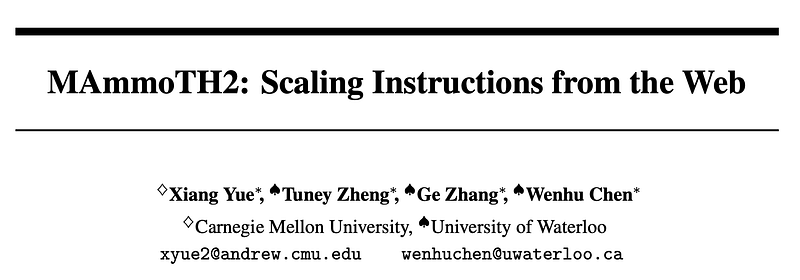
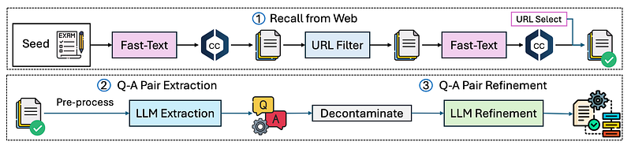
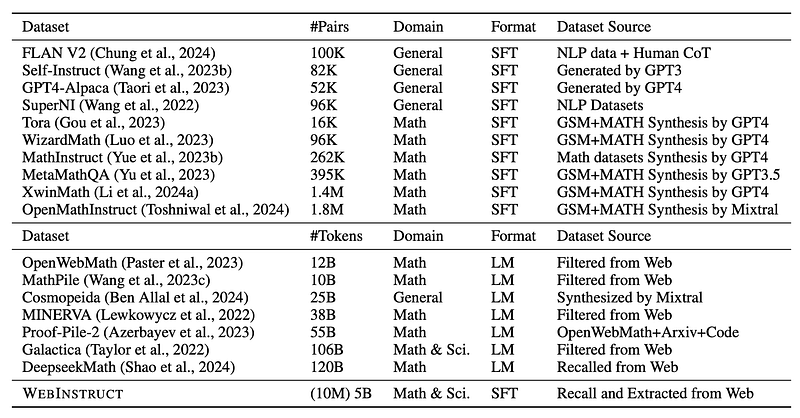
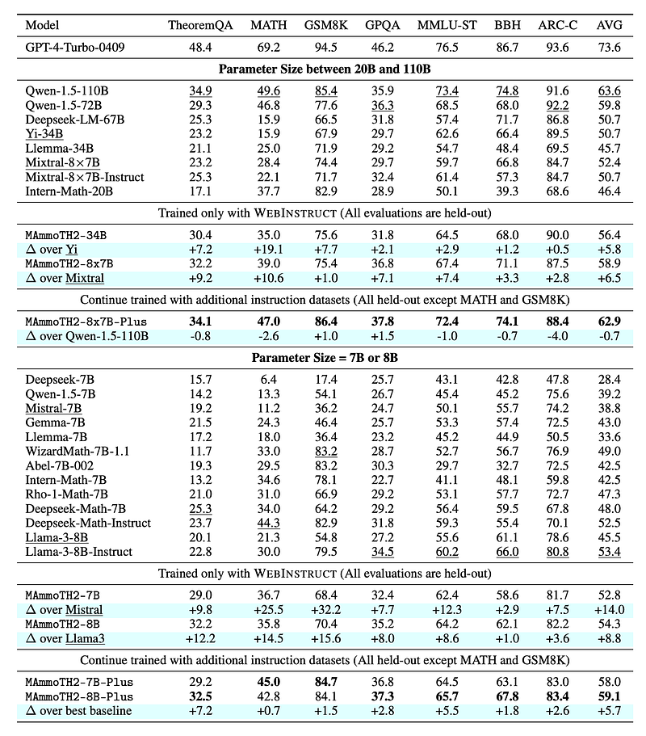

# Papers Explained 231 - MAmmoTH2

This work proposes a method to efficiently harvest 10M naturally existing instruction data from the pre-training web corpus to enhance LLMs’ reasoning abilities. The approach involves three steps: recalling relevant documents, extracting instruction-response pairs, and refining the extracted pairs using open-source LLMs.

This page ingests the source article into the wiki and connects it to [[Papers Explained Corpus]], [[Synthetic Data]], [[Large Language Models]], [[Reasoning Models]], [[Mixture of Experts]], [[Evaluation and Benchmarks]].

## Source Metadata

- Source file: `raw/2024-10-15_Papers-Explained-231--MAmmoTH2-e9c0e6fb9795.html`
- Source title: Papers Explained 231: MAmmoTH2
- Published: 2024-10-15
- Canonical: [https://medium.com/@ritvik19/papers-explained-231-mammoth2-e9c0e6fb9795](https://medium.com/@ritvik19/papers-explained-231-mammoth2-e9c0e6fb9795)

## Key Ideas

- This work proposes a method to efficiently harvest 10M naturally existing instruction data from the pre-training web corpus to enhance LLMs’ reasoning abilities.
- For a broad coverage of disciplines new exam problems are crawled from educational websites. To achieve this, 100K seed data is crawled as positive training examples and 100K negative documents are randomly sampled from Common Crawl to train a fastText model.
- The fastText model is trained for 3 epochs with a vector dimension of 256. The trained fastText model is used to recall relevant documents from an internal CC, resulting in 100B tokens.
- Sampled documents from the selected domains as used positive examples and documents from non-selected domains and general Common Crawl as negative examples to re-train an improved fastText classifier.
- It is observed there are many Q-A pairs present in a large corpus of documents, but these Q-A pairs are mixed with noise such as ads, markups, and boilerplate content.

## Notes

This work proposes a method to efficiently harvest 10M naturally existing instruction data from the pre-training web corpus to enhance LLMs’ reasoning abilities. The approach involves three steps: recalling relevant documents, extracting instruction-response pairs, and refining the extracted pairs using open-source LLMs. Base LLMs are fine tuned on this dataset to build MAmmoTH2 models, which significantly boost performance on reasoning benchmarks.

## Web Instruct

### Recall from Common Crawl

For a broad coverage of disciplines new exam problems are crawled from educational websites. To achieve this, 100K seed data is crawled as positive training examples and 100K negative documents are randomly sampled from Common Crawl to train a fastText model.

The fastText model is trained for 3 epochs with a vector dimension of 256. The trained fastText model is used to recall relevant documents from an internal CC, resulting in 100B tokens. The recalled documents are grouped by their domains (root URL) and only those with more than 1000 documents are retained, extracting roughly 600K domains. GPT-3.5 is prompted to scan through the domains and select those that might contain instruction data, labeling around 50K domains as positive samples.

Sampled documents from the selected domains as used positive examples and documents from non-selected domains and general Common Crawl as negative examples to re-train an improved fastText classifier. The newly trained fastText classifier is now used to recall documents, resulting in 40B tokens. GPT-4 is prompted to sift through the recalled domains again, ultimately leading to 18M raw documents, primarily originating from the desired websites.

### Q-A Pair Extraction

It is observed there are many Q-A pairs present in a large corpus of documents, but these Q-A pairs are mixed with noise such as ads, markups, and boilerplate content. To improve the quality of the data, the HTML is first preprocessed to extract useful content from the recalled documents using rule-based filtering to remove site information, ads, and HTML boilerplate, which significantly reduces the document length.

Next, Qwen-72B is used to identify Q-A pairs from the preprocessed documents. In-context examples are provided to help the model understand what to extract and allow it to return void if no natural Q-A pairs exist. This step identifies about 30% of the recalled documents as containing naturally existing Q-A pairs, resulting in around 5 million Q-A pairs.

To avoid contamination, web pages containing questions or answers matching the evaluation benchmarks are filtered out using n-gram string matches (n = 10).

### Q-A Pair Refinement

The extracted Q-A pair candidates are refined using LLMs. Mixtral-22B×8 and Qwen-72B are prompted to reformat the extracted Q-A pairs. Two models are used to increase the diversity of the dataset. If the answer does not contain any explanation, these two LLMs will attempt to complete the intermediate reasoning steps leading to the given answer.

The process results in 10M Q-A pairs.

### Dataset Statistics

### Additional Public Instruction Datasets

To further enhance the diversity and quality of the dataset, MAmmoTH2 is fine tuned on several open source instruction tuning datasets: OpenHermes 2.5, Code-Feedback, Math-Plus which is an augmented version of MetaMathQA (395K) and Orca-Math (200K).

## Experimental Setup

All the samples in the dataset are unified to conform to the structure of a multi-turn instruction tuning dataset. Mistral 7B , Mixtral 8×7B, Llama-3 8B, and Yi-34B are fine-tuned with a maximum sequence length of 4096 for 2 epochs.

## Evaluation

*Figure: Main results on reasoning datasets.*

- WebInstruct training significantly improves performance across various benchmarks for 7B and 8B parameter models.

- MAmmoTH2–7B achieves a 14-point average performance boost over Mistral-7B.

- MAmmoTH2–8B improves Llama-3–8B-base by an average of 8.8 points.

- Performance gains are consistent across different model sizes, including larger models like Yi-34B and Mixtral.

- Yi-34B’s MATH performance increases by 19% after WEBINSTRUCT training.

MAmmoTH2-Plus models

- Achieve state-of-the-art results on TheoremQA, GPQA, and ARC-C for models under 10B parameters.

- MAmmoTH2–7B-Plus performs close to the best-known results on MATH and GSM.

Comparison with Llama3-Instruct:

- MAmmoTH2–8B-Plus outperforms Llama3-Instruct (trained on a 10M instruction dataset) by an average of 6% across benchmarks.

Scaling:

- MAmmoTH2–8x7B-Plus matches the performance of Qwen-1.5–110B with only 13B active parameters.

## Paper

MAmmoTH2: Scaling Instructions from the Web [2405.03548](https://arxiv.org/abs/2405.03548)

## Figures

Figures from the Medium HTML export (`raw/2024-10-15_Papers-Explained-231--MAmmoTH2-e9c0e6fb9795.html`); local copies under `wiki/assets/papers-explained-231-mammoth2/` when download succeeded.

| Figure | Caption |
|--------|---------|
|  | Title card: MAmmoTH2. |
|  | Web Instruct. |
|  | The process results in 10M Q-A pairs. |
|  | Main results on reasoning datasets. |
## Related

- [[Papers Explained Corpus]]
- [[Synthetic Data]]
- [[Large Language Models]]
- [[Reasoning Models]]
- [[Mixture of Experts]]
- [[Evaluation and Benchmarks]]
- [[Papers Explained 230 - MAmmoTH]]
- [[Papers Explained 232 - MobileNetV4]]

#summary #topic
