# Papers Explained 232 - MobileNetV4

An optimized neural architecture search (NAS) recipe is also introduced, which improves MNv4 search effectiveness. To further boost accuracy, a novel distillation technique is introduced, which mixes datasets with different augmentations and adds balanced in-class data, enhancing generalization and increasing accuracy.

This page ingests the source article into the wiki and connects it to [[Papers Explained Corpus]], [[Model Compression and Efficiency]], [[Agentic AI]], [[Computer Vision]], [[Model Distillation]].

## Source Metadata

- Source file: `raw/2024-10-16_Papers-Explained-232--MobileNetV4-83a526887c30.html`
- Source title: Papers Explained 232: MobileNetV4
- Published: 2024-10-16
- Canonical: [https://medium.com/@ritvik19/papers-explained-232-mobilenetv4-83a526887c30](https://medium.com/@ritvik19/papers-explained-232-mobilenetv4-83a526887c30)

## Key Ideas

- An optimized neural architecture search (NAS) recipe is also introduced, which improves MNv4 search effectiveness.
- Roofline Model estimates the performance of a given workload and predicts whether it is memory-bottlenecked, or compute-bottlenecked. It abstracts away specific hardware details and only considers a workload’s operational intensity vs.
- In the roofline model, hardware behavior is summarized by the Ridge Point (RP) the ratio of a hardware’s PeakMACs to PeakMemBW. I.e. the minimum operational intensity required to achieve maximum performance.
- In order to optimize for hardware with a wide range of bottlenecks algorithms’ latency is analyzed while sweeping the RP from its lowest expected value (0 MAC/byte) to its highest expected value (500 MACs/byte)
- UIB extends the inverted bottleneck (IB) block, introduced by MobileNetV2, which has become the standard building block for efficient networks by introducing two optional DWs in the Inverted BottleNeck block, one before the expansion layer, and one between...

## Notes

MobileNet V4 is the latest generation of MobileNets, designed for mobile devices with universally efficient architecture designs. The core of MNv4 is the Universal Inverted Bottleneck (UIB) search block, which combines Inverted Bottleneck (IB), ConvNext, Feed Forward Network (FFN), and a novel Extra Depthwise (ExtraDW) variant. This block offers flexibility in spatial and channel mixing, the option to extend the receptive field, and enhanced computational efficiency. MNV4 presents Mobile MQA, an attention block tailored for mobile accelerators, which delivers a significant 39% speedup.

An optimized neural architecture search (NAS) recipe is also introduced, which improves MNv4 search effectiveness. To further boost accuracy, a novel distillation technique is introduced, which mixes datasets with different augmentations and adds balanced in-class data, enhancing generalization and increasing accuracy.

## Hardware-Independent Pareto Efficiency

### The Roofline Model

Roofline Model estimates the performance of a given workload and predicts whether it is memory-bottlenecked, or compute-bottlenecked. It abstracts away specific hardware details and only considers a workload’s operational intensity vs. the theoretical limits of the hardware’s processor and memory system. Memory and compute operations happen roughly in parallel, so the slower of the two approximately determines the latency bottleneck.

*Figure: MAC -> Multiply-Accumulate operations.*

In the roofline model, hardware behavior is summarized by the Ridge Point (RP) the ratio of a hardware’s PeakMACs to PeakMemBW. I.e. the minimum operational intensity required to achieve maximum performance.

In order to optimize for hardware with a wide range of bottlenecks algorithms’ latency is analyzed while sweeping the RP from its lowest expected value (0 MAC/byte) to its highest expected value (500 MACs/byte)

### Ridge Point Sweep Analysis

*Figure: Ridge Points and Latency/Accuracy Trade-Offs*

*Figure: Op Cost vs Ridge Point*

On low-RP hardware (e.g. CPUs), models are more likely to be compute-bound than memory-bound. So, to improve latency you minimize the total number of MACs even at the cost of increased memory complexity. Data movement is the bottleneck on high-RP hardware, so MACs do not meaningfully slow down the model but can increase model capacity. So models optimized for low-RPs run slowly at high-RPs because memory-intensive and low-MAC fully-connected (FC) layers are bottlenecked on memory bandwidth and can’t take advantage of the high available PeakMACs.

### MobileNetV4 Design

MobileNetV4 balances investing MACs and memory bandwidth where they will provide the maximum return for the cost. At the beginning of the network, MobileNetV4 uses large and expensive initial layers to substantially improve the models’ capacity and downstream accuracy. These initial layers are dominated by a high number of MACs, so they are only expensive on low-RP hardware. At the end of the network, all MobileNetV4 variants use the same size final FC layers to maximize accuracy, even though this causes smaller MNV4 variants to suffer higher FC latency on high-RP hardware. Since large initial Conv layers are expensive on low-RP hardware, but not high-RP hardware and the final FC layers are expensive on high-RP hardware, but not low-RP hardware, MobileNetV4 models will never see both slowdowns at the same time.

## Universal Inverted Bottlenecks

*Figure: Universal Inverted Bottleneck (UIB) blocks.*

UIB extends the inverted bottleneck (IB) block, introduced by MobileNetV2, which has become the standard building block for efficient networks by introducing two optional DWs in the Inverted BottleNeck block, one before the expansion layer, and one between the expansion and projection layer. The presence or absence of these DWs is part of the NAS optimization procedure, resulting in novel architectures.

The two optional depthwise convolutions in the UIB block have four possible instantiations, resulting in different tradeoffs.

- Inverted Bottleneck (IB) — performs spatial mixing on the expanded features activations, providing greater model capacity at increased cost.

- ConvNext allows for a cheaper spatial mixing with larger kernel size by performing the spatial mixing before the expansion.

- ExtraDW is a new variant introduced in this paper that allows for an inexpensive increase of the network depth and the receptive field. It offers the combined benefits of ConvNext and IB.

- FFN is a stack of two 1x1 pointwise convolutions (PW) with activation and normalization layers in between. PW is one of the most accelerator-friendly operations but works best when used with other blocks.

At each network stage, UIB provides flexibility to (1) Strike an ad-hoc spatial and channel mixing tradeoff. (2) Enlarge the receptive field as needed. (3) Maximize the computational utilization.

## Mobile MQA

MHSA projects the queries, keys, and values into multiple spaces to capture different aspects of the information. Multi-Query Attention (MQA) simplifies this and uses one shared head for keys and values greatly reducing the memory access needed, and thus significantly improves Operational Intensity.

Mobile MQA incorporates Spatial Reduction Attention (SRA) to downscale the resolution of keys and values, yet retain high-resolution queries. This strategy is motivated by the observed correlation between spatially adjacent tokens in hybrid models, attributed to spatial mixing convolution filters in early layers. Through asymmetric spatial down-sampling, the same token count between input and output is maintained preserving attention’s high resolution and significantly enhancing efficiency. AvgPooling is replaced with a 3x3 depthwise convolution using a stride of 2 for spatial reduction, offering a cost-effective way to boost model capacity.

where SR denotes either spatial reduction, a DW with stride of 2 in our design, or the identity function in the case that spatial reduction isn’t used.

## Design of MNv4 Models

Through empirical examination, a set of components and parameters are found that both ensure high correlations between cost models (the prediction of cost of latency) across various devices and approach the Pareto frontier in performance.

- Multi-path efficiency concerns: Group convolutions and similar multipath designs, despite lower FLOP counts, can be less efficient due to memory access complexity.

- Hardware support matters: Advanced modules like Squeeze and Excite (SE), GELU, LayerNorm are not well supported on DSPs, with LayerNorm also lagging behind BatchNorm, and SE slow on accelerators.

- The Power of Simplicity: Conventional components — depthwise and pointwise convolutions, ReLU, BatchNorm, and simple attention (e.g., MHSA) — demonstrate superior efficiency and hardware compatibility.

Based on these findings, a set of design principles are established:

- Standard Components: We prioritize widely supported elements for seamless deployment and hardware efficiency.

- Flexible UIB Blocks: Our novel searchable UIB building block allows for adaptable spatial and channel mixing, receptive field adjustments, and maximized computational utilization, facilitating a balanced compromise between efficiency and accuracy through Network Architecture Search (NAS).

- Employ Straightforward Attention: Our Mobile MQA mechanism prioritizes simplicity for optimal performance.

### Refining NAS for Enhanced Architectures

To effectively instantiate the UIB blocks, TuNAS is tailored

- Coarse-Grained Search: Initially, the focus is on determining optimal filter sizes while maintaining fixed parameters: an inverted bottleneck block with a default expansion factor of 4 and a 3x3 depthwise kernel.

- Fine-Grained Search: Building on the outcomes of the initial search, the configuration of UIB’s two depthwise layers (including their presence and kernel size of either 3x3 or 5x5) is searched, with the expansion factor kept constant at 4.

### Optimization of MNv4 Models

It is found that adding attention to the last stages of convolution models is most effective. In MNv4-Hybrid models, Mobile MQA blocks are interlaced with UIB blocks for enhanced performance.

## Evaluation

### ImageNet classification

The experimental setup followed the standard protocol of training on the ImageNet-1k training split and measuring Top-1 accuracy on its validation split. Benchmarking involved comparing the models against leading efficient models, including both hybrid (MiT-EfficientViT, FastViT, NextViT) and convolutional ones (MobileOne, ConvNext, previous MobileNet versions).

*Figure: Classification results on ImageNet-1K, along with on-device benchmarks.*

- On CPUs, MNv4 models outperform other models significantly, being approximately twice as fast as MobileNetV3 and much faster than other models for equivalent accuracy targets.

- On EdgeTPUs, MNv4 models double the speed of MobileNet V3 at the same accuracy level, with MNv4-Conv-M model being over 50% faster than both MobileOne-S4 and FastViT-S12, while also improving Top-1 accuracy by 1.5% over MobileNet V2 at comparable latencies.

- On S23 GPU and iPhone 13 CoreML (ANE), MNv4 models are mostly at the Pareto front, with MIT-EfficientViT being the closest competitor on S23 GPU but having over twice the latency as MNv4 on CoreML for the same accuracy. FastViT, optimized for the Apple Neural Engine, ranks second on CoreML but has more than 5 times the latency of MNv4 on S23 GPU.

- MNv4-Conv models are top performers on DSPs, highlighting their compatibility and efficiency across diverse hardware platforms.

- MNv4-Hybrid achieves excellent performance on CPUs and accelerators, demonstrating the cross-platform efficiency of the Mobile MQA design.

### COCO Object Detection

Utilized RetinaNet framework for building object detectors. Attached a 256-dimensional Feature Pyramid Network (FPN) decoder to the P3-P7 endpoints of the backbone and a 256-dimensional prediction head with four convolutional layers. Implemented depth-separable convolutions in both FPN decoder and box prediction head to reduce computational complexity.

*Figure: Object detection results on the COCO-17 Val set.*

- The medium-size convolutional-only MNv4-Conv-M detector achieved an Average Precision (AP) of 32.6%, which is comparable to MobileNet Multi-AVG and MobileNet v2.

- The MNv4-Conv-M model had a lower Pixel 6 CPU latency than both MobileNet Multi-AVG and MobileNet v2, at 12% and 23% respectively.

- Adding Mobile MQA blocks to the MNv4-Conv-M model increased its AP by +1.6% on the COCO dataset, indicating the effectiveness of the Hybrid form of MNv4 for object detection tasks.

## Enhanced distillation recipe

Building upon the strong Patient Teacher distillation baseline, two novel techniques are used to further boost performance.

Dynamic Dataset Mixing

Three key distillation datasets are experimented with:

- D1 : Inception Crop followed by RandAugment l2m9 applied to 500 ImageNet-1k replicas.

- D2 : Inception Crop followed by extreme Mixup applied to 1000 ImageNet1k replicas (mirroring the Patient Teacher approach).

- D1 + D2 : A dynamic mixture of D1 and D2 during training.

JFT Data Augmentation

To increase training data volume, we add in domain, class-balanced data by resampling the JFT-300M dataset to 130K images per class (130M total). Following the Noisy Student protocol and using EfficientNet-B0 trained on ImageNet-1K, we select images with a relevance threshold above 0.3. For classes with abundant data, we choose the top 130K images; for rare classes, we replicate images for balance. Due to JFT’s complexity, weaker augmentations (Inception Crop + RandAugment l2m5) are applied. This forms the distillation dataset D3.

*Figure: Distillation results using MNv4-Conv-L as student.*

- D2 outperforms D1 in student accuracy (84.1% vs. 83.8%). However, dynamically mixing datasets (D1 + D2) elevates accuracy to 84.4% (+0.3%).

- Using JFT alone (D3) yields a 2% accuracy drop. However, combining JFT with ImageNet data results in a 0.6% improvement, demonstrating the value of additional data for generalization.

### Distillation Recipe

The combined distillation recipe dynamically mixes datasets D1, D2, and D3 for diverse augmentations and leverages class-balanced JFT data.

*Figure: Top-1 Accuracy Comparison Across Training Approaches*

- This method achieves consistent improvements of over 0.8% top-1 accuracy compared to the previous SOTA.

- Training an MNv4-Conv-L student model for 2000 epochs yields 85.9% top-1 accuracy.

- The student is 15x smaller in parameters and 48x smaller in MACs than its teacher EfficientNet-L2, yet suffers only a 1.6% accuracy drop.

- When combined distillation with pre-training on JFT, MNv4-Conv-Hybrid reaches 87.0% top-1 accuracy.

## Paper

MobileNetV4 — Universal Models for the Mobile Ecosystem [2404.10518](https://arxiv.org/abs/2404.10518)

Recommended Reading [Convolutional Neural Networks](https://medium.com/@ritvik19/list/convolutional-neural-networks-5b875ce3b689)

## Figures

Figures from the Medium HTML export (`raw/2024-10-16_Papers-Explained-232--MobileNetV4-83a526887c30.html`); local copies under `wiki/assets/papers-explained-232-mobilenetv4/` when download succeeded.

| Figure | Caption |
|--------|---------|
| 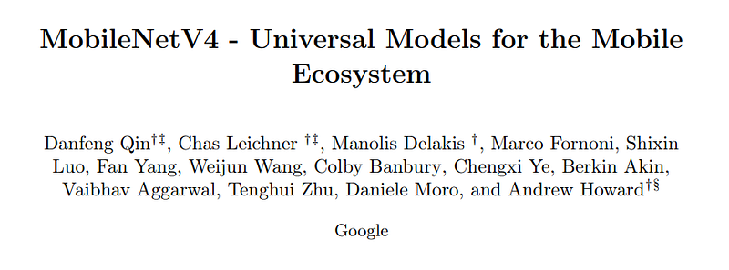 | Title card: MobileNetV4. |
| 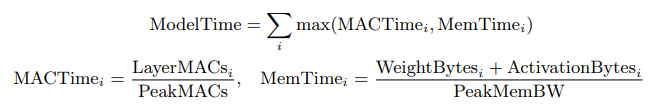 | MAC -> Multiply-Accumulate operations. |
| 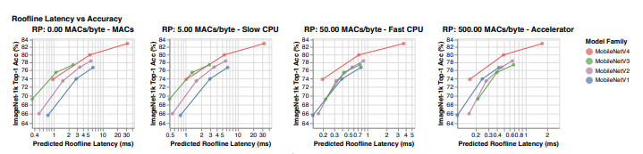 | Ridge Points and Latency/Accuracy Trade-Offs. |
| 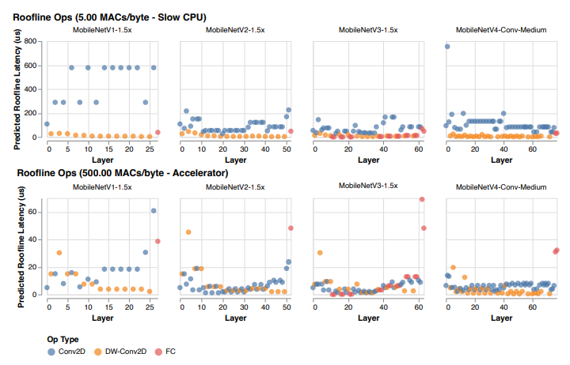 | Op Cost vs Ridge Point. |
| 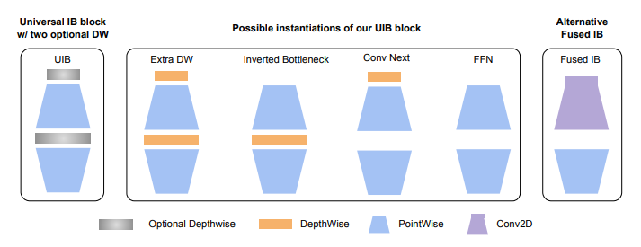 | Universal Inverted Bottleneck (UIB) blocks. |
| 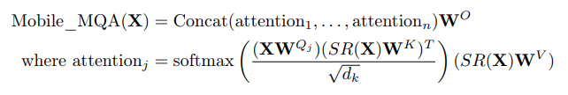 | Mobile MQA incorporates Spatial Reduction Attention (SRA) to downscale the resolution of keys and values, yet retain high-resolution... |
| 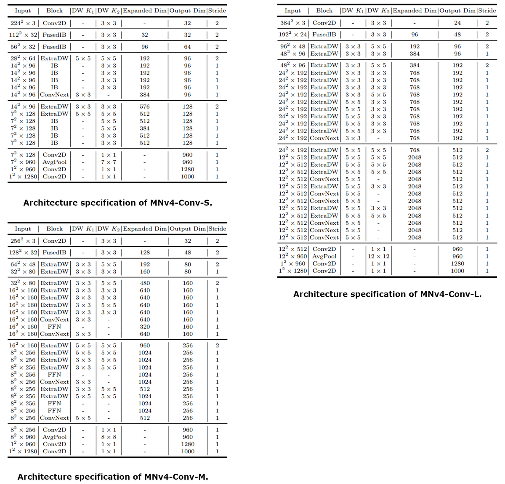 | It is found that adding attention to the last stages of convolution models is most effective. |
| 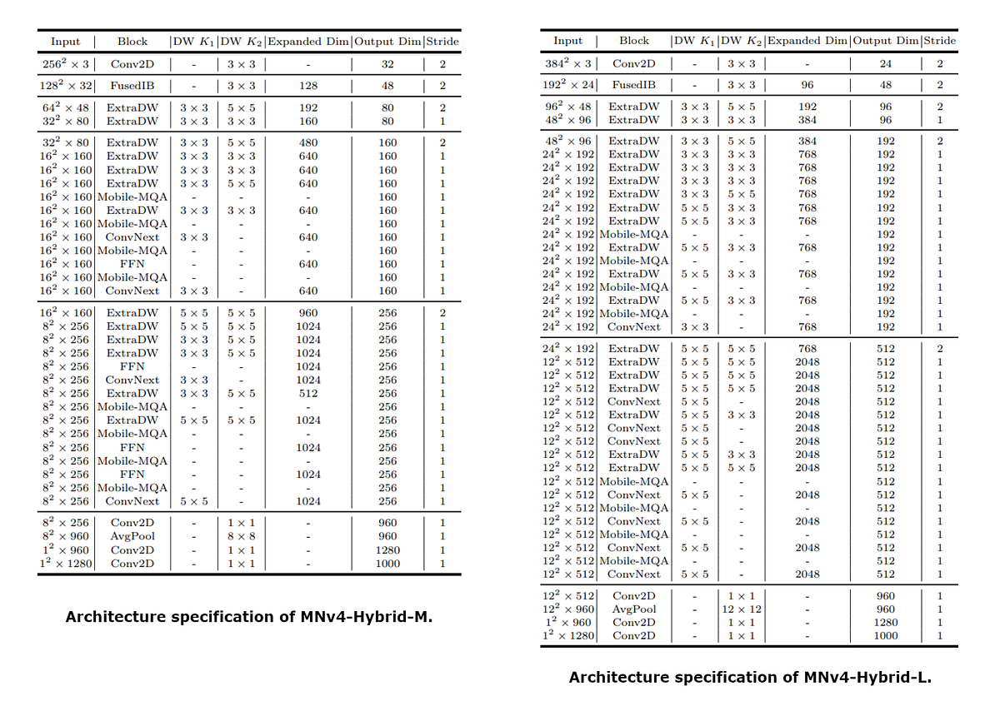 | It is found that adding attention to the last stages of convolution models is most effective. |
| 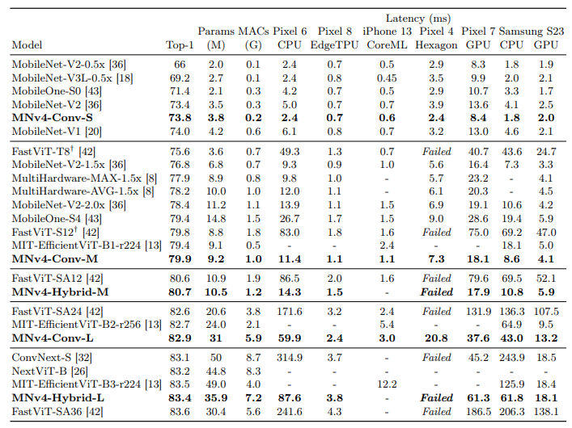 | Classification results on ImageNet-1K, along with on-device benchmarks. |
| 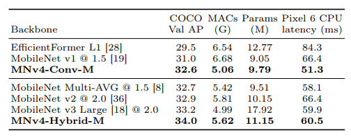 | Object detection results on the COCO-17 Val set. |
| 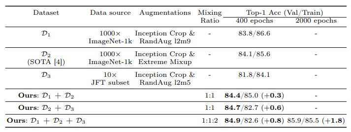 | Distillation results using MNv4-Conv-L as student. |
| 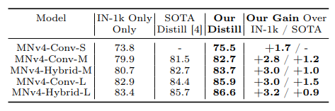 | Top-1 Accuracy Comparison Across Training Approaches. |
## Related

- [[Papers Explained Corpus]]
- [[Model Compression and Efficiency]]
- [[Agentic AI]]
- [[Computer Vision]]
- [[Model Distillation]]
- [[Papers Explained 231 - MAmmoTH2]]
- [[Papers Explained - EfficientNetV2]]

#summary #topic
