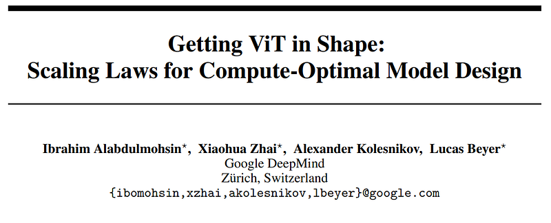
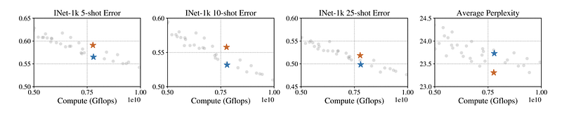
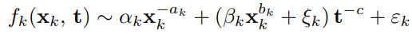
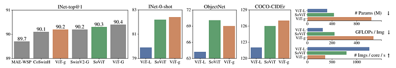
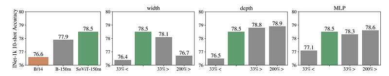
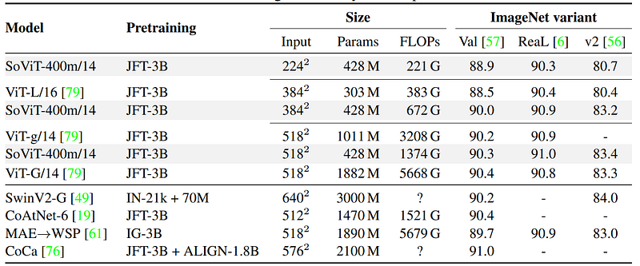
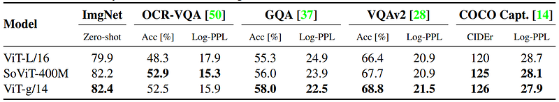

# Papers Explained 234 - SoViT

This paper introduces advanced methods for inferring compute-optimal model shapes, such as width and depth, challenging the prevailing approach of blindly scaling up vision models and promoting a more informed scaling in the research community.

This page ingests the source article into the wiki and connects it to [[Papers Explained Corpus]], [[Computer Vision]], [[Large Language Models]].

## Source Metadata

- Source file: `raw/2024-10-18_Papers-Explained-234--SoViT-a0ce3c7ef480.html`
- Source title: Papers Explained 234: SoViT
- Published: 2024-10-18
- Canonical: [https://medium.com/@ritvik19/papers-explained-234-sovit-a0ce3c7ef480](https://medium.com/@ritvik19/papers-explained-234-sovit-a0ce3c7ef480)

## Key Ideas

- SoViT is a shape-optimized vision transformer that achieves competitive results with models twice its size, while being pre-trained with an equivalent amount of compute, and it demonstrates effectiveness across various domains.
- A neural architecture is represented as a tuple (x1, x2, ..., xD) where D is the number of shape dimensions (e.g., width, depth, MLP size).
- The computational cost is denoted as “GFLOPs” (Giga Floating-point Operations) and is represented as ‘t’.
- A performance metric ‘f’ (e.g., ImageNet 10-shot error rate) is used to evaluate the model’s performance.
- The goal is to optimize the model’s shape (architecture) while keeping the computational cost fixed (t), within a small tolerance (ϵ).

## Notes

This paper introduces advanced methods for inferring compute-optimal model shapes, such as width and depth, challenging the prevailing approach of blindly scaling up vision models and promoting a more informed scaling in the research community.

SoViT is a shape-optimized vision transformer that achieves competitive results with models twice its size, while being pre-trained with an equivalent amount of compute, and it demonstrates effectiveness across various domains.

## Scaling Strategy

### Notation and Problem Statement:

- A neural architecture is represented as a tuple (x1, x2, ..., xD) where D is the number of shape dimensions (e.g., width, depth, MLP size).

- The computational cost is denoted as “GFLOPs” (Giga Floating-point Operations) and is represented as ‘t’.

- A performance metric ‘f’ (e.g., ImageNet 10-shot error rate) is used to evaluate the model’s performance.

- The goal is to optimize the model’s shape (architecture) while keeping the computational cost fixed (t), within a small tolerance (ϵ).

### Single Dimension Optimization:

*Figure: A grid sweep over multiple ViT shapes pretrained on 600M JFT examples highlights the important role of shape. The two architectures marked in blue and red are compute-optimal for image classification and image-to-text tasks, respectively.*

- To optimize a single shape dimension (e.g., depth) while keeping computational cost ‘t’ constant, a functional form ‘fk’ is proposed that relates the shape dimension ‘xk’ and the computational cost ‘t’ to the performance metric ‘f’.

*Figure: where αk, ak, βk, bk, c, ξk, εk > 0*

- This functional form ‘fk’ takes into account various parameters (αk, ak, βk, bk, c, ξk, εk).

- The purpose is to find an optimal value ‘x⋆k’ for the shape dimension ‘xk’ given the fixed computational cost ‘t’.

- The functional form ‘fk’ is motivated by six observations, including its behavior with unbounded compute, data scaling laws, non-monotonicity, and consistency with power law behavior.

### Optimizing Multiple Dimensions:

- The approach is expanded to optimize multiple shape dimensions simultaneously.

- A “star sweep” method is proposed to decrease the number of experiments needed to find optimal architectures. This involves varying one dimension at a time while keeping others fixed.

- A “grid sweep” is used to identify a starting architecture that lies on the Pareto optimal frontier for small compute.

- Finally, all dimensions are scaled jointly as compute increases.

## Shape-optimized ViT

JFT-3B containing about 30,000 classes and approximately 3 billion examples is used for pretraining. Duplicate or near-duplicate examples between the JFT-3B dataset and downstream training and test sets are removed to avoid redundancy and potential bias.

The aforementioned star center x (c)= (1968, 40, 6144) is used as our starting point. To estimate the scaling exponents sk in (4) for each dimension separately, the width in the grid (608, 768, 928, 1088, 1328, 1648), depth in the grid (8, 10, 12, 16, 20, 24), and MLP dimension in the grid (1088, 1360, 1728, 2160, 2592, 3072) are varied.

Based on the scaling exponents, the following observations are made:

- The MLP dimension should be scaled faster than depth, and depth should be scaled faster than width.

- The size of the ViT model (parameter count) scales more slowly than the allocated computational resources.

- Small ViT models can perform well if their shape and training duration are optimized for the available computational resources.

The validating the findings, optimized ViT models for specific computational budgets are trained, resulting in models like SoViT-400m/14 and SoViT-150m/14.

*Figure: Optimizing for the compute-equivalent of ViT-g/14 results in the 2.5× smaller SoViT400m/14*

SoViT-400m/14 has a width of 1152, depth 27, and MLP dim 4304. Fine-tuning it on ImageNet results in a 90.3% top-1 accuracy.

*Figure: LEFT: Optimizing ViT shape for the compute-equivalent of ViT-B/14 results in SoViT150m/14, which improves performance significantly. CENTER & RIGHT: Impact of debiating from the optimal shape in SoViT-150m/14 (in green) while keeping compute fixed.*

Optimizing the shape of ViT leads to a significant improvement in performance, from 76.6% in ViT-B/14 to 78.5% in SoViT-150m/14.

## Evaluation

*Figure: ImageNet fine-tuning.*

- Pre-trained image encoders evaluated through fine-tuning on ILSVRC2012 classification task.

- Increasing image resolution enhances pre-trained model capacity during fine-tuning.

- SoViT-400m/14 matches ViT-g/14 performance but is significantly smaller.

*Figure: Summary of multitask decoding and zero-shot transfer results.*

- A new text encoder is trained using the contrastive image-text matching objective in this setup.

- SoViT-400m/14 is found to be competitive with ViT-g/14 and significantly better than ViT-L/16 in this context (Table 4, second column).

- The three pre-trained ViT models are also evaluated in multitask decoding with a fixed two-layer decoder architecture.

- Evaluation metrics include COCO CIDEr, OCR, VQAv2, and GQA accuracy, as well as log-perplexity.

- SoViT-400M performs comparably to ViT-g/14 in this multitask decoding evaluation.

## Paper

Getting ViT in Shape: Scaling Laws for Compute-Optimal Model Design [2305.13035](https://arxiv.org/abs/2305.13035)

Recommended Reading [Vision Transformers](https://ritvik19.medium.com/list/vision-transformers-61e6836230f1)

## Figures

Figures from the Medium HTML export (`raw/2024-10-18_Papers-Explained-234--SoViT-a0ce3c7ef480.html`); local copies under `wiki/assets/papers-explained-234-sovit/` when download succeeded.

| Figure | Caption |
|--------|---------|
|  | Title card: SoViT. |
|  | A grid sweep over multiple ViT shapes pretrained on 600M JFT examples highlights the important role of shape. The two architectures marked in blue and red are compute-optimal for image classification and image-to-text tasks, respectively. |
|  | where αk, ak, βk, bk, c, ξk, εk > 0. |
|  | Optimizing for the compute-equivalent of ViT-g/14 results in the 2.5× smaller SoViT400m/14. |
|  | LEFT: Optimizing ViT shape for the compute-equivalent of ViT-B/14 results in SoViT150m/14, which improves performance significantly. CENTER & RIGHT: Impact of debiating from the optimal shape in SoViT-150m/14 (in green) while keeping compute fixed. |
|  | ImageNet fine-tuning. |
|  | Summary of multitask decoding and zero-shot transfer results. |
## Related

- [[Papers Explained Corpus]]
- [[Computer Vision]]
- [[Large Language Models]]
- [[Papers Explained - EfficientNetV2]]
- [[Papers Explained 235 - CogVLM]]

#summary #topic
