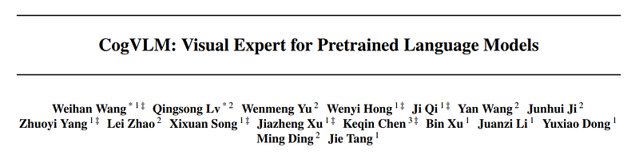
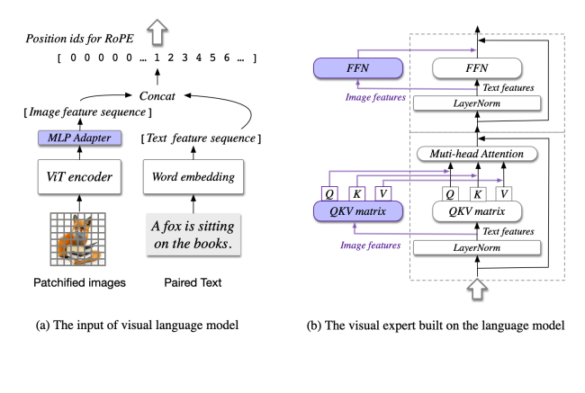
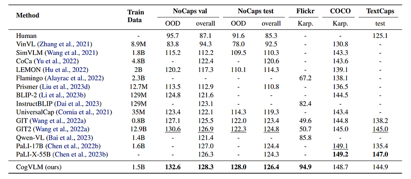
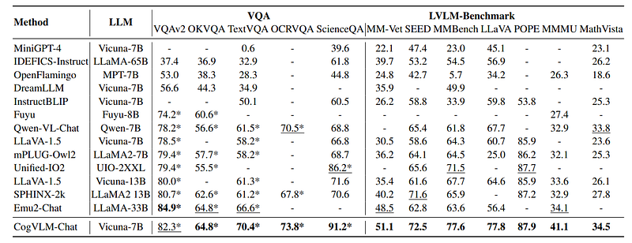
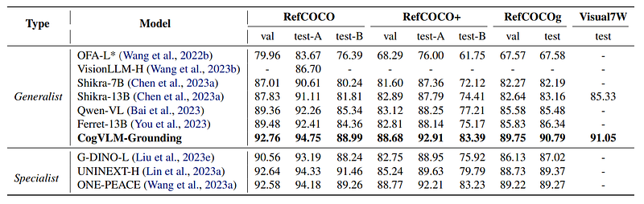

# Papers Explained 235 - CogVLM

Unlike existing methods that employ shallow alignment techniques — where image features are simply mapped into the input space of a language model — CogVLM innovates by incorporating a trainable visual expert module within the attention and feedforward neural network (FFN) layers of a pretrained language model.

This page ingests the source article into the wiki and connects it to [[Papers Explained Corpus]], [[Large Language Models]], [[Vision Language Models]], [[Safety and Alignment]], [[Computer Vision]], [[Embedding and Retrieval]].

## Source Metadata

- Source file: `raw/2024-10-21_Papers-Explained-235--CogVLM-9f3aa657f9b1.html`
- Source title: Papers Explained 235: CogVLM
- Published: 2024-10-21
- Canonical: [https://medium.com/@ritvik19/papers-explained-235-cogvlm-9f3aa657f9b1](https://medium.com/@ritvik19/papers-explained-235-cogvlm-9f3aa657f9b1)

## Key Ideas

- Unlike existing methods that employ shallow alignment techniques — where image features are simply mapped into the input space of a language model — CogVLM innovates by incorporating a trainable visual expert module within the attention and feedforward neural...
- CogVLM model comprises following fundamental components:
- EVA2-CLIP-E is used as the image encoder with its final layer removed as it specializes in aggregating the [CLS] features for contrastive learning.
- A two layer MLP with SwiGLU activation is used to map the output of ViT into the same space as the text features from word embedding
- Vicuna1.5–7B is used with a causal mask applied to all the attention operations, including the attention between image features.

## Notes

Unlike existing methods that employ shallow alignment techniques — where image features are simply mapped into the input space of a language model — CogVLM innovates by incorporating a trainable visual expert module within the attention and feedforward neural network (FFN) layers of a pretrained language model. This approach enables a deeper fusion of vision and language features, allowing CogVLM to maintain high performance on natural language processing (NLP) tasks while also excelling in cross-modal benchmarks.

## Architecture

*Figure: The architecture of CogVLM. (a) The illustration about the input, where an image is processed by a pretrained ViT and mapped into the same space as the text features. (b) The Transformer block in the language model. The image features have a different QKV matrix and FFN. Only the purple parts are trainable.*

CogVLM model comprises following fundamental components:

### ViT encoder

EVA2-CLIP-E is used as the image encoder with its final layer removed as it specializes in aggregating the [CLS] features for contrastive learning.

### MLP adapter

A two layer MLP with SwiGLU activation is used to map the output of ViT into the same space as the text features from word embedding

### Pretrained large language model

Vicuna1.5–7B is used with a causal mask applied to all the attention operations, including the attention between image features.

### Visual expert module

A visual expert module is added to each layer to enable deep visual-language feature alignment. Specifically, the visual expert module in each layer consists of a QKV matrix and an MLP in each layer. The shapes of the QKV matrix and MLP are identical to those in the pretrained language model and initialized from them.

### Position embedding

In the RoPE within LLM, all visual tokens share a single position id, as they already encapsulate positional information when inputted into the ViT. This approach mitigates the impact of remote attenuation between tokens in the LLM.

## Pretraining

### Data

The image-text pairs for pretraining are curated from publicly available datasets, including LAION-2B and COYO-700M.

After removing the broken URLs, NSFW images, images with noisy captions, images with political bias and images with an aspect ratio > 6 or < 1/6, about 1.5B images are left for pretraining.

A visual grounding dataset of 40M images is also curated. Each noun in the image caption is associated with bounding boxes to indicate the positions in the image. The nouns are extracted via spaCy and bounding boxes via GLIPv2.

The image-text pairs are sampled from LAION-115M, a subset of LAION-400M.

### Training

The first stage of pre-training is for image captioning loss, i.e. next token prediction in the text part.

The second stage of pre-training is a mixture of image captioning and Referring Expression Comprehension (REC). REC is a task to predict the bounding box in the image given the text description of an object, which is trained in the form of VQA, i.e., Question: Where is the object? and Answer: \[\[x0, y0, x1, y1\]\].

Both x and y coordinates range from 000 to 999. Only the loss of the next token prediction in the “Answer” part is considered. During the second half of pretraining, the input resolution is increased from 224 × 224 to 490 × 490. The total number of trainable parameters is 6.5B.

## Alignment

In the instruction alignment phase, two generalist models are trained

### CogVLM-Chat

The fine tuning data is curated from a variety of open-source visual question-answering datasets, including VQAv2, OKVQA, TextVQA, OCRVQA, ScienceQA, as well as datasets formatted as multi-turn dialogues such as LLaVAInstruct, LRV-Instruction, LLaVAR.

A unified instruction supervised finetuning is then performed.

VQA datasets typically feature concise, often one-word answers, contrasting with the dialogue datasets that provide detailed responses with extensive reasoning. To accommodate this variability, prompts formatted as Question: Short answer: were used for concise responses and Question: Answer: for extended discourse in the SFT phase.

### CogVLM-Grounding

A dataset covering 4 types of grounding data is curated from publicly available sources including Flickr30K Entities, RefCOCO, Visual7W, VisualGenome and Grounded CoT-VQA:

- Grounded Captioning (GC) — image captioning datasets where each noun phrase within the caption is followed by the corresponding referential bounding boxes.

- Referring Expression Generation (REG) — image-oriented datasets that each bounding box in the image is annotated with a descriptive textual expression that accurately characterizes and refers to the content within the specific region.

- Referring Expression Comprehension (REC) — textoriented datasets that each textual description is annotated with multiple referential links associating the phrases with corresponding boxes.

- Grounded Visual Question Answering (GroundedVQA) — VQA-style datasets where the questions may contain region references in a given image.

## Evaluation

Thr performance and robust generalization of the base model is evaluated through quantitative evaluations on multi-modal benchmarks in four categories:

### Image Captioning

*Figure: Performance on Image Captioning benchmarks.*

- The model achieves state-of-the-art (SOTA) or compatible performance across all benchmarks.

- Specifically, on the NoCaps benchmark, the base model outperforms the previous best method, GIT2, across four splits with a maximum of 5.7 points in the out-domain set while only consuming 10% of the pretraining data (1.5B vs 12.9B).

- On the Flickr benchmark, the model achieves a SOTA score of 94.9, surpassing the concurrently released Qwen-VL model by 9.1 points.

- These results demonstrate the remarkable capability and robustness of the pretrained model in the image captioning task.

- On the COCO and TextCaps datasets, despite not training with dedicated OCR data, the base model reveals significant text-reading ability and obtains competitive performance with PaLI-X-55B, outperforming the previous best model of the same scale, PaLI-17B, by 9.1 points score.

### Visual Question Answering and LVLM Benchmarks

*Figure: Generalist performance on VQA and LVLM benchmarks.*

- CogVLM demonstrated outstanding performance, leading over models of similar parameter scale in tasks like VQAv2, TextVQA, OCRVQA, OKVQA, and ScienceQA.

- In LVLM benchmarks, CogVLM achieved state-of-the-art results, surpassing all other models including those utilizing larger language models such as LLava1.5 with Vicuna-13B and Emu-2 with LLAMA-33B, and IDEFICS-Instruct trained on LLaMA-65B.

- CogVLM notably outperformed competitors by significant margins across various benchmarks including MM-vet, MMBench, SeedBench, LLaVA-Bench, MMMU dataset, POPE dataset, and MathVista benchmark.

- The results underscore the robust reasoning abilities and multi-task generalization capabilities of CogVLM, significantly outpacing other models in these domains.

- Shallow fusion models like InstructBLIP and MiniGPT-4 underperformed across most benchmarks, highlighting the importance of deep fusion for enhanced performance.

- These findings collectively demonstrate CogVLM’s potential as a leading solution in visual question answering and related tasks, showcasing its ability to handle diverse and challenging datasets with superior performance.

### Visual Grounding

*Figure: Results on Referring Expression Comprehension and Grounded Visual Question Answering.*

- The generalist model achieves state-of-the-art (SOTA) performance across all benchmarks, indicating a significant advantage over other models.

- Specifically, the model surpasses models trained for individual tasks in 5 of 9 splits, demonstrating its superior visual grounding capability.

- These results underscore the effectiveness of the training paradigm used for the generalist model, highlighting its remarkable visual grounding capabilities.

## Paper

CogVLM: Visual Expert for Pretrained Language Models [2311.03079](https://arxiv.org/abs/2311.03079)

Recommended Reading [Multi Modal Transformers](https://ritvik19.medium.com/list/multi-modal-transformers-67453f215ecf)

## Figures

Figures from the Medium HTML export (`raw/2024-10-21_Papers-Explained-235--CogVLM-9f3aa657f9b1.html`); local copies under `wiki/assets/papers-explained-235-cogvlm/` when download succeeded.

| Figure | Caption |
|--------|---------|
|  | Title card: CogVLM. |
|  | The architecture of CogVLM. (a) The illustration about the input, where an image is processed by a pretrained ViT and mapped into the same space as the text features. (b) The Transformer block in the language model. The image features have a different QKV matrix and FFN. Only the purple parts are trainable. |
|  | Performance on Image Captioning benchmarks. |
|  | Generalist performance on VQA and LVLM benchmarks. |
|  | Results on Referring Expression Comprehension and Grounded Visual Question Answering. |
## Related

- [[Papers Explained Corpus]]
- [[Large Language Models]]
- [[Vision Language Models]]
- [[Safety and Alignment]]
- [[Computer Vision]]
- [[Embedding and Retrieval]]
- [[Papers Explained 234 - SoViT]]
- [[Papers Explained 236 - CogVLM2]]

#summary #topic
