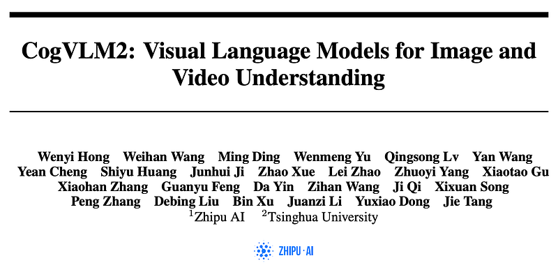
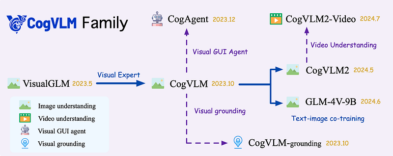
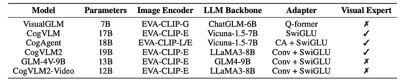
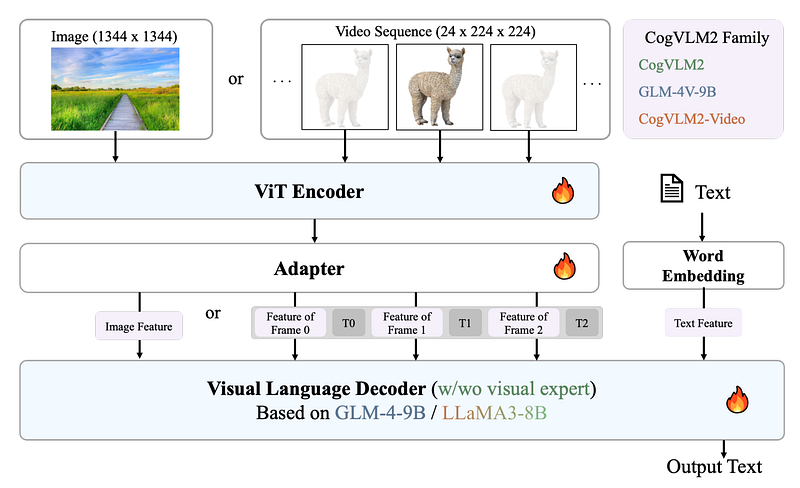
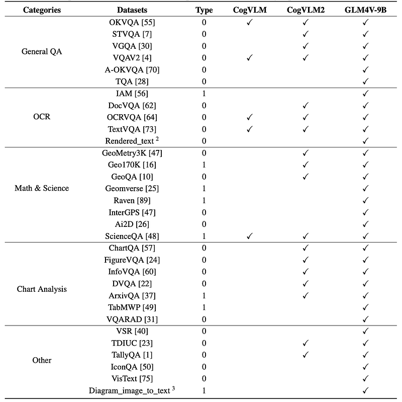
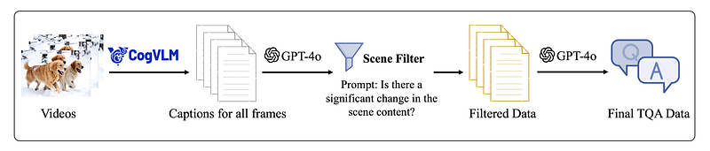
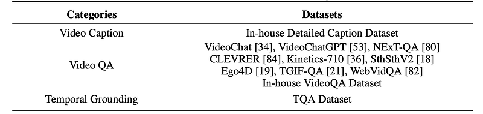
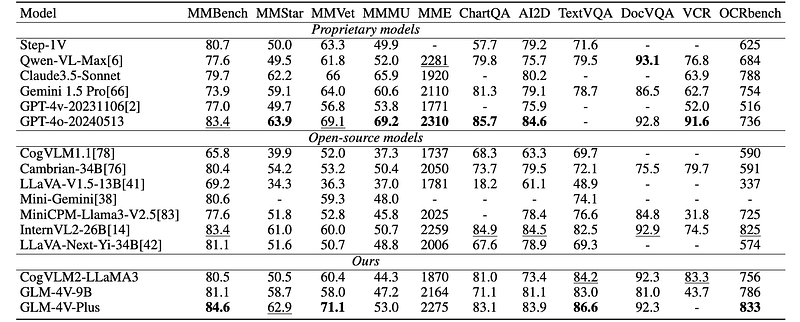
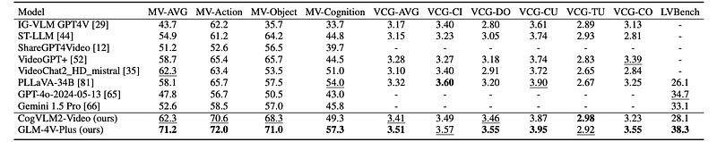

# Papers Explained 236 - CogVLM2

The CogVLM2 family is a new generation of visual language models for image and video understanding. The family includes three models: CogVLM2, CogVLM2-Video, and GLM-4V.

This page ingests the source article into the wiki and connects it to [[Papers Explained Corpus]], [[Vision Language Models]], [[Large Language Models]], [[Computer Vision]], [[Synthetic Data]], [[Model Compression and Efficiency]].

## Source Metadata

- Source file: `raw/2024-10-22_Papers-Explained-236--CogVLM2-db0261745cf5.html`
- Source title: Papers Explained 236: CogVLM2
- Published: 2024-10-22
- Canonical: [https://medium.com/@ritvik19/papers-explained-236-cogvlm2-db0261745cf5](https://medium.com/@ritvik19/papers-explained-236-cogvlm2-db0261745cf5)

## Key Ideas

- Recommended Reading [Papers Explained 235: CogVLM](https://ritvik19.medium.com/papers-explained-235-cogvlm-9f3aa657f9b1)
- The CogVLM family of models comprises four key components: a ViT encoder, an adapter, a language model, and an optional visual expert module.
- The ViT encoder transforms discrete raw image inputs into continuous image features rich in semantic content. Specifically, EVA-CLIP is used.
- CogVLM2: Similar to CogVLM, CogVLM2 features the architecture of visual experts in both the attention and FFN module.
- CogVLM2-Video extracts frames from the input video segments and annotate them with timestamp information, allowing the subsequent language model to accurately know the exact time each frame corresponds to in the original video.

## Notes

The CogVLM2 family is a new generation of visual language models for image and video understanding. The family includes three models: CogVLM2, CogVLM2-Video, and GLM-4V.

Recommended Reading [Papers Explained 235: CogVLM](https://ritvik19.medium.com/papers-explained-235-cogvlm-9f3aa657f9b1)

*Figure: Overview of CogVLM family.*

*Figure: Comparison of different model architectures.*

*Figure: The architecture of the CogVLM Family.*

The CogVLM family of models comprises four key components: a ViT encoder, an adapter, a language model, and an optional visual expert module.

The ViT encoder transforms discrete raw image inputs into continuous image features rich in semantic content. Specifically, EVA-CLIP is used.

The adapter serves as a bridge between visual and linguistic features. Existing approaches like Q-former significantly reduces image sequence length but introduces lossy transformation, sacrificing image details and spatial information. Conversely, Linear mapping, though simple and effective, suffers from computational inefficiency due to extended image sequences and the limited expressive capacity of a single linear layer. To address these challenges, the adapter incorporates a 2×2 convolutional layer followed by a SwiGLU module.

CogVLM2: Similar to CogVLM, CogVLM2 features the architecture of visual experts in both the attention and FFN module. This architectural innovation facilitates a deep fusion of visual and linguistic features while preserving the model’s inherent language capabilities. Different from the first generation model, CogVLM2 further adopts a 2×2 downsampling module to increase input resolution while preserving efficiency, and using LLaMA3–8B as the LLM backbone.

CogVLM2-Video extracts frames from the input video segments and annotate them with timestamp information, allowing the subsequent language model to accurately know the exact time each frame corresponds to in the original video.

GLM-4V is a 13B bilingual visual language model to explore the image understanding capabilities in both English and Chinese. GLM-4V-9B is pre-trained based on GLM-4–9B. GLM-4V’s architecture is similar to CogVLM2, and accommodates input images with a resolution of 1120 × 1120 pixels. The input images are first patchified and processed by a 4B-parameter ViT (EVA-E), downsampled by 2 × 2, then concatenated with language embeddings and fed into the language decoder. Additionally, GLM-4V-Plus models are pre-trained for both image and video understanding tasks using the same training recipe.

## Pre-training

### Pre-training Data

Two main techniques are used to obtain and process the pre-training dataset:

- Iterative Refinement: To begin with, the initial model is trained on publicly available datasets, and then used to re-annotate a new batch of data. The annotations generated by the model undergo meticulous manual correction to ensure their accuracy. The corrected data is subsequently used to iteratively refine and enhance future versions of the model.

- Synthetic Data Generation: Synthesizing data according to specific rules or utilizing advanced tools to generate high-quality image-text pairs.

The datasets are:

- LAION-2B and COYO-700M: form the foundational base for the pre- training stages of all models in CogVLM family, offering a diverse collection of image-text pairs essential for effective model training.

- LAION-40M-grounding: is an in-house grounding dataset developed using LAION-400M and GLIPv2.

- Digital World Grounding Dataset: consists of 7M English and 5M Chinese entries, created by crawling web pages with a web browser, capturing screenshots along with all visible DOM elements and their corresponding rendered boxes. This comprehensive approach allows for the creation of REC (Referring Expression Comprehension) and REG (Referring Expression Generation) question-answer pairs, significantly enhancing the model’s ability to understand and generate natural language descriptions for visual elements.

- Synthetic OCR Dataset: includes 120M English and 150M Chinese entries, focusing on four specific OCR scenarios: fully generated OCR images with source text printed on the images using Python; real-world images with extracted text obtained using PaddleOCR; academic papers with extracted LaTeX code by Nougat; and HTML or LaTeX code of tables and formulae rendered to images using various tools.

- CLAY-1B: is an in-house recaption dataset built upon LAION-2B and COYO-700M. This dataset is developed with the aid of a fine-tuned CogVLM model specifically designed to generate long, detailed captions for images.

### Pre-training Settings

Three main visual-language training methodologies are explored:

- progressively enabling more trainable parameters as pre-training stages advance.

- training all parameters simultaneously but utilizing both language pre-training data and visual-language pre-training data.

- gradually increasing the input image resolution as training progresses.

## Post-training

### Image Post-Training Datasets

The whole collection of VQA datasets are listed:

*Figure: VQA datasets used in image understanding models. The “Type” column signifies the format of the answers provided. “0” corresponds to concise responses, such as multiple-choice, Y/N, etc. “1” denotes comprehensive answers that incorporate a chain of thought processes.*

During experiments, it was observed that adding VQA data with concise responses could detract from the model’s conversational performance. To deal with this, “Short Answer” was prefixed to concise answers to distinguish VQA-type concise responses from dialogue-type responses, thereby reducing interference between the two.

Moreover, approximately 300K alignment corpora were meticulously annotated. These corpora were categorized into different categories based on the characteristics of the images and instructions for proportional control during training. Additionally, 50K preference alignment corpora were annotated to steer the model towards generating outputs that align with human preferences.

### Video TQA Dataset

*Figure: The pipeline for temporal grounding data generation.*

Temporal grounding data suitable for large-scale training is prepared by developing a fully automated video question-answering data generation process. The latest image understanding models are leveraged to extract frame-level understanding from video data, and GPT-4o is used for data filtering and generation. Through this pipeline, 30k Temporal Grounding Question and Answer (TQA) data points are generated.

*Figure: Datasets used in video understanding models.*

### Image Supervised Fine-tuning

In CogVLM2 and GLM-4V, a two-stage SFT training approach is used:

- In the first stage, all VQA training datasets and the 300K alignment corpora are utilized to enhance the model’s foundational capabilities, addressing the limitations of pre-training on image captioning tasks.

- In the second stage, a subset of VQA datasets and the 50K preference alignment data are selected to optimize the model’s output style, closely aligning with human preferences.

### Video Supervised Fine-tuning

Starting from a pre-trained 224 × 224 variant of CogVLM2 image understanding model, CogVLM2-Video takes 24 frames as input and extract visual information sequentially. An additional convolution layer with a 2 × 2 kernel is added at the end of the ViT model to further compress video features.

The training process consists of two stages: instruction tuning and temporal grounding tuning. All the parameters are trainable throughout these two stages. In the instruction tuning stage, in-house detailed caption data and publicly available question-answering data are utilized to improve the general video understanding capability of the model.

Mainly, instruction data provided in VideoChat2 is used without simple caption datasets. An in-house video QA dataset is also collected for better temporal understanding. A total of 330k video samples are utilized in the instruction tuning stage. In the temporal grounding tuning stage, CogVLM2-Video is trained on the TQA Dataset.

## Evaluation

### Image Tasks

To comprehensively assess the performance of the models, the following tasks are evaluated:

- OCR comprehension: TextVQA, DocVQA, OCRbench, VCR

- Chart and diagram understanding: ChartQA, AI2D

- Subject-specific question answering: MMMU

- General question answering: MMVet, MMBench, MMStar and MME.

*Figure: Image understanding performance comparison on popular benchmarks.*

- Compared to open-source models of similar parameter scales, CogVLM2 and GLM-4V-9B achieve state-of-the-art performance on most tasks, and even surpass models of much larger scale.

### Video Tasks

*Figure: Video understanding performance comparison.*

- CogVLM2-Video achieves state-of-the-art performance on multiple video question-answering tasks.

## Paper

CogVLM2: Visual Language Models for Image and Video Understanding [2408.16500](https://arxiv.org/abs/2408.16500)

Recommended Reading [Multi Modal Transformers](https://ritvik19.medium.com/list/multi-modal-transformers-67453f215ecf)

## Figures

Figures from the Medium HTML export (`raw/2024-10-22_Papers-Explained-236--CogVLM2-db0261745cf5.html`); local copies under `wiki/assets/papers-explained-236-cogvlm2/` when download succeeded.

| Figure | Caption |
|--------|---------|
|  | Title card: CogVLM2. |
|  | Overview of CogVLM family. |
|  | Comparison of different model architectures. |
|  | The architecture of the CogVLM Family. |
|  | VQA datasets used in image understanding models. The “Type” column signifies the format of the answers provided. “0” corresponds to concise responses, such as multiple-choice, Y/N, etc. “1” denotes comprehensive answers that incorporate a chain of thought processes. |
|  | The pipeline for temporal grounding data generation. |
|  | Datasets used in video understanding models. |
|  | Image understanding performance comparison on popular benchmarks. |
|  | Video understanding performance comparison. |
## Related

- [[Papers Explained Corpus]]
- [[Vision Language Models]]
- [[Large Language Models]]
- [[Computer Vision]]
- [[Synthetic Data]]
- [[Model Compression and Efficiency]]
- [[Papers Explained 235 - CogVLM]]
- [[Papers Explained 237 - OWL ViT]]

#summary #topic
