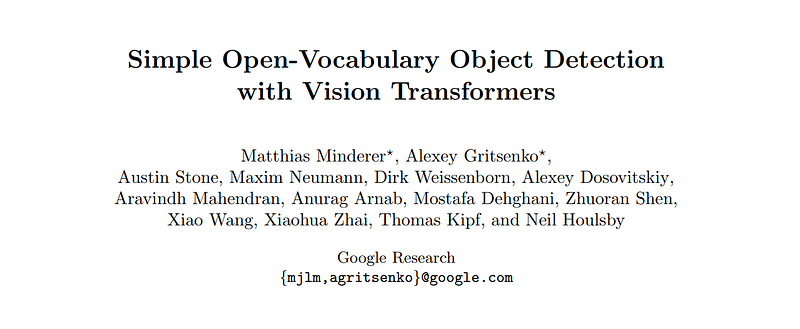
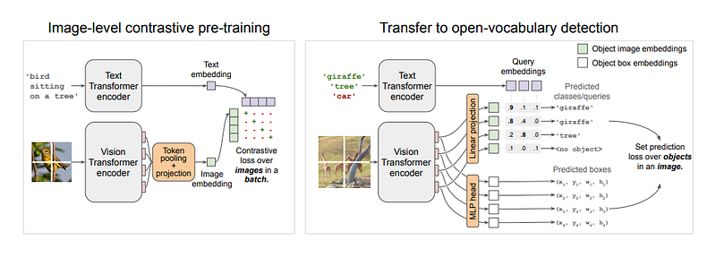
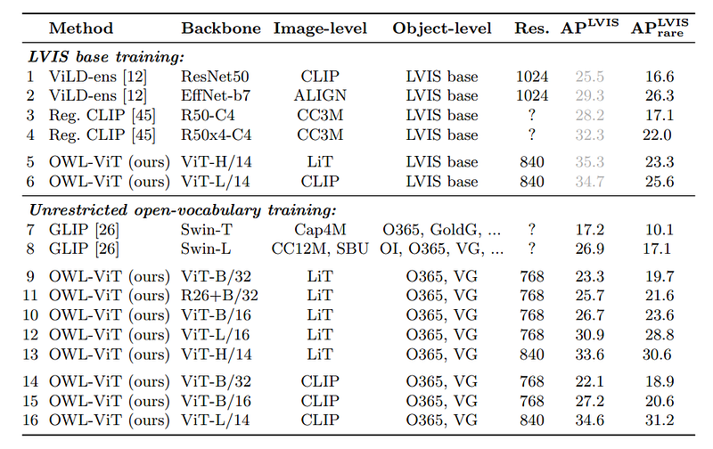
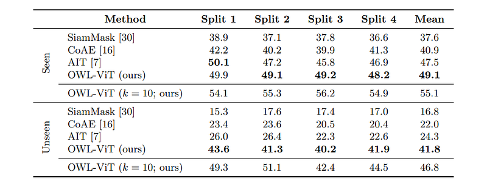
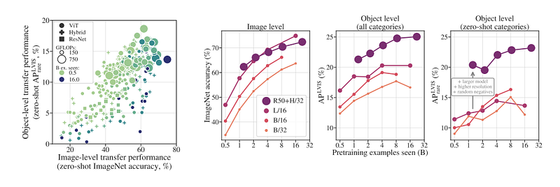
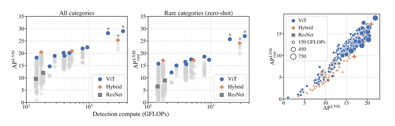

# Papers Explained 237 - OWL ViT

OWL ViT (Vision Transformer for Open-World Localization) proposes a strong recipe for transferring image-text models to open-vocabulary object detection.

This page ingests the source article into the wiki and connects it to [[Papers Explained Corpus]], [[Computer Vision]], [[Embedding and Retrieval]], [[Large Language Models]], [[Vision Language Models]], [[Code Models]], [[Supervised Fine-Tuning]].

## Source Metadata

- Source file: `raw/2024-10-23_Papers-Explained-237--OWL-ViT-ea58a142de68.html`
- Source title: Papers Explained 237: OWL ViT
- Published: 2024-10-23
- Canonical: [https://medium.com/@ritvik19/papers-explained-237-owl-vit-ea58a142de68](https://medium.com/@ritvik19/papers-explained-237-owl-vit-ea58a142de68)

## Key Ideas

- Code and models are available on [GitHub](https://github.com/google-research/scenic/tree/main/scenic/projects/owl_vit) and [HuggingFace](https://huggingface.co/docs/transformers/en/model_doc/owlvit).
- Recommended Reading [Papers Explained 79: DETR](https://ritvik19.medium.com/papers-explained-79-detr-bcdd53355d9f) [Papers Explained 100: CLIP](https://ritvik19.medium.com/papers-explained-100-clip-f9873c65134)
- Contrastively pre-train image and text encoders on large-scale image-text data.
- Add detection heads and fine-tune on medium-sized detection data
- This setup resembles DETR, but is simplified by removing the decoder.

## Notes

OWL ViT (Vision Transformer for Open-World Localization) proposes a strong recipe for transferring image-text models to open-vocabulary object detection. Using a standard ViT architecture with minimal modifications, contrastive image-text pre-training, and end-to-end detection fine-tuning, resulting in a State-of-the-art one-shot (image conditional) detection by a large margin.

Code and models are available on [GitHub](https://github.com/google-research/scenic/tree/main/scenic/projects/owl_vit) and [HuggingFace](https://huggingface.co/docs/transformers/en/model_doc/owlvit).

Recommended Reading [Papers Explained 79: DETR](https://ritvik19.medium.com/papers-explained-79-detr-bcdd53355d9f) [Papers Explained 100: CLIP](https://ritvik19.medium.com/papers-explained-100-clip-f9873c65134)

## Method

*Figure: Overview of the method.*

A two-stage approach is followed:

- Contrastively pre-train image and text encoders on large-scale image-text data.

- Add detection heads and fine-tune on medium-sized detection data

## Model

### Architecture

The model uses a standard ViT as the image encoder and a similar Transformer architecture as the text encoder. To adapt the image encoder for detection, the token pooling and final projection layer are removed, and instead each output token representation is linearly projected to obtain per-object image embeddings for classification. The maximum number of predicted objects is therefore equal to the number of tokens (sequence length) of the image encoder. Box coordinates are obtained by passing token representations through a small MLP.

This setup resembles DETR, but is simplified by removing the decoder.

### Open-vocabulary object detection

For open-vocabulary classification of detected objects, instead of learned class embeddings, text embeddings (called queries, obtained by passing category names or other textual object descriptions through the text encoder) are used in the output layer of the classification head. The task of the model then becomes to predict, for each object, a bounding box and a probability with which each query applies to the object.

Instead of combining all queries for an image into a single token sequence, each query consists of a separate token sequence which represents an individual object description, and is individually processed by the text encoder. In addition, the architecture includes no fusion between image and text encoders. Although early fusion seems intuitively beneficial, it dramatically reduces inference efficiency because encoding a query requires a forward pass through the entire image model and needs to be repeated for each image/query combination.

### One- or Few-Shot Transfer

This setup does not require query embeddings to be of textual origin, since there is no fusion between image and text encoders. Image-derived embeddings can also be supplied as queries to the classification head without modifying the model. By using embeddings of prototypical object images as queries, image-conditioned oneshot object detection can be performed by the model.

## Training

### Image-Level Contrastive Pre-Training

Both encoders are trained from scratch with random initialization with a contrastive loss on the image and text representations using the same image-text dataset and loss as in LiT. For the image representation, multihead attention pooling (MAP) is used to aggregate token representation. The text representation is obtained from the final end-of-sequence (EOS) token of the text encoder.

### Training the Detector

The general detection training procedure of the model is almost identical to that for closed-vocabulary detectors, except that the set of object category names is provided as queries for each image. The classification head therefore outputs logits over the per-image label space defined by the queries, rather than a fixed global label space. The bipartite matching loss introduced by DETR is adapted to long-tailed/open-vocabulary detection by using focal sigmoid cross-entropy instead of softmax cross-entropy as the classification loss.

## Evaluation

### Open-Vocabulary Detection Performance

*Figure: Open-vocabulary and zero-shot performance on LVIS v1.0 val.*

To evaluate the open-vocabulary detection performance of models using the LVIS v1.0 validation dataset, All category names are used as queries for each image, resulting in 1203 queries per image. Class predictions are ensembled over seven prompt templates.

To focus on unseen categories, box annotations with labels matching any of the LVIS “rare” categories are removed from the training data.

- The method is highly competitive across different architecture sizes in both open-vocabulary (APLVIS) and zero-shot (APLVIS rare) scenarios.

- The best model achieves 31.2% APLVIS rare and uses a publicly available CLIP backbone, indicating strong zero-shot performance.

- On MS-COCO 2017 and Objects 365, the best model achieves 43.5% APCOCO and 15.8% APO365 (when trained without O365), showcasing the model’s open-vocabulary transfer ability.

### Few-Shot Image-Conditioned Detection Performance

*Figure: One- and few-shot image-conditioned detection performance on COCO AP50.*

The objective is to perform one- or few-shot object detection by replacing text-derived query embeddings with image-derived query embeddings.

- The model significantly outperforms the best task-specific prior work by a margin of 72% across the four COCO splits, as shown in Table 2.

- This performance is achieved despite the model not being specifically designed for the task.

- The model’s approach of not entangling query image and target image features during inference allows for running models on thousands of different image embeddings simultaneously and efficiently, enhancing practicality.

- Moving to few-shot predictions by averaging image embeddings for multiple query examples for each category leads to further significant improvements.

### Scaling of Image-Level Pre-Training

*Figure: Image-level pre-training transfers to detection.*

- High image-level performance is necessary but not sufficient for strong transfer to detection.

- Detection performance increases with pre-training duration up to a point, after which it peaks while image-level performance continues to rise. This trend can be extended by increasing model size and improving detection fine-tuning.

*Figure: Effect of model architecture on detection performance.*

- Hybrid ResNet-Transformer architectures are more efficient than pure Vision Transformers (ViTs) at small model sizes, but pure ViTs outperform hybrids as model size increases.

- Pure ViTs show a clear advantage in zero-shot detection performance, indicating a bias towards learning semantic generalization, which is beneficial for large-scale pre-training.

- The findings suggest that further scaling efforts should focus on pure Transformer architectures, as they offer better efficiency and performance for detection tasks at large scales.

## Paper

Simple Open-Vocabulary Object Detection with Vision Transformers [2205.06230](https://arxiv.org/abs/2205.06230)

Recommended Reading: [Object Detection](https://ritvik19.medium.com/list/object-detection-bd9e6e21ca3e)

## Figures

Figures from the Medium HTML export (`raw/2024-10-23_Papers-Explained-237--OWL-ViT-ea58a142de68.html`); local copies under `wiki/assets/papers-explained-237-owl-vit/` when download succeeded.

| Figure | Caption |
|--------|---------|
|  | Title card: OWL ViT. |
|  | Overview of the method. |
|  | Open-vocabulary and zero-shot performance on LVIS v1.0 val. |
|  | One- and few-shot image-conditioned detection performance on COCO AP50. |
|  | Image-level pre-training transfers to detection. |
|  | Effect of model architecture on detection performance. |
## Related

- [[Papers Explained Corpus]]
- [[Computer Vision]]
- [[Embedding and Retrieval]]
- [[Large Language Models]]
- [[Vision Language Models]]
- [[Code Models]]
- [[Supervised Fine-Tuning]]
- [[Papers Explained 236 - CogVLM2]]
- [[Papers Explained 238 - Segment Anything Model]]

#summary #topic
