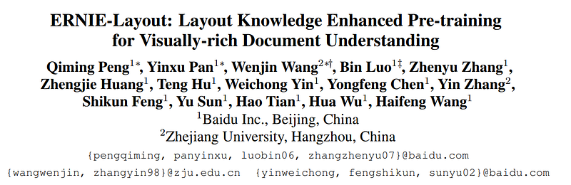
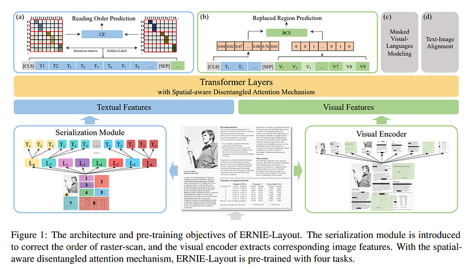
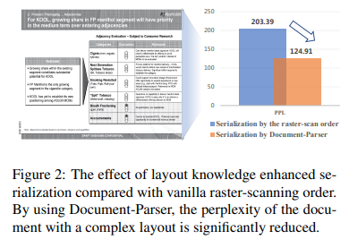
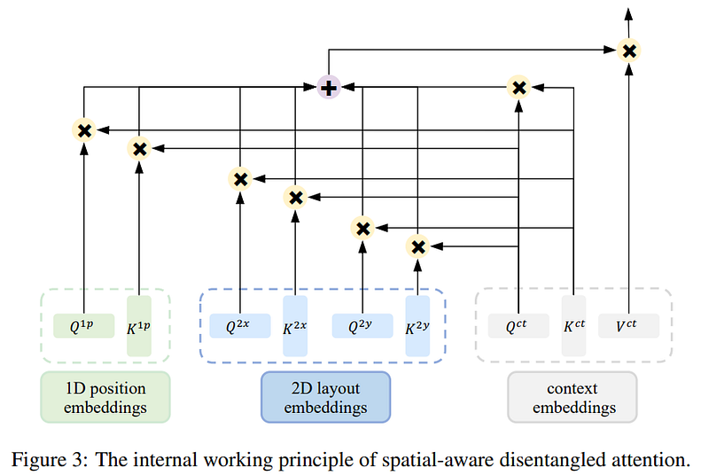

# Papers Explained 24 - ERNIE Layout

Given a document, ERNIE-Layout rearranges the token sequence with the layout knowledge and extracts visual features from the visual encoder. The textual and layout embeddings are combined into textual features through a linear projection, and similar operations are executed for visual embeddings.

This page ingests the source article into the wiki and connects it to [[Papers Explained Corpus]], [[Document AI]], [[Embedding and Retrieval]], [[Vision Language Models]], [[Large Language Models]], [[Computer Vision]].

## Source Metadata

- Source file: `raw/2023-02-08_Papers-Explained-24--ERNIE-Layout-47a5a38e321b.html`
- Source title: Papers Explained 24: ERNIE Layout
- Published: 2023-02-08
- Canonical: [https://medium.com/@ritvik19/papers-explained-24-ernie-layout-47a5a38e321b](https://medium.com/@ritvik19/papers-explained-24-ernie-layout-47a5a38e321b)

## Key Ideas

- Given a document, ERNIE-Layout rearranges the token sequence with the layout knowledge and extracts visual features from the visual encoder.
- Inspired by the human reading habits, we adopt Document-Parser, an advanced document layout analysis toolkit based on Layout-Parser, to serialize these documents.
- The text embedding of token sequence T is expressed as:
- where Etk, E1p, Etp respectively denote the token embedding, 1D position embedding, and token type embedding layer.
- To extract the visual features of documents, we employ Faster-RCNN as the backbone of visual encoder.

## Notes

Given a document, ERNIE-Layout rearranges the token sequence with the layout knowledge and extracts visual features from the visual encoder. The
textual and layout embeddings are combined into textual features through a linear projection, and similar operations are executed for visual embeddings. Next, these features are concatenated and fed into the stacked multi-modal transformer layers, which are equipped with the spatial aware disentangled attention mechanism.

Serialization Module

Inspired by the human reading habits, we adopt Document-Parser, an advanced document layout analysis toolkit based on Layout-Parser, to serialize these documents. Based on the words and their boxes recognized by OCR, it first detects document elements (e.g., paragraphs, lists, tables, figures), and then uses specific algorithms to obtain the logical relationship between words based on the characteristics of different elements, to obtain the proper reading order

Text Embedding

The text embedding of token sequence T is expressed as:

where Etk, E1p, Etp respectively denote the token embedding, 1D position embedding, and token type embedding layer.

Visual Embedding

To extract the visual features of documents, we employ Faster-RCNN as the backbone of visual encoder. In particular, the document image is resized to 224×224 and fed into visual backbone, an adaptive pooling layer is introduced to convert the output into a feature map with a fixed width W and height H (here, we set them to 7). Next, the feature map is flattened into a visual sequence V , and project each visual token to the same dimension as text embedding with a linear layer Fvs(·)

Layout Embedding

Separate embedding layers are constructed in the horizontal and vertical directions:

where E2x is the x-axis embedding layer, E2y denotes the y-axis embedding layer. And all the coordinate values are normalized in the range [0, 1000].

The ultimate input representation H of ERNIE-Layout

Multi-modal Transformer

Inspired by the disentangled attention of DeBERTa, in which the attention weights among tokens are computed using disentangled matrices on their contents and relative positions, spatial-aware disentangled attention for the multi-modal transformer is proposed to enable the participation of layout features.

## Pre Training

ERNIE-Layout has 24 transformer layers with 1024 hidden units and 16 attention heads. The maximum sequence length of textual tokens is 512 the sequence length of visual tokens is 49. The transformer is initialized from RoBERTa large, and the visual encoder takes Faster-RCNN as the initialized model.

Reading Order Prediction: To make the model understand the relationship between layout knowledge and reading order and still work well when receiving input in inappropriate order, Aˆ ij is given an additional meaning, i.e., the probability that the j-th token is the next token of the i-th token. Besides, the ground truth is a 0–1 matrix G, where 1 indicates that there is a reading order relationship between the two tokens and vice versa. For the end position, the next token is itself. In pre-training, we calculate the loss with Cross-Entropy.

Replaced Region Prediction

To enable the model perceive fine-grained correspondence between image patches and text, with the help of layout knowledge, Specifically, 10% of the patches are randomly selected and replaced with a patch from another image, the processed image is encoded by the visual encoder and input into the multi-modal transformer. Then, the [CLS] vector output by the transformer is used to predict which patches are replaced.

Masked Visual-Language Modeling

Text-Image Alignment

## Fine Tuning

- Form and Receipt Understanding: FUNSD, SROIE, Kleister-NDA and CORD dataset

- Document Image Classification: RVL-CDIP dataset

- Document Visual Question Answering: DocVQA dataset

## Paper

ERNIE-Layout: Layout Knowledge Enhanced Pre-training for Visually-rich Document Understanding [2210.06155](https://arxiv.org/abs/2210.06155)

## Figures

Figures from the Medium HTML export (`raw/2023-02-08_Papers-Explained-24--ERNIE-Layout-47a5a38e321b.html`); local copies under `wiki/assets/papers-explained-24-ernie-layout/` when download succeeded.

| Figure | Caption |
|--------|---------|
|  | Title card: ERNIE Layout. |
|  | Given a document, ERNIE-Layout rearranges the token sequence with the layout knowledge and extracts visual features from the visual encoder. |
|  | Serialization Module. |
|  | The text embedding of token sequence T is expressed as. |
|  | To extract the visual features of documents, we employ Faster-RCNN as the backbone of visual encoder. |
|  | Separate embedding layers are constructed in the horizontal and vertical directions. |
|  | The ultimate input representation H of ERNIE-Layout. |
|  | Multi-modal Transformer. |
## Related

- [[Papers Explained Corpus]]
- [[Document AI]]
- [[Embedding and Retrieval]]
- [[Vision Language Models]]
- [[Large Language Models]]
- [[Computer Vision]]
- [[Papers Explained Review 03 - RCNNs]]
- [[Papers Explained 25 - Vision Transformers]]

#summary #topic
