# Papers Explained 240 - NVLM

NVLM 1.0 is a family of multimodal large language models (LLMs) rivaling proprietary and open-access models. Notably, NVLM 1.0 shows improved text-only performance over its LLM backbone after multimodal training.

This page ingests the source article into the wiki and connects it to [[Papers Explained Corpus]], [[Vision Language Models]], [[Large Language Models]], [[Safety and Alignment]], [[Reasoning Models]], [[Document AI]], [[Supervised Fine-Tuning]].

## Source Metadata

- Source file: `raw/2024-10-28_Papers-Explained-240--NVLM-7ad201bfbfc2.html`
- Source title: Papers Explained 240: NVLM
- Published: 2024-10-28
- Canonical: [https://medium.com/@ritvik19/papers-explained-240-nvlm-7ad201bfbfc2](https://medium.com/@ritvik19/papers-explained-240-nvlm-7ad201bfbfc2)

## Key Ideas

- The paper presents a comprehensive comparison between two approaches to model design: decoder-only multimodal LLMs (e.g., LLaVA) and cross-attention-based models (e.g., Flamingo) and proposes a hybrid architecture.
- The project is available on [GitHub](https://nvlm-project.github.io/).
- NVLM-1.0 family features three architectures:
- InternViT-6B-448px-V1–5 is used as the default vision encoder for all three architectures, keeping it frozen throughout all training stages. It processes images at a fixed resolution of 4482, generating 1,024 output tokens.
- NVLM-D model connects the pretrained vision encoder to the LLM using a 2-layer MLP as the projector or modality-alignment module. Training NVLM-D involves two stages: pretraining and supervised fine-tuning (SFT).

## Notes

NVLM 1.0 is a family of multimodal large language models (LLMs) rivaling proprietary and open-access models. Notably, NVLM 1.0 shows improved text-only performance over its LLM backbone after multimodal training.

The paper presents a comprehensive comparison between two approaches to model design: decoder-only multimodal LLMs (e.g., LLaVA) and cross-attention-based models (e.g., Flamingo) and proposes a hybrid architecture. Additionally, the paper introduces a 1-D tile-tagging design for tile-based dynamic high-resolution images, which significantly boosts performance on multimodal reasoning and OCR-related tasks.

The project is available on [GitHub](https://nvlm-project.github.io/).

## Approach

NVLM-1.0 family features three architectures:

- Decoder-only NVLM-D

- Cross (X)-attention based NVLM-X

- NVLM-H with Hybrid architecture.

*Figure: NVLM-1.0 offers three architectural options: the cross-attention-based NVLM-X (top), the hybrid
NVLM-H (middle), and the decoder-only NVLM-D (bottom).*

InternViT-6B-448px-V1–5 is used as the default vision encoder for all three architectures, keeping it frozen throughout all training stages. It processes images at a fixed resolution of 4482, generating 1,024 output tokens.

*Figure: Dynamic tiling of high-resolution input images.*

The dynamic high-resolution (DHR) approach is used. A maximum of 6 tiles are allowed at training. Thus, the predefined aspect ratios are: {1:1, 1:2, 1:3, 1:4, 1:5, 1:6, 2:1, 2:2, 2:3, 3:1, 3:2, 4:1, 5:1, 6:1}, encompassing all possible combinations of aspect ratios formed by 1 to 6 tiles. Each input image is dynamically matched to a predefined aspect ratio and divided into 1 to 6 tiles, each corresponding to 448×448 pixels, based on the image’s resolution. A thumbnail tile, which is a scaled-down version of the entire image is included to capture the global context. Each tile is then fed into InternViT-6B-448px-V1- 5, generating 1,024 tokens. A downsampling operation is applied to reduce the 1,024 image tokens to 256, reducing the processing overhead for the LLM. This operation groups four neighboring image tokens into one by concatenating them along the channel dimension, a.k.a. pixel shuffle

### NVLM-D: Decoder-only Model

NVLM-D model connects the pretrained vision encoder to the LLM using a 2-layer MLP as the projector or modality-alignment module. Training NVLM-D involves two stages: pretraining and supervised fine-tuning (SFT).

- The MLP is randomly initialized and needs to undergo pre training first, with both the vision encoder and LLM backbone kept frozen.

- During the SFT stage, both the MLP projector and LLM are trained to learn new vision-language tasks with novel instructions, while the vision encoder remains frozen.

- NVLM-D model effectively maintains text-only performance by incorporating a high-quality text-only SFT dataset.

Tile Tag for Dynamic High-Resolution

The LLM backbone needs to process the flattened image tokens from all dynamic high-resolution tiles, including an additional thumbnail tile. Directly concatenating flattened tokens without delimiters could confuse the LLM, as LLM lacks prior knowledge of the dynamic tiling process. To address this, a text-based tile tag is inserted in the input sequence to signal the start of a tile and the position of this tile within the whole tiling structure. After the tile tag, the flattened 256 image tokens of the tile are appended.

Three different tile tags are compared with Yi-34B as the LLM backbone using the following variants of tile tags:

- No tag: Simple concatenation without tile tag, which is the design of InternVL-1.5.

- 1-D flattened tile tag: <tile_1>, <tile_2>, · · · , <tile_6>, <tile_global>.

- 2-D grid tag: <tile_x0_y0>, <tile_x1_y0>, · · · , <tile_xW_yH>, <tile_global>, where the {i : j} of <tile_xi_yj> can be in {1:1, 1:2, 1:3, 1:4, 1:5, 1:6, 2:1, 2:2, 2:3, 3:1, 3:2, 4:1, 5:1, 6:1}.

- 2-D bounding-box tag:<box>(x0,y0),(x1,y1)</box>,···,<box>(xW,yH),(xW+1,yH+1)</box>, where the (xi, yj), (xi+1, yj+1) are the (left, top), (right, bottom) coordinates of that particular title within the whole high-resolution image.

*Figure: Ablation study of tile tag formats for dynamic high-resolution (DHR) using the decoder-only NVLMD with Yi-34B as the backbone LLM.*

- The vanilla dynamic high-resolution method (DHR + No tag) significantly improves performance across all benchmarks, except for MMMU (50.0 vs. 50.9), compared to its low-resolution counterpart.

- Inserting all types of tile tags into the LLM decoder significantly outperforms simple concatenation with no tags, particularly OCR tasks.

- 1-D tile tag <tile_k> performs generally better than other tags.

### NVLM-X: X-attention Model

NVLM-X employs gated cross-attention to process image tokens.

It is found that while the perceiver resampler is beneficial for natural image captioning, it negatively impacts dense OCR tasks, such as transcribing text from scanned documents as the cross-attention to latent array in the Perceiver [48] mixes the input image tokens, potentially disrupting the spatial relationships between image patches, which are crucial for document OCR, Hence NVLM-X architecture does not use a perceiver resampler; instead, it relies solely on cross-attention to read image tokens directly from the vision encoder.

The LLM backbone of NVLM-X is unfreezed during multimodal SFT and a high-quality text-only SFT dataset is blended to maintain strong text-only performance.

Tile Tag for Dynamic High-Resolution

Similar to the design used in NVLM-D, a sequence of text-based tile tags <tile_1> · · · <tile_k> is inserted in the LLM decoder, while allowing each tag <tile_k> to only attend to its corresponding image tokens by properly configuring the X-attention mask. This approach ensures that the LLM is better informed about the tiling structure without needing to infer it from the content of thumbnail tile and regular tiles.

Decoder-only vs. X-attention

*Figure: Ablation study of using tile tag for dynamic high-resolution (DHR) using the cross-attention-based NVLM-X with Yi-34B as the backbone LLM.*

- Parameter efficiency: NVLM-D has fewer parameters than NVLM-X, as the latter has the newly introduced gated cross-attention layers. The number of additional parameters becomes significant as the model scales up.

- Training efficiency: NVLM-X enables more efficient processing of high-resolution images by eliminating the need to unroll all image tokens on the LLM decoder side.

- Multimodal reasoning: NVLM-D performs unified processing of all tokens from different modalities, enabling joint multimodal reasoning at the LLM decoder. However, the long sequence of tokens for high- resolution images (e.g., 256×7 = 1792 tokens) may still make reasoning challenging, even with the assistance of tile tags.

### NVLM-H: Hybrid Model

NVLM-H is a novel hybrid architecture that combines the best of both approaches. It separates the processing of image tokens into two paths. The thumbnail image tokens are fed into the LLM alongside text tokens and processed by self-attention layers, enabling joint multimodal reasoning. Simultaneously, a dynamic number of regular tiles are processed through gated cross- attention, enabling the model to capture finer image details. This approach enhances high-resolution capability compared to NVLM-X while significantly improving computational efficiency compared to NVLM-D.

Tile Tag for Dynamic High-Resolution

NVLM-H utilizes the same 1-D flattened tile tag. The primary distinction lies in the processing location: text embeddings of <tile_k> are integrated into the gated cross-attention layers alongside visual embeddings. This approach is effective because the text and visual embed- dings are well-aligned during pre-training, enabling the model to seamlessly interpret tile tags within the cross-attention mechanism.

## Model Configurations

- Backbone LLM: Qwen2–72B-Instruct

- Vision Encoder: InternViT-6B-448px-V1–5

### Modality-Alignment Module

- For NVLM-D models, the LLM and vision encoder are connected by a two-layer MLP to align the modalities, with hidden dimensions of 12800 → 29568 → 8192. Note that InternViT-6B has a hidden dimension of 3200, which increases to 3200 × 4 = 12800 after applying pixel shuffle.

- For NVLM-X models, the image features are first projected to LLMs’ hidden dimension with a one-layer MLP. A gated X-attention layer is inserted every 8 LLM self-attention layers, resulting in a total of 10 X-attention layers.

- The NVLM-H models utilize a two-layer MLP and X-attention layers as the modality alignment module. The image tokens for both thumbnail and regular tiles are projected through the two-layer MLP, with hidden dimensions of 12800 → 29568 → 8192. The projected thumbnail image tokens are then directly fed into the LLM decoder. The projected image tokens of regular tiles are cross-attended by the X-attention layers. As with NVLM-X, ten gated X-attention layers are inserted.

### Training Method

The training process involves two stages:

- Pre-training: Both the LLM backbone and vision encoder are frozen for all models. Only the modality-alignment modules are trained.

*Figure: Training hyper-parameters of NVLM models in the pretraining stage.*

- Supervised fine-tuning (SFT): Vision encoder is kept frozen while training both the LLM and modality-alignment modules.

*Figure: Training hyper-parameters of NVLM models in the SFT stage.*

## Training Data

Multimodal Pre Training Data

Multimodal SFT Data

Text-only SFT Data

A high-quality text-only SFT dataset is curated and incorporated into the multimodal fine-tuning stage, effectively preserving the LLM backbone’s text-only performance and preventing catastrophic forgetting.

SFT datasets are collected from general categories, including ShareGPT, SlimOrca, EvolInstruct, GPTeacher, AlpacaGPT4, and UltraInteract. Additionally, datasets are gathered from the math category, comprising OrcaMathWordProblems, MathInstruct, MetaMath, and from the code category, featuring Magicoder, WizardCoder, and GlaiveCodeAssistant.

To further refine the responses of prompts from these datasets, OpenAI models, specifically GPT-4o and GPT-4o-mini, are leveraged to improve the quality of the SFT dataset.

## Evaluation

*Figure: Evaluation on vision-language and text-only benchmarks.*

- NVLM-D1.0 72B achieves top scores on OCRBench (853), VQAv2 (85.4), and MMMU (59.7), outperforming leading proprietary and open-access models.

- NVLM-H1.0 72B achieves the highest MMMU (Val) score (60.2) among open-access multimodal LLMs and the best MathVista score (66.6) within the NVLM-1.0 family.

- NVLM-X1.0 72B rivals the yet-to-be-released Llama 3-V 70B and demonstrates significantly faster training and inference speeds compared to its decoder-only counterpart.

- NVLM-1.0 models show improved text-only performance compared to open-access multimodal LLMs like LLaVA-OneVision 72B and InternVL-2-Llama3–76B, highlighting the effectiveness of incorporating high-quality text-only SFT data.

### Text-only Performance

*Figure: Evaluation on text benchmarks.*

- Open-access multimodal LLMs generally show a significant drop in accuracy compared to their LLM backbones.

- NVLM-1.0 72B models achieve higher average accuracy than their respective LLM backbones (Qwen2–72B-Instruct), likely due to the combination of high-quality text SFT data and substantial multimodal math training data.

## Paper

NVLM: Open Frontier-Class Multimodal LLMs [2409.11402](https://arxiv.org/abs/2409.11402)

Recommended Reading [Multi Modal Transformers](https://ritvik19.medium.com/list/multi-modal-transformers-67453f215ecf)

## Figures

Figures from the Medium HTML export (`raw/2024-10-28_Papers-Explained-240--NVLM-7ad201bfbfc2.html`); local copies under `wiki/assets/papers-explained-240-nvlm/` when download succeeded.

| Figure | Caption |
|--------|---------|
| 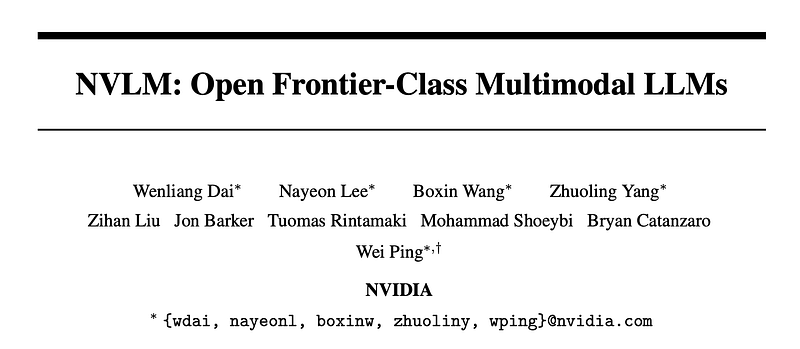 | Title card: NVLM. |
| 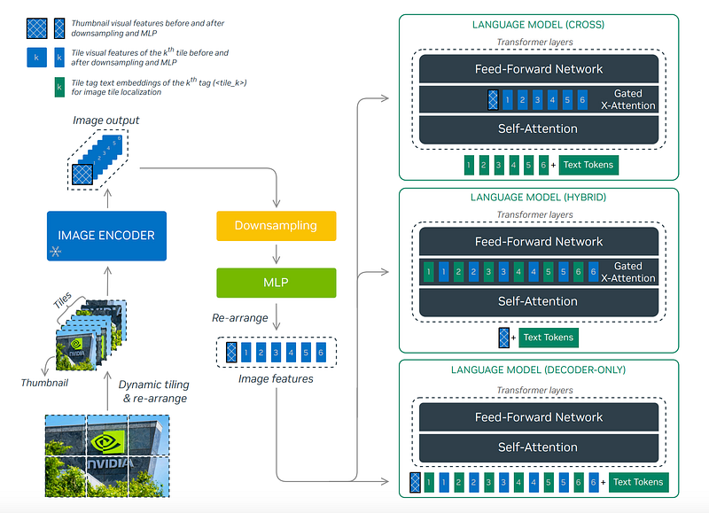 | NVLM-1.0 offers three architectural options: the cross-attention-based NVLM-X (top), the hybrid NVLM-H (middle), and the decoder-only NVLM-D (bottom). |
| 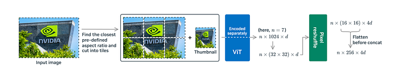 | Dynamic tiling of high-resolution input images. |
| 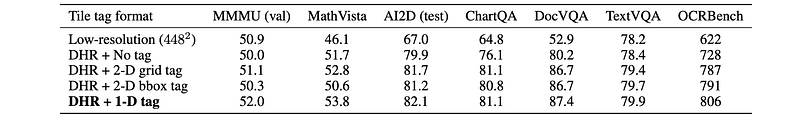 | Ablation study of tile tag formats for dynamic high-resolution (DHR) using the decoder-only NVLMD with Yi-34B as the backbone LLM. |
| 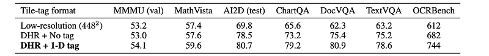 | Ablation study of using tile tag for dynamic high-resolution (DHR) using the cross-attention-based NVLM-X with Yi-34B as the backbone LLM. |
| 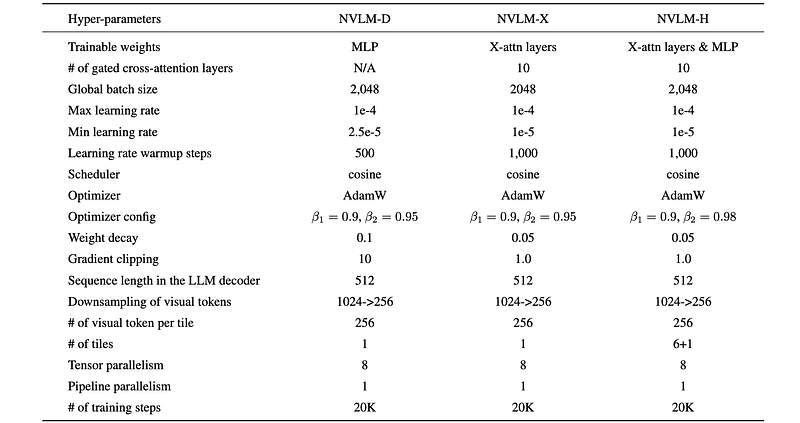 | Training hyper-parameters of NVLM models in the pretraining stage. |
| 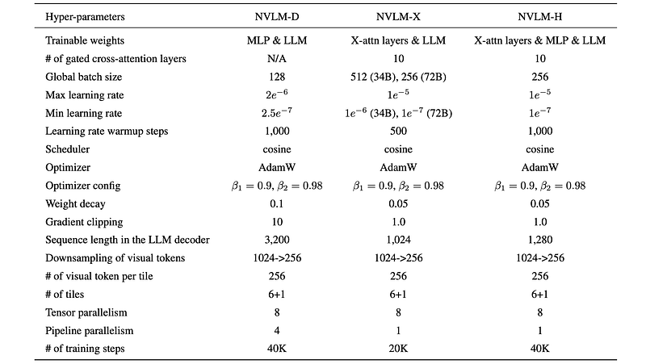 | Training hyper-parameters of NVLM models in the SFT stage. |
| 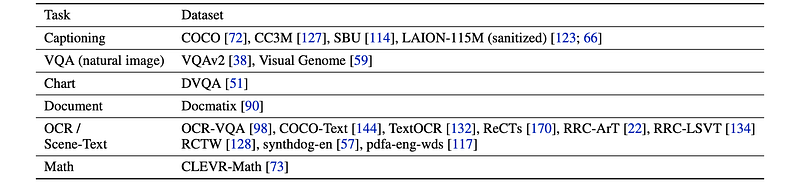 | Multimodal Pre Training Data. |
| 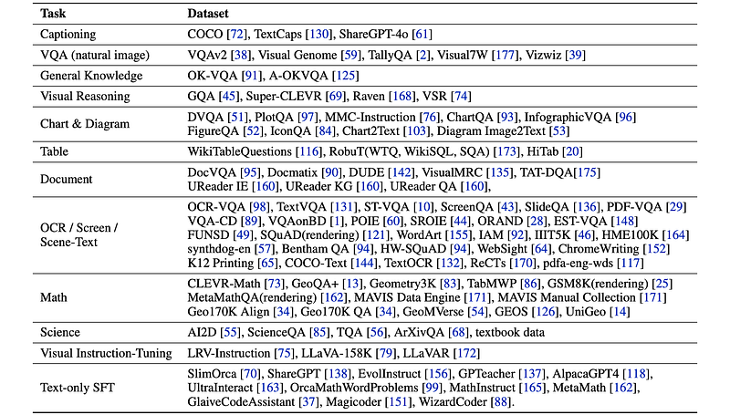 | Multimodal SFT Data. |
| 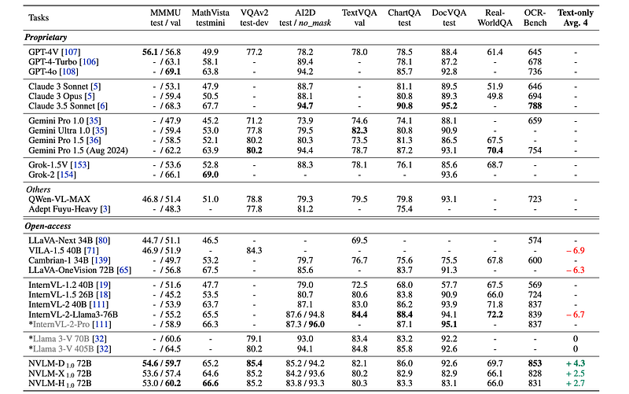 | Evaluation on vision-language and text-only benchmarks. |
| 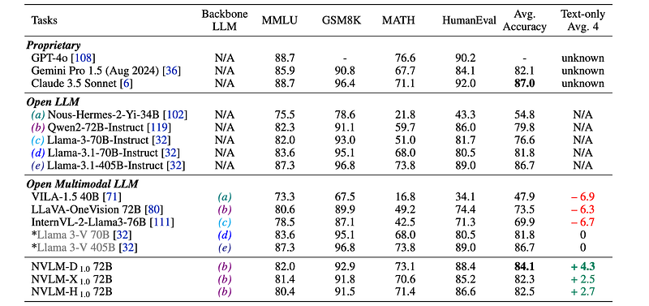 | Evaluation on text benchmarks. |
## Related

- [[Papers Explained Corpus]]
- [[Vision Language Models]]
- [[Large Language Models]]
- [[Safety and Alignment]]
- [[Reasoning Models]]
- [[Document AI]]
- [[Supervised Fine-Tuning]]
- [[Papers Explained 239 - SAM 2]]
- [[Papers Explained 241 - Pixmo and Molmo]]

#summary #topic
