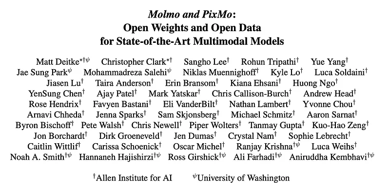
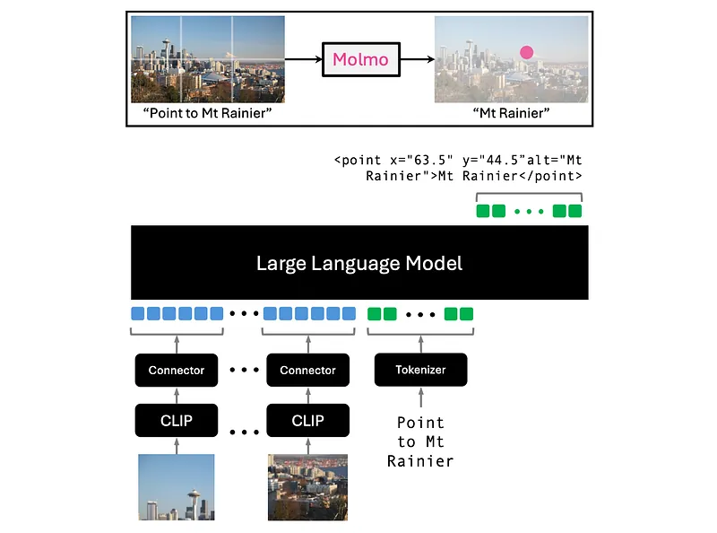
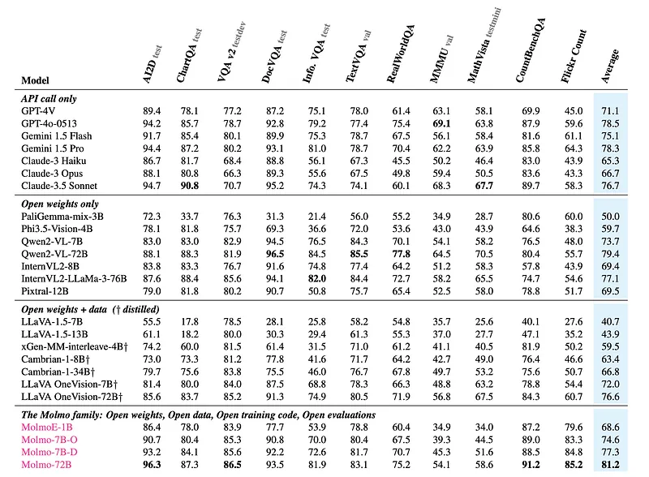
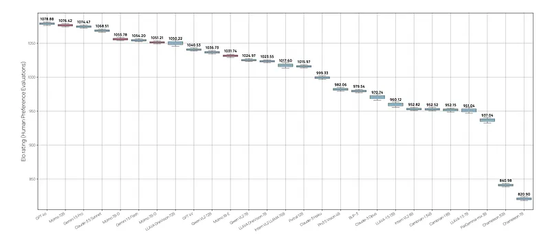

# Papers Explained 241 - Pixmo and Molmo

Molmo (Multimodal Open Language Model) utilizes PixMo (Pixels for Molmo), a high-quality dataset of detailed image captions collected from human annotators describing images through speech. This avoids reliance on synthetic data and encourages comprehensive descriptions.

This page ingests the source article into the wiki and connects it to [[Papers Explained Corpus]], [[Large Language Models]], [[Vision Language Models]], [[Synthetic Data]], [[Computer Vision]], [[Audio Models]], [[Supervised Fine-Tuning]], [[Reinforcement Learning]].

## Source Metadata

- Source file: `raw/2024-10-29_Papers-Explained-241--Pixmo-and-Molmo-239d70abebff.md`
- Source title: Papers Explained 241: Pixmo and Molmo
- Published: 2024-10-29
- Canonical: [https://medium.com/@ritvik19/papers-explained-241-pixmo-and-molmo-239d70abebff](https://medium.com/@ritvik19/papers-explained-241-pixmo-and-molmo-239d70abebff)

## Key Ideas

- Molmo (Multimodal Open Language Model) utilizes PixMo (Pixels for Molmo), a high-quality dataset of detailed image captions collected from human annotators describing images through speech.
- The model architecture combines a language model with a vision encoder. It consists of four components: a preprocessor that converts the input image into a set of multiscale, multi-crop images;
- All the models use OpenAI’s ViT-L/14 336px CLIP model for the vision encoder. A variety of choices are considered for the LLM at different scales: OLMo-7B-1024, OLMoE-1B-7B, Qwen2 7B, and Qwen2 72B.
- The training processing is simple and consists of only two stages:
- multimodal pre-training for caption generation using PixMo-Cap, our newly collected caption data

## Notes

Molmo (Multimodal Open Language Model) utilizes PixMo (Pixels for Molmo), a high-quality dataset of detailed image captions collected from human annotators describing images through speech. This avoids reliance on synthetic data and encourages comprehensive descriptions.

## Architecture

*Figure: The Molmo architecture.*

The model architecture combines a language model with a vision encoder. It consists of four components: a preprocessor that converts the input image into a set of multiscale, multi-crop images; a ViT image encoder that independently maps each of these images into a set of vision tokens; a connector that projects the vision tokens to the language model’s input dimension with an MLP and then pools the vision tokens to reduce their count; and a decoder-only Transformer LLM.

All the models use OpenAI’s ViT-L/14 336px CLIP model for the vision encoder. A variety of choices are considered for the LLM at different scales: OLMo-7B-1024, OLMoE-1B-7B, Qwen2 7B, and Qwen2 72B.

## Data and Training

The training processing is simple and consists of only two stages:

- multimodal pre-training for caption generation using PixMo-Cap, our newly collected caption data

- supervised fine-tuning using a mixture of aca- demic datasets and our newly collected supervised PixMo family of datasets.

All model parameters are updated in both stages. RLHF is not used.

### Caption generation

The vision encoder and theLLM are joined with randomly initialized connector and all the model parameters are trained on the task of caption generation.

Data Collection

A diverse set of images (~70 topics) are collected from the web. Three annotators are asked to describe each image in detail for at least 60 seconds (later increased to 90 seconds with a single annotator per image). Annotators are guided by a list of questions to ensure comprehensive descriptions:

- What is the image at first glance?

- What are the objects and their counts?

- What does the text say?

- What are the positions of the objects?

- What subtle details are noticeable?

- What is in the background?

- What is the style and color?

Data Processing

Annotators’ audio descriptions are transcribed using an off-the-shelf speech-to-text system. Transcribed texts are processed by a language-only LLM to improve quality (e.g., removing speech artifacts, standardizing style). A fourth description was generated by the language-only LLM, summarizing the three original transcripts into a single concise caption. In total712k distinct images with ∼1.3M captions are collected

The training uses all four of these image LLM- processed transcripts, as a form of naturalistic data augmentation.

### Supervised fine-tuning

All model parameters are fine tuned on a mixture of supervised training data, which includes common academic datasets and several new PixMo datasets:

- PixMo-AskModelAnything: This dataset focuses on enabling the model to answer diverse questions about images. Annotators first select an image and write a question about it. The model’s caption, OCR output, and the question are then fed to a language-only LLM, which generates an answer. Annotators can accept or reject the answer, providing feedback for improvement until an acceptable answer is reached. This dataset includes 162k question-answer pairs and 73k images.

- PixMo-Points: This dataset aims to enable the model to point to objects described in text, count objects, and use pointing as a visual explanation. Annotators point at objects in images, describe them, and point to every instance of the object. “Not present” data is also collected to teach the model to respond appropriately to nonexistent objects. This dataset includes 2.3M question-point pairs from 428k images.

- PixMo-CapQA: This dataset leverages ground-truth captions to generate question-answer pairs. A language-only LLM is prompted to ask and answer questions based solely on the caption. To increase diversity, prompts are based on high-level topics and writing styles. This dataset includes 214k question-answer pairs from 165k images.

- PixMo-Docs: This dataset focuses on code generation and question answering based on code. An LLM generates code for 255k text and figure-heavy images, and then generates 2.3M question-answer pairs based on the code.

- PixMo-Clocks: This dataset consists of synthetic analog clocks with questions and answers about the time. Images are rendered from various watches and styles, featuring randomly chosen times. This dataset includes 826k examples.

- Academic datasets: VQA v2 train, TextVQA train, OK-VQA train, ChartQA train, DocVQA train, InfographicVQA train, AI2D train, A-OKVQA train, Android-Control train, ScienceQA train, TabMWP train, ST-VQA train, TallyQA train, DVQA train, FigureQA train, and PlotQA train.

## Evaluation

*Figure: Academic benchmark results.*

*Figure: Elo human preference evaluations used 15k image and text prompt pairs.*

- Strong Agreement: Academic benchmark results and human evaluation generally agree, with some exceptions.

- MolmoE-1B: This efficient model, based on the OLMoE-1B-7B mixture-of-experts LLM, nearly matches GPT-4V’s performance on both benchmarks and Elo rankings.

- OLMo-7B-1024 and Qwen2 7B: These models perform well between GPT-4V and GPT-4o on both benchmarks and Elo rankings.

- Qwen2 72B: Achieves the highest academic benchmark score and ranks second in Elo, behind GPT-4o.

- Outperforming State-of-the-Art: The best model outperforms many proprietary systems, including Gemini 1.5 Pro, Flash, and Claude 3.5 Sonnet.

- Molmo’s Action Potential: Molmo-72B achieves strong results on the AndroidControl benchmark, demonstrating its potential for real-world applications.

- Qwen2-VL Exception: This model performs strongly on academic benchmarks but comparatively underperforms in the human evaluation.

## Paper

Molmo and PixMo: Open Weights and Open Data for State-of-the-Art Multimodal Models [2409.17146](https://arxiv.org/abs/2409.17146)

## Figures

Figures from the Medium HTML export (`raw/2024-10-29_Papers-Explained-241--Pixmo-and-Molmo-239d70abebff.md`); local copies under `wiki/assets/papers-explained-241-pixmo-and-molmo/` when download succeeded.

| Figure | Caption |
|--------|---------|
|  | Title card: Pixmo and Molmo. |
|  | The Molmo architecture. |
|  | Academic benchmark results. |
|  | Elo human preference evaluations used 15k image and text prompt pairs. |
## Related

- [[Papers Explained Corpus]]
- [[Large Language Models]]
- [[Vision Language Models]]
- [[Synthetic Data]]
- [[Computer Vision]]
- [[Audio Models]]
- [[Supervised Fine-Tuning]]
- [[Reinforcement Learning]]
- [[Papers Explained 240 - NVLM]]
- [[Papers Explained 242 - STORM]]

#summary #topic
