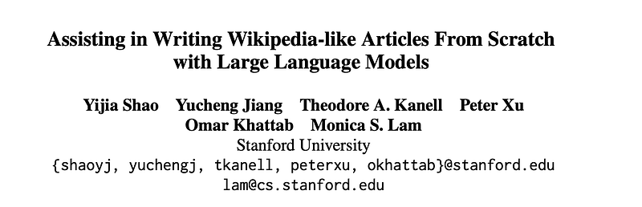
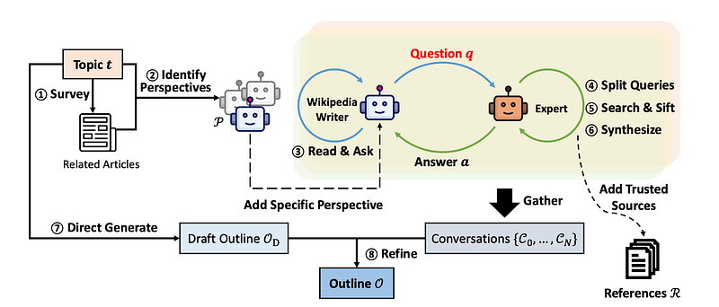
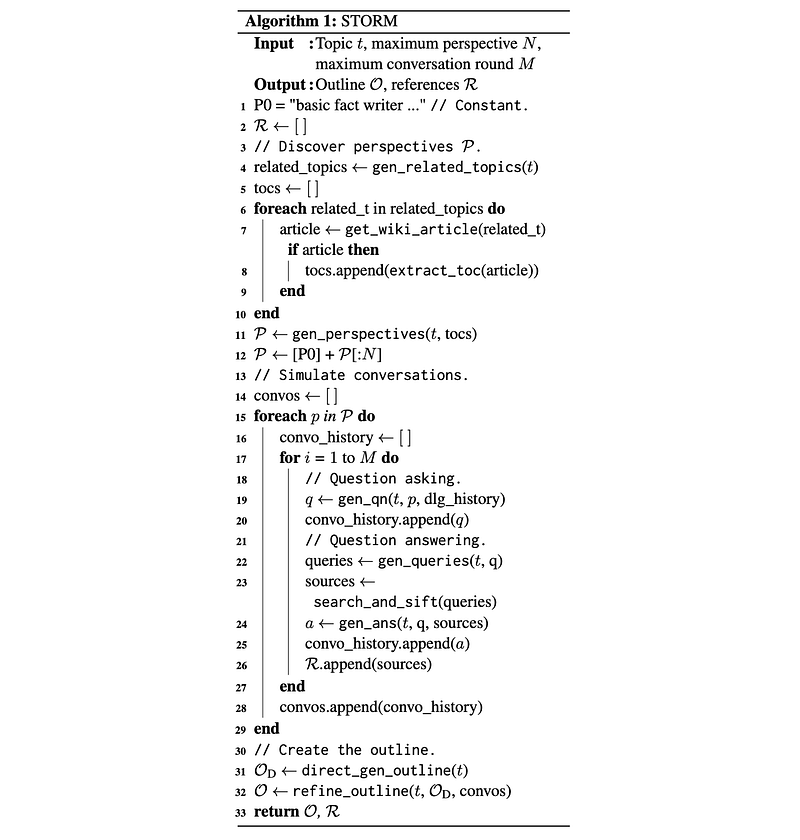
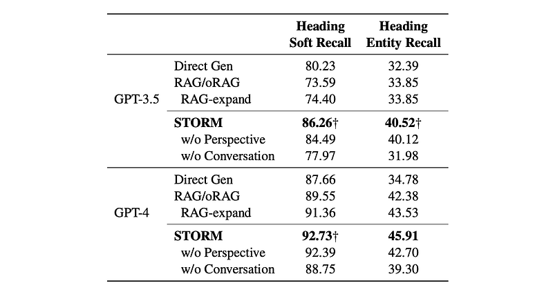
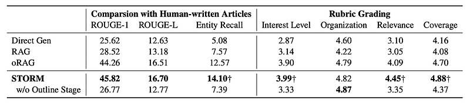

# Papers Explained 242 - STORM

STORM is a writing system for the Synthesis of Topic Outlines through Retrieval and Multi-perspective Question Asking.

This page ingests the source article into the wiki and connects it to [[Papers Explained Corpus]], [[Embedding and Retrieval]], [[Evaluation and Benchmarks]], [[Synthetic Data]], [[Large Language Models]].

## Source Metadata

- Source file: `raw/2024-10-30_Papers-Explained-242--STORM-2c55270d3150.html`
- Source title: Papers Explained 242: STORM
- Published: 2024-10-30
- Canonical: [https://medium.com/@ritvik19/papers-explained-242-storm-2c55270d3150](https://medium.com/@ritvik19/papers-explained-242-storm-2c55270d3150)

## Key Ideas

- For evaluation, a dataset of recent high-quality Wikipedia articles, called FreshWiki, is curated. Outline assessments are formulated to evaluate the prewriting stage.
- The project is available on [GitHub](https://github.com/stanford-oval/storm).
- As modern LLMs are generally trained on Wikipedia text, data leakage is mitigated by explicitly seeking out recent Wikipedia articles that were created (or very heavily edited) after the training cutoff of the LLMs we test.
- To evaluate the outline coverage, two metrics are introduced:
- Heading Soft Recall: Measures the similarity between the system-generated outline headings and the ground truth headings from human-written articles using cosine similarity based on Sentence-BERT embeddings.

## Notes

STORM is a writing system for the Synthesis of Topic Outlines through Retrieval and Multi-perspective Question Asking. STORM models the prewriting stage by (1) discovering diverse perspectives in research- ing the given topic, (2) simulating conversations where writers carrying different perspectives pose questions to a topic expert grounded on trusted Internet sources, (3) curating the collected information to create an outline.

For evaluation, a dataset of recent high-quality Wikipedia articles, called FreshWiki, is curated. Outline assessments are formulated to evaluate the prewriting stage.

The project is available on [GitHub](https://github.com/stanford-oval/storm).

## FreshWiki

The setup emphasizes the capability of long-form grounded writing systems to research and curate content. Given a topic t, the task is to find a set of references R and generate a full-length article S = s_1s_2…s_n, where each sentence s_i cites a list of documents in R. The generation of S is decomposed into two stages. In the prewriting stage, the system is required to create an outline O, which is defined as a list of multi-level section headings. In the writing stage, the system uses the topic t, the references R, and an outline O to produce the full-length article S.

As modern LLMs are generally trained on Wikipedia text, data leakage is mitigated by explicitly seeking out recent Wikipedia articles that were created (or very heavily edited) after the training cutoff of the LLMs we test.

To evaluate the outline coverage, two metrics are introduced:

- Heading Soft Recall: Measures the similarity between the system-generated outline headings and the ground truth headings from human-written articles using cosine similarity based on Sentence-BERT embeddings.

- Heading Entity Recall: Quantifies the percentage of named entities in human-written article headings covered by the system-generated outline.

## Method

STORM automates the prewriting stage by researching a given topic via effective question asking and creating an outline. The outline is extended to a full length article grounded on the collected references.

*Figure: The overview of STORM.*

### Perspective-Guided Question Asking

Given the input topic t, STORM discovers different perspectives by surveying existing articles from similar topics and uses these perspectives to control the question asking process. It prompts an LLM to generate a list of related topics and subsequently extracts the tables of contents from their corresponding Wikipedia articles. These tables of contents are con- catenated to create a context to prompt the LLM to identify N perspectives P = {p1, …, pN } that can collectively contribute to a comprehensive article on t.

To ensure that the basic information about t is also covered, p0 is added as “basic fact writer focusing on broadly covering the basic facts about the topic” into P. Each perspective p ∈ P is utilized to guide the LLM in the process of question asking in parallel.

### Simulating Conversations

STORM simulates a conversation between a Wikipedia writer and a topic expert. In the i-th round of the conversation, the LLM-powered Wikipedia writer generates a single question qi based on the topic t, its assigned perspective p ∈ P, and the conversation history {q1,a1,…,qi−1,ai−1} where aj denotes the simulated expert’s answer. The conversation history enables the LLM to update its understanding of the topic and ask follow-up questions. In practice, we limit the conversation to at most M rounds. Since qi can be complicated, the LLM is prompted to break down qi into a set of search queries and the searched results are evaluated using a rule-based filter according to the Wikipedia guideline to exclude untrustworthy sources. Finally, the LLM synthesizes the trustworthy sources to generate the answer ai, and these sources are added to R for full article generation.

### Creating the Article Outline

After thoroughly researching the topic through N + 1 simulated conversations, denoted as {C0, C1, …, CN}, STORM creates an outline before the actual writing starts. To fully leverage the internal knowledge of LLMs, the model is prompted to generate a draft outline O_D given only the topic t. O_D typically provides a general but organized framework. Subsequently, the LLM is prompted with the topic t, the draft outline O_D, and the simulated conversations {C0, C1, …, CN } to refine the outline. This results in an improved outline O which is used for producing the full-length article.

### Writing the Full-Length Article

Building upon the references R collected and the outline O developed during the prewriting stage, the full-length article can be composed section by section. The section title and headings of the subsections are used to retrieve relevant documents from R based on semantic similarity calculated from Sentence-BERT embeddings. The LLM is then prompted to generate the section with citations. Once all sections are generated, they are concatenated to form the full-length article. The LLM is then prompted with the concatenated article to delete repeated information to improve coherence. Furthermore, in alignment with Wikipedia’s stylistic norms, the LLM is also utilized to synthesize a summary of the entire article, forming the lead section at the beginning.

## Experiment Settings

The final output is limited to at most 4000 tokens (roughly 3000 words). The hyperparameters N and M in STORM are both set as 5. The chat model gpt-3.5-turbo is used for question asking and gpt-3.5-turbo-instruct is used for other parts of STORM. Experiments are also conducted using gpt-4 for drafting and refining the outline. The simulated topic expert in STORM is grounded on the You.com search API. For final article generation, gpt-4 is used as gpt-3.5 is not faithful to sources when generating text with citations.

## Evaluation

### Outline Coverage

*Figure: Results of outline quality evaluation (%).*

- LLMs (Direct Gen) demonstrate high heading soft recall, indicating understanding of high-level topics.

- STORM outperforms Direct Gen and RAG by generating outlines with higher topic-specific recall through effective question asking.

- Even with additional retrieval and refinement (RAG-expand), STORM still surpasses RAG’s performance.

### Full-Length Article Generation

*Figure: Results of automatic article quality evaluation.*

- oRAG (outline-based RAG) outperforms standard RAG, highlighting the benefit of outlining.

- STORM further improves upon oRAG by generating articles with higher entity recall and better scores in “Interest Level”, “Relevance and Focus”, and “Coverage” according to the evaluator LLM

### Citation Quality

*Figure: Citation quality judged by Mistral 7B-Instruct.*

- Mistral 7B-Instruct judges 84.83% of sentences as supported by citations.

- Unsupported sentences primarily result from improper inferences and inaccurate paraphrasing, rather than hallucinations

## Paper

Assisting in Writing Wikipedia-like Articles From Scratch with Large Language Models [2402.14207](https://arxiv.org/abs/2402.14207)

## Figures

Figures from the Medium HTML export (`raw/2024-10-30_Papers-Explained-242--STORM-2c55270d3150.html`); local copies under `wiki/assets/papers-explained-242-storm/` when download succeeded.

| Figure | Caption |
|--------|---------|
|  | Title card: STORM. |
|  | The overview of STORM. |
|  | STORM automates the prewriting stage by researching a given topic via effective question asking and creating an outline. |
|  | Results of outline quality evaluation (%). |
|  | Results of automatic article quality evaluation. |
|  | Citation quality judged by Mistral 7B-Instruct. |
## Related

- [[Papers Explained Corpus]]
- [[Embedding and Retrieval]]
- [[Evaluation and Benchmarks]]
- [[Synthetic Data]]
- [[Large Language Models]]
- [[Papers Explained 241 - Pixmo and Molmo]]
- [[Papers Explained 243 - ShieldGemma]]

#summary #topic
