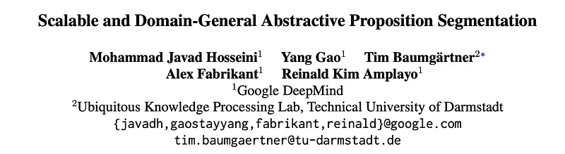
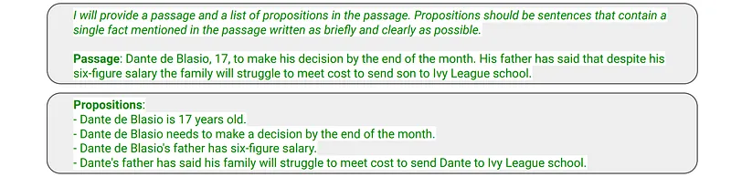
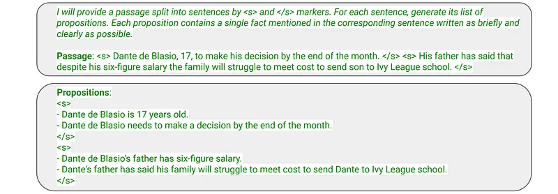
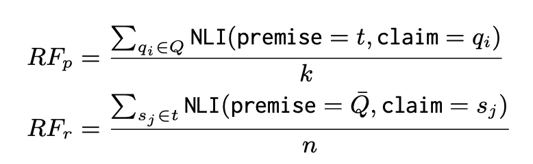
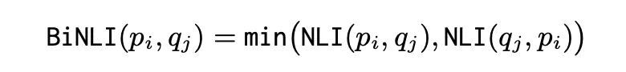
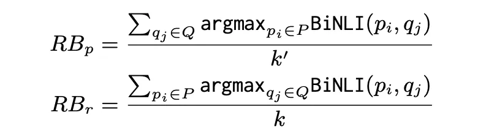
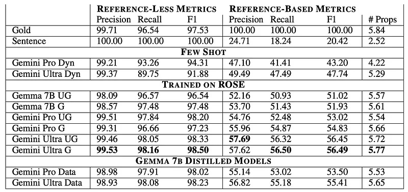
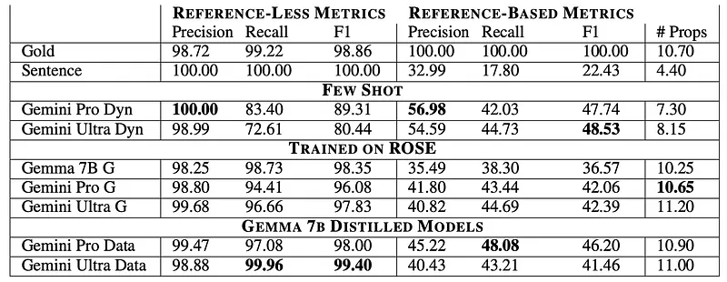
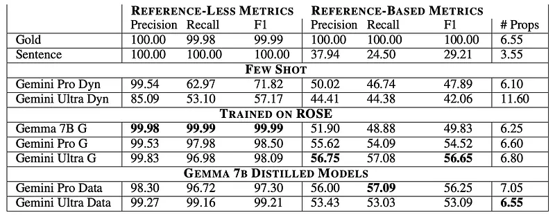

# Papers Explained 244 - Gemma APS

This work focuses on the task of abstractive proposition segmentation: transforming text into simple, self-contained, well-formed sentences.

This page ingests the source article into the wiki and connects it to [[Papers Explained Corpus]], [[Evaluation and Benchmarks]], [[Large Language Models]].

## Source Metadata

- Source file: `raw/2024-11-01_Papers-Explained-244--Gemma-APS-8fac1838b9ef.md`
- Source title: Papers Explained 244: Gemma APS
- Published: 2024-11-01
- Canonical: [https://medium.com/@ritvik19/papers-explained-244-gemma-aps-8fac1838b9ef](https://medium.com/@ritvik19/papers-explained-244-gemma-aps-8fac1838b9ef)

## Key Ideas

- First, evaluation metrics are introduced to measure several dimensions of quality.
- The models are available on [HuggingFace](https://huggingface.co/collections/google/gemma-aps-release-66e1a42c7b9c3bd67a0ade88).
- Given an input text t, which comprises a naturally-occurring sequence of English words, possibly split into multiple sentences, i.e., t = {s1, …, sn}. In text t, there are k latent atomic facts {f1, …, fk}.
- Well-formed: Proposition pi should be grammatically correct and conform to the rules of the English language.
- Atomic: Proposition pi should contain a single atomic fact.

## Notes

This work focuses on the task of abstractive proposition segmentation: transforming text into simple, self-contained, well-formed sentences.

First, evaluation metrics are introduced to measure several dimensions of quality. A scalable, yet accurate, proposition segmentation model is then proposed by modeling Proposition segmentation as a supervised task by training LLMs on existing annotated datasets.

The models are available on [HuggingFace](https://huggingface.co/collections/google/gemma-aps-release-66e1a42c7b9c3bd67a0ade88).

## Abstractive Proposition Segmentation

Given an input text t, which comprises a naturally-occurring sequence of English words, possibly split into multiple sentences, i.e., t = {s1, …, sn}. In text t, there are k latent atomic facts {f1, …, fk}. The task is then to segment t into a list of propositions {p1 , …, pk } with the following conditions:

- Well-formed: Proposition pi should be grammatically correct and conform to the rules of the English language.

- Atomic: Proposition pi should contain a single atomic fact.

- Self-contained: Proposition pi should not need additional context to be understood.

- Supported: Proposition pi should be found in the given text t.

- Comprehensive: The list of propositions {p1 , …, pk } should cover all the facts in text t.

There are two approaches: ungrouped propositions and grouped propositions.

### Ungrouped Propositions:

*Figure: The input and output for training an APS model with ungrouped propositions.*

- The input consists of an instruction and a passage.

- The output is a list of propositions, each prepended by “-” and separated by a newline character.

### Grouped Propositions:

*Figure: The input and output for training an APS model with grouped propositions.*

- This approach leverages the existing sentence structure of the passage.

- The passage is split into sentences, with special start of sentence (<s>) and end of sentence (</s>) tokens marking the boundaries.

- Propositions belonging to each sentence are grouped together and placed within the corresponding start and end sentence tokens.

Benefits of Grouped Propositions:

- Improved Performance: The model can learn to generate propositions per sentence instead of a long list for the entire passage, potentially leading to better performance.

- Automatic Sentence Attribution: During inference, each proposition can be automatically attributed to its corresponding sentence. This is valuable for downstream applications like grounding, where it’s useful to identify which sentences have propositions supported or contradicted by a source.

## Evaluation Metrics

Natural Language Inference (NLI) is employed as backbone to the metrics because by definition, it can be used to check factual support (i.e., one entails another) and semantic equivalence (i.e., both entail each other). In experiments, a T5–11B model fine-tuned on the ANLI dataset is used as the entailment model NLI(premise, claim) that returns an entailment score between 0 and 1.

### Reference-free (RF)

These metrics compare the system-generated propositions Q = {q1, …, qk′ } with input text t = {s1, …, sn}, to evaluate whether the propositions are supported and comprehensive. Specifically, precision RFp and recall RFr are calculated as follows:

where Q ̄ is the space-concatenated version of Q to create a single text.

- Here, precision essentially evaluates whether each proposition qi in Q is supported in text t.

- While recall evaluates whether each latent atomic fact mentioned in each sentence sj is covered in Q.

Precision and recall can be combined by calculating the f1-score RFf1.

### Reference-based (RB)

These metrics rely on a gold-standard set of propositions P = {p1 , …, pk } and check whether each proposition in P is semantically equivalent to a predicted proposition (and vice versa). A bidirectional version of NLI is used where premise and claim need to entail each other, i.e.:

- The first NLI call (i.e., does gold entail predicted?) ensures atomicity: predicted proposition qj should not include other facts (otherwise, the entailment will not hold).

- The second NLI call (i.e., does predicted entail gold?) ensures self- containedness: qj should not need further context (otherwise, the entailment does not hold).

Precision RBp and Recall RBr are calculated as follows:

Note that well-formedness is not measured since it is assumed for system predictions, given the advancements of pretrained LMs.

## Domain-General APS

To distill a relatively small, yet domain general proposition segmentation model:

- A teacher LLM is trained on an existing proposition segmentation dataset.

- A large set of multi-domain synthetic data with different lengths is generated.

- A large synthetic dataset with pairs of (text, propositions list) is generated and a student model is trained on it.

### Training an APS Model

Two different LLMs are fine-tuned as teachers: Gemini Pro and Gemini Ultra, by using examples in the ROSE dataset (Liu et al., 2023). Each example contains an input text t, and a list of propositions {p1,…,pk}.

### Generating Multi-Domain Synthetic Data

Various text properties, such as genre, topic, and platform, are considered contributing factors to domains. A prompt with 18 few-shot examples, each a triple of (length, domain, text), is designed. The length can be either short (one or a few sentences) or paragraph. The 18 few-shot examples cover 8 seed domains such as shopping reviews and Twitter and Reddit posts. To have a wide range of domains, the FLAN-PaLM2 L (Unicorn) model is first prompted to generate new domains. Then, a number of non-repetitive domains are manually selected. Finally, the LLM is prompted to generate text in those domains with the two lengths.

This approach is replicated using Gemini Ultra. Gemini Ultra is prompted 4,000 times to generate new domains, resulting in a set of 105 domains. From this set, 75 domains are manually selected. The LLM is then prompted to generate 226K examples with the selected domains and the two lengths.

### Distillation

The teacher LLMs are applied to the synthetic multi-domain set of texts and produced 226K (text, propositions) pairs of grouped propositions as it showed better results in the preliminary experiments. A Gemma 7b model with the same input and output format as the teacher models is then trained.

## Evaluation

Benchmarking Datasets:

- ROSE: A manually annotated dataset of news summaries split into Atomic Content Units (ACUs), which closely resemble propositions. This dataset was used for supervised training. The authors manually filtered out examples with unsupported or non-comprehensive propositions and aligned each proposition with a sentence using NLI scores. The final dataset contains 1,923 training examples and 383 development examples.

- Reddit: A dataset of 20 human-written answer passages from the ELI5 dataset, manually annotated with propositions.

- Amazon Review: A dataset of 20 randomly sampled reviews from the Amazon Review Data, manually annotated with propositions.

Baselines:

- Gold: Human-annotated propositions.

- Sentence: Each sentence is considered a proposition.

- Few Shot: Propositions are extracted using few-shot prompting with LLMs (Gemini Pro and Gemini Ultra).

- Trained on ROSE: Language models (Gemma 7B, Gemini Pro, Gemini Ultra) supervised trained on the ROSE dataset, both with ungrouped and grouped propositions.

### In-Domain Results

*Figure: Results on the ROSE dataset.*

- Gold propositions achieve the highest RLp (99.71%) and RLr (96.54%), indicating high quality in the pre-processed dataset.

- Sentence baseline achieves perfect RL metrics by definition but low RB metrics.

- Few-shot models have high RLp but relatively low RLr compared to supervised baselines.

- Grouped versions of trained models outperform ungrouped versions in most cases.

- Larger LMs generally achieve better results than smaller ones.

- Student models trained on distillation data outperform models trained directly on ROSE.

- The number of predicted propositions correlates well with RB metrics.

### Out-of-Domain Results

*Figure: Results on the REDDIT dataset.*

*Figure: Results on the AMAZON REVIEW dataset.*

- Both student and teacher models achieve high RL metrics (≥ 96%).

- Student models outperform Gemma 7B trained directly on ROSE in RB metrics, demonstrating the effectiveness of distillation and synthetic data for domain adaptation.

- Student models perform comparably to or better than teacher models on out-of-domain datasets.

- Few-shot models show significantly lower RL metrics (53% to 83%) compared to student models (≥ 97%), making them unreliable for downstream tasks requiring access to all claims.

- Slightly better RB metrics than student models on Reddit but much worse on Amazon Review.

## Paper

Scalable and Domain-General Abstractive Proposition Segmentation [2406.19803](https://arxiv.org/abs/2406.19803)

Recommended Reading [Gemini / Gemma Models](https://ritvik19.medium.com/list/gemini-gemma-models-4cb7dfc50d42)

## Figures

Figures from the Medium HTML export (`raw/2024-11-01_Papers-Explained-244--Gemma-APS-8fac1838b9ef.md`); local copies under `wiki/assets/papers-explained-244-gemma-aps/` when download succeeded.

| Figure | Caption |
|--------|---------|
|  | Title card: Gemma APS. |
|  | The input and output for training an APS model with ungrouped propositions. |
|  | The input and output for training an APS model with grouped propositions. |
|  | Benefits of Grouped Propositions:: where Q ̄ is the space-concatenated version of Q to create a single text. |
|  | Precision RBp and Recall RBr are calculated as follows. |
|  | Precision RBp and Recall RBr are calculated as follows. |
|  | Results on the ROSE dataset. |
|  | Results on the REDDIT dataset. |
|  | Results on the AMAZON REVIEW dataset. |
## Related

- [[Papers Explained Corpus]]
- [[Evaluation and Benchmarks]]
- [[Large Language Models]]
- [[Papers Explained 243 - ShieldGemma]]
- [[Papers Explained 187e - Quantized Llama 3.2, Llama 3.3]]

#summary #topic
