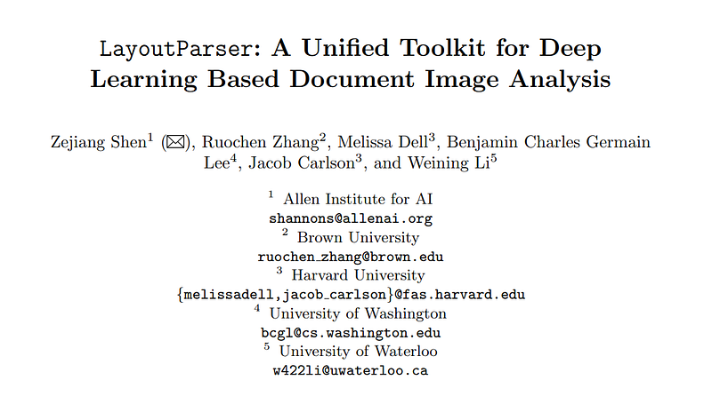
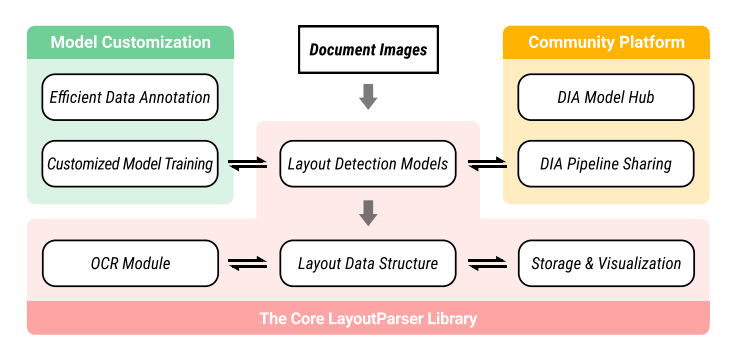
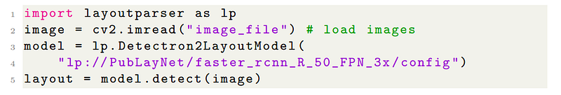
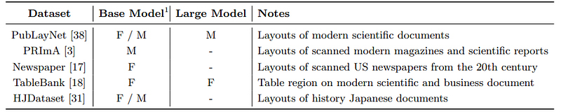
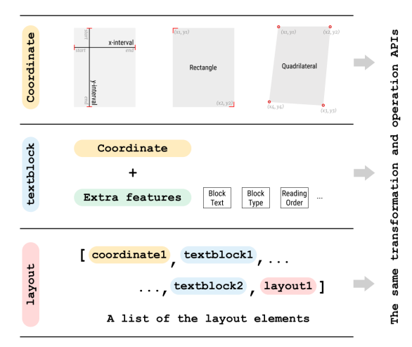
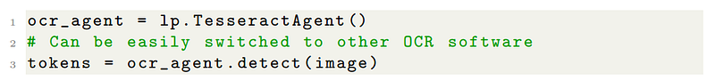

# Papers Explained 245 - Layout Parser

LayoutParser is an open-source library designed to streamline the application of deep learning (DL) in document image analysis (DIA) research and applications.

This page ingests the source article into the wiki and connects it to [[Papers Explained Corpus]], [[Document AI]], [[Synthetic Data]], [[Code Models]].

## Source Metadata

- Source file: `raw/2024-11-05_Papers-Explained-245--Layout-Parser-d29bb291890c.html`
- Source title: Papers Explained 245: Layout Parser
- Published: 2024-11-05
- Canonical: [https://medium.com/@ritvik19/papers-explained-245-layout-parser-d29bb291890c](https://medium.com/@ritvik19/papers-explained-245-layout-parser-d29bb291890c)

## Key Ideas

- It provides a unified toolkit that includes a set of simple and intuitive interfaces for applying and customizing DL models for tasks such as layout detection, character recognition, and other document processing tasks.
- LayoutParser also incorporates a community platform for sharing both pre-trained models and full document digitization pipelines, making it useful for both lightweight and large-scale digitization pipelines in real-world use cases.
- The library is publicly available at https://layout-parser.github.io.
- At the core of LayoutParser is an off-the-shelf toolkit that streamlines DL based document image analysis.
- The layout detection models enable using pre-trained or self-trained DL models for layout detection with just four lines of code.

## Notes

LayoutParser is an open-source library designed to streamline the application of deep learning (DL) in document image analysis (DIA) research and applications.

It provides a unified toolkit that includes a set of simple and intuitive interfaces for applying and customizing DL models for tasks such as layout detection, character recognition, and other document processing tasks.

LayoutParser also incorporates a community platform for sharing both pre-trained models and full document digitization pipelines, making it useful for both lightweight and large-scale digitization pipelines in real-world use cases.

The library is publicly available at https://layout-parser.github.io.

## The Core LayoutParser Library

*Figure: The overall architecture of LayoutParser.*

At the core of LayoutParser is an off-the-shelf toolkit that streamlines DL based document image analysis.

### Layout Detection Models

The layout detection models enable using pre-trained or self-trained DL models for layout detection with just four lines of code.

LayoutParser currently hosts 9 pre-trained models trained on 5 different datasets.

*Figure: Current layout detection models in the LayoutParser model zoo*

A semantic syntax is used for initializing the model weights in LayoutParser, using both the dataset name and model name lp://<dataset-name>/<model-architecture-name>.

### Layout Data Structures

In document image analysis pipelines, various post-processing on the layout analysis model outputs is usually required to obtain the final outputs.

All model outputs from LayoutParser are stored in carefully engineered data types optimized for further processing, which makes it possible to build an end-to-end document digitization pipeline within LayoutParser. There are three key components in the data structure, namely the Coordinate system, the TextBlock, and the Layout. They provide different levels of abstraction for the layout data, and a set of APIs are supported for transformations or operations on these classes.

*Figure: The relationship between the three types of layout data structures.*

Coordinate supports three kinds of variation; TextBlock consists of the coordinate information and extra features like block text, types, and reading orders; a Layout object is a list of all possible layout elements, including other Layout objects. They all support the same set of transformation and operation APIs for maximum flexibility.

### OCR

LayoutParser builds a series of wrappers among existing OCR engines, and provides nearly the same syntax for using them.

The OCR outputs will also be stored in the aforementioned layout data structures and can be seamlessly incorporated into the digitization pipeline.

LayoutParser also comes with a DL-based CNN-RNN OCR model trained with the Connectionist Temporal Classification (CTC) loss.

### Storage and visualization

LayoutParser supports exporting layout data into different formats like JSON, csv. It can also load datasets from layout analysis-specific formats like COCO and the Page Format for training layout models. LayoutParser is built with an integrated API for displaying the layout information along with the original document image. More detailed information can be found in the online LayoutParser documentation page.

### Customized Model Training

There can be cases when a model is not readily available, LayoutParser also supports training customized layout models and community sharing of the models.

It incorporates a toolkit optimized for annotating document layouts using object-level active learning. This allows a layout dataset to be created more efficiently with only around 60% of the labeling budget.

After the training dataset is curated, LayoutParser supports different modes for training the layout models. Through the integrated API provided by LayoutParser, users can easily compare model performances on the benchmark datasets.

## LayoutParser Community Platform

LayoutParser comes with a community model hub for distributing layout models. End-users can upload their self-trained models to the model hub, and these models can be loaded into a similar interface as the currently available LayoutParser pre-trained models.

## Paper

LayoutParser: A Unified Toolkit for Deep Learning Based Document Image Analysis [2103.15348](https://arxiv.org/abs/2103.15348)

Recommended Reading [Document Information Processing](https://ritvik19.medium.com/list/document-information-processing-3cd900a34972)

## Figures

Figures from the Medium HTML export (`raw/2024-11-05_Papers-Explained-245--Layout-Parser-d29bb291890c.html`); local copies under `wiki/assets/papers-explained-245-layout-parser/` when download succeeded.

| Figure | Caption |
|--------|---------|
|  | Title card: Layout Parser. |
|  | The overall architecture of LayoutParser. |
|  | The layout detection models enable using pre-trained or self-trained DL models for layout detection with just four lines of code. |
|  | Current layout detection models in the LayoutParser model zoo. |
|  | The relationship between the three types of layout data structures. |
|  | LayoutParser builds a series of wrappers among existing OCR engines, and provides nearly the same syntax for using them. |
## Related

- [[Papers Explained Corpus]]
- [[Document AI]]
- [[Synthetic Data]]
- [[Code Models]]
- [[Papers Explained Review 06 - Parameter Efficient FineTuning]]
- [[Papers Explained 246 - BROS]]

#summary #topic
