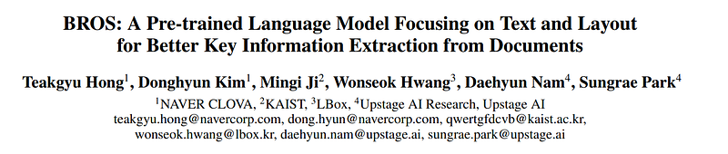
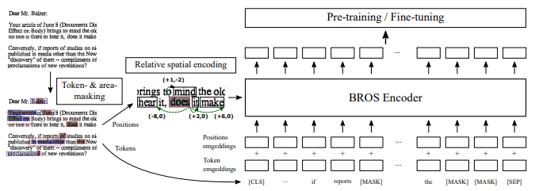
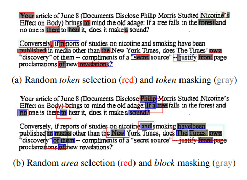

# Papers Explained 246 - BROS

The main Transformer structure of BROS is the same as BERT. BROS (BERT Relying On Spatiality) encodes relative positions of texts in 2D space and learns from unlabeled documents with area masking strategy.

This page ingests the source article into the wiki and connects it to [[Papers Explained Corpus]], [[Large Language Models]], [[Document AI]], [[Evaluation and Benchmarks]].

## Source Metadata

- Source file: `raw/2024-11-06_Papers-Explained-246--BROS-1f1127476f73.html`
- Source title: Papers Explained 246: BROS
- Published: 2024-11-06
- Canonical: [https://medium.com/@ritvik19/papers-explained-246-bros-1f1127476f73](https://medium.com/@ritvik19/papers-explained-246-bros-1f1127476f73)

## Key Ideas

- The main structure of BROS follows LayoutLM, but there are two critical advances:
- use of spatial encoding metric that describes spatial relations between text blocks
- use of 2D pre-training objective designed for text blocks on 2D space
- The way to encode spatial information of text blocks decides how text blocks be aware of their spatial relations.
- BROS first normalizes all the 2D points of the text blocks using the size of the image. Then, BROS calculates relative positions of the vertices from the same vertices of the other bounding boxes of text blocks and applies sinusoidal functions as:

## Notes

The main Transformer structure of BROS is the same as BERT. BROS (BERT Relying On Spatiality) encodes relative positions of texts in 2D space and learns from unlabeled documents with area masking strategy.

The main structure of BROS follows LayoutLM, but there are two critical advances:

- use of spatial encoding metric that describes spatial relations between text blocks

- use of 2D pre-training objective designed for text blocks on 2D space

*Figure: An overview of BROS. The tokens in the document image are masked through token- and area-masking strategy. The position difference between text blocks is encoded directly to the attention mechanism in Transformer. The output token representations are used in both pre-training and fine-tuning.*

The way to encode spatial information of text blocks decides how text blocks be aware of their spatial relations. LayoutLM simply encodes absolute x- and y-axis positions to each text blocks but the specific-point encoding is not robust on the minor position changes of text blocks. Instead, BROS employs relative positions between text blocks to explicitly encode spatial relations.

BROS first normalizes all the 2D points of the text blocks using the size of the image. Then, BROS calculates relative positions of the vertices from the same vertices of the other bounding boxes of text blocks and applies sinusoidal functions as:

the relative positions of j th bounding box based on the i th bounding box are represented with the four vectors:

Finally, BROS combines the four relative positions by applying a linear transformation, bbi,j:

BROS directly encodes the spatial relations to the contextualization of text blocks. In detail, it calculates an attention logit combining both semantic and spatial features as follows:

## Pretraining

*Figure: Illustrations of two masking strategies. The blue boxes represent text blocks including masked tokens. In both figures, 15% of tokens are masked.*

BROS utilizes two pre-training objectives: one is a token-masked LM (TMLM) used in BERT and the other is a novel area-masked LM (AMLM) introduced in this paper.

TMLM randomly masks tokens while keeping their spatial information, and then the model predicts the masked tokens with the clues of spatial information and the other un-masked tokens. The process is identical to MLM of BERT and Masked Visual-Language Model (MVLM) of LayoutLM.

AMLM masks all text blocks allocated in a randomly chosen area. It can be interpreted as a span masking for text blocks in 2D space. Specifically, AMLM consists of the following four steps: (1) randomly selects a text block, (2) identifies an area by expanding the region of the text block, (3) determines text blocks allocated in the area, and (4) masks all tokens of the text blocks and predicts them.

For pre-training, IIT-CDIP Test Collection 1.01, which consists of approximately 11M document images, is used but 400K of RVL-CDIP dataset are excluded following LayoutLM.

## Fine Tuning

BROS is finetuned on the following benchmark datasets as the downstream tasks to evaluate the performance

- FUNSD dataset: for form understanding

- CORD dataset: for receipt understanding

- SROIE dataset: for receipt understanding

- SciTSR: for table structure recognition

## Paper

BROS: A Pre-trained Language Model Focusing on Text and Layout for Better Key Information Extraction from Documents [2108.04539](https://arxiv.org/abs/2108.04539)

Recommended Reading [Document Information Processing](https://ritvik19.medium.com/list/document-information-processing-3cd900a34972)

## Figures

Figures from the Medium HTML export (`raw/2024-11-06_Papers-Explained-246--BROS-1f1127476f73.html`); local copies under `wiki/assets/papers-explained-246-bros/` when download succeeded.

| Figure | Caption |
|--------|---------|
|  | Title card: BROS. |
|  | An overview of BROS. The tokens in the document image are masked through token- and area-masking strategy. The position difference between text blocks is encoded directly to the attention mechanism in Transformer. The output token representations are used in both pre-training and fine-tuning. |
|  | the relative positions of j th bounding box based on the i th bounding box are represented with the four vectors. |
|  | the relative positions of j th bounding box based on the i th bounding box are represented with the four vectors. |
|  | Finally, BROS combines the four relative positions by applying a linear transformation, bbi,j. |
|  | BROS directly encodes the spatial relations to the contextualization of text blocks. |
|  | Illustrations of two masking strategies. The blue boxes represent text blocks including masked tokens. In both figures, 15% of tokens are masked. |
## Related

- [[Papers Explained Corpus]]
- [[Large Language Models]]
- [[Document AI]]
- [[Evaluation and Benchmarks]]
- [[Papers Explained 245 - Layout Parser]]
- [[Papers Explained 247 - Layout Reader]]

#summary #topic
