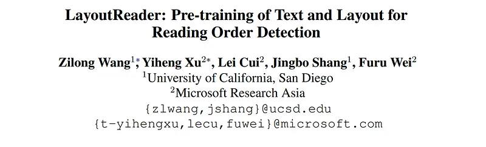
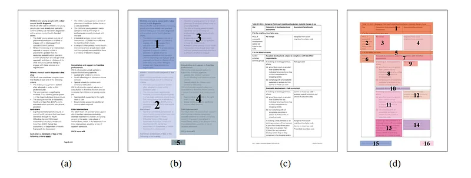
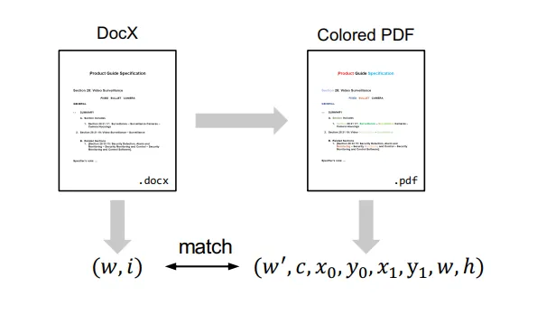
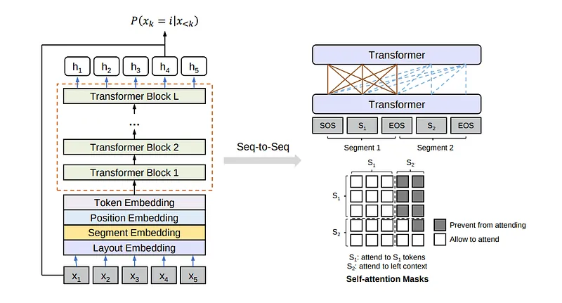
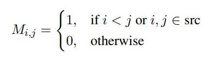
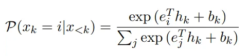
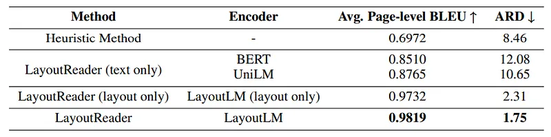
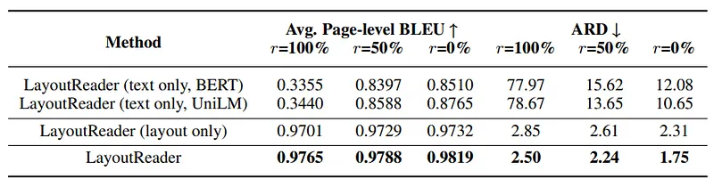
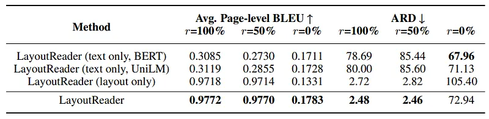

# Papers Explained 247 - Layout Reader

LayoutReader captures the text and layout information for reading order prediction using the seq2seq model. It performs almost perfectly in reading order detection and significantly improves both open-source and commercial OCR engines in ordering text lines in their results in our experiments.

This page ingests the source article into the wiki and connects it to [[Papers Explained Corpus]], [[Document AI]], [[Synthetic Data]], [[Multilingual Models]], [[Evaluation and Benchmarks]].

## Source Metadata

- Source file: `raw/2024-11-07_Papers-Explained-247--Layout-Reader-248b27db1234.md`
- Source title: Papers Explained 247: Layout Reader
- Published: 2024-11-07
- Canonical: [https://medium.com/@ritvik19/papers-explained-247-layout-reader-248b27db1234](https://medium.com/@ritvik19/papers-explained-247-layout-reader-248b27db1234)

## Key Ideas

- LayoutReader captures the text and layout information for reading order prediction using the seq2seq model.
- ReadingBank, a benchmark dataset with 500,000 document images for reading order detection.
- LayoutReader model for reading order detection and conduct experiments with different parameter settings. The results confirm the effectiveness of LayoutReader in detecting reading order of documents and improving line ordering of OCR engines.
- Equipped with the textual and layout information of the tokens in the document image, the intention is to sort the tokens into the reading order.
- ReadingBank includes two parts, the word sequence and its corresponding bounding box coordinates. The word sequence is denoted as the Reading Sequence, which is extracted from DocX files.

## Notes

LayoutReader captures the text and layout information for reading order prediction using the seq2seq model. It performs almost perfectly in reading order detection and significantly improves both open-source and commercial OCR engines in ordering text lines in their results in our experiments.

The contributions of this paper are:

- ReadingBank, a benchmark dataset with 500,000 document images for reading order detection.

- LayoutReader model for reading order detection and conduct experiments with different parameter settings. The results confirm the effectiveness of LayoutReader in detecting reading order of documents and improving line ordering of OCR engines.

## Problem Formulation

*Figure: Document image examples in ReadingBank with the reading order information. The colored areas show the paragraph-level reading order.*

Equipped with the textual and layout information of the tokens in the document image, the intention is to sort the tokens into the reading order.

## ReadingBank

*Figure: Building pipeline of ReadingBank, where (w, i) is the pair of word and its appearance index and (w 0 , c, x0, y0, x1, y1, w, h) is the word, word color and layout information.*

ReadingBank includes two parts, the word sequence and its corresponding bounding box coordinates. The word sequence is denoted as the Reading Sequence, which is extracted from DocX files. The corresponding bounding boxes are extracted from the PDF files that are generated from DocX files.

### Document Collection

WORD documents in DocX format are crawled from the internet.

The language detection API is used with a high confidence threshold to filter non-English or bilingual documents as the focus is on the reading order detection for English documents.

Only the pages with more than 50 words are kept to guarantee enough information on each page. In this way, a total of 210,000 WORD documents in English have been collected, and each page in the documents is informative enough. Furthermore, 500,000 pages are randomly selected to build the dataset.

### Reading Sequence Extraction

An open source tool python-docx is used to parse the DocX file and extract the word sequence from the XML metadata.

The paragraphs and tables are first extracted sequentially from the parsing result. Then, the paragraphs are traversed line by line, and the tables are processed cell by cell to obtain the word sequence in the DocX file.

The obtained sequence is the reading order without the layout information and is denoted as the Reading Sequence.

### Layout Alignment with Coloring Scheme

The PDF files produced by the colored DocX files are utilized as an intermediary for the extraction of layout information. PDF Metamorphosis .Net is employed to convert the DocX files to PDF, and an open-source tool known as MuPDF is used as the PDF parser. The words, bounding box coordinates, and word color are extracted from the PDF file.

## LayoutReader

*Figure: LayoutReader architecture for the reading order detection. The self-attention is designed for sequenceto-sequence modeling and the generation step is modified to predict the indices in the source segment*

LayoutReader is a sequence-to-sequence model using both textual and layout information, where alayout-aware language model LayoutLM is leveraged as encoder and modify the generation step in the encoder-decoder structure to generate the reading order sequence.

LayoutReader allows the tokens in the source segment to attend to each other while preventing the tokens in the target segment from attending to the rightward context. If 1 means allowing and 0 means preventing, the detail of the mask M is as follows:

In the decoding stage, since the source and target are reordered sequences, the prediction candidates can be constrained to the source segment. Therefore, the model is asked to predict the indices in the source sequence. The probability is calculated as follows:

where i is an index in the source segment; ei and ej are the i-th and j-th input embeddings of the source segment; hk is the hidden states at the k-th time step; bk is the bias at the k-th time step.

## Experiments

### Comparative Methods

Heuristic Method: This method refers to sorting words from left to right and from top to bottom.

LayoutReader (text only): LayoutLM is replaced with textual language models, e.g. BERT, UniLM.

LayoutReader (layout only): Token embeddings are removed in LayoutLM. After removing these embeddings, LayoutReader (layout only) only considers the 1D and 2D positional layout information.

### Evaluation Metrics

Average Page-level BLEU: BLEU scores measure the n-gram overlaps between the hypothesis and reference.

Average Relative Distance (ARD): The ARD score measures the relative distance between the common elements in the different sequence.

## Results

### Reading Order Detection

*Figure: Evaluation results of the LayoutReader on the reading order detection task, where the source-side of training/testing data is in the left-to-right and top-to-bottom order*

- LayoutReader outperforms other baselines and achieves state-of-the-art (SOTA) results.

- LayoutReader improves average page-level BLEU by 0.2847 and decreases ARD by 6.71.

- Even when some input modalities are removed, LayoutReader still shows improvements in BLEU (0.16 and 0.27) for text-only and layout-only inputs, respectively.

- There is a steady 6.15 reduction in ARD for LayoutReader with layout-only input.

- However, LayoutReader with text-only input sees a drop in ARD, mainly due to severe punishment for token omission.

- LayoutReader (text only) guarantees the correct order of tokens but suffers from generation incompleteness.

- The layout information is found to be more important than textual information in reading order detection.

- LayoutReader with layout-only input significantly outperforms LayoutReader (text only) by about 0.1 in BLEU and about 9.0 in ARD.

### Input Order for Training and Testing

*Figure: Input order study with left-to-right and top-to-bottom inputs in evaluation, where r is the proportion of shuffled samples in training.*

*Figure: Input order study with token-shuffled inputs in evaluation, where r is the proportion of shuffled samples in training.*

- The study involves shuffling input tokens of a sequence-to-sequence model in various proportions (r) during training to evaluate the accuracy of LayoutReader for different input orders.

- Three versions of comparative models are created with r values of 100%, 50%, and 0%.

- Left-to-right and top-to-bottom input orders are considered important for reading order detection but are incomplete hints during training.

- Two evaluation methods are used: one with left-to-right and top-to-bottom inputs and the other with token-shuffled inputs.

- LayoutReader and LayoutReader (layout only) are more robust to token shuffling during training, likely because they consider layout information, which remains consistent despite shuffling.

- When training LayoutReader with no token shuffling (r = 0%) and evaluating with token-shuffled inputs, there is a drop in performance. This is attributed to overfitting to the left-to-right and top-to-bottom order during training, which is similar to the ground truth, while the token-shuffled inputs during evaluation are entirely different and unseen.

## Paper

LayoutReader: Pre-training of Text and Layout for Reading Order Detection [2108.11591](https://arxiv.org/abs/2108.11591)

Recommended Reading [Document Information Processing](https://ritvik19.medium.com/list/document-information-processing-3cd900a34972)

## Figures

Figures from the Medium HTML export (`raw/2024-11-07_Papers-Explained-247--Layout-Reader-248b27db1234.md`); local copies under `wiki/assets/papers-explained-247-layout-reader/` when download succeeded.

| Figure | Caption |
|--------|---------|
|  | Title card: Layout Reader. |
|  | Document image examples in ReadingBank with the reading order information. The colored areas show the paragraph-level reading order. |
|  | Building pipeline of ReadingBank, where (w, i) is the pair of word and its appearance index and (w 0, c, x0, y0, x1, y1, w, h) is the word, word color and layout information. |
|  | LayoutReader architecture for the reading order detection. The self-attention is designed for sequenceto-sequence modeling and the generation step is modified to predict the indices in the source segment. |
|  | The contributions of this paper are. |
|  | In the decoding stage, since the source and target are reordered sequences, the prediction candidates can be constrained to the source... |
|  | Evaluation results of the LayoutReader on the reading order detection task, where the source-side of training/testing data is in the left-to-right and top-to-bottom order. |
|  | Input order study with left-to-right and top-to-bottom inputs in evaluation, where r is the proportion of shuffled samples in training. |
|  | Input order study with token-shuffled inputs in evaluation, where r is the proportion of shuffled samples in training. |
## Related

- [[Papers Explained Corpus]]
- [[Document AI]]
- [[Synthetic Data]]
- [[Multilingual Models]]
- [[Evaluation and Benchmarks]]
- [[Papers Explained 246 - BROS]]
- [[Papers Explained 248 - LMDX]]

#summary #topic
