# Papers Explained 249 - DINO

This paper investigates whether self-supervised learning enhances Vision Transformer performance compared to convolutional networks, finding that self-supervised ViT features exhibit semantic segmentation information, excel as k-NN classifiers, and these findings are implemented into a simple self-supervised method, called DINO...

This page ingests the source article into the wiki and connects it to [[Papers Explained Corpus]], [[Computer Vision]], [[Large Language Models]], [[Model Compression and Efficiency]], [[Model Distillation]], [[On-Policy Self-Distillation]].

## Source Metadata

- Source file: `raw/2024-11-11_Papers-Explained-249--DINO-f7e2c7f438ab.html`
- Source title: Papers Explained 249: DINO
- Published: 2024-11-11
- Canonical: [https://medium.com/@ritvik19/papers-explained-249-dino-f7e2c7f438ab](https://medium.com/@ritvik19/papers-explained-249-dino-f7e2c7f438ab)

## Key Ideas

- This paper investigates whether self-supervised learning enhances Vision Transformer performance compared to convolutional networks, finding that self-supervised ViT features exhibit semantic segmentation information, excel as k-NN classifiers, and these...
- The project is available at [GitHub](https://github.com/facebookresearch/dino).
- Given student network gθs, teacher network gθt , parameterized by θs and θt respectively For an input image x, both networks output probability distributions over K dimensions denoted by Ps and Pt.
- From a given image, a set V of different views are generated. This set contains two global views, xg1 and xg2 and several local views of smaller resolution.
- The standard setting for multi-crop uses two global views at a resolution of 224², covering a large area (greater than 50%) of the original image. Additionally, several local views of resolution 96² cover only small areas (less than 50%) of the original image.

## Notes

This paper investigates whether self-supervised learning enhances Vision Transformer performance compared to convolutional networks, finding that self-supervised ViT features exhibit semantic segmentation information, excel as k-NN classifiers, and these findings are implemented into a simple self-supervised method, called DINO (self-distillation with no labels).

The project is available at [GitHub](https://github.com/facebookresearch/dino).

## SSL with Knowledge Distillation

*Figure: Self-distillation with no labels.*

Given student network gθs, teacher network gθt , parameterized by θs and θt respectively For an input image x, both networks output probability distributions over K dimensions denoted by Ps and Pt. The probability P is obtained by normalizing the output of the network g with a softmax function.

From a given image, a set V of different views are generated. This set contains two global views, xg1 and xg2 and several local views of smaller resolution. All crops are passed through the student while only the global views are passed through the teacher, therefore encouraging “local-to-global” correspondences. The following loss is minimized:

The standard setting for multi-crop uses two global views at a resolution of 224², covering a large area (greater than 50%) of the original image. Additionally, several local views of resolution 96² cover only small areas (less than 50%) of the original image.

```text
# gs, gt: student and teacher networks
# C: center (K)
# tps, tpt: student and teacher temperatures
# l, m: network and center momentum rates
gt.params = gs.params
for
x
in
loader:
# load a minibatch x with n samples
x1, x2 = augment(x), augment(x)
# random views
s1, s2 = gs(x1), gs(x2)
# student output n-by-K
t1, t2 = gt(x1), gt(x2)
# teacher output n-by-K
loss = H(t1, s2)/
2
+ H(t2, s1)/
2
loss.backward()
# back-propagate
# student, teacher and center updates
update(gs)
# SGD
gt.params = l*gt.params + (
1
-l)*gs.params
C = m*C + (
1
-m)*cat([t1, t2]).mean(dim=
0
)
def
H
(
t, s
):
t = t.detach()
# stop gradient
s = softmax(s / tps, dim=
1
)
t = softmax((t - C) / tpt, dim=
1
)
# center + sharpen
return
- (t * log(s)).
sum
(dim=
1
).mean()
```

## Implementation Details

Unlike knowledge distillation, there is no teacher network gθt given a priori, so it is built from past iterations of the student network.

The neural network g is composed of a backbone f (ViT or ResNet), and of a projection head h: g = h ◦ f. The features used in downstream tasks are the backbone f output. The projection head consists of a 3-layer multi-layer perceptron (MLP) with hidden dimension 2048 followed by 2 normalization and a weight normalized fully connected layer with K dimensions.

*Figure: Networks configuration.*

Unlike standard convnets, ViT architectures do not use batch normalizations (BN) by default. Therefore, when applying DINO to ViT, no BN is used also in the projection heads, making the system entirely BN-free.

The models are pre-trained on the ImageNet dataset without labels. Data augmentations include color jittering, Gaussian blur, solarization, and multi-crop with a bicubic interpolation to adapt the position embeddings to different scales.

## Evaluation

### Comparing with SSL frameworks on ImageNet

DINO is compared against other self-supervised learning methods (BYOL, MoCov2, SwAV) using both ResNet-50 and ViT-small architectures. Performance is evaluated using both linear classification and k-NN evaluation metrics. The impact of different patch sizes on ViT architectures trained with DINO is investigated.

*Figure: Linear and k-NN classification on ImageNet.*

Same Architecture Comparison:

- DINO achieves state-of-the-art performance on ResNet-50, validating its effectiveness in a standard setting.

- With ViT-small, DINO outperforms BYOL, MoCov2, and SwAV by a significant margin (+3.5% linear classification, +7.9% k-NN).

- Surprisingly, DINO with ViT achieves near-identical performance with both linear and k-NN classifiers (74.5% vs. 77.0%). This phenomenon is unique to DINO and ViT architectures.

Across Architectures Comparison:

- Training larger ViT architectures with DINO improves performance.

- Reducing the patch size in ViT architectures trained with DINO has a more significant impact on performance than increasing the model size.

- A base ViT with 8x8 patches trained with DINO achieves 80.1% top-1 accuracy in linear classification and 77.4% with k-NN, using 10x fewer parameters and running 1.4x faster than previous state-of-the-art methods.

### Nearest neighbor retrieval with DINO ViT

The effectiveness of DINO-trained ViT features is evaluated for nearest neighbor retrieval tasks, specifically landmark retrieval and copy detection. To achieve this, DINO ViT models are pre-trained on large datasets such as ImageNet and Google Landmarks v2.

Image Retrieval:

*Figure: Image retrieval.*

- DINO-trained features outperform supervised ImageNet-trained features on the Oxford and Paris image retrieval datasets.

- DINO ViT features trained on Google Landmarks v2 achieve state-of-the-art performance, surpassing previous methods using off-the-shelf descriptors.

Copy Detection:

*Figure: Copy detection.*

- DINO-trained ViT features are highly competitive on the INRIA Copydays dataset, achieving comparable results to existing methods.

### Discovering the semantic layout of scenes

To investigate whether self-attention maps generated by ViT models contain information about image segmentation, a qualitative analysis of self-attention maps is conducted on the DAVIS-2017 video instance segmentation benchmark.

*Figure: DAVIS 2017 Video object segmentation.*

*Figure: Segmentations from supervised versus DINO.*

- ViT models achieve competitive performance on video instance segmentation without fine-tuning.

- Smaller patch sizes (S/8) lead to better performance in dense recognition tasks.

- Different self-attention heads attend to distinct semantic regions, even occluded or small ones.

- Self-supervised ViT models outperform supervised ViT models and DINO models in terms of segmentation quality.

- Self-attention maps provide a readily accessible source of segmentation information, unlike self-supervised convolutional networks which require dedicated methods for extraction.

### Transfer learning on downstream tasks

The effectiveness of self-supervised pretraining using DINO is evaluated compared to supervised pretraining using ImageNet. This evaluation is achieved by fine-tuning features from both pretraining methods on various downstream tasks.

*Figure: Transfer learning by finetuning pretrained models on different datasets.*

- For ViT architectures, self-supervised pretraining outperforms supervised pretraining on downstream tasks by 1–2%.

## Paper

Emerging Properties in Self-Supervised Vision Transformers [2104.14294](https://arxiv.org/abs/2104.14294)

Recommended Reading [Vision Transformers](https://ritvik19.medium.com/list/vision-transformers-61e6836230f1)

## Figures

Figures from the Medium HTML export (`raw/2024-11-11_Papers-Explained-249--DINO-f7e2c7f438ab.html`); local copies under `wiki/assets/papers-explained-249-dino/` when download succeeded.

| Figure | Caption |
|--------|---------|
| 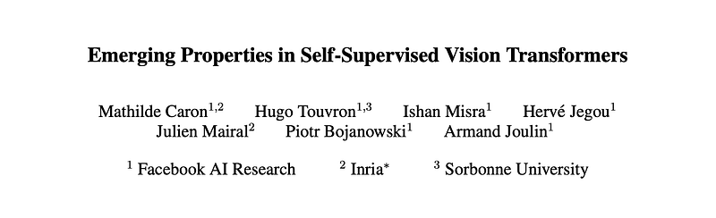 | Title card: DINO. |
| 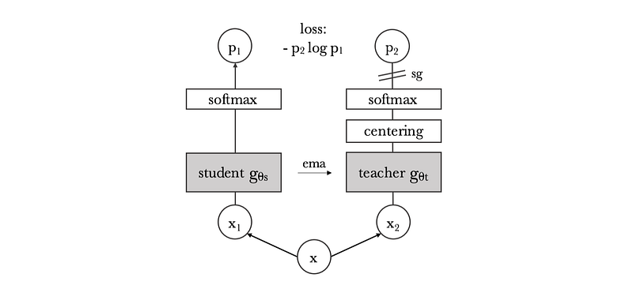 | Self-distillation with no labels. |
| 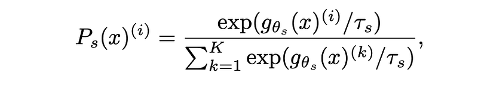 | From a given image, a set V of different views are generated. |
| 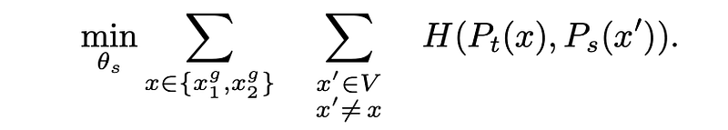 | From a given image, a set V of different views are generated. |
| 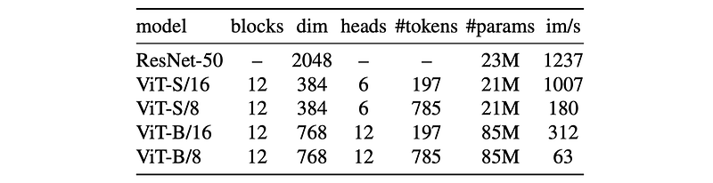 | Networks configuration. |
| 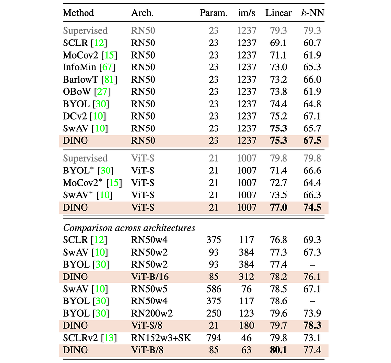 | Linear and k-NN classification on ImageNet. |
| 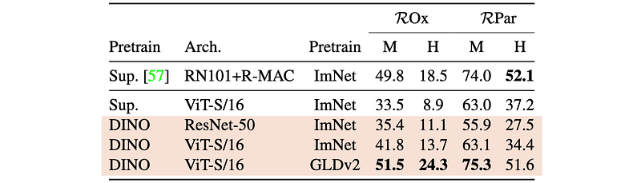 | Image retrieval. |
| 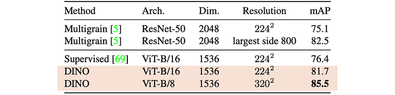 | Copy detection. |
| 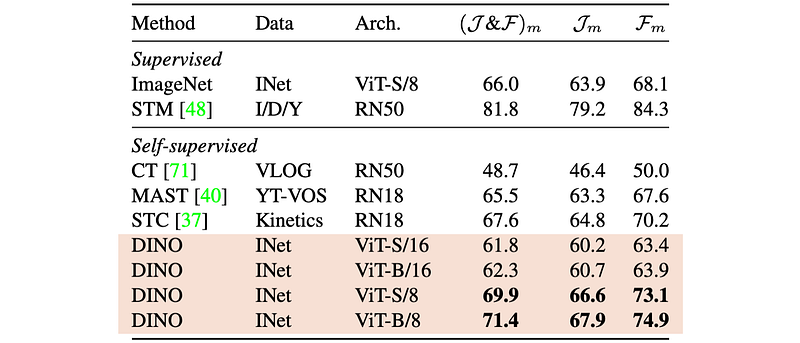 | DAVIS 2017 Video object segmentation. |
| 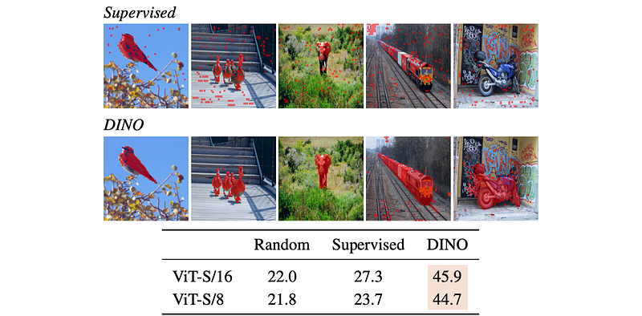 | Segmentations from supervised versus DINO. |
| 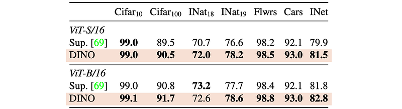 | Transfer learning by finetuning pretrained models on different datasets. |
## Related

- [[Papers Explained Corpus]]
- [[Computer Vision]]
- [[Large Language Models]]
- [[Model Compression and Efficiency]]
- [[Model Distillation]]
- [[On-Policy Self-Distillation]]
- [[Papers Explained 248 - LMDX]]
- [[Papers Explained 250 - DINO v2]]

#summary #topic
