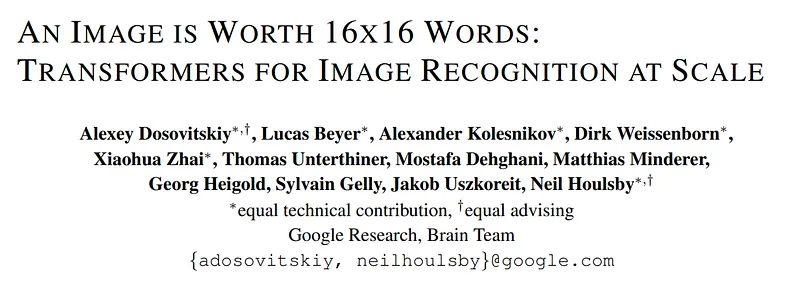
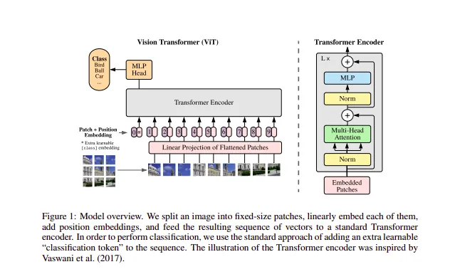

# Papers Explained 25 - Vision Transformers

Inspired by the Transformer scaling successes in NLP, the idea is to apply a standard Transformer directly to images, with the fewest possible modifications. To do so, we split an image into patches and provide the sequence of linear embeddings of these patches as an input to a Transformer.

This page ingests the source article into the wiki and connects it to [[Papers Explained Corpus]], [[Large Language Models]], [[Embedding and Retrieval]], [[Computer Vision]].

## Source Metadata

- Source file: `raw/2023-02-09_Papers-Explained-25--Vision-Transformers-e286ee8bc06b.md`
- Source title: Papers Explained 25: Vision Transformers
- Published: 2023-02-09
- Canonical: [https://medium.com/@ritvik19/papers-explained-25-vision-transformers-e286ee8bc06b](https://medium.com/@ritvik19/papers-explained-25-vision-transformers-e286ee8bc06b)

## Key Ideas

- Inspired by the Transformer scaling successes in NLP, the idea is to apply a standard Transformer directly to images, with the fewest possible modifications.
- The standard Transformer receives as input a 1D sequence of token embeddings. To handle 2D images, we reshape the image
- where (H, W) is the resolution of the original image, C is the number of channels, (P, P) is the resolution of each image patch, and
- is the resulting number of patches, which also serves as the effective input sequence length for the Transformer.
- The Transformer uses constant latent vector size D through all of its layers, so we flatten the patches and map to D dimensions with a trainable linear projection. We refer to the output of this projection as the patch embeddings.

## Notes

Inspired by the Transformer scaling successes in NLP, the idea is to apply a standard Transformer directly to images, with the fewest possible modifications. To do so, we split an image into patches and provide the sequence of linear embeddings of these patches as an input to a Transformer. Image patches are treated the same way as tokens (words) in an NLP application. We train the model on image classification in supervised fashion.

The standard Transformer receives as input a 1D sequence of token embeddings. To handle 2D images, we reshape the image

into a sequence of flattened 2D patches

where (H, W) is the resolution of the original image, C is the number of channels, (P, P) is the resolution of each image patch, and

is the resulting number of patches, which also serves as the effective input sequence length for the Transformer.

The Transformer uses constant latent vector size D through all of its layers, so we flatten the patches and map to D dimensions with a trainable linear projection. We refer to the output of this projection as the patch embeddings.

Similar to BERT’s [class] token, we prepend a learnable embedding to the sequence of embedded patches, whose state at the output of the Transformer encoder serves as the image representation y.

Position embeddings are added to the patch embeddings to retain positional information. We use standard learnable 1D position embeddings, since we have not observed significant performance gains from using more advanced 2D-aware position embeddings. The resulting sequence of embedding vectors serves as input to the encoder.

The Transformer encoder consists of alternating layers of multiheaded self attention and MLP blocks. Layernorm is applied before every block, and residual connections after every block. The MLP contains two layers with a GELU non-linearity.

## Training

When trained on mid-sized datasets such as ImageNet without strong regularization, these models yield modest accuracies of a few percentage points below ResNets of comparable size. This seemingly discouraging outcome may be expected: Transformers lack some of the inductive biases inherent to CNNs, such as translation equivariance and locality, and therefore do not generalize well when trained on insufficient amounts of data.

However, the picture changes if the models are trained on larger datasets (14M-300M images). We find that large scale training trumps inductive bias. Vision Transformer (ViT) attains excellent results when pre-trained at sufficient scale and transferred to tasks with fewer datapoints. When pre-trained on the public ImageNet-21k dataset or the in-house JFT-300M dataset, ViT approaches or beats state of the art on multiple image recognition benchmarks.

## Paper

An Image is Worth 16x16 Words: Transformers for Image Recognition at Scale: [2010.11929](https://arxiv.org/abs/2010.11929)

## Implementation

[Masked Autoencoder — Vision Transformer](https://www.kaggle.com/code/ritvik1909/masked-autoencoder-vision-transformer)

Recommended Reading [Vision Transformers](https://ritvik19.medium.com/list/vision-transformers-61e6836230f1)

## Figures

Figures from the Medium HTML export (`raw/2023-02-09_Papers-Explained-25--Vision-Transformers-e286ee8bc06b.md`); local copies under `wiki/assets/papers-explained-25-vision-transformers/` when download succeeded.

| Figure | Caption |
|--------|---------|
|  | Title card: Vision Transformers. |
|  | The standard Transformer receives as input a 1D sequence of token embeddings. |
|  | The standard Transformer receives as input a 1D sequence of token embeddings. |
|  | into a sequence of flattened 2D patches. |
|  | where (H, W) is the resolution of the original image, C is the number of channels, (P, P) is the resolution of each image patch, and. |
## Related

- [[How the Vision Transformer (ViT) Works in 10 Minutes: An Image Is Worth 16×16 Words]] — AI Summer tutorial on the same Dosovitskiy et al. architecture with attention-distance analysis and PyTorch code.
- [[Vision Transformer]] — concept page for ViT patch-token formulation and training recipe.
- [[Papers Explained Corpus]]
- [[Large Language Models]]
- [[Embedding and Retrieval]]
- [[Computer Vision]]
- [[Papers Explained 24 - ERNIE Layout]]
- [[Papers Explained 26 - Swin Transformer]]

#summary #topic
