# Papers Explained 250 - DINO v2

Recommended Reading [Papers Explained 249: DINO](https://ritvik19.medium.com/papers-explained-249-dino-f7e2c7f438ab)

This page ingests the source article into the wiki and connects it to [[Papers Explained Corpus]], [[Computer Vision]], [[Synthetic Data]], [[Evaluation and Benchmarks]], [[Embedding and Retrieval]].

## Source Metadata

- Source file: `raw/2024-11-12_Papers-Explained-250--DINO-v2-e1e6d12a5c85.html`
- Source title: Papers Explained 250: DINO v2
- Published: 2024-11-12
- Canonical: [https://medium.com/@ritvik19/papers-explained-250-dino-v2-e1e6d12a5c85](https://medium.com/@ritvik19/papers-explained-250-dino-v2-e1e6d12a5c85)

## Key Ideas

- The LVD-142M dataset is curated by retrieving images from an uncurated data source that are close to those in several curated datasets.
- Data Sources: The curated datasets include ImageNet-22k, the train split of ImageNet-1k, Google Landmarks, and several fine-grained datasets.
- Deduplication: A copy detection pipeline is applied to remove near-duplicate images from the uncurated data, reducing redundancy and increasing diversity among images.
- The features are learned using a discriminative self-supervised method, which can be viewed as a combination of DINO and iBOT losses with the centering of SwAV.
- The student network is trained using three objectives:

## Notes

This work demonstrates that existing pre-training methods, especially self-supervised methods, can produce general purpose visual features, i.e., features that work across image distributions and tasks without fine tuning. If trained on enough curated data from diverse sources, these methods can achieve this goal. Existing approaches are revisited and combined with different techniques to scale pretraining in terms of data and model size. In terms of data, a dedicated, diverse, and curated image dataset is proposed through an automatic pipeline instead of uncurated data, as typically done in the self-supervised literature. Additionally, a ViT model with 1B parameters is trained and distilled into a series of smaller models that surpass the best available general-purpose features on most benchmarks at both image and pixel levels.

Recommended Reading [Papers Explained 249: DINO](https://ritvik19.medium.com/papers-explained-249-dino-f7e2c7f438ab)

## Data Processing

*Figure: Overview of our data processing pipeline.*

The LVD-142M dataset is curated by retrieving images from an uncurated data source that are close to those in several curated datasets. The pipeline consists of three main components: curated/uncurated data sources, image deduplication, and self-supervised image retrieval.

Data Sources: The curated datasets include ImageNet-22k, the train split of ImageNet-1k, Google Landmarks, and several fine-grained datasets. The uncurated data source is a publicly available repository of crawled web data, from which they extract URL links of images from `` tags. Unsafe or restricted URLs are discarded and the downloaded images are post processed (PCA hash deduplication, NSFW filtering, and blurring identifiable faces), resulting in 1.2B unique images.

*Figure: Composition of our LVD-142M dataset.*

Deduplication: A copy detection pipeline is applied to remove near-duplicate images from the uncurated data, reducing redundancy and increasing diversity among images. Near-duplicates of images contained in the test or validation set of any benchmark used in this work are removed.

Self-Supervised Image Retrieval: To build their curated pre-training dataset, they retrieve images from the uncurated data source that are close to images in their curated sources. An image embedding is computed using a self-supervised ViT-H/16 network pretrained on ImageNet-22k and cosine-similarity is used as a distance measure between images. Then, k-means clustering is performed of the uncurated data. For each query image, N (typically 4) nearest neighbors or sample M images from the cluster are retrieved corresponding to each query image.

## Discriminative Self-supervised Pre-training

The features are learned using a discriminative self-supervised method, which can be viewed as a combination of DINO and iBOT losses with the centering of SwAV. Additionally, a regularizer is employed to spread features, and a brief high-resolution training phase is conducted. The approach is discriminative, meaning it learns features by comparing the outputs of two networks (student and teacher) rather than using a contrastive loss.

The student network is trained using three objectives:

Image-level objective: The cross-entropy loss between the features extracted from the student and teacher networks, both obtained from different crops of the same image. The DINO loss term is calculated as:

Patch-level objective: Randomly masking some input patches given to the student network (but not the teacher) and applying the iBOT head to the student mask tokens. The iBOT loss term is calculated as:

Untying head weights: Both DINO and iBOT losses use a learnable MLP projection head, which is applied to the output tokens and the loss is computed atop. Initially, parameters sharing between the two heads was tried, but found that using separate heads led to better performance.

The teacher network is built by applying an exponential moving average of past iterates to the student network’s weights. Additionally, the pre-training method uses:

Sinkhorn-Knopp centering: Replacing the teacher softmax-centering step with Sinkhorn-Knopp batch normalization from SwAV.

KoLeo regularizer: A regularizer that encourages a uniform span of features within a batch, defined as:

Adapting the resolution: Increasing the image resolution to 518x518 during a short period at the end of pre-training, similar to UniViT and FlexiViT training.

These components are combined to learn features that can be used for downstream tasks such as segmentation or detection.

*Figure: Architecture details of the ViT-S/B/L/g networks used in this work.*

## Evaluations

### ImageNet Classification

Evaluation of the quality of holistic image representations produced by a model by assessing how well features extracted from a frozen backbone performed in a linear classification task

*Figure: Linear evaluation on ImageNet-1k of frozen pretrained features.*

- The proposed model shows a very significant improvement (+4.2%) over the previous SoTA on linear evaluation using ImageNet-1k.

- Performance increase on alternative test sets (ImageNet-ReaL and ImageNet-V2) indicates stronger generalization.

- The model’s frozen features outperform OpenCLIP with a ViT-G/14 architecture and EVA-CLIP with the same architecture on ImageNet-1k.

- Significantly better performance (+1.1% versus EVA-CLIP) on the ImageNet-V2 test set, indicating better generalization.

*Figure: Supervised finetuning on ImageNet-1k.*

- Fine Tuning improves the Top-1 accuracy on the ImageNet-1k validation set by more than +2%, with the best fine tuned performance being only a couple of percent below the absolute SoTA.

*Figure: Domain Generalization with a linear probe on top of frozen features at a resolution of 224.*

- The model shows drastically better robustness (+29.6% on ImageNet-A, +22.1% on ImageNet-R, and +23.0% on Sketch) compared to iBOT when evaluated on domain generalization benchmarks.

### Additional Image and Video classification Benchmarks

To assess the generalization ability of the proposed features across various downstream classification benchmarks, including image and video classification tasks, two sets of evaluations are conducted. The first set involves large, fine-grained image datasets where a linear classifier is trained with data augmentations. The second set consists of 12 image classification tasks from SimCLR, where logistic regression is trained on precomputed features. Additionally, video action recognition datasets are evaluated using a linear classifier trained on average features or concatenated features.

*Figure: Linear evaluation on other image and video classification.*

- Significantly outperforms OpenCLIP ViT-G/14 on iNaturalist 2018 and 2021 (+8.6% and +9.7% respectively).

- Slightly lags behind OpenCLIP ViT-G/14 on Places205 (-2.3%).

- Sets a new state-of-the-art among self-supervised approaches for Video Action Recognition.

- Matches OpenCLIP accuracy on UCF101 and Kinetics-400 (+0.1% and +0.5% respectively).

- Outperforms OpenCLIP on Something-Something v2 (+2.5%).

*Figure: Linear evaluation of frozen features on fine-grained benchmarks.*

- Significantly outperforms state-of-the-art SSL models on most benchmarks.

- Notable performance gains on Stanford Cars (+14.8% vs. DINO ViT-B/8) and FGVC Aircraft (+14.8% vs. iBOT ViT-L/16).

- Competitive with OpenCLIP on most benchmarks, except SUN (-5.3%) and Cars (-4.7%).

### Instance Recognition

The objective of this evaluation is to assess a non-parametric model for instance-level recognition using cosine similarity between images. The method employed involved ranking images based on their cosine similarity to a query image.

*Figure: Evaluation of frozen features on instance-level recognition.*

- The model significantly outperforms both self-supervised learning (SSL) and weakly-supervised learning baselines.

- +41% mAP improvement over SSL on Oxford-Hard dataset.

- +34% mAP improvement over weakly-supervised methods on Oxford-Hard dataset.

- The model performs well across different task granularities (category-level and instance-level).

### Dense Recognition Tasks

To evaluate the quality of patch-level features extracted from a Vision Transformer network on dense downstream tasks, specifically focusing on semantic image segmentation and monocular depth estimation.

*Figure: Semantic segmentation on ADE20K, CityScapes and Pascal VOC with frozen features and a linear classifier (lin.) and with multiscale (+ms).*

- Models achieve very good performance on all datasets and setups.

- The +ms setup achieves comparable performance to fully fine-tuning MAE with an Upernet decoder.

- Best model (using +ms) nearly matches the state-of-the-art on Pascal VOC.

*Figure: Depth estimation with frozen features.*

- Features extracted from ViT outperform best SSL and WSL features.

- ViT-L features outperform OpenCLIP with ViT-G, suggesting caption-based learning struggles with subtle patterns.

- Frozen ViT backbone with DPT decoder matches or exceeds recent state-of-the-art results.

- Strong out-of-domain generalization from NYUd to SUN-RGBd.

## Paper

DINOv2: Learning Robust Visual Features without Supervision [2304.07193](https://arxiv.org/abs/2304.07193)

Recommended Reading [Vision Transformers](https://ritvik19.medium.com/list/vision-transformers-61e6836230f1)

## Figures

Figures from the Medium HTML export (`raw/2024-11-12_Papers-Explained-250--DINO-v2-e1e6d12a5c85.html`); local copies under `wiki/assets/papers-explained-250-dino-v2/` when download succeeded.

| Figure | Caption |
|--------|---------|
| 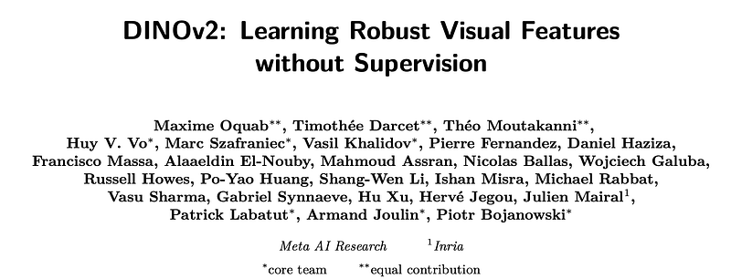 | Title card: DINO v2. |
| 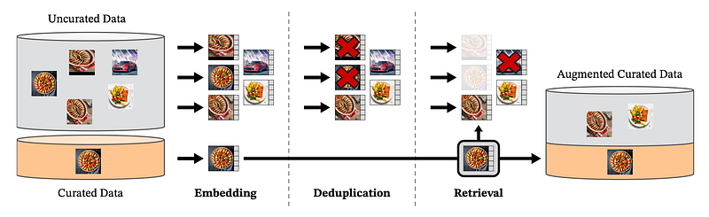 | Overview of our data processing pipeline. |
| 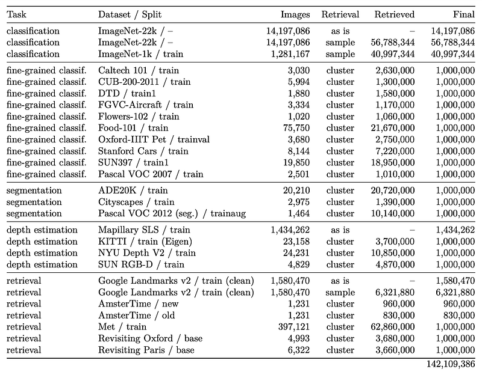 | Composition of our LVD-142M dataset. |
|  | Recommended Reading [ Papers Explained 249: DINO ]. |
|  | Recommended Reading [ Papers Explained 249: DINO ]. |
|  | KoLeo regularizer: A regularizer that encourages a uniform span of features within a batch, defined as. |
| 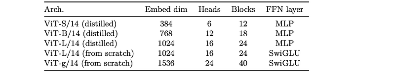 | Architecture details of the ViT-S/B/L/g networks used in this work. |
| 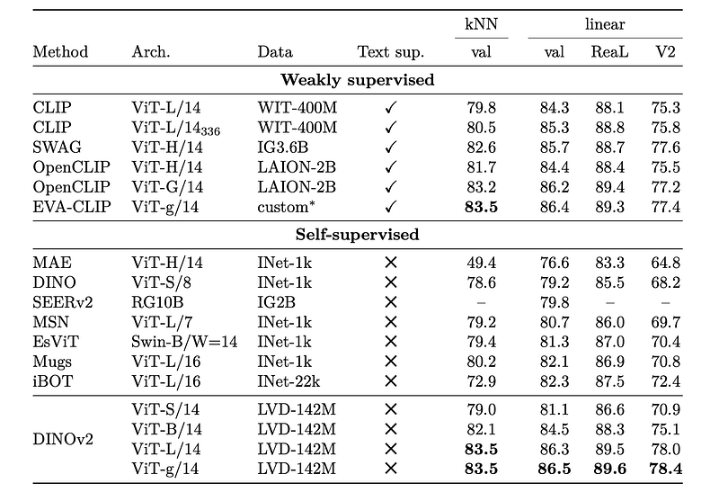 | Linear evaluation on ImageNet-1k of frozen pretrained features. |
|  | Supervised finetuning on ImageNet-1k. |
| 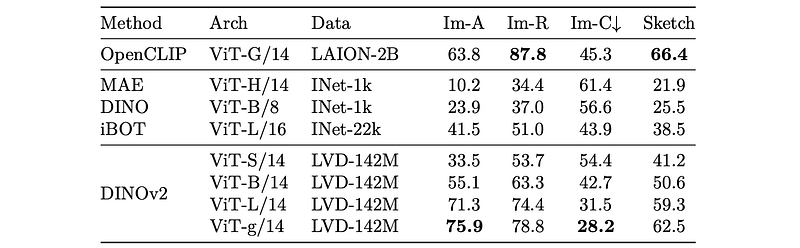 | Domain Generalization with a linear probe on top of frozen features at a resolution of 224. |
| 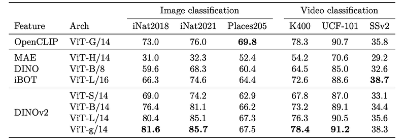 | Linear evaluation on other image and video classification. |
| 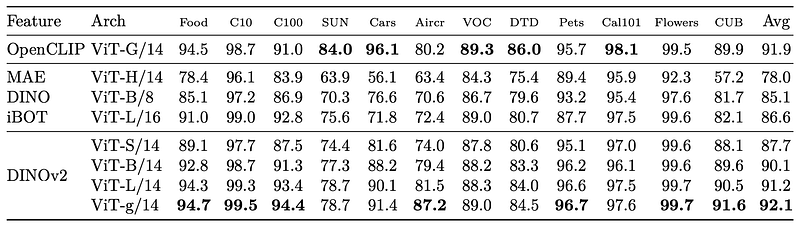 | Linear evaluation of frozen features on fine-grained benchmarks. |
| 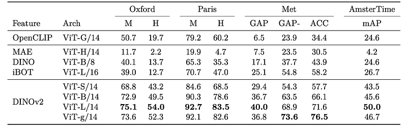 | Evaluation of frozen features on instance-level recognition. |
| 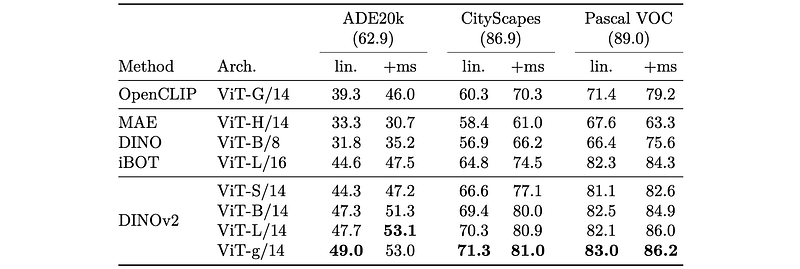 | Semantic segmentation on ADE20K, CityScapes and Pascal VOC with frozen features and a linear classifier (lin.) and with multiscale (+ms). |
| 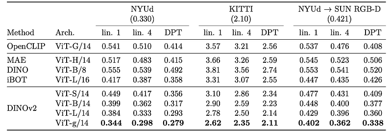 | Depth estimation with frozen features. |
## Related

- [[Papers Explained Corpus]]
- [[Computer Vision]]
- [[Synthetic Data]]
- [[Evaluation and Benchmarks]]
- [[Embedding and Retrieval]]
- [[Papers Explained 249 - DINO]]
- [[Papers Explained 251 - H2OVL-Mississippi]]

#summary #topic
