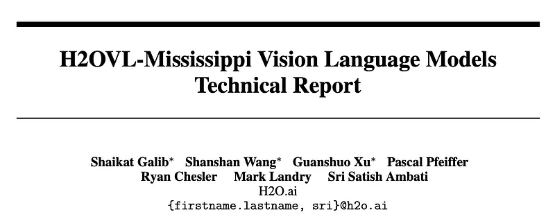
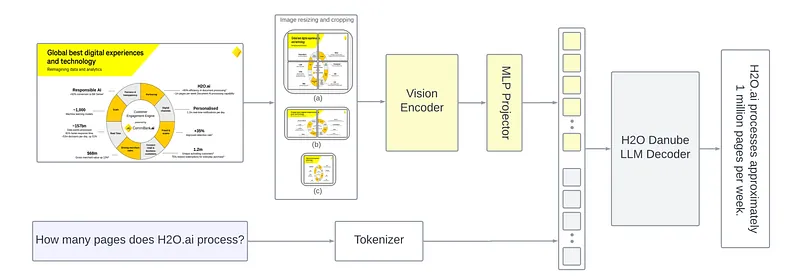
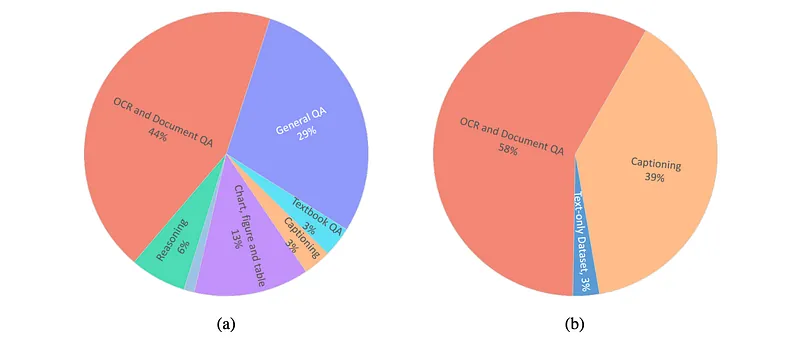
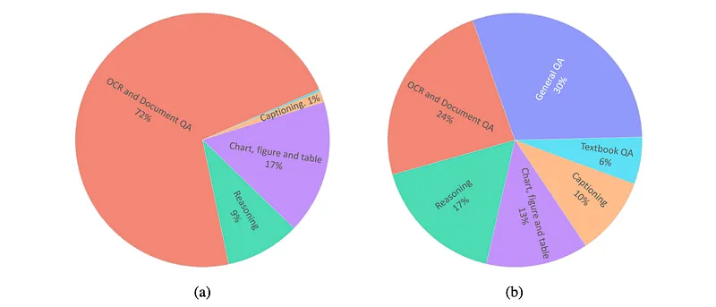
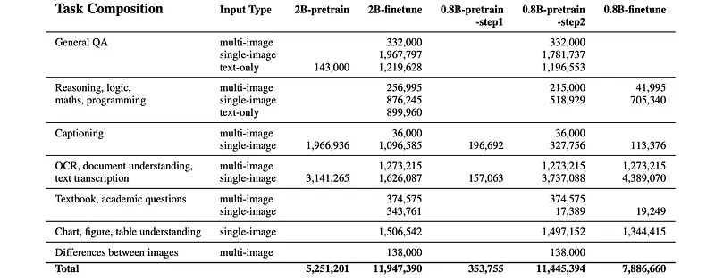
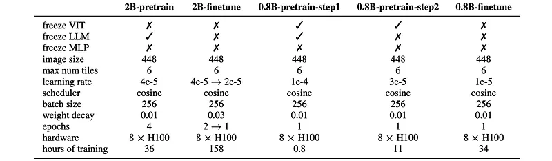
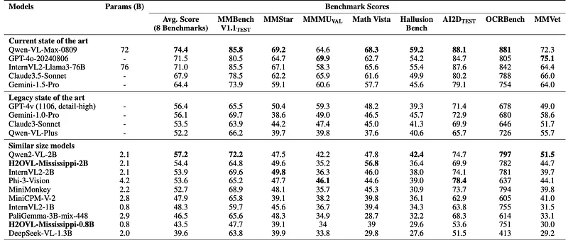
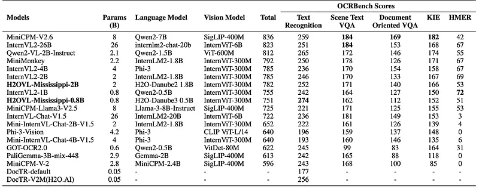
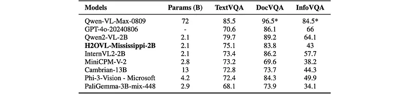
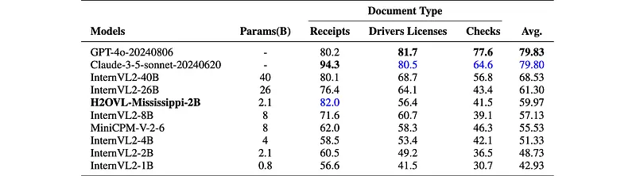

# Papers Explained 251 - H2OVL-Mississippi

H2O VL Mississippi is a collection of smaller vision-language models, including H2OVL-Mississippi-0.8B and H2OVL-Mississippi-2B. These models were designed for efficiency and accessibility.

This page ingests the source article into the wiki and connects it to [[Papers Explained Corpus]], [[Large Language Models]], [[Vision Language Models]], [[Model Compression and Efficiency]], [[Document AI]], [[Evaluation and Benchmarks]].

## Source Metadata

- Source file: `raw/2024-11-13_Papers-Explained-251--H2OVL-Mississippi-1508e9c8e862.md`
- Source title: Papers Explained 251: H2OVL-Mississippi
- Published: 2024-11-13
- Canonical: [https://medium.com/@ritvik19/papers-explained-251-h2ovl-mississippi-1508e9c8e862](https://medium.com/@ritvik19/papers-explained-251-h2ovl-mississippi-1508e9c8e862)

## Key Ideas

- The H2OVL-Mississippi-0.8B model specializes in text recognition, excelling in Optical Character Recognition (OCR) tasks and surpassing larger models on the OCRBench benchmark.
- The H2OVL-Mississippi-2B is a more versatile model capable of handling general vision-language tasks such as image captioning and visual question answering (VQA), while also demonstrating strong performance in OCR and document-centric tasks.
- The models are available on [HuggingFace](https://huggingface.co/collections/h2oai/h2ovl-mississippi-66e492da45da0a1b7ea7cf39/).
- The architecture of the H2OVL-Mississippi model takes inspiration from the LLaVA series, following a ViT-MLP-LLM configuration. It uses a transformer-based setup comprising a vision encoder, an MLP layer, and an LLM.
- Specifically, the H2OVL-Mississippi architecture integrates the InternViT-300M as its vision encoder and supports two variations for the language model: Danube-2 (1.8B) and Danube-3 (500M), providing flexibility based on computational requirements.

## Notes

H2O VL Mississippi is a collection of smaller vision-language models, including H2OVL-Mississippi-0.8B and H2OVL-Mississippi-2B. These models were designed for efficiency and accessibility.

- The H2OVL-Mississippi-0.8B model specializes in text recognition, excelling in Optical Character Recognition (OCR) tasks and surpassing larger models on the OCRBench benchmark.

- The H2OVL-Mississippi-2B is a more versatile model capable of handling general vision-language tasks such as image captioning and visual question answering (VQA), while also demonstrating strong performance in OCR and document-centric tasks.

The models are available on [HuggingFace](https://huggingface.co/collections/h2oai/h2ovl-mississippi-66e492da45da0a1b7ea7cf39/).

## Model Architecture

*Figure: H2OVL-Mississippi Model Architecture*

The architecture of the H2OVL-Mississippi model takes inspiration from the LLaVA series, following a ViT-MLP-LLM configuration. It uses a transformer-based setup comprising a vision encoder, an MLP layer, and an LLM. The vision encoder extracts features from images, while the LLM generates text. The MLP layer acts as a bridge between the vision encoder and the LLM.

Specifically, the H2OVL-Mississippi architecture integrates the InternViT-300M as its vision encoder and supports two variations for the language model: Danube-2 (1.8B) and Danube-3 (500M), providing flexibility based on computational requirements.

The H2O VL Mississippi architecture employs a dynamic resolution strategy and multi-scale adaptive cropping (MSAC), to balance efficiency and visual detail.

### Dynamic Resolution Strategy

- Images are divided into tiles of 448x448 pixels.

- The number of tiles used to cover the entire image ranges from 1 to 6, depending on the aspect ratio and resolution of the input image. This dynamic approach allows the model to adapt to varying image dimensions.

- The number of visual tokens generated during training varies between 256 and 1,590.

- Pixel Shuffle Operation: A pixel shuffle operation is applied to the ViT embeddings to reduce the number of visual tokens per tile to 256. This operation, commonly used in image super-resolution tasks, helps to reduce computational demands without sacrificing important information.

### Multi-Scale Adaptive Cropping (MSAC)

- Implemented specifically in the H2OVL-Mississippi-2B model, MSAC addresses the “sawtooth effect” that can arise from traditional cropping techniques. This effect refers to the jagged edges that can appear when cropping images, leading to information loss.

- By generating multi-scale representations of the image, MSAC enables the model to capture features at different scales. This proves particularly beneficial when dealing with small or irregularly shaped objects, enhancing performance in tasks like document parsing and image recognition.

- The number of tiles generated using MSAC varies from 2 to 6.

### Complete Image View

A resized version of the original image, scaled to 448x448 pixels, is also provided to the model to ensure that it has access to the complete visual context of the image, which is crucial for capturing overall layout information.

## Training Methodology

The H2OVL-Mississippi models employ a pre-training and fine-tuning strategy: pre-training focuses on aligning visual and textual features, while fine-tuning is dedicated to task-specific modeling.

*Figure: Data distribution across tasks during pre-training for (a) H2OVL-Mississippi-0.8B (b) H2OVL-Mississippi-2B.*

*Figure: Data distribution across tasks during fine-tuning for (a) H2OVL-Mississippi-0.8B (b) H2OVL-Mississippi-2B.*

*Figure: Summary of data for pre-training and fine-tuning of H2OVL-Mississippi models.*

*Figure: Hyper-parameters for pre-training and fine-tuning of H2OVL-Mississippi models.*

### H2OVL-Mississippi-0.8B Model

The H2OVL-Mississippi-0.8B model is designed specifically for Optical Character Recognition (OCR) and document understanding tasks.

Pretraining:

The pre-training phase uses 11 million conversation examples from various tasks, including: General Question Answering, Image Captioning, OCR, Reasoning. This diverse dataset helps the model achieve a balanced and unbiased state.

The pre-training process consists of two steps:

- Only the MLP projector is optimized, while the ViT and LLM remain frozen. This step uses approximately 3% of the pre-training dataset.

- Both the MLP and LLM are jointly optimized, with the ViT still frozen. This step uses the full pre-training dataset.

Fine-tuning:

The fine-tuning phase uses a separate dataset of approximately 8 million examples. This dataset focuses on OCR tasks, such as: Text recognition, Document parsing, Structured information extraction. Other general task datasets are excluded to enhance the model’s specialization in OCR.

### H2OVL-Mississippi-2B Model

The H2OVL-Mississippi-2B model is designed for document intelligence tasks while maintaining its versatility as a general-purpose visual language model.

Pre-training:

The pre-training dataset consists of 5 million conversation pairs, focusing on three key areas:

- OCR data: Trains the model to recognize and interpret text embedded within images, improving document understanding and text extraction from visual sources.

- Image captioning data: Connects visual inputs with corresponding textual descriptions, enhancing the model’s ability to associate images with relevant language.

- Text-only datasets: Ensures the model maintains strong language understanding capabilities even when visual inputs are absent.

During pre-training, only the vision encoder and MLP projector were trained together for 4 epochs, while the LLM remained frozen.

Fine-tuning:

The fine-tuning stage utilized 12 million conversation examples to enhance task-specific performance across various domains including:

- General question-answering (QA): Handled multi-image, single-image, and text-only inputs.

- OCR and document understanding: Extracted structured information from both multi- and single-image sources.

- Complex tasks: Involved reasoning, logic, and programming, requiring problem-solving with mixed input types.

- Captioning, Textbook Q&A, Image comparison, Chart and table understanding.

## Evaluation

### General Vision-Language benchmarks

*Figure: Performance Comparison of Models Across Multiple Benchmarks.*

- Legacy models: Models like GPT-4v and Gemini-1.0-Pro, once considered state-of-the-art, now lag behind newer models, particularly on advanced benchmarks like MMStar and OCRBench.

- Similar-sized models: H2OVL-Mississippi-2B demonstrates competitive performance, excelling in benchmarks like Math Vista and OCRBench. It shows a slight lag in benchmarks like MMBench and MMStar compared to models like Qwen2-VL-2B but outperforms them in OCR-related tasks.

- Trend: While models like H2OVL-Mississippi-2B and Qwen2-VL may not yet reach state-of-the-art performance, they are highly effective for specific use cases such as text extraction and mathematical reasoning.

### OCR and Document centric benchmarks

OCRBench

*Figure: Performance Comparison of Models on OCRBench*

- H2OVL-Mississippi-0.8B: Achieves the highest score in OCRBench Text Recognition, outperforming larger models like InternVL2–26B and MiniCPM-V2.6.

- H2OVL-Mississippi-2B: Outperforms several larger models across various tasks, including Text Recognition, Scene Text VQA, Document-Oriented VQA, and KIE.

Text-Oriented VQA

*Figure: Comparison on Text-Oriented VQA.*

- H2OVL-Mississippi-2B: Demonstrates commendable performance on TextVQA, DocVQA, and InfoVQA, achieving better or comparable scores to larger models like Cambrian-13B.

Document Understanding

*Figure: Comparison on Information Extraction Tasks.*

- H2OVL-Mississippi-2B: Excels in processing receipts, achieving the second-highest accuracy (82), outperforming larger models like InternVL2–40B and GPT-4o.

- H2OVL-Mississippi-2B: Shows competitive results on driver’s licenses and checks, outperforming some larger models.

## Paper

H2OVL-Mississippi Vision Language Models Technical Report [2410.13611](https://arxiv.org/abs/2410.13611)

Recommended Reading [Multi Modal Transformers](https://ritvik19.medium.com/list/multi-modal-transformers-67453f215ecf)

## Figures

Figures from the Medium HTML export (`raw/2024-11-13_Papers-Explained-251--H2OVL-Mississippi-1508e9c8e862.md`); local copies under `wiki/assets/papers-explained-251-h2ovl-mississippi/` when download succeeded.

| Figure | Caption |
|--------|---------|
|  | Title card: H2OVL-Mississippi. |
|  | H2OVL-Mississippi Model Architecture. |
|  | Data distribution across tasks during pre-training for (a) H2OVL-Mississippi-0.8B (b) H2OVL-Mississippi-2B. |
|  | Data distribution across tasks during fine-tuning for (a) H2OVL-Mississippi-0.8B (b) H2OVL-Mississippi-2B. |
|  | Summary of data for pre-training and fine-tuning of H2OVL-Mississippi models. |
|  | Hyper-parameters for pre-training and fine-tuning of H2OVL-Mississippi models. |
|  | Performance Comparison of Models Across Multiple Benchmarks. |
|  | Performance Comparison of Models on OCRBench. |
|  | Comparison on Text-Oriented VQA. |
|  | Comparison on Information Extraction Tasks. |
## Related

- [[Papers Explained Corpus]]
- [[Large Language Models]]
- [[Vision Language Models]]
- [[Model Compression and Efficiency]]
- [[Document AI]]
- [[Evaluation and Benchmarks]]
- [[Papers Explained 250 - DINO v2]]
- [[Papers Explained 252 - Nemotron-Mini-Hindi]]

#summary #topic
