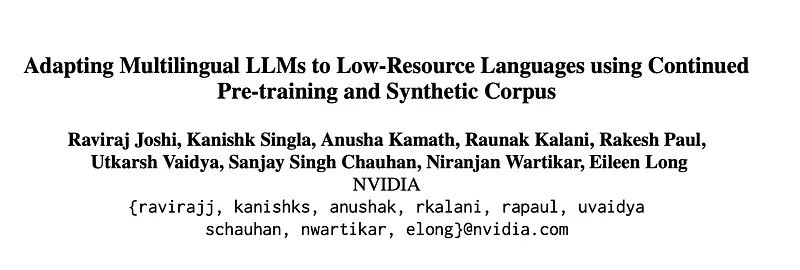
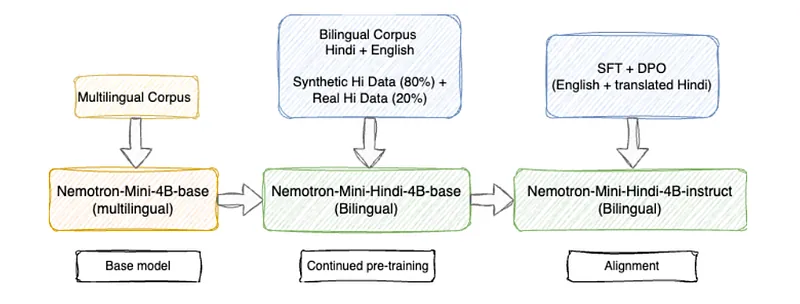
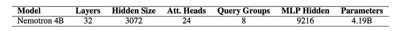
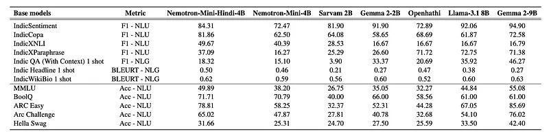
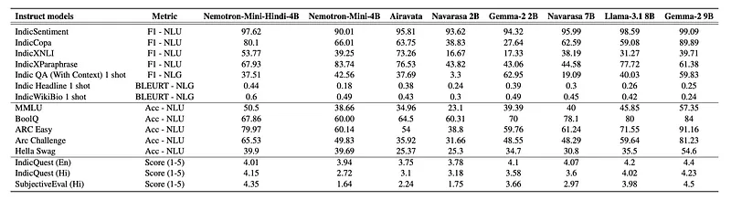
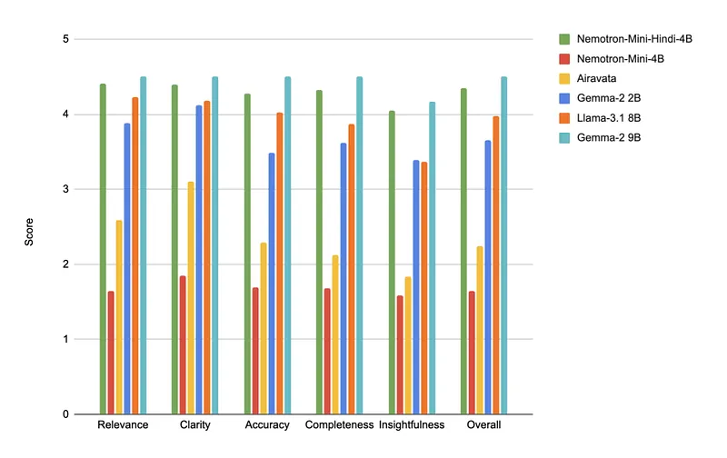
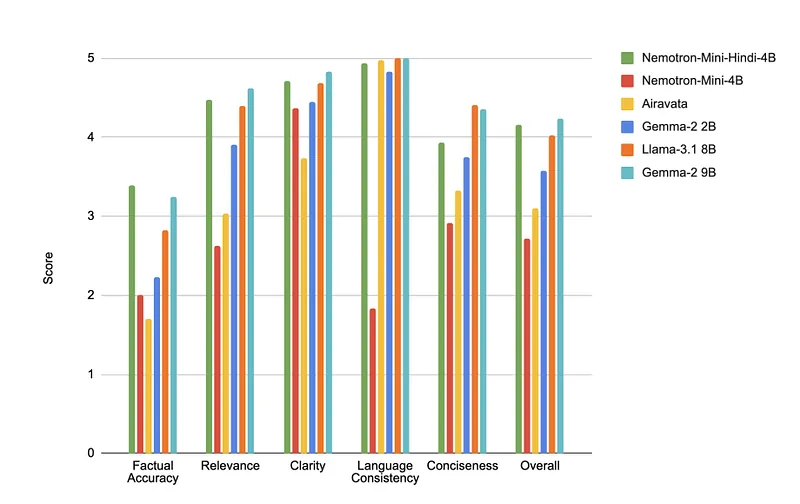
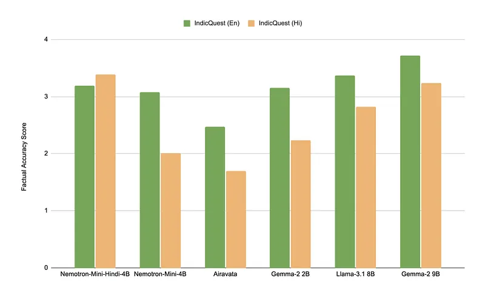
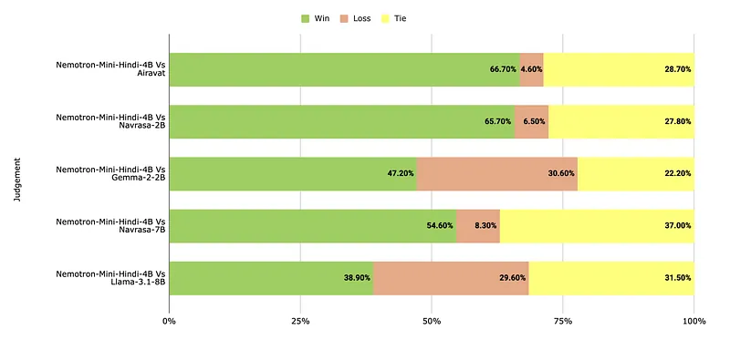

# Papers Explained 252 - Nemotron-Mini-Hindi

Nemotron-Mini-Hindi is a 4B bilingual SLM supporting both Hindi and English, based on Nemotron-Mini 4B.

This page ingests the source article into the wiki and connects it to [[Papers Explained Corpus]], [[Multilingual Models]], [[Large Language Models]], [[Model Compression and Efficiency]], [[Synthetic Data]], [[Reinforcement Learning Topic]], [[Supervised Fine-Tuning]], [[Model Distillation]].

## Source Metadata

- Source file: `raw/2024-11-14_Papers-Explained-252--Nemotron-Mini-Hindi-c7adc3b2f759.md`
- Source title: Papers Explained 252: Nemotron-Mini-Hindi
- Published: 2024-11-14
- Canonical: [https://medium.com/@ritvik19/papers-explained-252-nemotron-mini-hindi-c7adc3b2f759](https://medium.com/@ritvik19/papers-explained-252-nemotron-mini-hindi-c7adc3b2f759)

## Key Ideas

- The models are available on HuggingFace: [Base](https://huggingface.co/nvidia/Nemotron-4-Mini-Hindi-4B-Base/), [Instruct](https://huggingface.co/nvidia/Nemotron-4-Mini-Hindi-4B-Instruct/).
- Recommended Reading [Papers Explained 208: Minitron](https://ritvik19.medium.com/papers-explained-208-minitron-e55ea374d9dd/)
- The Nemotron-Mini-4B model is derived from the Nemotron-15B model using compression techniques such as pruning and distillation. Re-training is performed on this model using a standard causal modeling objective.
- After the SFT stage, the model undergoes a preference-tuning phase using Direct Preference Optimisation (DPO). Approximately 200k English samples and 60k synthetic Hindi samples were used.
- The performance of the Nemotron-Mini-Hindi-4B language model and its instruct model is evaluated on a range of benchmarks including IndicXTREME, IndicNLG, IndicQuest, and translated English benchmarks.

## Notes

Nemotron-Mini-Hindi is a 4B bilingual SLM supporting both Hindi and English, based on Nemotron-Mini 4B. The model emphasize the importance of continued pre- training of multilingual LLMs and the use of translation-based synthetic pre-training corpora for improving LLMs in low-resource languages as it is trained using a mix of real and synthetic Hindi + English tokens, with continuous pre-training performed on 400B tokens.

The models are available on HuggingFace: [Base](https://huggingface.co/nvidia/Nemotron-4-Mini-Hindi-4B-Base/), [Instruct](https://huggingface.co/nvidia/Nemotron-4-Mini-Hindi-4B-Instruct/).

Recommended Reading [Papers Explained 208: Minitron](https://ritvik19.medium.com/papers-explained-208-minitron-e55ea374d9dd/)

## Method

*Figure: Adaptation of multilingual Nemotron-Mini4B model (also known as Minitron-4B).*

The adaptation experiments are conducted using the multilingual Nemotron-Mini-4B model, also known as Minitron-4B. The model undergoes continuous pre-training with an equal mixture of Hindi and English data, consisting of 200B tokens per language. The original Nemotron-4B model was primarily trained on English tokens and had seen only 20B Hindi tokens. Given the limited amount of Hindi data, adapting an existing multilingual model rather than training from scratch is an effective strategy, allowing to leverage the knowledge learned from the pre-trained model.

### Synthetic Data Curation

High-quality English data sources are selected and translated into Hindi using a custom document translation pipeline. This pipeline preserves the document structure, including elements like bullet points and tables, and employs the IndicTrans2 model for sentence translation. However, since the translated data may contain noise, an n-gram language model is used to filter out low-quality samples. This model, trained on MuRIL-tokenized real Hindi data, applies perplexity scores to identify and exclude noisy translations. Around 2% of the documents were discarded post-filtering.

The translated Hindi data comprises approximately 60B tokens. The synthetic data is then combined with around 40 billion real tokens (web-scraped data) to create a dataset totaling 100B Hindi tokens. Additionally, this entire Hindi text is transliterated into Roman script, expanding the total dataset to 220B tokens. The transliterated tokens are included to enable the model to support Hinglish queries. This Hindi data is further combined with 200B English tokens for continued pre-training. Including the English dataset helps prevent catastrophic forgetting of English capabilities and contributes to training stability. Fuzzy deduplication is performed on the entire text to eliminate similar documents.

### Continued Pre-training

*Figure: Architecture details of Nemotron-Mini-4B model.*

The Nemotron-Mini-4B model is derived from the Nemotron-15B model using compression techniques such as pruning and distillation. Re-training is performed on this model using a standard causal modeling objective. This model is referred to as Nemotron-Mini-Hindi-4B, a base model where Hindi is the primary language.

### Model Alignment

The first alignment stage involves Supervised Fine-Tuning (SFT). A general SFT corpus with approximately 200k examples, comprising various tasks as outlined in Nemotron-4 340B, was used. Due to the lack of a high-quality Hindi SFT corpus, English-only data was leveraged for SFT. Additionally, translated English data (filtered using back-translation-based methods) was experimented with for SFT, but no improvements were observed with this addition. The use of the English-only SFT corpus enhances instruction-following capabilities in Hindi, highlighting the cross-lingual transferability of these skills.

After the SFT stage, the model undergoes a preference-tuning phase using Direct Preference Optimisation (DPO). Approximately 200k English samples and 60k synthetic Hindi samples were used. The synthetic Hindi samples were created by translating the English samples and then filtered using back-translation methods. It was observed that incorporating synthetic Hindi samples during this stage improves the overall performance of the model. The aligned model is referred to as Nemotron-Mini-Hindi-4B-Instruct.

## Evaluation

The performance of the Nemotron-Mini-Hindi-4B language model and its instruct model is evaluated on a range of benchmarks including IndicXTREME, IndicNLG, IndicQuest, and translated English benchmarks. Performance was assessed using standard metrics for each benchmark, as well as human evaluations.

*Figure: Performance metrics for various base models across different Hindi tasks. The results are zero-shot unless otherwise specified.*

*Figure: Performance of base models on English Benchmarks.*

- The Nemotron-Mini-Hindi-4B Base model achieved state-of-the-art performance on most benchmarks, outperforming even larger models like Gemma-2–9B and Llama-3.1–8B on over half the benchmarks.

- Hindi-specific continued pre-training significantly improved performance on Hindi tasks.

*Figure: Performance metrics for various instruct models across different Hindi tasks. The results are zero-shot unless otherwise specified.*

The instruct model showed improvements in both English and Hindi compared to the base model on IndicXTREME, IndicNLG, and translated English benchmarks.

*Figure: Comparison of different instruct models on various parameters using SubjectiveEval.*

*Figure: Comparison of different instruct models on various parameters using IndicQuest-Hi.*

*Figure: Comparison of different instruct models on Factuality score of IndicQuest.*

- The instruct model outperformed all baseline models except for Gemma-2–9B on IndicQuest and SubjectiveEval, demonstrating improvements in factuality and language consistency.

*Figure: Results of human evaluation on translated MT-Bench. A win indicates Nemotron-Mini-Hindi-4B model is preferred.*

- Human evaluations consistently preferred responses from the Nemotron-Mini-4B-Hindi model over other models.

## Paper

Adapting Multilingual LLMs to Low-Resource Languages using Continued Pre-training and Synthetic Corpus [2410.14815](https://arxiv.org/abs/2410.14815)

## Figures

Figures from the Medium HTML export (`raw/2024-11-14_Papers-Explained-252--Nemotron-Mini-Hindi-c7adc3b2f759.md`); local copies under `wiki/assets/papers-explained-252-nemotron-mini-hindi/` when download succeeded.

| Figure | Caption |
|--------|---------|
|  | Title card: Nemotron-Mini-Hindi. |
|  | Adaptation of multilingual Nemotron-Mini4B model (also known as Minitron-4B). |
|  | Architecture details of Nemotron-Mini-4B model. |
|  | Performance metrics for various base models across different Hindi tasks. The results are zero-shot unless otherwise specified. |
|  | Performance of base models on English Benchmarks. |
|  | Performance metrics for various instruct models across different Hindi tasks. The results are zero-shot unless otherwise specified. |
|  | Comparison of different instruct models on various parameters using SubjectiveEval. |
|  | Comparison of different instruct models on various parameters using IndicQuest-Hi. |
|  | Comparison of different instruct models on Factuality score of IndicQuest. |
|  | Results of human evaluation on translated MT-Bench. A win indicates Nemotron-Mini-Hindi-4B model is preferred. |
## Related

- [[Papers Explained Corpus]]
- [[Multilingual Models]]
- [[Large Language Models]]
- [[Model Compression and Efficiency]]
- [[Synthetic Data]]
- [[Reinforcement Learning Topic]]
- [[Supervised Fine-Tuning]]
- [[Model Distillation]]
- [[Papers Explained 251 - H2OVL-Mississippi]]
- [[Papers Explained 253 - SPADE]]

#summary #topic
