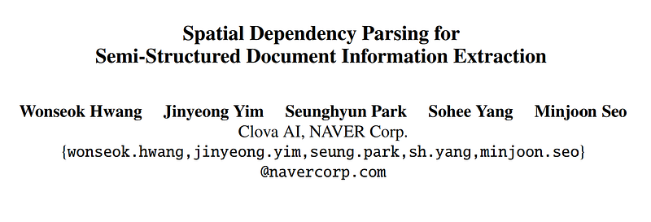
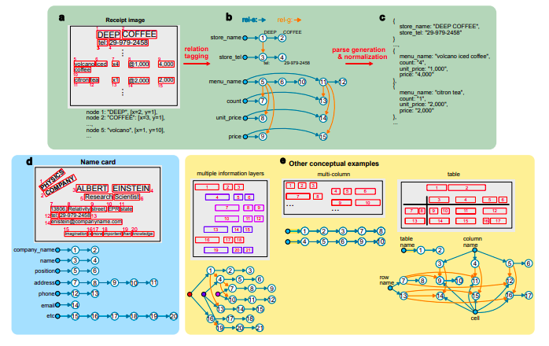
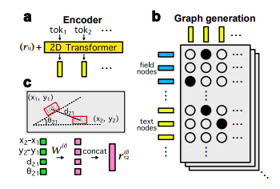
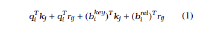
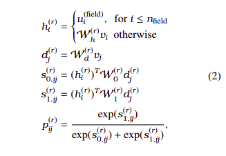
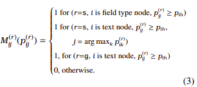
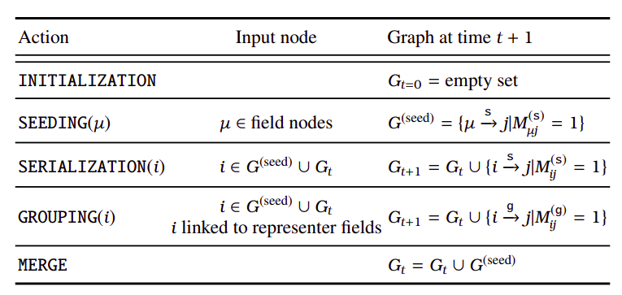

# Papers Explained 253 - SPADE

Information Extraction (IE) for semistructured document images is often approached as a sequence tagging problem by classifying each recognized input token into one of the IOB categories.

This page ingests the source article into the wiki and connects it to [[Papers Explained Corpus]], [[Document AI]], [[Large Language Models]], [[Multilingual Models]], [[Embedding and Retrieval]].

## Source Metadata

- Source file: `raw/2024-11-15_Papers-Explained-253--SPADE-f564ce612501.html`
- Source title: Papers Explained 253: SPADE
- Published: 2024-11-15
- Canonical: [https://medium.com/@ritvik19/papers-explained-253-spade-f564ce612501](https://medium.com/@ritvik19/papers-explained-253-spade-f564ce612501)

## Key Ideas

- To tackle these issues, SPADE (SPAtial DEpendency parser) models highly complex spatial relationships and an arbitrary number of information layers in the documents in an end-to-end manner by formulating the IE task as spatial dependency parsing problem that...
- To better model spatial relationships and hierarchical information structures in semi-structured documents, the IE problem is formulated as a “spatial dependency parsing” task by constructing a dependency graph with tokens and fields as the graph nodes (with...
- Although the spatial layout of semi-structured documents is diverse, it can be considered as the realization of mainly two abstract properties between each pair of nodes, (1) rel-s for the ordering and grouping of tokens belonging to the same information...
- To perform the spatial dependency parsing task introduced in the previous section in an end-to-end fashion, SPADEs consists of
- Spatial text encoder and graph generator are trained jointly. Graph decoder is a deterministic function that maps the graph to a valid parse of the output structure.

## Notes

Information Extraction (IE) for semistructured document images is often approached as a sequence tagging problem by classifying each recognized input token into one of the IOB categories. However, such problem setup has two inherent limitations that it cannot easily handle complex spatial relationships and it is not suitable for highly structured information, which are nevertheless frequently observed in real-world document images.

To tackle these issues, SPADE (SPAtial DEpendency parser) models highly complex spatial relationships and an arbitrary number of information layers in the documents in an end-to-end manner by formulating the IE task as spatial dependency parsing problem that focuses on the relationship among text tokens in the documents.

## Spatial Dependency Parsing

*Figure: The illustration of spatial dependency parsing problem.*

To better model spatial relationships and hierarchical information structures in semi-structured documents, the IE problem is formulated as a “spatial dependency parsing” task by constructing a dependency graph with tokens and fields as the graph nodes (with one node per token and field type).

Although the spatial layout of semi-structured documents is diverse, it can be considered as the realization of mainly two abstract properties between each pair of nodes, (1) rel-s for the ordering and grouping of tokens belonging to the same information category, and (2) rel-g for the inter-group relation between grouped tokens or groups. Connecting a field node to a text node indicates that the text is classified into the field.

## Model

*Figure: The illustration of SPADE*

To perform the spatial dependency parsing task introduced in the previous section in an end-to-end fashion, SPADEs consists of

- spatial text encoder

- graph generator

- graph decoder

Spatial text encoder and graph generator are trained jointly. Graph decoder is a deterministic function that maps the graph to a valid parse of the output structure.

### Spatial Text Encoder

Spatial text encoder is based on 2D Transformer architecture, 12 layers of 2D Transformer encoder are used. The parameters are initialized from bert-multilingual.

Unlike the original Transformer, there is no order among the input tokens, making the model invariant under the permutation of the input tokens. Inspired by Transformer XL, the attention weights (between each key and query vector) is computed by:

where qi is the query vector of the i-th input token, kj is the key vector of the j-th input token, rij is the relative spatial vector of the j-th token with respect to the i-th token, and b key|rel i is a bias vector. In original Transformer, only the first term of Equation 1 is used.

The relative spatial vector rij is constructed as follows. First, the relative coordinates between each pair of tokens are computed. Next, the coordinates are quantized into integers and embedded using sin and cos functions. The physical distance and the relative angle between each pair of the tokens are also embedded in a similar way. Finally, the four embedding vectors are linearly projected and concatenated at each encoder layer.

### Graph Generator

As every token corresponds to a node and each pair of the nodes forms zero or one of the two relations: (1) rel-s for serializing tokens within the same field, and (2) rel-g for inter-grouping between fields. The dependency graph can be represented by using a binary matrix M(r) for each relation type r, where M (r) ij = 1 if their exists a directed edge from the i-th token to the j-th token and 0 otherwise. Each M(r) consists of nfield + ntext number of rows and ntext number of columns where nfield and ntext represent the number of field types and the number of tokens, respectively. The graph generation task now becomes predicting the binary matrix.

M(r) is obtained as follows. The probability that there exists a directed edge i → j, related by r is computed by:

where u (field) i represents the trainable embedding vector of the i-th field type node, {vi} is a set of vectors of contextualized tokens from the enoder, W stands for affine transformation, h is the embedding vector of the head token, and d is that of the dependent token.

M (r) ij is obtained by binarizing p (r) ij as follows:

The recall rate of edges can be controlled by varying the threshold value pth. Here, pth = 0.5.

### Tail Collision Avoidance Algorithm

In Spatial Dependency Graphs, each node typically has only one incoming edge per relation, except for special documents like tables. The algorithm works as follows:

- For nodes with multiple incoming edges, all edges except the one with the highest linking probability are removed.

- For the remaining edges, the head node is connected to the next probable tail node that has a probability larger than a threshold value (pth) and belongs to the top three.

- Steps 1 and 2 are repeated until the process becomes self-consistent or reaches a maximum iteration limit of 20.

By applying this algorithm, loops and token redundancy in parses are prevented.

### Graph Decoder

*Figure: A formal description of the parse decoding process. s and g stand for rel-s and rel-g respectively*

The generated graph is decoded into the final parse through the following three stages:

- SEEDING: In SEEDING, field type nodes are linked to multiple text nodes (seeds) by rel-s.

- SERIALIZATION: In SERIALIZATION, each seed node found in the previous stage generates a directed edge (rel-s) to the next text node recursively until there is no further node to be linked.

- GROUPING: in GROUPING, the serialized texts are grouped iteratively, constructing information layers from the top to the bottom.

The total number of iterations is equal to “the number of information layers−1”. To group texts using directed edges, a special representative field for each information layer is defined. Then, the first token of the representative field generates directed edges to the first token of other fields that belong to the same group using rel-g.

## Paper

Spatial Dependency Parsing for Semi-Structured Document Information Extraction [2005.00642](https://arxiv.org/abs/2005.00642)

Recommended Reading: [Document Information Processing](https://ritvik19.medium.com/list/document-information-processing-3cd900a34972)

## Figures

Figures from the Medium HTML export (`raw/2024-11-15_Papers-Explained-253--SPADE-f564ce612501.html`); local copies under `wiki/assets/papers-explained-253-spade/` when download succeeded.

| Figure | Caption |
|--------|---------|
|  | Title card: SPADE. |
|  | The illustration of spatial dependency parsing problem. |
|  | The illustration of SPADE. |
|  | Unlike the original Transformer, there is no order among the input tokens, making the model invariant under the permutation of the input... |
|  | M(r) is obtained as follows. The probability that there exists a directed edge i → j, related by r is computed by. |
|  | M (r) ij is obtained by binarizing p (r) ij as follows. |
|  | A formal description of the parse decoding process. s and g stand for rel-s and rel-g respectively. |
## Related

- [[Papers Explained Corpus]]
- [[Document AI]]
- [[Large Language Models]]
- [[Multilingual Models]]
- [[Embedding and Retrieval]]
- [[Papers Explained 252 - Nemotron-Mini-Hindi]]
- [[Papers Explained 254 - Pix2Struct]]

#summary #topic
