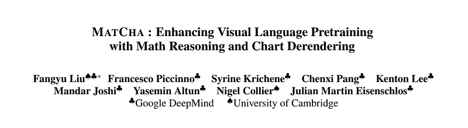
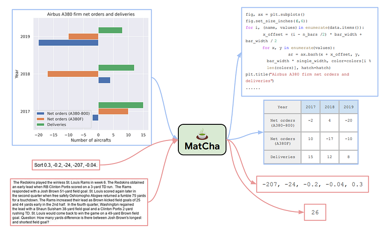
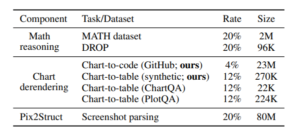
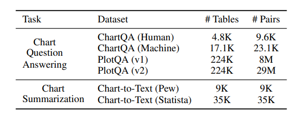
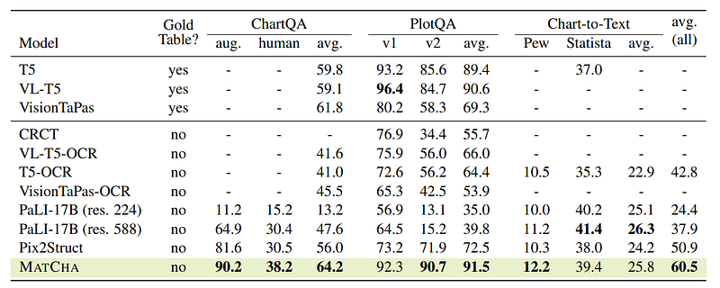
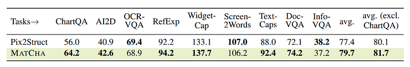

# Papers Explained 255 - Matcha

Matcha (Math reasoning and Chart derendering pretraining) propose several pre-training tasks that cover plot deconstruction and numerical reasoning, starting from Pix2Struct to enhance visual language models’ capabilities in jointly modeling charts/plots and language data.

This page ingests the source article into the wiki and connects it to [[Papers Explained Corpus]], [[Document AI]], [[Reasoning Models]], [[Code Models]], [[Vision Language Models]], [[Synthetic Data]].

## Source Metadata

- Source file: `raw/2024-11-19_Papers-Explained-255--Matcha-d5d5fe66b039.html`
- Source title: Papers Explained 255: Matcha
- Published: 2024-11-19
- Canonical: [https://medium.com/@ritvik19/papers-explained-255-matcha-d5d5fe66b039](https://medium.com/@ritvik19/papers-explained-255-matcha-d5d5fe66b039)

## Key Ideas

- Matcha (Math reasoning and Chart derendering pretraining) propose several pre-training tasks that cover plot deconstruction and numerical reasoning, starting from Pix2Struct to enhance visual language models’ capabilities in jointly modeling charts/plots and...
- In chart derendering, given a chart, the model needs to decode its underlying rendering code or data table. Chart derendering teaches the models layout understanding (including number extraction and their organizations).
- To collect sufficient pre-training data, (chart, code) and (chart, table) pairs are independently accumulated . For (chart, code), all GitHub IPython notebooks with appropriate licenses are crawled and blocks with figures are extracted.
- For (chart, table) pairs, two sources are explored. First is to manually write code for converting web-crawled Wikipedia tables to charts and randomly combining several plotting options.
- The second source is web-crawled chart-table pairs. Websites such as Statista provide both. Chart-table pairs crawled (from ChartQA), containing around 20k pairs in total from four websites: Statista, Pew, Our World in Data, and OECD are also added.

## Notes

Matcha (Math reasoning and Chart derendering pretraining) propose several pre-training tasks that cover plot deconstruction and numerical reasoning, starting from Pix2Struct to enhance visual language models’ capabilities in jointly modeling charts/plots and language data.

*Figure: MATCHA defines two types of pretraining tasks: (1) chart derendering (light blue boxes) and (2) mathematical reasoning (light red boxes).*

## Chart Derendering

In chart derendering, given a chart, the model needs to decode its underlying rendering code or data table. Chart derendering teaches the models layout understanding (including number extraction and their organizations).

To collect sufficient pre-training data, (chart, code) and (chart, table) pairs are independently accumulated . For (chart, code), all GitHub IPython notebooks with appropriate licenses are crawled and blocks with figures are extracted. A figure and the code block right before it are saved as a (chart, code) pair.

For (chart, table) pairs, two sources are explored. First is to manually write code for converting web-crawled Wikipedia tables to charts and randomly combining several plotting options. Besides this synthetic data, chart-table pairs generated (from PlotQA) are also added.

The second source is web-crawled chart-table pairs. Websites such as Statista provide both. Chart-table pairs crawled (from ChartQA), containing around 20k pairs in total from four websites: Statista, Pew, Our World in Data, and OECD are also added.

## Math Reasoning

In math reasoning, given a math question rendered as an image, the model needs to decode its answer. Math reasoning teaches the models numerical reasoning capabilities.

Two existing textual math reasoning datasets, MATH and DROP are used for pretraining. MATH is synthetically created, containing two million training examples per module (type) of questions. DROP is a reading-comprehension-style QA dataset where the input is a paragraph context and a question. DROP has 96k question and answer pairs over 6.7K paragraphs.

## Experimental Setup

Besides the two newly proposed pre-training strategies, to prevent catastrophic forgetting, the screenshot parsing pretraining from Pix2Struct is also applied. The final pretraining task is a mixture of all aforementioned tasks.

*Figure: Mixture rates for all tasks in pretraining and the absolute size of each dataset.*

The mixture rate is used to sample each example within the batch.

## Evaluation

Evaluation datasets included ChartQA, PlotQA, and Chart-to-Text summarization, with different subsets requiring varying levels of reasoning and complexity.

*Figure: Statistics of the finetuning datasets.*

Metrics used were relaxed correctness for ChartQA and PlotQA, and BLEU4 for Chart-to-Text. Pix2Struct experiments followed identical metrics.

### Main Results

*Figure: Main experimental results on two chart QA benchmarks ChartQA & PlotQA and a chart summarization benchmark Chart-to-Text.*

- MATCHA outperformed previous SOTA models across ChartQA, PlotQA, and Chart-to-Text summarization benchmarks, establishing new SOTA performances in several cases.

- In ChartQA, MATCHA exceeded the previous SOTA by 8.2% and performed competitively even against models with access to underlying gold data tables.

- On PlotQA, MATCHA was the best overall, particularly excelling in the v2 set focused on numerical reasoning.

- For Chart-to-Text summarization, MATCHA set new SOTA on Pew but was slightly behind PaLI-17B on Statista.

- MATCHA demonstrated superior performance across all tasks compared to baselines without access to gold tables, outperforming the strongest baseline, Pix2Struct, by approximately 10% on average.

- PaLI, despite being a larger model, underperformed in chart/plot domain tasks due to differences in visual language challenges compared to natural images but performed reasonably well in Chart-to-Text.

### Results on Pix2Struct Tasks

*Figure: MATCHA vs. Pix2Sturct on Pix2Sturct tasks.*

- MATCHA showed an average improvement of 2.3% over Pix2Struct, indicating the transferability of knowledge learned through MATCHA pretraining to other visual language domains.

## Paper

MatCha: Enhancing Visual Language Pretraining with Math Reasoning and Chart Derendering [2212.09662](https://arxiv.org/abs/2212.09662)

Recommended Reading: [Document Information Processing](https://ritvik19.medium.com/list/document-information-processing-3cd900a34972)

## Figures

Figures from the Medium HTML export (`raw/2024-11-19_Papers-Explained-255--Matcha-d5d5fe66b039.html`); local copies under `wiki/assets/papers-explained-255-matcha/` when download succeeded.

| Figure | Caption |
|--------|---------|
|  | Title card: Matcha. |
|  | MATCHA defines two types of pretraining tasks: (1) chart derendering (light blue boxes) and (2) mathematical reasoning (light red boxes). |
|  | Mixture rates for all tasks in pretraining and the absolute size of each dataset. |
|  | Statistics of the finetuning datasets. |
|  | Main experimental results on two chart QA benchmarks ChartQA & PlotQA and a chart summarization benchmark Chart-to-Text. |
|  | MATCHA vs. Pix2Sturct on Pix2Sturct tasks. |
## Related

- [[Papers Explained Corpus]]
- [[Document AI]]
- [[Reasoning Models]]
- [[Code Models]]
- [[Vision Language Models]]
- [[Synthetic Data]]
- [[Papers Explained 254 - Pix2Struct]]
- [[Papers Explained 256 - DePlot]]

#summary #topic
