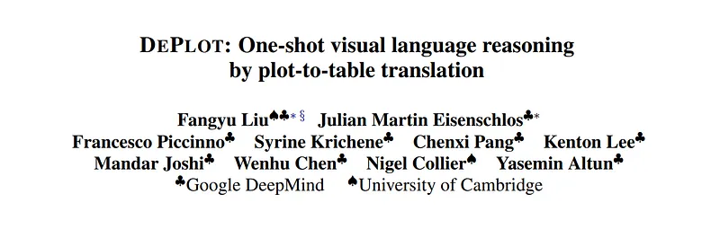
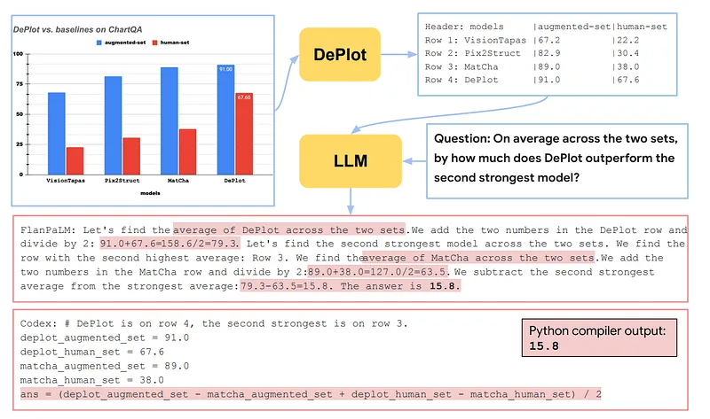
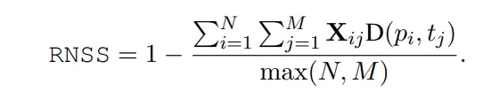
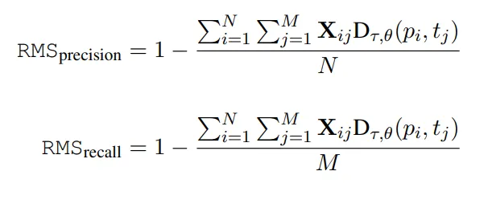
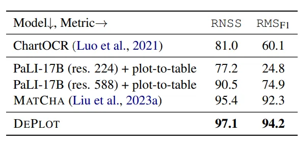
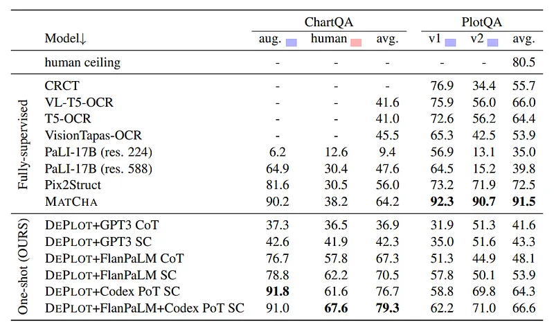

# Papers Explained 256 - DePlot

This paper presents the first few(one)- shot solution to visual language reasoning. It proposes to decompose visual language reasoning into two steps: (1) plot-to-text translation, and (2) reasoning over the translated text.

This page ingests the source article into the wiki and connects it to [[Papers Explained Corpus]], [[Vision Language Models]], [[Document AI]], [[Reasoning Models]], [[Large Language Models]], [[Multilingual Models]].

## Source Metadata

- Source file: `raw/2024-11-20_Papers-Explained-256--DePlot-3e8a02eefc94.md`
- Source title: Papers Explained 256: DePlot
- Published: 2024-11-20
- Canonical: [https://medium.com/@ritvik19/papers-explained-256-deplot-3e8a02eefc94](https://medium.com/@ritvik19/papers-explained-256-deplot-3e8a02eefc94)

## Key Ideas

- The key in this method is a modality conversion module, named as DEPLOT, which translates the image of a plot or chart to a linearized table.
- Relative Number Set Similarity (RNSS) is a metric proposed in ChartQA designed to evaluate the similarity between model-predicted numbers in a table to the numbers in a target table.
- Let the model predicted numbers in table be P = {pi}1≤i≤N and numbers in target tables be T = {tj}1≤j≤M.
- For each pair of predicted number (p) and target number (t), the relative distance (D(p, t) is calculated, with a cap at 1 to limit the impact of very large differences.
- Then the N ×M matrix of distances can be used to find a minimal cost matching between the elements in P and T , expressed in the form of binary matrix X ∈ R^N×M. The final score is computed as

## Notes

This paper presents the first few(one)- shot solution to visual language reasoning. It proposes to decompose visual language reasoning into two steps: (1) plot-to-text translation, and (2) reasoning over the translated text.

The key in this method is a modality conversion module, named as DEPLOT, which translates the image of a plot or chart to a linearized table. The output of DEPLOT can then be directly used to prompt a pretrained large language model (LLM), exploiting the few-shot reasoning capabilities of LLMs.

*Figure: An illustration of the DEPLOT+LLM method.*

## Standardizing the Plot-to-table Task

### Relative Number Set Similarity

Relative Number Set Similarity (RNSS) is a metric proposed in ChartQA designed to evaluate the similarity between model-predicted numbers in a table to the numbers in a target table.

Let the model predicted numbers in table be P = {pi}1≤i≤N and numbers in target tables be T = {tj}1≤j≤M.

For each pair of predicted number (p) and target number (t), the relative distance (D(p, t) is calculated, with a cap at 1 to limit the impact of very large differences.

Then the N ×M matrix of distances can be used to find a minimal cost matching between the elements in P and T , expressed in the form of binary matrix X ∈ R^N×M. The final score is computed as

However, RNSS has limitations, including not accounting for the position of numbers within the table, ignoring non-numeric content, giving credit to high relative errors, and not distinguishing between precision and recall losses in table reconstruction.

### Relative Mapping Similarity (RMS)

Relative Mapping Similarity (RMS) is a metric proposed in this paper designed to evaluate the similarity between two tables by considering them as unordered collections of mappings from row and column headers to a single value. Unlike RNSS, which focuses solely on numeric entries, RMS accounts for both numeric and textual content within tables, aiming to provide a more comprehensive measure of table similarity. The RMS metric also allows the computation of precision, recall, and the F1 score.

The distance between textual is be measured with Normalized Levenshtein Distance, or NLτ where the variable τ is such that values above τ are set to the maximum of 1, in order to prevent partial credit for very dissimilar texts. Therefore the distance of two keys pi and tj is NLτ (p^r ||p^c , t^r ||t^c) where || denotes string concatenation.

The distance between numeric entries is computed using relative distance Dθ(p, t) = min(1, ∥p − t∥/∥t∥) and distances above θ are set to the maximum of 1.

The similarity between two entries can be computed by combining these two entities in a mapping Dτ,θ(p, t) as: (1 − NLτ (p^r ||p^c , t^r ||t^c )) (1 − Dθ (p^v , t^v )).

A similarity matrix with shape N × M in then obtained which can be used to identify the minimal cost matching X ∈ R^N×M. The precision and recall between two full mappings can be computed by calculating the total similarities of the correspondingly matched entries.

The RMSF1 score can be computed the harmonic mean of the precision and recall. Because permutations of columns and rows yield the same set of column header, row header, value entries, the resulting metric is invariant to them. In order to allow for table transpositions, both the table and its transposed version are considered and the one that corresponds to highest RMSF1 score is returned.

### Training Plot-to-table Conversion Models

Deplot is initialised from MatCha and is continued to fine-tune with the task of mapping plots to their underlying data tables. The table is linearized as a textual sequence (markdown format).

The training corpus is a set of parallel plottable pairs collected similar to MatCha - both synthetic data and real world plot-table pairs are combined to form a finetuning corpus. Specifically, three sources of plot-table pairs are used:

- synthetic data generated by Matcha;

- synthetic data generated in PlotQA dataset

- realworld data crawled in ChartQA (sourced from four websites, statista.com, pewresearch. com, ourworldindata.org, and oecd.org.)

The three corpora are mixed with the rate of 1:1:1. DEPLOT is trained for 10k steps with a maximum sequence length of 512.

## Prompting LLMs for Reasoning

Textual prompts are constructed by concatenating the linearized tables and the questions for QA tasks. The typical in-context learning paradigm is followed to prepend a one-shot example before the current prompt. The full prompts use either Chain-of-Thoughts (CoT) or Program-of-Thoughts (PoT).

Besides CoT prompting, combining DEPLOT+LLM with self-consistency (SC), which samples a diverse set of reasoning paths and choose the majority-voted answer instead of relying on one greedily-decoded answer as in CoT is also explored.

In order to simplify performing arithmetic on large numbers, the models were also tested to generate python code that can be passed through an interpreter.

## Evaluation

The performance of DEPLOT in plot-to-table translation and downstream question answering (QA) tasks on chart/plot QA benchmarks is evaluated. Evaluation metrics include RNSS, RMSF1, and exact match accuracy with a 5% tolerance on numerical error.

### Plot-to-Table Translation

*Figure: Benchmarking plot-to-table conversion accuracy on the PlotQA dataset.*

- DEPLOT significantly outperforms baseline methods (ChartOCR, PaLI models, and MATCHA) in plot-to-table conversion accuracy on the PlotQA dataset.

- High input resolution is crucial for chart information extraction, as indicated by the better performance of PaLI-17B (res. 588) compared to its lower-resolution variant.

### Downstream QA Tasks

*Figure: Main experimental results on two plot/chart QA benchmarks ChartQA & PlotQA.*

- DEPLOT combined with LLMs (GPT-3, FlanPaLM, Codex) achieves strong performance on human-written queries in ChartQA, significantly improving over the state-of-the-art MATCHA model.

- The combination of DEPLOT with FlanPaLM and Codex, using self-consistency across chain-of-thought (CoT) and program-of-thought (PoT) predictions, yields the best results.

- DEPLOT+LLM underperforms on synthetic queries from PlotQA compared to MATCHA, highlighting a limitation in handling templatic, synthetic queries and the loss of visual attributes in plot-to-table translation.

## Paper

DePlot: One-shot visual language reasoning by plot-to-table translation [2212.10505](https://arxiv.org/abs/2212.10505)

Recommended Reading: [Document Information Processing](https://ritvik19.medium.com/list/document-information-processing-3cd900a34972)

## Figures

Figures from the Medium HTML export (`raw/2024-11-20_Papers-Explained-256--DePlot-3e8a02eefc94.md`); local copies under `wiki/assets/papers-explained-256-deplot/` when download succeeded.

| Figure | Caption |
|--------|---------|
|  | Title card: DePlot. |
|  | An illustration of the DEPLOT+LLM method. |
|  | Then the N ×M matrix of distances can be used to find a minimal cost matching between the elements in P and T, expressed in the form of... |
|  | However, RNSS has limitations, including not accounting for the position of numbers within the table, ignoring non-numeric content, giving... |
|  | A similarity matrix with shape N × M in then obtained which can be used to identify the minimal cost matching X ∈ R^N×M. |
|  | Benchmarking plot-to-table conversion accuracy on the PlotQA dataset. |
|  | Main experimental results on two plot/chart QA benchmarks ChartQA & PlotQA. |
## Related

- [[Papers Explained Corpus]]
- [[Vision Language Models]]
- [[Document AI]]
- [[Reasoning Models]]
- [[Large Language Models]]
- [[Multilingual Models]]
- [[Papers Explained 255 - Matcha]]
- [[Papers Explained 257 - Nougat]]

#summary #topic
