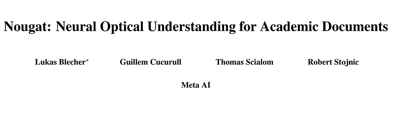
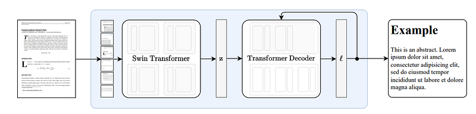
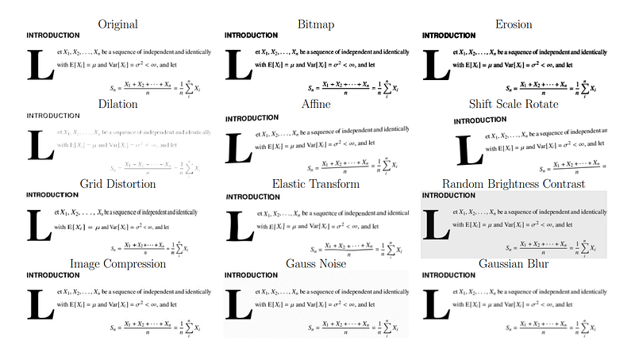
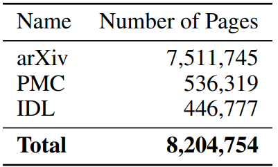
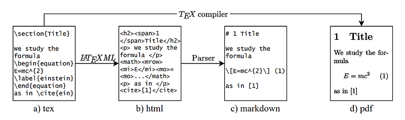
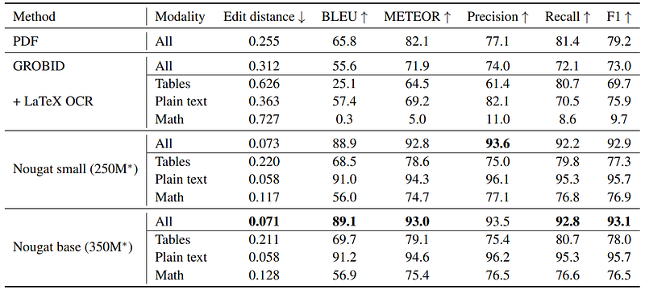

# Papers Explained 257 - Nougat

Nougat (Neural Optical Understanding for Academic Documents) is a Visual Transformer model that performs an Optical Character Recognition (OCR) task for processing scientific documents into a markup language.

This page ingests the source article into the wiki and connects it to [[Papers Explained Corpus]], [[Document AI]], [[Large Language Models]], [[Synthetic Data]], [[Multilingual Models]].

## Source Metadata

- Source file: `raw/2024-11-21_Papers-Explained-257--Nougat-bb304f7af0a3.html`
- Source title: Papers Explained 257: Nougat
- Published: 2024-11-21
- Canonical: [https://medium.com/@ritvik19/papers-explained-257-nougat-bb304f7af0a3](https://medium.com/@ritvik19/papers-explained-257-nougat-bb304f7af0a3)

## Key Ideas

- The model is built on the Donut architecture, hence is a encoder-decoder transformer architecture, that allows for an end-to-end training procedure.
- The encoded image z is decoded into a sequence of tokens using a transformer decoder architecture with cross-attention.
- Following DONUT, mBART is used as a decoder. Galactica’s tokenizer is utilized as it is specialized in the scientific text domain.
- The document images are resized and then padded to achieve the desired input size of (H, W) = (896, 672). The Transformer decoder has a maximal sequence length of S = 4096.
- Certain Image augmentation techniques are used to improve generalization.

## Notes

Nougat (Neural Optical Understanding for Academic Documents) is a Visual Transformer model that performs an Optical Character Recognition (OCR) task for processing scientific documents into a markup language. It offers a promising solution to enhance the accessibility of scientific knowledge in the digital age, by bridging the gap between human readable documents and machine-readable text.

## Model

*Figure: End-to-end architecture*

The model is built on the Donut architecture, hence is a encoder-decoder transformer architecture, that allows for an end-to-end training procedure.

### Encoder

The visual encoder receives a document image x, crops the margins and resizes the image to fit in a fixed rectangle of size (H, W). If the image is smaller than the rectangle, additional padding is added to ensure each image has the same dimensionality. A Swin Transformer is used which is a hierarchical vision transformer that splits the image into non-overlapping windows of fixed size and applies a series of self-attention layers to aggregate information across these windows. The model outputs a sequence of the embedded patches z.

### Decoder

The encoded image z is decoded into a sequence of tokens using a transformer decoder architecture with cross-attention. The tokens are generated in an auto-regressive manner, using self-attention and cross-attention to attend to different parts of the input sequence and encoder output respectively. Finally, the output is projected to the size of the vocabulary v, yielding the logits ℓ.

Following DONUT, mBART is used as a decoder. Galactica’s tokenizer is utilized as it is specialized in the scientific text domain.

### Setup

The document images are resized and then padded to achieve the desired input size of (H, W) = (896, 672). The Transformer decoder has a maximal sequence length of S = 4096. This relatively large sizing is due to the fact that the text of academic research papers can be dense and the syntax for tables in particular is token intensive.

### Data Augmentation

Certain Image augmentation techniques are used to improve generalization.

*Figure: List of the different image augmentation methods used during training on an example snippet form a sample document.*

During training time, perturbations are also added to the ground truth text by randomly replacing tokens. It is found to reduce the collapse into a repeating loop significantly.

## Data

*Figure: Dataset composition*

The dataset was compiled from various sources, including arXiv, PubMed Central (PMC), and the Industry Documents Library (IDL).

*Figure: Data processing*

The source file is converted into HTML which is then converted to Markdown.

### Splitting the pages

The PDF pages were split based on page breaks, and each page was converted into an image. Page breaks were determined heuristically using text matching, and figures/tables were handled separately.

A Bag of Words model was used to match text lines from PDFs to source code paragraphs, predicting page numbers. The goal was to find the best boundaries.

After initial splitting, a fuzzy matching technique was used to find the exact position within a paragraph for page breaks. This involved comparing text near the predicted splitting position with adjacent text.

### Ground truth artifacts

Due to preprocessing and splitting, the source code markup may contain artifacts and unsupported package commands. In PMC papers, inline math and display math equations in image format posed challenges.

Despite these issues, the large number of training samples compensates for small errors, ensuring that the dataset is valuable for training models.

## Evaluation

The following metrics are reported:

- Edit distance: measures the number of character manipulations (insertions, deletions, substitutions) it takes to get from one string to another. In this work the normalized edit distance is considered , where we divide by the total number of characters.

- BLEU: computes a score based on the number of matching n-grams between the candidate and reference sentence.

- METEOR: a machine-translating metric with a focus on recall instead of precision.

- F-measure: the regulare F1-score precision and recall.

*Figure: Results on arXiv test set*

- As expected, the mathematical expressions have the worst agreement with the ground truth.

- GROBID’s output format is XML, which is converted into a compatible markup language.

- GROBID mislabels small inline expressions as text, affecting equation prediction accuracy.

- Performance of embedded PDF text is better than GROBID.

### Repetitions during Inference

- Model sometimes repeats the same sentence, especially in out-of-domain documents.

- Known problem with Transformer-based models when sampled with greedy decoding.

- Model may alternate between two sentences with minor changes.

- Anti-repetition augmentation introduced during training to handle wrongly predicted tokens.

- Significant reduction in repetitions observed, especially in out-of-domain documents.

- Repetition detection involves analyzing logit values and using heuristics based on variances.

## Paper

Nougat: Neural Optical Understanding for Academic Documents [2308.13418](https://arxiv.org/abs/2308.13418)

Recommended Reading: [Document Information Processing](https://ritvik19.medium.com/list/document-information-processing-3cd900a34972)

## Figures

Figures from the Medium HTML export (`raw/2024-11-21_Papers-Explained-257--Nougat-bb304f7af0a3.html`); local copies under `wiki/assets/papers-explained-257-nougat/` when download succeeded.

| Figure | Caption |
|--------|---------|
|  | Title card: Nougat. |
|  | End-to-end architecture. |
|  | List of the different image augmentation methods used during training on an example snippet form a sample document. |
|  | Dataset composition. |
|  | Data processing. |
|  | Results on arXiv test set. |
## Related

- [[Papers Explained Corpus]]
- [[Document AI]]
- [[Large Language Models]]
- [[Synthetic Data]]
- [[Multilingual Models]]
- [[Papers Explained 256 - DePlot]]
- [[Papers Explained 258 - GeoLayoutLM]]

#summary #topic
