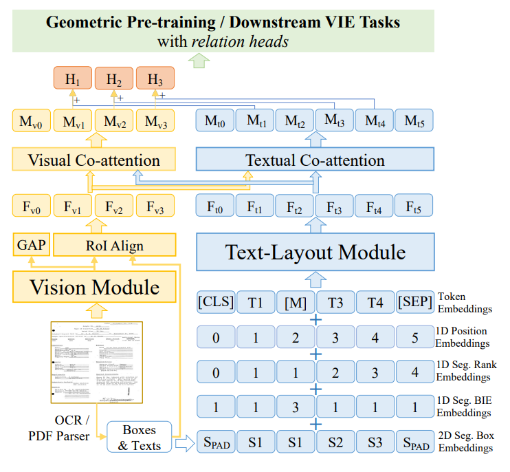
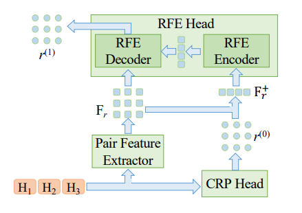
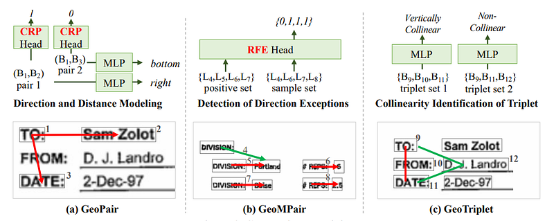
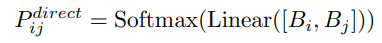
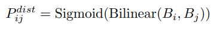
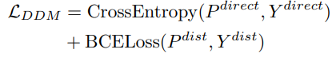
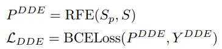
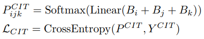
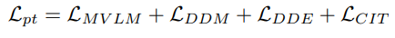
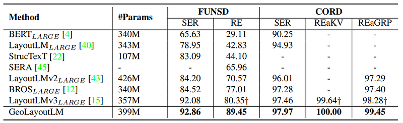

# Papers Explained 258 - GeoLayoutLM

Visual information extraction (VIE) is divided into two tasks: semantic entity recognition (SER) and relation extraction (RE). Most of the existing models learn the geometric representation in an implicit way, which has been found insufficient for the RE.

This page ingests the source article into the wiki and connects it to [[Papers Explained Corpus]], [[Embedding and Retrieval]], [[Document AI]], [[Large Language Models]], [[Model Compression and Efficiency]], [[Computer Vision]], [[Supervised Fine-Tuning]].

## Source Metadata

- Source file: `raw/2024-11-22_Papers-Explained-258--GeoLayoutLM-f581eec8c8a2.html`
- Source title: Papers Explained 258: GeoLayoutLM
- Published: 2024-11-22
- Canonical: [https://medium.com/@ritvik19/papers-explained-258-geolayoutlm-f581eec8c8a2](https://medium.com/@ritvik19/papers-explained-258-geolayoutlm-f581eec8c8a2)

## Key Ideas

- GeoLayoutLM tackle these issues as it explicitly models the geometric relations in pre-training, called geometric pre-training.
- The backbone of GeoLayoutLM is composed of an independent vision module, a text-layout module, and interactive visual and text co-attention layers.
- The text embeddings are the summation of 5 embeddings, including the token embeddings, 1D position embeddings, 1D segment rank embeddings, 1D segment BIE embeddings and 2D segment box embeddings.
- The semantic entity recognition (SER) in VIE is usually modeled as a token classification problem. Learning a simple MLP classifier is effective for SER.
- Two relation heads are proposed, including a Coarse Relation Prediction (CPR) head and a novel Relation Feature Enhancement (RFE) head, to enhance the relation feature representation for both relation pre-training and RE fine-tuning.

## Notes

Visual information extraction (VIE) is divided into two tasks: semantic entity recognition (SER) and relation extraction (RE). Most of the existing models learn the geometric representation in an implicit way, which has been found insufficient for the RE. Another factor that limits the performance of RE lies in the objective gap between the pre-training phase and the finetuning phase for RE.

GeoLayoutLM tackle these issues as it explicitly models the geometric relations in pre-training, called geometric pre-training. Additionally, novel relation heads, which are pre-trained by the geometric pre-training tasks and fine-tuned for RE, are elaborately designed to enrich and enhance the feature representation.

## Model Architecture

### Backbone

The backbone of GeoLayoutLM is composed of an independent vision module, a text-layout module, and interactive visual and text co-attention layers. The vision module takes the document image as input, and the text-layout module is fed with layout-related text embeddings.

The text embeddings are the summation of 5 embeddings, including the token embeddings, 1D position embeddings, 1D segment rank embeddings, 1D segment BIE embeddings and 2D segment box embeddings.

The output feature of the vision module is processed by the global average pooling and RoI align to compute the global visual feature Fv0 and the n visual segment features {Fvi|i ∈ [1, n]}. Then the visual co-attention module takes {Fvi} as query and {Fti} from the text-layout module as key and value for attention calculation, and outputs the fused visual features {Mvi}. The fused textual features {Mti} are calculated in a similar way. Finally, Mvi and the corresponding first token feature of the segment Mt,b(i) are added to obtain the i-th segment feature Hi .

### Relation Heads

*Figure: Relation heads*

The semantic entity recognition (SER) in VIE is usually modeled as a token classification problem. Learning a simple MLP classifier is effective for SER. In the relation extraction (RE) of VIE, the final relation matrix was usually produced by a single linear or bilinear layer. Considering that the relationships among text segments are relatively complex and interconnected, a simple linear or bilinear layer is insufficient for modeling relations.

Two relation heads are proposed, including a Coarse Relation Prediction (CPR) head and a novel Relation Feature Enhancement (RFE) head, to enhance the relation feature representation for both relation pre-training and RE fine-tuning.

The RFE head is a lightweight transformer consisting of a standard encoder layer, a modified decoder layer that discards the self-attention layer for computation efficiency, and a fully-connected layer followed by the sigmoid activation.

The text-segment features {Hi} are fed into the CRP head (a bilinear layer) to predict a coarse relation matrix r (0). To build the relation features Fr, the segment feature pairs are passed to a pair feature extractor (linearly mapping the concatenated paired features). Then positive relation features F + r are selected based on r (0). Note that F + r probably has some false positive relation features since r (0) is the coarse prediction. F + r is then fed into the RFE encoder to capture the internal pattern of the true positive relations in each document sample, which is based on the assumption that most of the predicted positive pairs in r (0) are true. All the relation features Fr and the memory from the RFE encoder are fed into the RFE decoder to compute the final relation matrix r (1) .

### Implementation Details

The vision module is composed of a ConvNeXt and a multiscale FPN. BROS is used as our text-layout module. The visual and textual co-attention modules are both equipped with a transformer decoder layer.

The document images are resized to 768 × 768. The embedding size and feed-forward size of the co-attention module are 1024 and 4096 respectively. In the RFE head, the relation feature size and feed-forward size are both set to 1024. The number of attention heads is 2.

## Pre-training

GeoLayoutLM is pre-trained with four self-supervised tasks simultaneously. To learn multimodal contextualaware text representations, the widely-used Masked VisualLanguage Model (MVLM) is adopted on both {Fti} and {Mti}.

To better represent document layout by geometric information, three geometric relationships are introduced, which are GeoPair, GeoMPair and GeoTriplet. The relation between two text-segments (a pair) is denoted as GeoPair.

GeoPair is further extended to GeoMPair that is the relation among multiple segment pairs, to explore the relation of relations.

GeoTriplet is devised as the relation among three text-segments.

The inputs are text-segments features {Bi} which can be either of the five features: {Hi}, {Mvi}, {Fvi}, {Mt,b(i)}, {Ft,b(i)}, where b(i) is the index of the first token of the i-th segment.

Following the LayoutLM series, the model is pretrained on the IIT-CDIP Test Collection 1.0

*Figure: Geometric Pretraining*

### Direction and Distance Modeling for GeoPair

To better understand the relative position relationship of two textsegments. 9 directions are considered, including 8 neighbor ones and the overlapping. Hence, the direction modeling is exactly a 9-direction classification problem:

The distance between two segments is defined as the minimum distance between the two bounding boxes. The distance is modeled as a binary classification problem that is to identify whether the j-th text-segment is the nearest to the i-th one in their direction.

The loss function L_DDM of DDM task is defined as:

### Detection of Direction Exceptions for GeoMPair

The relationships within a certain document area usually have some common geometric attributes. The DDE task is to discriminate segment pairs whether their directions are exceptional in a sample set S. A direction is regarded as an exception if the pairs with the direction have a minor ratio in the given positive set Sp

### Collinearity Identification of Triplet for GeoTriplet

The geometric alignment of segments is an important expression of document layout, which is meaningful and involves the relation of multiple segments.

Given three text-segments Bi , Bj and Bk, if the direction from Bi to Bj , Bj to Bk and Bi to Bk are the same or antiphase, they are collinear; otherwise non-collinear.

The full pre-training objective of GeoLayoutLM is:

## Evaluation

*Figure: Comparison with existing models that explore both SER & RE.*

- GeoLayoutLM achieves the best F1 score in both semantic entity recognition (SER) and relation extraction (RE) compared to previous state-of-the-art models.

- For the FUNSD SER task, GeoLayoutLM and LayoutLMv3 significantly outperform other models.

- Geometric pre-training is shown to be slightly more favorable than text-image alignment for SER tasks.

- GeoLayoutLM outperforms the previous state-of-the-art by 9.1% on FUNSD for the RE task, demonstrating its superiority in extracting relations.

- Even with only 100 epochs of fine-tuning, GeoLayoutLM achieves high performance (SER: 92.24%, RE: 88.80%) on FUNSD.

- GeoLayoutLM has a slightly heavier backbone due to the two-tower encoder, while LayoutLMv3 has fewer parameters and a coupling feature encoder.

- The relation head used in LayoutLMv3 is the same as the CPR head in GeoLayoutLM.

- The proposed RFE head in GeoLayoutLM constitutes only 3.5% of the total parameters.

## Paper

GeoLayoutLM: Geometric Pre-training for Visual Information Extraction [2304.10759](https://arxiv.org/abs/2304.10759)

Recommended Reading: [Document Information Processing](https://ritvik19.medium.com/list/document-information-processing-3cd900a34972)

## Figures

Figures from the Medium HTML export (`raw/2024-11-22_Papers-Explained-258--GeoLayoutLM-f581eec8c8a2.html`); local copies under `wiki/assets/papers-explained-258-geolayoutlm/` when download succeeded.

| Figure | Caption |
|--------|---------|
|  | Title card: GeoLayoutLM. |
|  | GeoLayoutLM tackle these issues as it explicitly models the geometric relations in pre-training, called geometric pre-training. |
|  | Relation heads. |
|  | Geometric Pretraining. |
|  | To better understand the relative position relationship of two textsegments. |
|  | The loss function L_DDM of DDM task is defined as. |
|  | The loss function L_DDM of DDM task is defined as. |
|  | The relationships within a certain document area usually have some common geometric attributes. |
|  | The full pre-training objective of GeoLayoutLM is. |
|  | The full pre-training objective of GeoLayoutLM is. |
|  | Comparison with existing models that explore both SER & RE. |
## Related

- [[Papers Explained Corpus]]
- [[Embedding and Retrieval]]
- [[Document AI]]
- [[Large Language Models]]
- [[Model Compression and Efficiency]]
- [[Computer Vision]]
- [[Supervised Fine-Tuning]]
- [[Papers Explained 257 - Nougat]]
- [[Papers Explained 259 - OmniParser]]

#summary #topic
