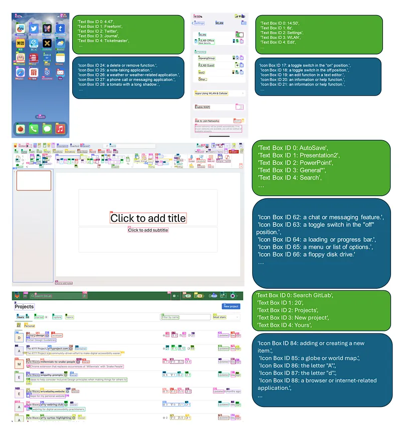
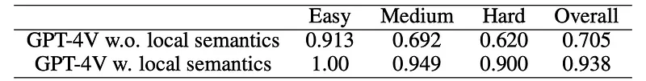
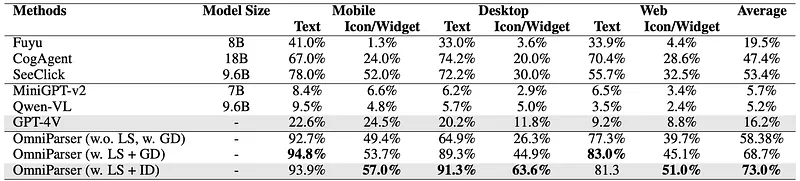
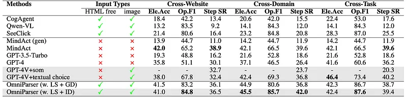
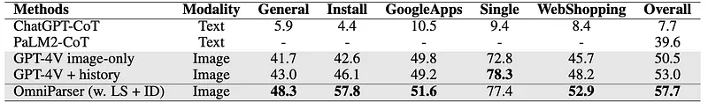
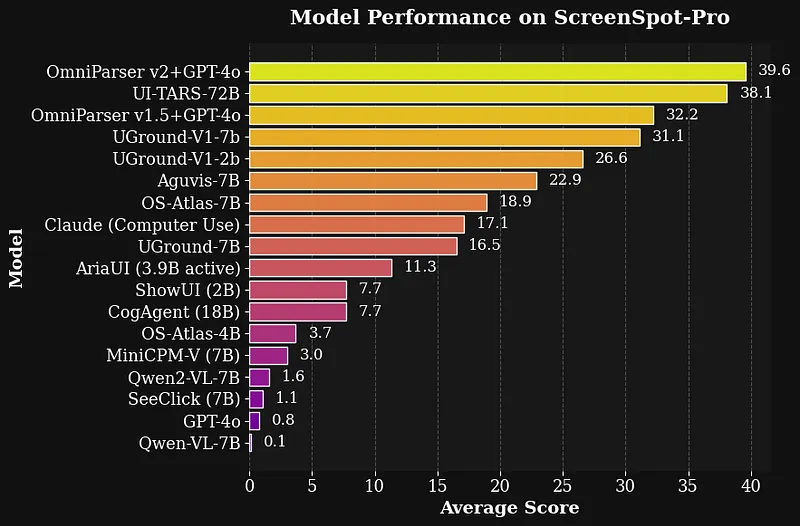

# Papers Explained 259 - OmniParser

VLMs struggle to effectively interact with user interfaces due to the lack of robust screen parsing techniques. These techniques are crucial for:

This page ingests the source article into the wiki and connects it to [[Papers Explained Corpus]], [[Evaluation and Benchmarks]], [[Large Language Models]], [[Document AI]].

## Source Metadata

- Source file: `raw/2024-11-26_Papers-Explained-259--OmniParser-2e895f6f2c15.md`
- Source title: Papers Explained 259: OmniParser
- Published: 2024-11-26
- Canonical: [https://medium.com/@ritvik19/papers-explained-259-omniparser-2e895f6f2c15](https://medium.com/@ritvik19/papers-explained-259-omniparser-2e895f6f2c15)

## Key Ideas

- Identifying interactable icons: Accurately recognizing icons that users can click or interact with.
- Understanding element semantics: Determining the function and purpose of various elements within a screenshot.
- Associating actions with regions: Linking intended actions to specific regions on the screen for accurate execution.
- OmniParser tackles these challenges by parsing user interface screenshots into structured elements, significantly enhancing the ability of GPT-4V to generate actions grounded in the interface.
- The model is available on [HuggingFace](https://huggingface.co/microsoft/OmniParser).

## Notes

VLMs struggle to effectively interact with user interfaces due to the lack of robust screen parsing techniques. These techniques are crucial for:

- Identifying interactable icons: Accurately recognizing icons that users can click or interact with.

- Understanding element semantics: Determining the function and purpose of various elements within a screenshot.

- Associating actions with regions: Linking intended actions to specific regions on the screen for accurate execution.

OmniParser tackles these challenges by parsing user interface screenshots into structured elements, significantly enhancing the ability of GPT-4V to generate actions grounded in the interface.

The model is available on [HuggingFace](https://huggingface.co/microsoft/OmniParser).

## Method

The task can usually be broken down into

- understanding the UI screen in the current step, i.e. analyzing what is the screen content overall, what are the functions of detected icons that are labeled with numeric ID,

- predicting what is the next action on the current screen that is likely to help complete the whole task.

OmniParser integrates the outputs from a fine tuned interactable icon detection model, a fine tuned icon description model, and an OCR module. This combination produces a structured, DOM-like representation of the UI and a screenshot overlaid with bounding boxes for potential interactable elements.

### Interactable Region Detection

Instead of directly prompting GPT-4V to predict the xy coordinate value of the screen that it should operate on, the Set-of-Marks approach is used to overlay bounding boxes of interactable icons on top of a UI screenshot, and ask GPT-4V to generate the bounding box ID to perform action on. A detection model is fine-tuned to extract interactable icons/buttons.

Specifically, a dataset of interactable icon detection is curated, containing 67k unique screenshot images, each labeled with bounding boxes of interactable icons derived from the DOM tree. A 100k uniform sample of popular publicly available URLs on the web is taken, and bounding boxes of interactable regions of the webpage are collected from the DOM tree of each URL.

Apart from interactable region detection, an OCR module is used to extract bounding boxes of texts. Then, the bounding boxes from the OCR detection module and icon detection module are merged while removing boxes that have high overlap (over 90% is used as a threshold). For every bounding box, a unique ID is labeled next to it using a simple algorithm to minimize the overlap between numeric labels and other bounding boxes.

### Incorporating Local Semantics of Functionality

Local semantics of functionality are incorporated into the prompt. For each icon detected by the interactable region detection model, a fine-tuned model generates a description of the icon’s functionality. For each text box, the detected text and its label are used. To the best of knowledge, there is no public model specifically trained for up-to-date UI icon description, and suitable for providing fast and accurate local semantics for the UI screenshot. Therefore, a dataset of 7k icon-description pairs is curated using GPT-4o, and a BLIP-v2 model is fine-tuned on this dataset. After finetuning, the model is found to be much more reliable in its description of common app icons.

## Evaluation

### Evaluation on SeeAssign Task

To evaluate the ability of GPT-4v models to accurately predict bounding box IDs based on task descriptions and screenshot images, a manually curated dataset called SeeAssign is created, containing 112 tasks with descriptions and screenshots. GPT-4v is prompted to predict the bounding box ID corresponding to the task description. The dataset is divided into three difficulty levels based on the number of bounding boxes.

*Figure: Comparison of GPT-4V with and without local semantics*

- GPT-4v struggled to accurately assign bounding box IDs, particularly when there were many bounding boxes on the screen.

- Adding local semantics, such as text within bounding boxes and short icon descriptions, significantly improved GPT-4v’s performance (from 0.705 to 0.938 accuracy).

- Without descriptions of the referred icons in the task prompt, GPT-4v often hallucinated responses, failing to link the task requirement to the correct icon ID.

- Providing fine-grained local semantics in the prompt helped GPT-4v accurately identify the correct icon ID.

### Evaluation on ScreenSpot

OmniParsers’s performance is evaluated on the ScreenSpot dataset, comparing it to GPT-4V baseline and other models like SeeClick, CogAgent, and Fuyu. The impact of incorporating local semantics (OCR text and icon descriptions) and a fine-tuned interactable region detection (ID) model is also evaluated.

*Figure: Comparison of different approaches on ScreenSpot Benchmark.*

- OmniParser significantly outperforms the GPT-4V baseline across mobile, desktop, and web platforms.

- OmniParser surpasses models specifically fine-tuned on GUI datasets by a large margin.

- Incorporating local semantics further improves OmniParser performance.

- The fine-tuned ID model improves overall accuracy by 4.3% compared to using the raw Grounding DINO model.

### Evaluation on Mind2Web

*Figure: Comparison of different methods across various categories on Mind2Web benchmark.*

- OmniParser, when augmented with GPT-4V, outperforms all other models using only UI screenshots.

- OmniParser significantly outperforms GPT-4V+SOM in Cross-Website and Cross-Domain categories (+4.1% and +5.2% respectively).

- While OmniParser slightly underperforms GPT-4V+textual choices in the Cross-Task category (-0.8%), it demonstrates superior performance in other categories.

- OmniParser achieves better results than GPT-4V using raw grounding DINO model (w. LS + GD) in all categories when augmented with local semantics of icon functionality and a fine tuned interactable region detection model (w. LS + ID).

### Evaluation on AITW

*Figure: Comparison of different methods across various tasks and overall performance in AITW benchmark.*

- Replacing IconNet with the fine tuned ID model and incorporating LS significantly improved OmniParser performance across most subcategories of the AITW benchmark.

- OmniParser achieved a 4.7% increase in the overall score compared to the best-performing GPT-4V + history baseline.

## OmniParser V2

OmniParser V2 builds upon its predecessor with several key enhancements:

- Increased Accuracy: Improved detection of smaller interactable elements, leading to more precise interactions.

- Faster Inference: Reduced latency by 60% compared to the previous version, achieved by decreasing the image size used by the icon caption model.

- Enhanced Training Data: Trained with a larger dataset of interactive element detection data and icon functional caption data, contributing to its improved performance.

These improvements have resulted in state-of-the-art performance, demonstrated by achieving a 39.6 average accuracy on the ScreenSpot Pro grounding benchmark, a significant improvement over GPT-4o’s original score of 0.8. This benchmark is particularly challenging due to its high-resolution screens and small target icons.

The model is available at [HuggingFace](https://huggingface.co/microsoft/OmniParser-v2.0/).

### OmniTool

To facilitate experimentation with different agent settings, OmniTool, a dockerized Windows system, has been developed. It integrates a suite of tools for agents and allows OmniParser to be used with various LLMs, including:

- OpenAI (4o/o1/o3-mini)

- DeepSeek (R1)

- Qwen (2.5VL)

- Anthropic (Sonnet)

OmniTool combines screen understanding, grounding, action planning, and execution steps. It is available at [GitHub](https://github.com/microsoft/OmniParser/tree/master/omnitool/).

## Paper

OmniParser for Pure Vision Based GUI Agent [2408.00203](https://arxiv.org/abs/2408.00203)

[OmniParser V2: Turning Any LLM into a Computer Use Agent](https://www.microsoft.com/en-us/research/articles/omniparser-v2-turning-any-llm-into-a-computer-use-agent/)

## Figures

Figures from the Medium HTML export (`raw/2024-11-26_Papers-Explained-259--OmniParser-2e895f6f2c15.md`); local copies under `wiki/assets/papers-explained-259-omniparser/` when download succeeded.

| Figure | Caption |
|--------|---------|
|  | Title card: OmniParser. |
|  | The model is available on HuggingFace. |
|  | Comparison of GPT-4V with and without local semantics. |
|  | Comparison of different approaches on ScreenSpot Benchmark. |
|  | Comparison of different methods across various categories on Mind2Web benchmark. |
|  | Comparison of different methods across various tasks and overall performance in AITW benchmark. |
|  | OmniParser V2 builds upon its predecessor with several key enhancements. |
## Related

- [[Papers Explained Corpus]]
- [[Evaluation and Benchmarks]]
- [[Large Language Models]]
- [[Document AI]]
- [[Papers Explained 258 - GeoLayoutLM]]
- [[Papers Explained 260 - GSM-Symbolic]]

#summary #topic
