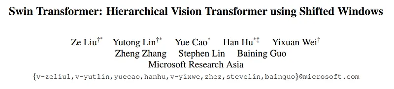
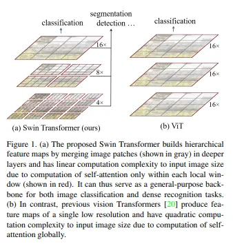
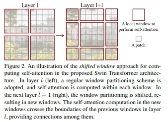
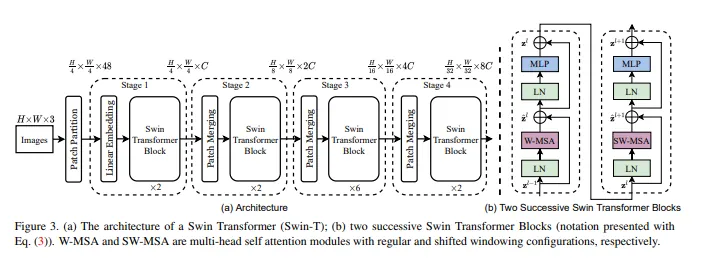

# Papers Explained 26 - Swin Transformer

Swin Transformer constructs a hierarchical representation by starting from small-sized patches and gradually merging neighboring patches in deeper Transformer layers.

This page ingests the source article into the wiki and connects it to [[Papers Explained Corpus]], [[Large Language Models]], [[Computer Vision]], [[Embedding and Retrieval]].

## Source Metadata

- Source file: `raw/2023-02-09_Papers-Explained-26--Swin-Transformer-39cf88b00e3e.md`
- Source title: Papers Explained 26: Swin Transformer
- Published: 2023-02-09
- Canonical: [https://medium.com/@ritvik19/papers-explained-26-swin-transformer-39cf88b00e3e](https://medium.com/@ritvik19/papers-explained-26-swin-transformer-39cf88b00e3e)

## Key Ideas

- A key design element of Swin Transformer is its shift of the window partition between consecutive self-attention
layers. The shifted windows bridge the windows of the preceding layer, providing connections among them that significantly enhance modeling power
- It first splits an input RGB image into non-overlapping patches by a patch splitting module, like ViT. Each patch is
treated as a “token” and its feature is set as a concatenation of the raw pixel RGB values.
- Several Transformer blocks with modified self-attention computation (Swin Transformer blocks) are applied on these patch tokens.
- To produce a hierarchical representation, the number of tokens is reduced by patch merging layers as the network gets deeper.
- This reduces the number of tokens by a multiple of 2×2 = 4 (2× downsampling of resolution), and the output dimension is set to 2C. Swin Transformer blocks are applied afterwards for feature transformation, with the resolution kept at H / 8 × W / 8.

## Notes

Swin Transformer constructs a hierarchical representation by starting from small-sized patches and gradually merging neighboring patches in deeper Transformer layers. With these hierarchical feature maps, the Swin Transformer model can conveniently leverage advanced techniques for dense prediction such as feature pyramid networks (FPN) or U-Net.

A key design element of Swin Transformer is its shift of the window partition between consecutive self-attention
layers. The shifted windows bridge the windows of the preceding layer, providing connections among them that significantly enhance modeling power

## Architecture

It first splits an input RGB image into non-overlapping patches by a patch splitting module, like ViT. Each patch is
treated as a “token” and its feature is set as a concatenation of the raw pixel RGB values. In the original implementation, we use a patch size of 4 × 4 and thus the feature dimension of each patch is 4 × 4 × 3 = 48. A linear embedding layer is applied on this raw-valued feature to project it to an arbitrary dimension (denoted as C).

Several Transformer blocks with modified self-attention computation (Swin Transformer blocks) are applied on these patch tokens. The Transformer blocks maintain the number of tokens ( H / 4 × W / 4), and together with the linear embedding are referred to as “Stage 1”.

To produce a hierarchical representation, the number of tokens is reduced by patch merging layers as the network gets deeper. The first patch merging layer concatenates the features of each group of 2 × 2 neighboring patches, and applies a linear layer on the 4C-dimensional concatenated features.

This reduces the number of tokens by a multiple of 2×2 = 4 (2× downsampling of resolution), and the output dimension is set to 2C. Swin Transformer blocks are applied afterwards for feature transformation, with the resolution kept at H / 8 × W / 8. This first block of patch merging and feature transformation is denoted as “Stage 2”.

The procedure is repeated twice, as “Stage 3” and “Stage 4”, with output resolutions of H / 16 × W / 16 and H / 32 × W / 32 , respectively. These stages jointly produce a hierarchical representation, with the same feature map resolutions as those of typical convolutional networks

Swin Transformer block

Swin Transformer is built by replacing the standard multi-head self attention (MSA) module in a Transformer block by a module based on shifted windows, with other layers kept the same. A Swin Transformer block consists of a shifted window based MSA module, followed by a 2-layer MLP with GELU nonlinearity in between. A LayerNorm (LN) layer is applied before each MSA module and each MLP, and a residual connection is applied after each module.

## Experiments

- Image Classification on ImageNet-1K

- Regular ImageNet-1K training

- Pre-training on ImageNet-22K and fine-tuning on ImageNet-1K

- Object Detection on COCO 2017

- Semantic Segmentation on ADE20K

## Paper

Swin Transformer: Hierarchical Vision Transformer using Shifted Windows [2103.14030](https://arxiv.org/abs/2103.14030)

Recommended Reading [Vision Transformers](https://ritvik19.medium.com/list/vision-transformers-61e6836230f1)

## Figures

Figures from the Medium HTML export (`raw/2023-02-09_Papers-Explained-26--Swin-Transformer-39cf88b00e3e.md`); local copies under `wiki/assets/papers-explained-26-swin-transformer/` when download succeeded.

| Figure | Caption |
|--------|---------|
|  | Title card: Swin Transformer. |
|  | A key design element of Swin Transformer is its shift of the window partition between consecutive self-attention layers. |
|  | A key design element of Swin Transformer is its shift of the window partition between consecutive self-attention layers. |
|  | A key design element of Swin Transformer is its shift of the window partition between consecutive self-attention layers. |
## Related

- [[Papers Explained Corpus]]
- [[Large Language Models]]
- [[Computer Vision]]
- [[Embedding and Retrieval]]
- [[Papers Explained 25 - Vision Transformers]]
- [[Papers Explained 27 - BEiT]]

#summary #topic
