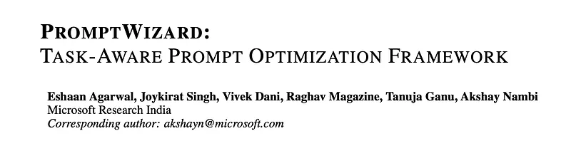
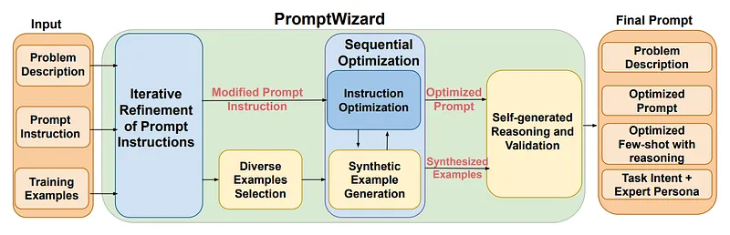
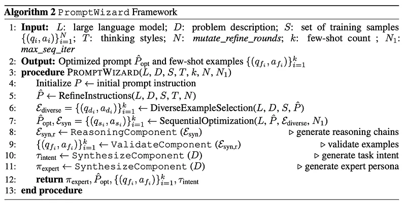
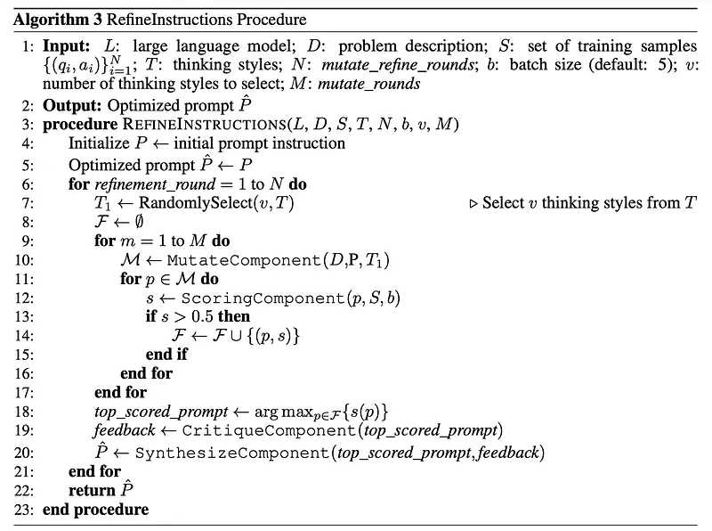
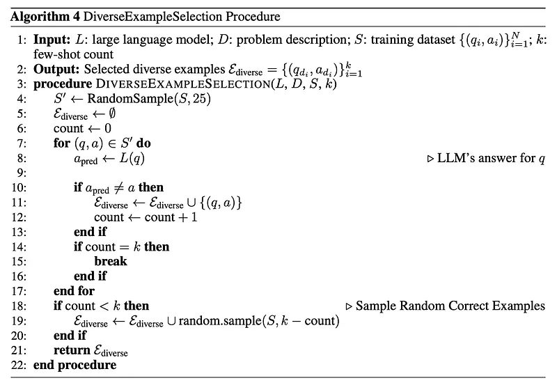
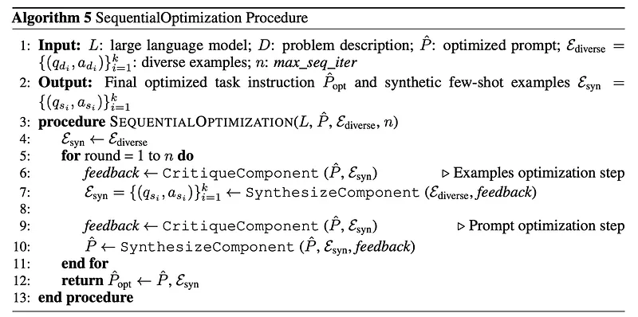
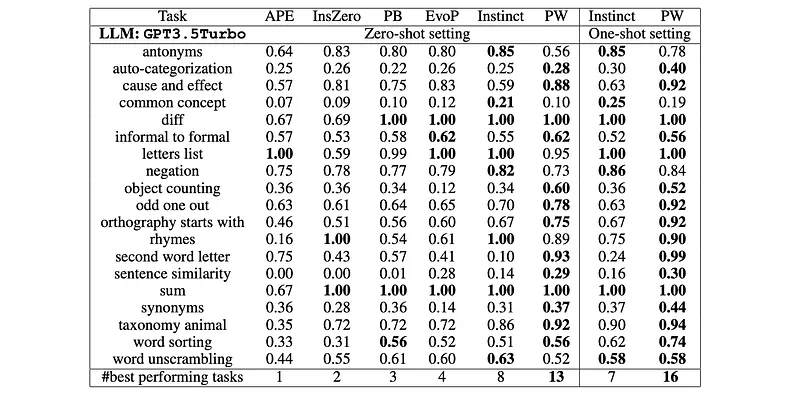

# Papers Explained 262 - PromptWizard

Prompt Wizard is a novel framework that uses LLMs to iteratively synthesize and refine prompts tailored to specific tasks.

This page ingests the source article into the wiki and connects it to [[Papers Explained Corpus]], [[Reasoning Models]], [[Synthetic Data]], [[Safety and Alignment]], [[Large Language Models]], [[Evaluation and Benchmarks]].

## Source Metadata

- Source file: `raw/2024-11-29_Papers-Explained-262--PromptWizard-228568783085.md`
- Source title: Papers Explained 262: PromptWizard
- Published: 2024-11-29
- Canonical: [https://medium.com/@ritvik19/papers-explained-262-promptwizard-228568783085](https://medium.com/@ritvik19/papers-explained-262-promptwizard-228568783085)

## Key Ideas

- The final optimized prompt includes: <optimized prompt instruction>, <problem description>, <in-context examples with reasoning chains>, <human intent>, <expert persona>, and <prompt guidelines for desired output format>.
- The approach follows a principled strategy through several key steps:
- Iterative Refinement of Prompt Instructions: Prompt instructions are refined iteratively by mutating them with diverse thinking styles, evaluating against training samples, and refining with an LLM critic.
- Identification of Diverse Examples: Diverse examples are strategically obtained by identifying negative samples during evaluation on a small subset of training data. These examples enhance the diversity and performance of the prompt.
- Sequential Optimization of Prompt Instructions and Examples: Leveraging a critic, shortcomings in current negative examples are identified and used to generate new synthetic examples that are diverse and relevant.

## Notes

Prompt Wizard is a novel framework that uses LLMs to iteratively synthesize and refine prompts tailored to specific tasks. It optimizes both prompt instructions and in-context examples to maximize model performance with the aid of a critic, synthesizing new instructions and examples enriched with detailed reasoning steps for optimal performance. The framework refines prompts by mutating instructions and incorporating negative examples to deepen understanding and ensure diversity.

## PromptWizard Framework

Starting with an initial prompt instruction denoted as P, along with a problem description D and a set of training samples represented as (Q, A) = {(qi, ai)}. The LLM model L generates outputs based on these inputs and the prompt, with the probability of generating each output determined by pl(ai | qi, P, af , qf ), where qf and af are the selected input-output pairs used as few-shot examples in the prompt. The objective of PromptWizard is to iteratively synthesize and refine both the prompt and few-shot examples to maximize task accuracy A, which is the performance of the LLM model on the target task. The refined prompt, denoted as Pˆ, should guide the LLM model to generate more accurate outputs for the given task.

The final optimized prompt includes: <optimized prompt instruction>, <problem description>, <in-context examples with reasoning chains>, <human intent>, <expert persona>, and <prompt guidelines for desired output format>.

*Figure: Overview of PromptWizard framework.*

The approach follows a principled strategy through several key steps:

- Iterative Refinement of Prompt Instructions: Prompt instructions are refined iteratively by mutating them with diverse thinking styles, evaluating against training samples, and refining with an LLM critic. This tailors the instructions to guide the model’s output effectively.

- Identification of Diverse Examples: Diverse examples are strategically obtained by identifying negative samples during evaluation on a small subset of training data. These examples enhance the diversity and performance of the prompt.

- Sequential Optimization of Prompt Instructions and Examples: Leveraging a critic, shortcomings in current negative examples are identified and used to generate new synthetic examples that are diverse and relevant. These are subsequently used to further synthesize and refine the prompt instruction, thus adapting to problem context.

- Self-generated Reasoning and Validation: A detailed reasoning chain with Chain-of-Thought (CoT) is generated for the newly synthesized examples, assisting the model with additional information on solving the problem. This deepens the prompt’s understanding, leading the model to generate more accurate responses.

- Integration of Task Intent and Expert Persona: Prompts are aligned with human understanding and reasoning by integrating task intent and expert personas, enhancing model performance and interpretability.

### Iterative Refinement of Prompt Instructions

Different LLM agents are used systematically to iteratively create and refine instructions as follows:

- MutateAgent: Starting with the initial problem description, a set of predefined diverse thinking styles assist MutateAgent in generating new mutated prompt instructions. Leveraging the 39 thinking styles defined in Prompt-Breeder, such as “How can I simplify the problem?” and “What are alternative perspectives on this problem?”, MutateAgent randomly selects several thinking styles and generates corresponding mutated instructions in a single LLM call for efficiency.

- ScoringAgent: To evaluate the effectiveness of mutated prompts, ScoringAgent evaluates mutated prompts against a small set of training examples, providing a performance score. A mini-batch of k = 5 training examples is randomly selected and a score is derived based on the number of mini-batches whose all examples were correctly obtained, with a minimum of 3 batches. The mutated prompt with the highest score progresses to the next step.

- CriticAgent: The CriticAgent provides feedback on the best mutated prompt to iteratively enhance it. It takes the best mutated prompt along with examples where it performed well or poorly to derive additional insights for improvement.

- SynthesizeAgent: Using feedback from CriticAgent, SynthesizeAgent refines the prompt instruction. It takes the best mutated prompt and the critic feedback to generate an improved, refined prompt instruction.

This entire iterative refinement of the prompt instruction is performed across multiple rounds to derive a best improved prompt instruction tailored to the specific task.

### Identification of Diverse Examples

Candidate examples are extracted from the dataset to optimize prompt instructions and few-shot examples. A few negative examples –where the current prompt fails– are included in order to refine the prompt and understand data challenges. A scoring mechanism is used to assess the prompt’s effectiveness against randomly selected examples from the dataset. Randomly selected 25 examples are iterated over until <few shot count> number of negative examples are found (usually takes 5 iterations). If not, 5 out of the 25 examples are randomly picked. This targeted approach boosts efficiency by avoiding the need to evaluate the entire dataset for negative examples.

### Sequential Optimization of Prompt Instructions and Few-Shot Examples

This step has two main goals:

- Analyzing previously selected negative examples with a CriticAgent to provide detailed feedback, utilized by the SynthesizeAgent to generate new synthetic examples. These are more diverse, robust, and task-relevant, guiding the model towards accurate answers.

- The new synthetic examples, along with the improved prompt, are analyzed using a CriticAgent to refine the instruction, optimized with the new synthetic few-shot examples. These steps iterate to arrive at an optimized prompt instruction and synthetic few-shot examples.

### Self-generated Reasoning and Validation

The prompt is further refined with additional information to improve the model’s performance. A detailed reasoning chain is automatically generated for each selected few-shot example to guide the model on problem-solving. ReasoningAgent takes the selected few-shot examples and generates a detailed reasoning chain for each example to facilitate problem-solving. ValidateAgent conducts validation of the synthetic example and its reasoning chain, crucial for reducing scenarios where the model has hallucinated or generated factually incorrect examples or reasoning chains.

### Integration of Task Intent and Expert Persona

To enhance LLMs’ task performance, task intent and expert guidance are integrated into prompts. Task intent prevents output divergence from task requirements, especially in specialized domains. By incorporating specific hints or keywords, inspired by human methodology, the model is guided to apply relevant approaches accurately. These cues are generated using SynthesizeAgent, informed by the initial problem description. To maintain consistency and relevance in LLM interactions, an expert persona is incorporated into prompts. Without a defined persona, responses can vary unpredictably. The expert persona is generated using SynthesizeAgent, based on the problem description, thus guiding the model’s behavior effectively.

## Evaluation

### Performance Analysis Against Various Prompting Baselines

*Figure: Average test accuracy achieved by best instruction generated by different SOTA algorithms.*

> PromptWizard demonstrates the ability to generate effective prompt instructions and few-shot examples with reasoning across various tasks and datasets, outperforming popular baselines while maintaining significantly reduced computational and latency overheads.

- PromptWizard consistently outperforms GPT-4, Gemini Ultra, and PromptBreeder across various tasks and datasets.

- PromptWizard achieves an average improvement of +5% over GPT-4, Gemini, and PromptBreeder.

- On reasoning tasks like GSM8k, PromptWizard demonstrates a significant +11.9% performance boost compared to PromptBreeder.

- PromptWizard is significantly more computationally efficient and has lower latency compared to MedPrompt.

- PromptWizard requires only 139 LLM calls, while MedPrompt makes 73.2 times more calls in MedQA, 3.5 times more in PubMedQA, and 1.1 times more in MMLU medical datasets during preprocessing.

- During inference, PromptWizard makes 1 LLM call per query, while MedPrompt makes 5 calls per query.

- PromptWizard achieves comparable performance to MedPrompt on datasets like PubMedQA, MedQA, and MMLU-6 medical tasks.

### PromptWizard Efficacy with Fewer Training Examples

*Figure: Perf. on arithmetic tasks.*

> PromptWizard demonstrates its effectiveness even with a modest number of training examples, making it suitable for scenarios where comprehensive datasets are unavailable.

### PromptWizard with Smaller LLMs

*Figure: Perf. on BBH.*

> PromptWizard achieves identical task performance when optimal prompts are generated using a smaller LLM model, demonstrating its versatility and robustness across model sizes.

## Paper

PromptWizard: Task-Aware Agent-driven Prompt Optimization Framework [2405.18369](https://arxiv.org/abs/2405.18369)

## Figures

Figures from the Medium HTML export (`raw/2024-11-29_Papers-Explained-262--PromptWizard-228568783085.md`); local copies under `wiki/assets/papers-explained-262-promptwizard/` when download succeeded.

| Figure | Caption |
|--------|---------|
|  | Title card: PromptWizard. |
|  | Overview of PromptWizard framework. |
|  | The approach follows a principled strategy through several key steps. |
|  | The approach follows a principled strategy through several key steps. |
|  | Candidate examples are extracted from the dataset to optimize prompt instructions and few-shot examples. |
|  | This step has two main goals. |
|  | Average test accuracy achieved by best instruction generated by different SOTA algorithms. |
|  | Perf. on arithmetic tasks. |
|  | Perf. on BBH. |
## Related

- [[Papers Explained Corpus]]
- [[Reasoning Models]]
- [[Synthetic Data]]
- [[Safety and Alignment]]
- [[Large Language Models]]
- [[Evaluation and Benchmarks]]
- [[Papers Explained 261 - MM-1.5]]
- [[Papers Explained 263 - Jina Embeddings v1]]

#summary #topic
