# Papers Explained 263 - Jina Embeddings v1

Jina Embeddings are a set of sentence embedding models ranging from 35M to 6B parameters that translate textual inputs into numerical representations, capturing the semantics of the text.

This page ingests the source article into the wiki and connects it to [[Papers Explained Corpus]], [[Embedding and Retrieval]], [[Multilingual Models]], [[Synthetic Data]], [[Large Language Models]], [[Agentic AI]].

## Source Metadata

- Source file: `raw/2024-12-02_Papers-Explained-263--Jina-Embeddings-v1-33336e9efb0f.md`
- Source title: Papers Explained 263: Jina Embeddings v1
- Published: 2024-12-02
- Canonical: [https://medium.com/@ritvik19/papers-explained-263-jina-embeddings-v1-33336e9efb0f](https://medium.com/@ritvik19/papers-explained-263-jina-embeddings-v1-33336e9efb0f)

## Key Ideas

- To develop these models, high-quality pairwise and triplet datasets are created, specifically to sensitize the models to distinguish negations of statements from confirming statements.
- The models are available at [HuggingFace](https://huggingface.co/collections/jinaai/jina-embeddings-v1-65708ebcf56f9538677ac37c/).
- A comprehensive set of both public and custom datasets targeting various retrieval objectives, such as e-commerce search, duplicate detection, web retrieval, article retrieval for question-answering, and text classification is collated.
- Each training item is reformatted into pairs, designated as (q, p) ∈ D_pairs .
- To leverage explicit non-relevance judgments, an auxiliary set of triplets (q, p, n) ∈ D_triplets is also created.

## Notes

Jina Embeddings are a set of sentence embedding models ranging from 35M to 6B parameters that translate textual inputs into numerical representations, capturing the semantics of the text.

To develop these models, high-quality pairwise and triplet datasets are created, specifically to sensitize the models to distinguish negations of statements from confirming statements. The training process involves contrastive training on the T5 architecture, which was chosen due to its pre-training on a mixed set of downstream tasks.

The models are available at [HuggingFace](https://huggingface.co/collections/jinaai/jina-embeddings-v1-65708ebcf56f9538677ac37c/).

## Dataset Preparation

A comprehensive set of both public and custom datasets targeting various retrieval objectives, such as e-commerce search, duplicate detection, web retrieval, article retrieval for question-answering, and text classification is collated.

- Each training item is reformatted into pairs, designated as (q, p) ∈ D_pairs .

- To leverage explicit non-relevance judgments, an auxiliary set of triplets (q, p, n) ∈ D_triplets is also created.

The methods used to extract pairs and triplets are specific to each source dataset. For example, given a question-answer dataset, questions are used as query strings and answers as target strings. Retrieval datasets often contain queries that can serve as query strings and relevant and non- relevant annotated documents which can operate as matching and non-matching strings.

### Pairwise Data Preparation

Duplicated entries within training data can negatively impact model performance, potentially leading to overfitting. To identify and eliminate duplicate text pairs, hash functions are used. Before checking for duplicates, whitespace and capitalization are normalized. Additionally, empty pairs and pairs with identical elements are also removed.

Non-English training items are then removed from the dataset using the fasttext-language-identification model.

To eliminate low-similarity pairs for boosting performance (Consistency Filtering), embeddings are generated for 1M pairs randomly sampled from the dataset using the all-MiniLM-L6-v2 model. For every pair in the dataset, it is verified whether a passage is among the top two most similar to another passage based on the cosine similarity of their embeddings compared to all passages.

### Triplet Data Preparation

For the triplet dataset, de-duplication and language filtering are foregone, assuming that the quality of these datasets already meets certain requirements. However, the relevance of the “positive” item with respect to the “query” for each triplet is validated in a manner similar to consistency filtering. Instead of contrasting the embedding cosine similarity s(q, p) against a sample set, this similarity is compared solely with the similarity s(q, n) of the embeddings derived from the same triplet (q, p, n) ∈ Dtriplets. This is accomplished using the ms-marco-MiniLM-L-6-v2 model to verify whether the difference in retrieval scores determined by the model exceeds a threshold r(q, p) − r(q, n) > κ, with threshold κ = 0.2, and all other pairs are eliminated.

### Negation Data Preparation

Many embedding models struggle to accurately embed negations. To address this problem, a negation dataset comprising triplets (anchor, entailment, negative) based on positive pairs from the SNLI dataset and negatives created with GPT-3.5 is created.

### Data Composition

*Figure: The composition of 385 million pairwise data.*

*Figure: The composition of 927,000 triplets data.*

The dataset of text pairs has been aggregated from 32 individual datasets, totalling 1.6B pairs, which is subsequently reduced to a robust 385M high-quality pairs after rigorous filtering.

The dataset of triplets initially comprises a total of 1.13M entries, streamlined to 927K triplets after filtering.

## Training

Training takes place in two phases.

- The first phase centers on training the model using the voluminous quantity of text pairs, consolidating the semantics of an entire text phrase into a single representative embedding.

- The second phase uses the relatively small triplet dataset, comprising an anchor, an entailment, and a hard-negative, teaching it to differentiate between similar and dissimilar text phrases.

Each Jina Embedding model is based on the T5 model of corresponding size, utilizing only the encoder component. Following the encoder component, a mean pooling layer is implemented to generate fixed-length representations from the token embeddings.

*Figure: Model sizes and output dimensions.*

### Training on Pairwise Data

For the training on the pairwise data, the InfoNCE, a contrastive loss function is used. This function calculates the loss for a pair (q, p) ∼ B within a batch B of text pairs, where the batch size is k, as follows:

The loss is calculated by comparing the cosine similarity between a given question q and its target p, with the similarity to all other targets in the batch. It is found that calculating the loss in both directions results in greater improvements during training. Accordingly, the loss is defined as follows:

### Training on Triplet Data

This phase uses a different loss function, leveraging negatives for improved model performance.

Various triplet loss functions are experimented with, and it is found that the best results are achieved through a combination of multiple commonly used triplet loss functions..

Specifically, an extended version of the InfoNCE loss given by (2), which employs additional negatives, the reverse InfoNCE loss from the initial training phase as given by (3), and the triplet margin loss function given by (4).

## Evaluation

### Performance Against State-of-the-Art Models

Sentence Similarity

*Figure: Spearman Correlation for Sentence Similarity Tasks.*

- Jina Embedding models outperform similarly sized counterparts across multiple tasks.

- jina-large-v1 achieves comparable or superior results to billion-parameter models.

- jina-base-v1 and jina-small-v1 exceed peers of similar size, especially on the BIOSSES task.

- jina-base-v1 performs similarly to gtr-t5-base (retrieval-focused) but often trails sentence-t5-base (similarity-focused).

Reranking Tasks

*Figure: Mean Average Precision (mAP@10) for Reranking Tasks.*

- jina-large-v1 often outperforms larger models.

- jina-base-v1 surpasses gtr-t5-large and sentence-t5-large on several tasks.

- Training focus (retrieval vs. similarity) appears to influence performance.

Retrieval Tasks

*Figure: Normalized Discounted Cumulative Gain (nDCG@10) for retrieval tasks.*

- gtr-t5 models (retrieval-focused) consistently achieve the highest scores for their size.

- Jina Embedding models follow closely behind, demonstrating the advantage of multi-task training.

- sentence-t5 models lag significantly.

### Impact of Filtering Steps

To evaluate the effectiveness of a dataset preprocessing pipeline, the smallest model is fine-tuned on the Reddit dataset, applying various preprocessing steps individually.

*Figure: Evaluation of Data-Preparation Effectiveness on the Reddit Dataset. Retrieval evaluated on nDCG@10, Sentence Similarity on Spearman.*

- Both language and consistency filtering are crucial preprocessing steps.

- Combined application of these filters yields the highest performance across most benchmarks.

- On the Reddit dataset, consistency filtering significantly boosts performance, while language filtering has a marginal effect. This is because consistency filtering removes a larger portion of the data (84.313%) compared to language filtering (17.4%).

### Effectiveness of Negation Data

To evaluate the effectiveness of proposed negation data, the models are evaluated on the test split of the negation dataset using two metrics: EasyNegation and HardNegation.

- EasyNegation: Percentage of samples where the model positions the anchor and entailment closer than the anchor and negative. (Anchor and negative are syntactically dissimilar)

- HardNegation: Percentage of samples where the model positions the anchor and entailment closer than the entailment and negative. (Entailment and negative are syntactically more similar)

*Figure: Evaluating a Range of Models on the Negation Dataset.*

- Fine-tuning on triplet data (which includes the negation training dataset) significantly improves performance, especially on the HardNegation task

## Paper

Jina Embeddings: A Novel Set of High-Performance Sentence Embedding Models [2307.11224](https://arxiv.org/abs/2307.11224)

Recommended Reading [Retrieval and Representation Learning](https://ritvik19.medium.com/list/retrieval-and-representation-learning-bcd23de0bd8e)

## Figures

Figures from the Medium HTML export (`raw/2024-12-02_Papers-Explained-263--Jina-Embeddings-v1-33336e9efb0f.md`); local copies under `wiki/assets/papers-explained-263-jina-embeddings-v1/` when download succeeded.

| Figure | Caption |
|--------|---------|
| 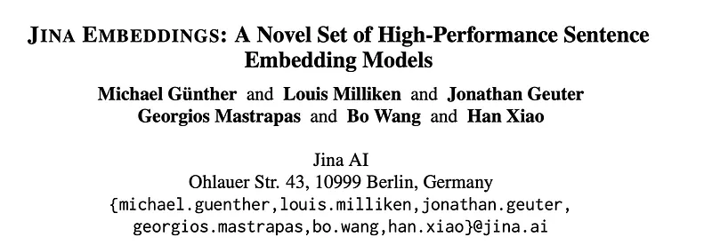 | Title card: Jina Embeddings v1. |
| 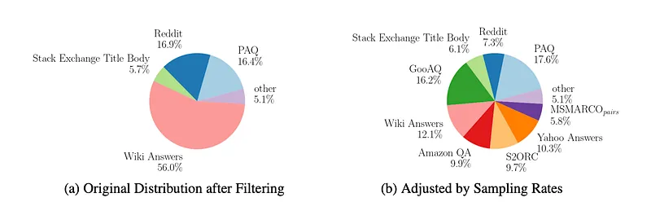 | The composition of 385 million pairwise data. |
| 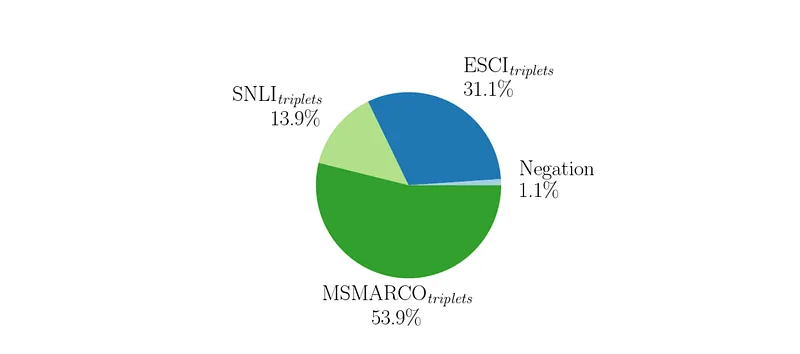 | The composition of 927,000 triplets data. |
| 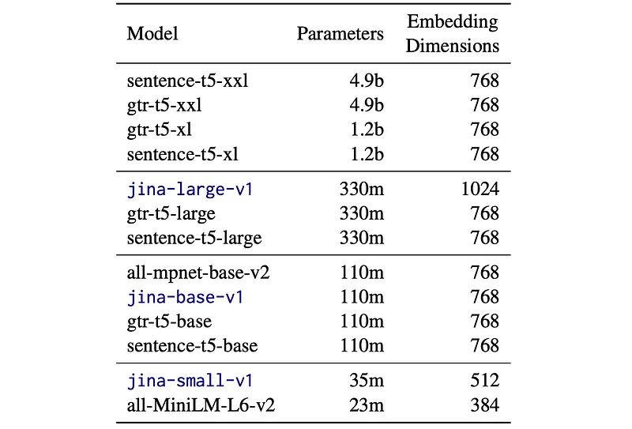 | Model sizes and output dimensions. |
| 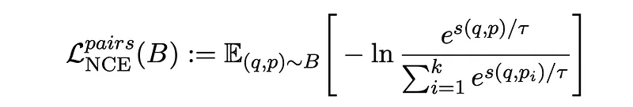 | For the training on the pairwise data, the InfoNCE, a contrastive loss function is used. |
| 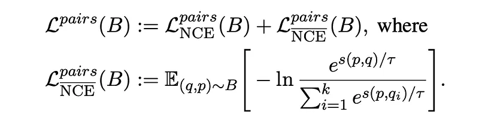 | Training on Pairwise Data. |
| 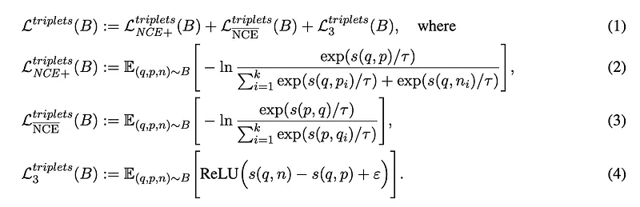 | Training on Triplet Data. |
| 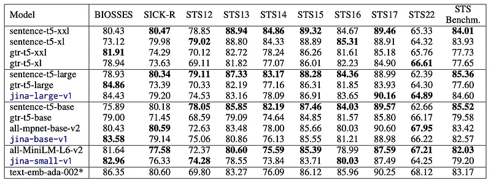 | Spearman Correlation for Sentence Similarity Tasks. |
| 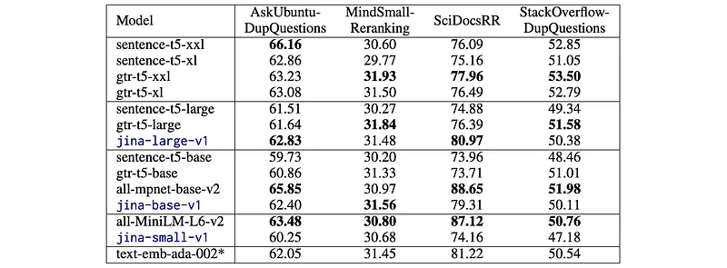 | Mean Average Precision (mAP@10) for Reranking Tasks. |
| 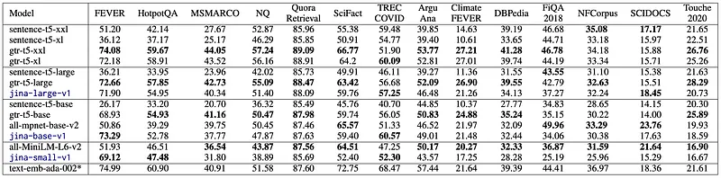 | Normalized Discounted Cumulative Gain (nDCG@10) for retrieval tasks. |
| 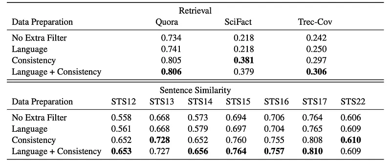 | Evaluation of Data-Preparation Effectiveness on the Reddit Dataset. Retrieval evaluated on nDCG@10, Sentence Similarity on Spearman. |
| 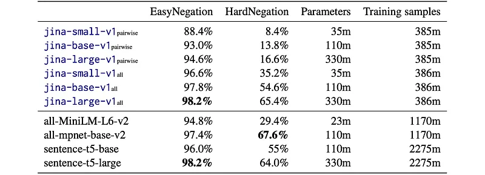 | Evaluating a Range of Models on the Negation Dataset. |
## Related

- [[Papers Explained Corpus]]
- [[Embedding and Retrieval]]
- [[Multilingual Models]]
- [[Synthetic Data]]
- [[Large Language Models]]
- [[Agentic AI]]
- [[Papers Explained 262 - PromptWizard]]
- [[Papers Explained 264 - Jina Embeddings v2]]

#summary #topic
