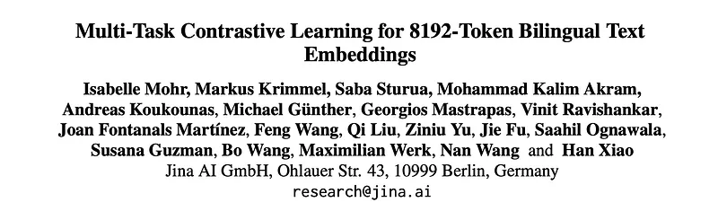
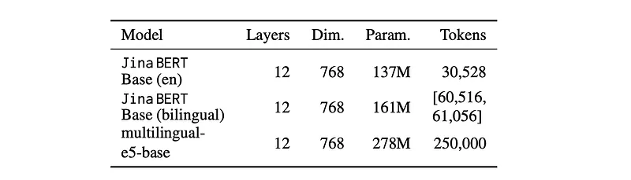
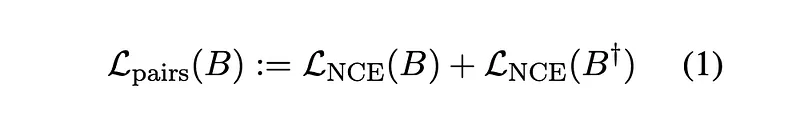
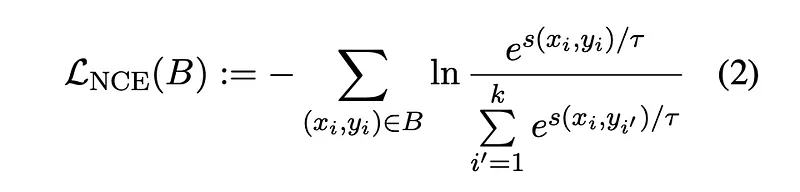
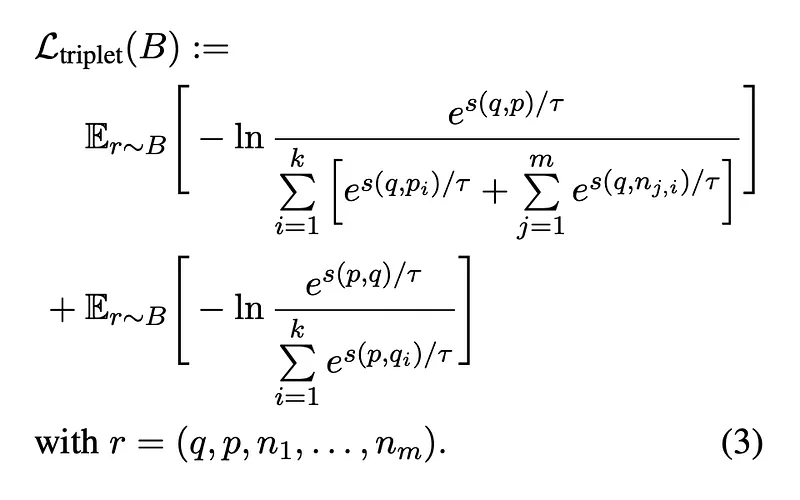
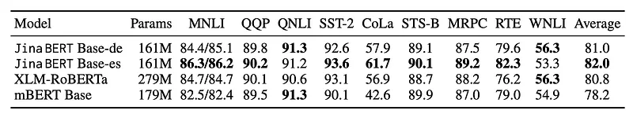
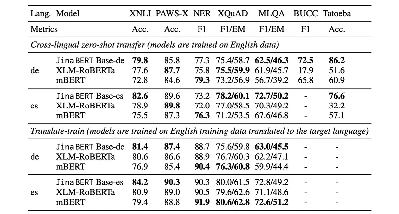
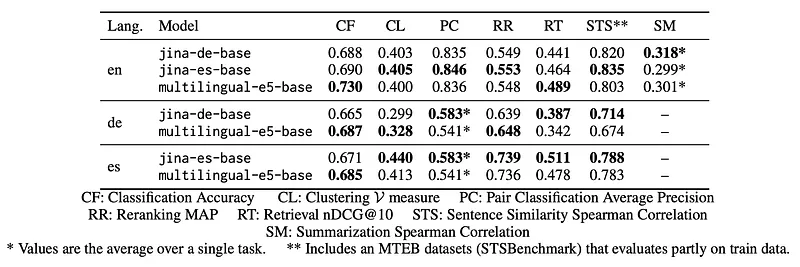
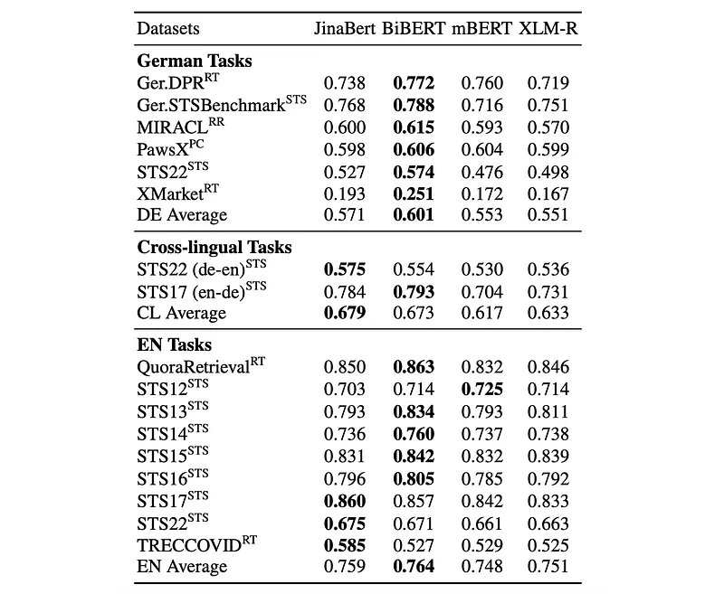
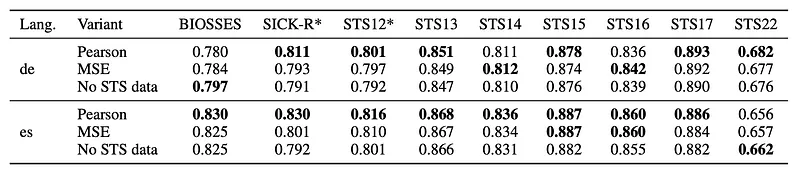

# Papers Explained 265 - Jina Bilingual Embeddings

This paper presents a novel suite of state-of-the-art bilingual text embedding models that are designed to support English and another target language. These models are capable of processing lengthy text inputs with up to 8192 tokens.

This page ingests the source article into the wiki and connects it to [[Papers Explained Corpus]], [[Embedding and Retrieval]], [[Multilingual Models]], [[Long Context]], [[Large Language Models]].

## Source Metadata

- Source file: `raw/2024-12-04_Papers-Explained-265--Jina-Bilingual-Embeddings-39960d6f7a7c.md`
- Source title: Papers Explained 265: Jina Bilingual Embeddings
- Published: 2024-12-04
- Canonical: [https://medium.com/@ritvik19/papers-explained-265-jina-bilingual-embeddings-39960d6f7a7c](https://medium.com/@ritvik19/papers-explained-265-jina-bilingual-embeddings-39960d6f7a7c)

## Key Ideas

- The models are available at [HuggingFace](https://huggingface.co/collections/jinaai/jina-embeddings-v2-65708e3ec4993b8fb968e744).
- Recommended Reading [Papers Explained 264: Jina Embeddings v2](https://ritvik19.medium.com/papers-explained-264-jina-embeddings-v2-c5d540a9154f)
- The training paradigm is similar to that of Jina Embeddings v2 and is divided into three stages:
- The bilingual text embedding models use the same BERT architecture described in Jina Embeddings v2.
- This architecture modifies the original BERT model with ALiBi to support long context lengths during model inference.

## Notes

This paper presents a novel suite of state-of-the-art bilingual text embedding models that are designed to support English and another target language. These models are capable of processing lengthy text inputs with up to 8192 tokens. As in Jina Embeddings v2 this work also trains backbone models that support these specific language pairs, thus reducing the model size compared to multilingual alternatives.

The models are available at [HuggingFace](https://huggingface.co/collections/jinaai/jina-embeddings-v2-65708e3ec4993b8fb968e744).

Recommended Reading [Papers Explained 264: Jina Embeddings v2](https://ritvik19.medium.com/papers-explained-264-jina-embeddings-v2-c5d540a9154f)

## Training Paradigm

The training paradigm is similar to that of Jina Embeddings v2 and is divided into three stages:

- Pre-training a Modified BERT

- Fine-tuning with Text Pairs

- Fine-tuning with Multi-Task Objective

*Figure: Architecture specifications of different monolingual, bilingual and multilingual models.*

## Pre-training a Modified BERT

The bilingual text embedding models use the same BERT architecture described in Jina Embeddings v2.

- This architecture modifies the original BERT model with ALiBi to support long context lengths during model inference.

- For the Spanish model, a normalization of key and query vectors is introduced to address training instabilities.

- In each self-attention layer, layer normalization is used to normalize keys and queries before computing the dot-product attention.

- The head axis is treated as an additional layer axis for the purpose of normalization, which is loosely related to QK-normalization in which keys and queries are l2-normalized.

- Normalization is not performed separately for each head, but instead the head axis is flattened into the layer axis.

- BPE tokenizers are trained for all language pairs, and the vocabulary size is doubled compared to the original monolingual variant to provide room for the token representation of two languages instead of one.

A comprehensive set of data is collected from various high-quality sources, including CulturaX, Wikipedia, and Opus.

- CulturaX is a combination of mC4 and OSCAR aggregating all accessible corpora up to 23.01.2024.

- The Opus collection consists of translated texts harvested from the Web and is publicly available.

The corpus consists approximately 250M English text documents and an equivalent number of German and Spanish text documents for each of the respective bilingual models, amounting to a total of 256B tokens for each model.

## Fine-Tuning for the Embedding Task

Following the Sentence- BERT approach, each model is augmented by a mean pooling layer to consolidate the semantic encoded in all the out- put token vectors into a single vector.

### Fine-tuning with Text Pairs

We train the models for general embedding tasks on a corpus of text pairs (q, p). We construct a collection of 211 million German, 111 million Spanish, and 518 mil- lion English text pairs. The dataset predominantly consists of monolingual pairs (97.5%). The rest are bilingual pairs that consist of identical texts in two different languages, forming a parallel dataset that bridges English with the other two. To assemble our dataset, we start with curated datasets such as MQA, XL- Sum, XNLI, MLSum, and Europarl. Seeking further diversity and volume, we utilize Common Crawl data to create two types of pairs: one from web page titles and their contents, and another by mining question- answer pairs from FAQ and support-related pages. Additionally, we pair paragraphs with their section titles from Wikipedia.

A corpus of text pairs (q, p) is constructed for general embedding tasks, consisting of 211M German, 111M Spanish, and 518M English text pairs. Predominantly, the dataset comprises monolingual pairs (97.5%). To assemble the dataset, curated datasets such as MQA, XL-Sum, XNLI, MLSum, and Europarl are used. Seeking further diversity and volume, Common Crawl data is utilized to create two types of pairs: one from web page titles and their contents, and another by mining question-answer pairs from FAQ and support-related pages. Additionally, paragraphs with their section titles from Wikipedia are paired.

A two-stage processing strategy is implemented to improve data quality. In the first stage, texts are eliminated based on various quality checks. For instance, very short texts, lengthy texts, and texts with excessive repetition of lines or n-grams are removed. Then, the refinement process is applied to enhance the remaining texts’ quality without discarding them. This includes stripping site-specific metadata and removing unfinished lines or lines with only one word.

To further improve the dataset, near- deduplication and consistency filtering is also used.

Following the previous work, a bi-directional InfoNCE loss is used

where B = ((p1, q1), . . . ,(pk, qk)) is a batch of k pairs, B† = ((q1, p1), . . . ,(qk, pk)) is obtained from B by swapping the order of pairs and LNCE is defined via:

### Fine-tuning with Multi-Task Objective

For different tasks, datasets come with different formats. For retrieval tasks, several datasets like MSMarco and Natural Questions (NQ) are prepared into a format of tuples with one positive and multiple negatives: (q, p, n1, . . . , nm). The STS datasets contain triplets of two text values q and p as well as a similarity score t: (q, p, t).

Since there is much more high-quality data available in English, machine translation is used to translate some datasets into other target languages. For translating datasets to German, FAIR’s compute-efficient WMT19 model is employed, whereas the multilingual MADLAD-3B model is utilized for generating Spanish datasets. In both cases, translations are performed at the sentence level.

German Dataset for legal information retrieval (GerDaLIR) and German training dataset for dense passage retrieval (GermanDPR) are used as well. For Spanish, SQAC dataset, an extractive QA dataset, is employed, along with the Spanish subset of XL-Sum, a multilingual summarization dataset consisting of BBC news articles. Additionally, the Spanish subset of MIRACL dataset, a multilingual information retrieval dataset, is also utilized.

For each batch, the type of task is determined and a respective loss function is selected. For retrieval tasks, a bi-directional InfoNCE loss function is used:

If the sampled batch comes from an STS dataset, the negative Pearson’s sample correlation is used as a loss function.

## Evaluation

### Performance of Backbone Models

To assess the proficiency of bilingual backbone models compared to established multilingual models, GLUE and XTREME benchmarks are used

*Figure: Performance of Jina BERT models and multilingual models on GLUE dev set.*

*Figure: Performance of Jina BERT models and multilingual models on XTREME dev set.*

- Bilingual models outperform multilingual models on average across both benchmarks.

- The Spanish model achieves the highest performance on the GLUE benchmark.

- The German model slightly outperforms XLM-RoBERTa on the XTREME benchmark.

- Bilingual models demonstrate a significant advantage in zero-shot cross-lingual transfer on XTREME, particularly in BUCC and Tatoeba sentence retrieval tasks.

- Performance gap decreases after training on translated data in XTREME.

### Embedding Model Evaluation

The models are accessed on a wide range of tasks using the MTEB , further new tasks are added to improve the evaluation of bilingual models, for German and Spanish.

Spanish Tasks:

- 6 Retrieval Tasks: XMarket, SpanishPassageRetrievalS2P, SpanishPassageRetrievalS2S, MIRACLRetrieval, MintakaRetrieval, XQPARetrieval.

- 2 Clustering Tasks: FloresClusteringS2S, SpanishNewsClusteringP2P8.

- 1 Reranking Task: MIRACLReranking.

- 1 STS Task: STSES.

- Multilingual Classification Task: Integrated PAWS-X dataset for seven languages.

German Tasks:

- 1 Reranking Task: MIRACLReranking.

- 1 STS Task: GermanSTSBenchmark.

- 3 Retrieval Tasks: GerDaLIR, GermanDPR, XMarket.

*Figure: Evaluation of the Jina models on MTEB tasks.*

- Spanish Model: Outperforms multilingual-e5 on Spanish clustering, retrieval, and reranking tasks, while slightly underperforming in classification. It shows advantages on cross-lingual STS tasks.

- German Model: Outperforms multilingual-e5 on German retrieval and STS tasks, with comparable performance in classification, clustering, and reranking.

- Cross-Lingual Performance: The German bilingual model matches or outperforms multilingual-e5 on cross-lingual German-English tasks.

- Efficiency in English Tasks: The bilingual models maintain consistency in performance across English tasks, with the bilingual Spanish model achieving the highest average scores in various tasks. The multilingual-e5 model performs better in classification and retrieval tasks.

- Balanced Expansion: The findings suggest a balanced enhancement of bilingual capabilities without compromising efficiency in English tasks.

### Comparing Bilingual to Multilingual Models

To empirically investigate whether bilingual models outperform multilingual models in both languages, two German-English bilingual models (including BiBERT) and two multilingual models (mBERT, XLM-RoBERTa) are evaluated on embedding tasks. Fine-tuning is done using a small set of German-English text pairs

*Figure: Evaluation of multilingual and bilingual models after short embedding training on pairs.*

- Bilingual models, including BiBERT, outperformed multilingual models on German and cross-lingual tasks.

- Bilingual models also slightly outperformed multilingual models on English tasks.

### Performance of Multi-Task Learning

To evaluate the effectiveness of a multi-task learning strategy that incorporates Semantic Textual Similarity (STS) training data, three fine-tuned model variants are studied for Spanish and German models:

- Pearson variant: Uses the Lcorr loss for STS datasets during multi-task learning.

- MSE variant: Uses a standard mean squared error (MSE) loss for STS datasets.

- No STS variant: Does not use any STS data.

*Figure: Spearman correlation on English STS tasks after triplet-tuning.*

- The Pearson variant outperformed both the MSE variant and the No STS variant in both German and Spanish settings.

- This performance difference was most pronounced for datasets (SICK-R, STS12) included in the training data, and less noticeable for out-of-domain evaluation.

- While the Pearson Lcorr loss was most effective for incorporating STS data, using a simple MSE loss was still beneficial compared to no STS data at all.

## Paper

Multi-Task Contrastive Learning for 8192-Token Bilingual Text Embeddings [2402.17016](https://arxiv.org/abs/2402.17016)

Recommended Reading [Retrieval and Representation Learning](https://ritvik19.medium.com/list/retrieval-and-representation-learning-bcd23de0bd8e)

## Figures

Figures from the Medium HTML export (`raw/2024-12-04_Papers-Explained-265--Jina-Bilingual-Embeddings-39960d6f7a7c.md`); local copies under `wiki/assets/papers-explained-265-jina-bilingual-embeddings/` when download succeeded.

| Figure | Caption |
|--------|---------|
|  | Title card: Jina Bilingual Embeddings. |
|  | Architecture specifications of different monolingual, bilingual and multilingual models. |
|  | Following the previous work, a bi-directional InfoNCE loss is used. |
|  | where B = ((p1, q1),. |
|  | For each batch, the type of task is determined and a respective loss function is selected. For retrieval tasks, a bi-directional InfoNCE loss function is used. |
|  | If the sampled batch comes from an STS dataset, the negative Pearson’s sample correlation is used as a loss function. |
|  | Performance of Jina BERT models and multilingual models on GLUE dev set. |
|  | Performance of Jina BERT models and multilingual models on XTREME dev set. |
|  | Evaluation of the Jina models on MTEB tasks. |
|  | Evaluation of multilingual and bilingual models after short embedding training on pairs. |
|  | Spearman correlation on English STS tasks after triplet-tuning. |
## Related

- [[Papers Explained Corpus]]
- [[Embedding and Retrieval]]
- [[Multilingual Models]]
- [[Long Context]]
- [[Large Language Models]]
- [[Papers Explained 264 - Jina Embeddings v2]]
- [[Papers Explained 266 - Jina Embeddings v3]]

#summary #topic
