# Papers Explained 266 - Jina Embeddings v3

Recommended Reading [Papers Explained 265: Jina Bilingual Embeddings](https://ritvik19.medium.com/papers-explained-265-jina-bilingual-embeddings-39960d6f7a7c)

This page ingests the source article into the wiki and connects it to [[Papers Explained Corpus]], [[Embedding and Retrieval]], [[Multilingual Models]], [[Large Language Models]], [[Model Compression and Efficiency]], [[Safety and Alignment]].

## Source Metadata

- Source file: `raw/2024-12-05_Papers-Explained-266--Jina-Embeddings-v3-9c38c9f69766.md`
- Source title: Papers Explained 266: Jina Embeddings v3
- Published: 2024-12-05
- Canonical: [https://medium.com/@ritvik19/papers-explained-266-jina-embeddings-v3-9c38c9f69766](https://medium.com/@ritvik19/papers-explained-266-jina-embeddings-v3-9c38c9f69766)

## Key Ideas

- The backbone architecture is adapted from the XLM-RoBERTa model with modifications that enable effective encoding of long text sequences, allow task-specific encoding of embeddings, and increase model efficiency.
- jina-embeddings-v3 is larger than jina-embeddings-v2, but significantly smaller than embedding models fine-tuned from LLMs. Importantly, the LoRA adapters account for less than 3% of the total parameters, adding minimal overhead.
- To handle long text sequences, absolute positional embeddings are replaced with Rotary Position Embeddings (RoPE), which use a rotation matrix to encode absolute positions while embedding relative positional dependencies directly within the self-attention...
- The embedding and linear layers within the multi-head attention mechanism are equipped with low-rank decomposition matrices of rank 4.
- The model is initialized using the weights of the original XLM-RoBERTa model. The model’s original MLM objective is not fully aligned with training objectives due to the changes in positional embedding methods.

## Notes

Jina Embeddings V3 is a text embedding model with 570 million parameters. It is trained on multilingual data and is designed for long-context retrieval tasks, supporting context lengths of up to 8192 tokens. The model includes a set of task-specific Low-Rank Adaptation (LoRA) adapters to generate high-quality embeddings for query-document retrieval, clustering, classification, and text matching. With a default output dimension of 1024, users can flexibly reduce the embedding dimensions to as low as 32 without compromising performance, enabled by Matryoshka Representation Learning.

Recommended Reading [Papers Explained 265: Jina Bilingual Embeddings](https://ritvik19.medium.com/papers-explained-265-jina-bilingual-embeddings-39960d6f7a7c)

## Model Architecture

*Figure: The architecture of jina-embeddings-v3.*

The backbone architecture is adapted from the XLM-RoBERTa model with modifications that enable effective encoding of long text sequences, allow task-specific encoding of embeddings, and increase model efficiency. jina-embeddings-v3 retains the original XLM-RoBERTa tokenizer.

*Figure: Model specification of jina-embeddings-v3.*

jina-embeddings-v3 is larger than jina-embeddings-v2, but significantly smaller than embedding models fine-tuned from LLMs. Importantly, the LoRA adapters account for less than 3% of the total parameters, adding minimal overhead.

To handle long text sequences, absolute positional embeddings are replaced with Rotary Position Embeddings (RoPE), which use a rotation matrix to encode absolute positions while embedding relative positional dependencies directly within the self-attention mechanism.

The embedding and linear layers within the multi-head attention mechanism are equipped with low-rank decomposition matrices of rank 4. These task-specific LoRA adapters are loaded alongside the model weights and are dynamically selected based on the input task type.

## Training Method

The model is initialized using the weights of the original XLM-RoBERTa model. The model’s original MLM objective is not fully aligned with training objectives due to the changes in positional embedding methods. Despite this, initializing with pre-trained weights leads to faster convergence during pre-training compared to random initialization. The training paradigm consists of three stages

- Pre Training

- Fine-Tuning for Embedding Tasks

- Training Task-Specific Adapters

## Pre-Training

After initialization, the model is trained using the MLM objective with whole word masking. To support multilingual tasks, the training data is drawn from the CulturaX corpus, which includes data from 89 languages, with English comprising approximately 20% of the dataset. During training, each batch contains data for only a single language, but the language is rotated between batches. For long-context support, the model is first trained for 100,000 steps on text sequences that are truncated to 512 tokens, followed by an additional 60,000 steps using text sequences truncated to 8192 tokens.

## Fine-Tuning for the Embedding Task

Following the Sentence-BERT approach, the model is augmented with a mean pooling layer to aggregate the semantics from all output token vectors into a single vector representation. The model is trained on text pairs using a bi-directional InfoNCE.

The training data consists of over one billion text pairs, drawn from more than 300 distinct sub- datasets, each representing specific domains in various languages. For data preparation, the same methodology as Jine Bilingual Embeddings is followed, with an additional filtering step. This filter removes pairs where at least 80% of the words (minimum of four) in the shorter text are sub- strings of the longer text.

As in the pre-training phase, training begins on short text pairs, followed by further training on longer texts using a larger sequence length.

## Training Task-Specific Adapters

*Figure: Supported tasks of jina-embeddings-v3.*

This phase incorporates high-quality data from various task types to optimize model performance across a range of downstream use cases. Five distinct LoRA adapters are trained for four well-defined task types. These tasks are trained independently, with the base model’s weights kept frozen. For query-document retrieval, two adapters are trained jointly: one for queries and one for passages. During inference, users can select the appropriate adapter based on their downstream task and input role, ensuring optimal embeddings for their specific use case.

### Classification Adapter

The classification adapter generates embeddings that are effective for training downstream classification models, particularly logistic regression classifiers. Datasets covering a range of common classification tasks, including sentiment analysis, intent classification, and article categorization, are selected.

From each dataset, tuples consisting of two text values from the same class (q, p) and seven text values from different classes (n1, . . . , n7), resulting in a tuple of nine text values (q,p,n1,…,n7), are constructed. The model is trained to assign a high cosine similarity to the embeddings of q and p, while enforcing low cosine similarity between q and all ni. Each batch is composed of tuples sampled from a single dataset. An extended version of the InfoNCE loss L_triplet is employed to take into account these additional negative samples.

### Text Matching Adapter

This adapter is trained to produce embeddings that quantify the similarity between two text values. It is applicable for tasks such as semantic textual similarity (STS) and retrieval tasks where there is no clear distinction between query and target text values. To train this adapter, the CoSent loss function: L_co is used.

The CoSent loss operates on two pairs of text values, (q1 , p1 ) and (q2 , p2 ), which are constructed from the batch by selecting combinations of four text values where the ground truth similarity ζ is provided in the training dataset, and ζ(q1,p1) is greater than ζ (q2 , p2 ). To train the model with this objective, data from semantic textual similarity (STS) training datasets such as STS12 and SICK is used. These datasets consist of triplets (qi, pi, ti) ∈ D, where (qi, pi) are text pairs and ti is the corresponding relevance score. To enhance the model’s performance across languages, the STS12 and SICK datasets are translated into multiple languages using machine translation models, i.e. WMT19 and MADLAD-3B. Various natural language inference (NLI) datasets have been incorporated into the training process.

### Asymmetric Retrieval Adapters

Asymmetric retrieval tasks, such as question answering and traditional information retrieval, perform better with separate encoding mechanisms for queries and documents. Using two distinct prefixes, but further separate the encoding processes by employing two specialized adapters, which are trained jointly. The model is trained on datasets containing hard negatives, such as MS-MARCO and Natural Questions (NQ), to focus on subtle distinctions and to differentiate between relevant and similar but irrelevant documents. For retrieval training datasets without annotated negatives, hard negative mining is applied, leveraging embedding models like BGE-large and BM25. To incorporate the mined negatives into the training process, the L_triplet loss function is applied.

### Separation Adapter

The separation adapter is designed to perform well on clustering and reranking tasks. It is trained to distinguish between text values belonging to the same group and those from different groups. For reranking tasks, the adapter separates relevant from irrelevant documents based on a query’s information need. In clustering tasks, groups of texts are provided, and after calculating the embeddings and applying a clustering algorithm (e.g., k-means), the resulting clusters should reflect the correct groupings. To train the adapter for this objective, a variant of the CoSent loss L_co is employed. The training data consists of batches B′ made up of tuples (x,l), where x is a text value and l is its label. To form a batch of text pairs compatible with Lco, all pairwise combinations of text values that share the same label li in the batch are generated. The separation loss is then defined as follows:

The same schema as used for the text matching adapter is followed, where a specific dataset is sampled at each training step, and the corresponding loss function is applied.

### Failure Analysis for Asymmetric Retrieval

A failure analysis is conducted to identify issues affecting retrieval tasks in the jina-embeddings-v2 models. The analysis revealed four key points:

- F1: Misleading Syntactic Similarities: Documents with high syntactic similarity to the query are often favored over relevant documents with lower syntactic overlap.

- F2: Misinterpretation of Named Entities: Named entities are frequently not recognized as such, leading to partial matches and incorrect retrievals (e.g., “Sofia Albert” vs. “Albert Stone”).

- F3: No Understanding of Polar Questions: Complex yes-no questions are not handled effectively, resulting in retrieval of documents with related content that do not necessarily answer the query.

- F4: Preference for Low-Quality Documents The model prioritizes low-quality documents (short, repetitive, or uninformative) that mention query terms over higher-quality documents.

To mitigate these failures:

- Crafted prompts to generate synthetic text examples targeting specific failure cases (F1-F3).

- Leveraged two preference learning datasets (oasst13 and oasst24 from the Open Assistant project) to create hard negative training data for F4.

- Converted the datasets into hard negative training data by selecting queries with at least two answers, treating the highest-quality answer as a positive match and lower-quality answers as negatives.

## Evaluation

### Performance of Jina-XLM-RoBERTa

*Figure: Evaluation of multilingual pre-trained models after short embedding training on pair-wise data.*

- Jina-XLM-RoBERTa outperforms both XLM-RoBERTa and mBERT on all tasks.

- 76.05% on monolingual English tasks

- 67.12% on multi-/cross-lingual tasks

### Performance on MTEB

*Figure: Performance of multilingual text embedding models on MTEB tasks as averages.*

- jina-embeddings-v3 performs competitively, particularly in monolingual English tasks, achieving the highest Classification Accuracy (CF) score of 82.58 and the top STS score of 85.80.

- When averaging across all tasks, jina-embeddings-v3 scores 65.52, outperforming models such as text-embedding-3-large, multilingual-e5-large-instruct, and Cohere-embed-multilingual-v3.0.

- jina-embeddings-v3 outperforms multilingual-e5-large in all multilingual tasks except reranking and approaches the performance of multilingual-e5-large-instruct.

- jina-embeddings-v3 demonstrates strong performance relative to its parameter size, outperforming larger models with significantly higher computational costs.

### Performance on LongEmbed MTEB

*Figure: Evaluation of nDCG@10 [%] on MTEB LongEmbed Tasks.*

- jina-embeddings-v3 with the text-matching adapter achieves the highest average performance across the six tasks. (Table 5)

- The superior performance of jina-embeddings-v3 is attributed to its use of RoPE-based positional embeddings.

- RoPE-based embeddings outperform both fixed positional embeddings (bge-m3) and ALiBi-based embeddings (jina-embeddings-v2).

### Retrieval Failures

Two quantitative evaluations are performed:

- Evaluated performance on existing retrieval benchmarks (HotpotQA, NaturalQuestions) containing failure cases.

- Used a larger, synthetically generated dataset of challenging examples representing typical failures (excluding failure case F4 due to LLMs’ limitations in generating low-quality content).

*Figure: Evaluation of Failure Cases.*

First experiment:

- The model, after training with the retrieval adapters, handles failure cases at least as effectively as jina-embeddings-v2 and multilingual-e5 models.

- Training on synthetic data did not improve handling of failure case F2 (named entities).

- Failure cases F2 and F4 were handled equally well by the multilingual-e5 model.

Second experiment:

- The model outperformed other models across all tasks.

## Paper

jina-embeddings-v3: Multilingual Embeddings With Task LoRA [2409.10173](https://arxiv.org/abs/2409.10173)

Recommended Reading [Retrieval and Representation Learning](https://ritvik19.medium.com/list/retrieval-and-representation-learning-bcd23de0bd8e)

## Figures

Figures from the Medium HTML export (`raw/2024-12-05_Papers-Explained-266--Jina-Embeddings-v3-9c38c9f69766.md`); local copies under `wiki/assets/papers-explained-266-jina-embeddings-v3/` when download succeeded.

| Figure | Caption |
|--------|---------|
| 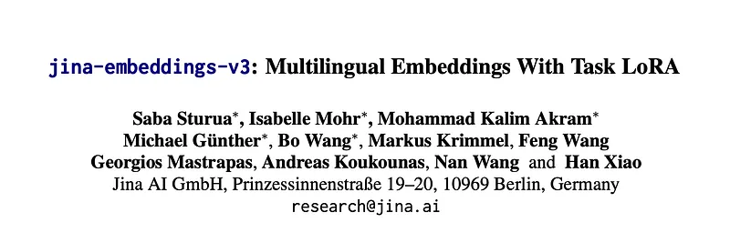 | Title card: Jina Embeddings v3. |
| 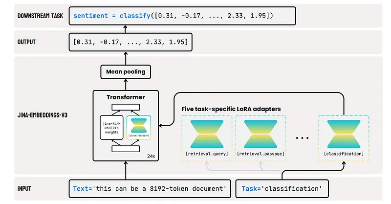 | The architecture of jina-embeddings-v3. |
| 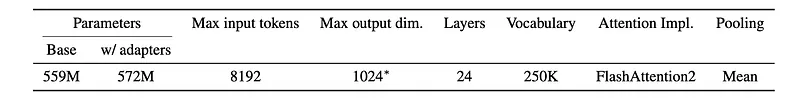 | Model specification of jina-embeddings-v3. |
|  | Fine-Tuning for the Embedding Task. |
| 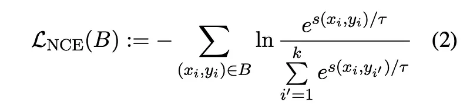 | The training data consists of over one billion text pairs, drawn from more than 300 distinct sub- datasets, each representing specific... |
| 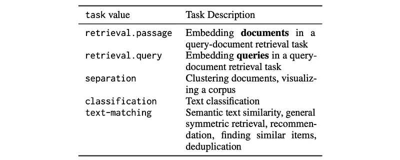 | Supported tasks of jina-embeddings-v3. |
| 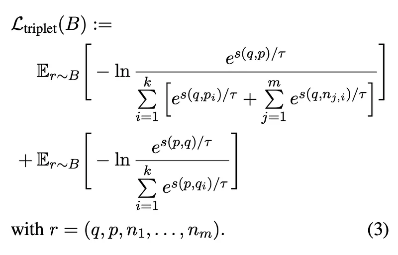 | From each dataset, tuples consisting of two text values from the same class (q, p) and seven text values from different classes (n1,. |
| 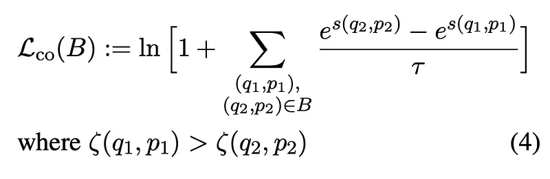 | This adapter is trained to produce embeddings that quantify the similarity between two text values. |
| 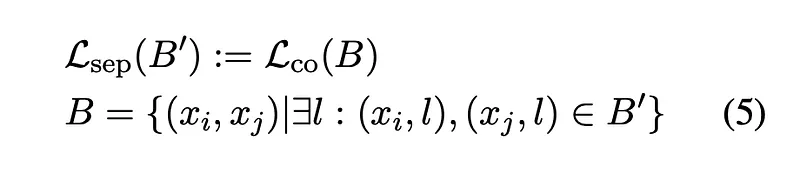 | The separation adapter is designed to perform well on clustering and reranking tasks. |
| 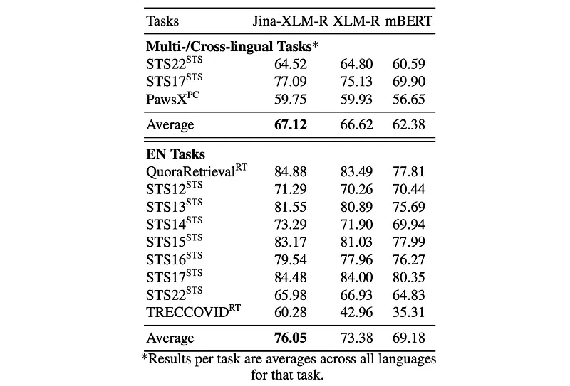 | Evaluation of multilingual pre-trained models after short embedding training on pair-wise data. |
| 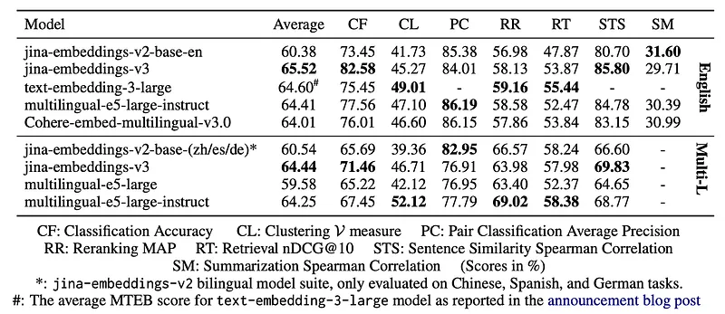 | Performance of multilingual text embedding models on MTEB tasks as averages. |
| 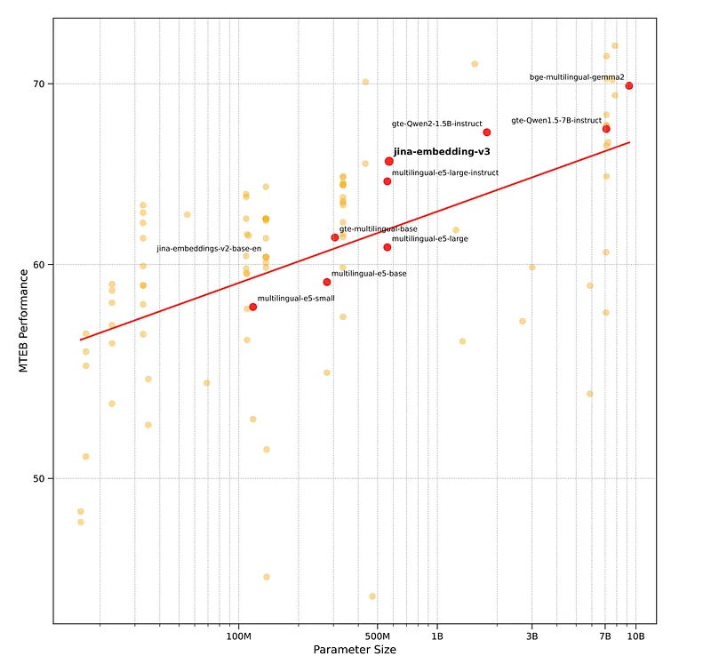 | To mitigate these failures. |
| 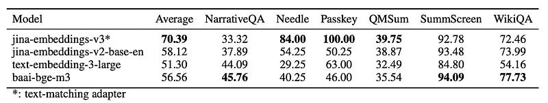 | Evaluation of nDCG@10 [%] on MTEB LongEmbed Tasks. |
| 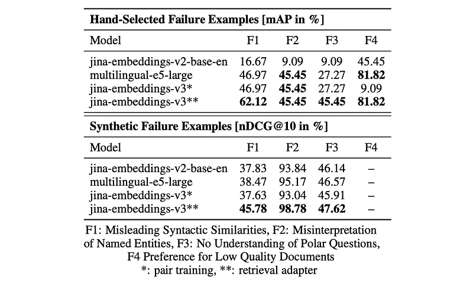 | Evaluation of Failure Cases. |
## Related

- [[Papers Explained Corpus]]
- [[Embedding and Retrieval]]
- [[Multilingual Models]]
- [[Large Language Models]]
- [[Model Compression and Efficiency]]
- [[Safety and Alignment]]
- [[Papers Explained 265 - Jina Bilingual Embeddings]]
- [[Papers Explained 267 - Jina Reranker]]

#summary #topic
