# Papers Explained 267 - Jina Reranker

Jina Reranker is a neural reranking model designed to tackle this critical issue of relevancy. It enhances search and RAG system by reordering retrieved documents in a manner that deeply and contextually understands the search query terms.

This page ingests the source article into the wiki and connects it to [[Papers Explained Corpus]], [[Embedding and Retrieval]], [[Agentic AI]], [[Multilingual Models]], [[Code Models]].

## Source Metadata

- Source file: `raw/2024-12-06_Papers-Explained-267--Jina-Reranker-daf6fdf8b2a6.html`
- Source title: Papers Explained 267: Jina Reranker
- Published: 2024-12-06
- Canonical: [https://medium.com/@ritvik19/papers-explained-267-jina-reranker-daf6fdf8b2a6](https://medium.com/@ritvik19/papers-explained-267-jina-reranker-daf6fdf8b2a6)

## Key Ideas

- On average, the introduction of Jina Reranker elevates the Hit Rate from 0.7908 to 0.8553 (+7.9%), and the MRR from 0.5307 to 0.7091 (+33.7%).
- Jina Reranker v2 represents an important expansion of capabilities for search foundation:
- State-of-the-art retrieval using cross-encoding opens up a wide array of new application areas.
- Enhanced multilingual and cross-language functionality removes language barriers from your use cases.
- Best-in-class support for function calling, together with awareness of structured data querying, takes your agentic RAG capabilities to the next level of precision.

## Notes

Jina Reranker is a neural reranking model designed to tackle this critical issue of relevancy. It enhances search and RAG system by reordering retrieved documents in a manner that deeply and contextually understands the search query terms.

## Why do we need a reranker

*Figure: The comparison of the representation-based cosine similarity (left) and the reranker (right).*

Cosine similarity quantifies the similarity between two documents by measuring the cosine of the angle between their embedding vectors. This metric is valued for its simplicity and has been used in many vector databases as the default way of retrieval. However, this approach tends to oversimplify interaction between query and documents. Specifically, it struggles with capturing the nuanced interaction at the sub-document level and sub-query level, often missing the full depth of user intent and the fine details of document relevance.

*Figure: A practical search system often chains the embedding-based search and the reranker together to achieve the best search quality.*

This is where rerankers come into play. Utilizing deep neural networks, rerankers go deeper into the interactions between the query and the shortlisted documents. They move beyond basic document-level embeddings to embrace token-level interactions that occur within the query, within the document, and across the query-document boundary. Although this method is more computationally intensive compared to simple cosine similarity, it enables a nuanced comparison that incorporates context, semantic meaning, and the intent behind the query, substantially improving the relevancy of search results.

## Evaluation

LlamaIndex RAG

- On average, the introduction of Jina Reranker elevates the Hit Rate from 0.7908 to 0.8553 (+7.9%), and the MRR from 0.5307 to 0.7091 (+33.7%).

BEIR

MTEB

LoCo

## Jina Reranker v2

Jina Reranker v2 represents an important expansion of capabilities for search foundation:

- State-of-the-art retrieval using cross-encoding opens up a wide array of new application areas.

- Enhanced multilingual and cross-language functionality removes language barriers from your use cases.

- Best-in-class support for function calling, together with awareness of structured data querying, takes your agentic RAG capabilities to the next level of precision.

- Better retrieval of computer code and computer-formatted data can go far beyond just doing text information retrieval.

- Much faster document throughput.

The training of Jina Reranker v2 is conducted in four stages.

- Initially, a backbone model is prepared by training it with only English-language data, including pairs (contrastive training) or triplets (query, correct response, wrong response), query-function schema pairs and query-table schema pairs.

- Next, cross-lingual pairs and triplets datasets are added to improve the backbone model’s multilingual abilities on retrieval tasks specifically.

- In the third stage, the model checkpoint from the second stage is fine-tuned with all pairs and triplet datasets from over 100 low- and high-resource languages.

- Finally, after observing the reranking performance from the third stage, the model is further fine-tuned by adding more triplet data with specifically more examples of hard-negatives for existing queries — responses that look superficially relevant to the query but are in fact wrong.

### Evaluation

MKQA: Multilingual Knowledge Questions and Answers

*Figure: Recall@10 scores reported for different reranking models for MKQA dataset.*

BEIR: Heterogeneous Benchmark on Diverse IR Tasks

*Figure: NDCG@10 scores reported for different reranking models for Beir dataset.*

- The newly-introduced multilingual capabilities don’t compromise its English-language retrieval capabilities.

### Jina Reranker v2 on Structured Data Querying

Jina Reranker v2 understands the downstream intent to query a source of structured databases, such as MySQL or MongoDB, and assigns the correct relevance score to a structured table schema, given an input query.

*Figure: Recall@3 scores reported for different reranking models for NSText2SQL dataset*

### Jina Reranker v2 on Function Calling

Function calling is also integrated into Jina Reranker v2, letting it understand the intent for external functions and assigning relevance scores to function specifications accordingly.

The ToolBench benchmark collects over 16 thousand public APIs and corresponding synthetically-generated instructions for using them in single and multi-API settings.

*Figure: Recall@3 scores reported for different reranking models for ToolBench dataset.*

### Jina Reranker v2 on Code Retrieval

Jina Reranker v2 improves code retrieval compared to competing models of similar size.

The CodeSearchNet benchmark is a combination of queries in docstring and natural language formats, with labelled code-segments relevant to the queries.

*Figure: MRR@10 scores reported for different reranking models for CodeSearchNet dataset*

## Paper

[Maximizing Search Relevance and RAG Accuracy with Jina Reranker](https://jina.ai/news/maximizing-search-relevancy-and-rag-accuracy-with-jina-reranker/)

[Jina Reranker v2 for Agentic RAG: Ultra-Fast, Multilingual, Function-Calling & Code Search](https://jina.ai/news/jina-reranker-v2-for-agentic-rag-ultra-fast-multilingual-function-calling-and-code-search/)

Recommended Reading [Retrieval and Representation Learning](https://ritvik19.medium.com/list/retrieval-and-representation-learning-bcd23de0bd8e)

## Figures

Figures from the Medium HTML export (`raw/2024-12-06_Papers-Explained-267--Jina-Reranker-daf6fdf8b2a6.html`); local copies under `wiki/assets/papers-explained-267-jina-reranker/` when download succeeded.

| Figure | Caption |
|--------|---------|
| 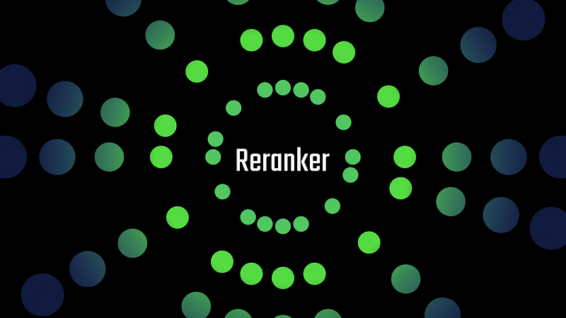 | Title card: Jina Reranker. |
| 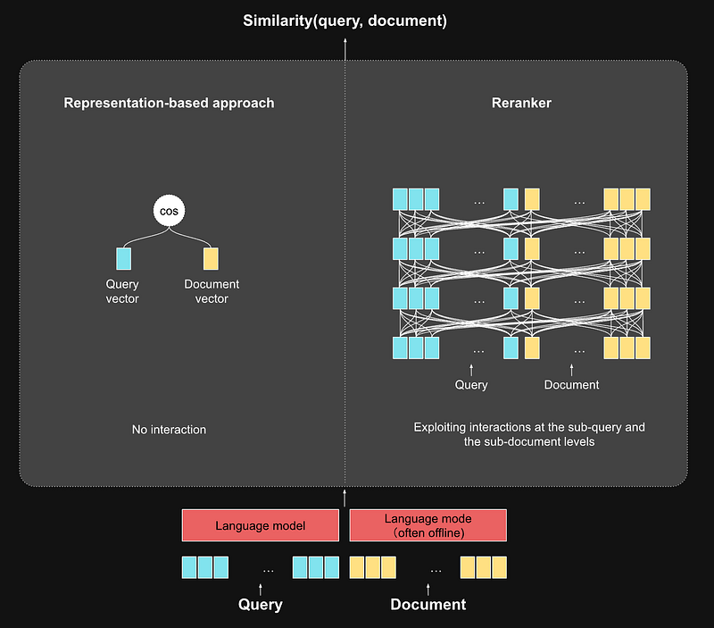 | The comparison of the representation-based cosine similarity (left) and the reranker (right). |
| 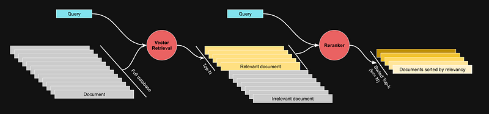 | A practical search system often chains the embedding-based search and the reranker together to achieve the best search quality. |
| 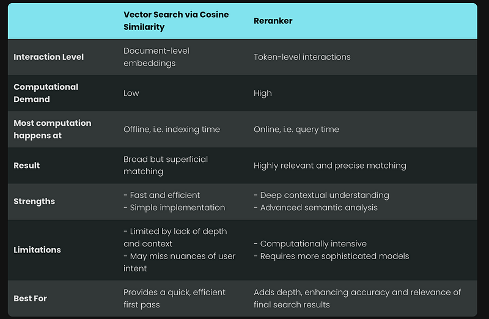 | This is where rerankers come into play. |
| 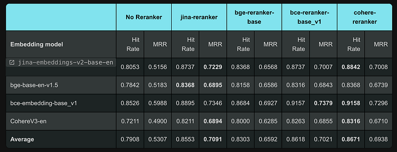 | LlamaIndex RAG. |
| 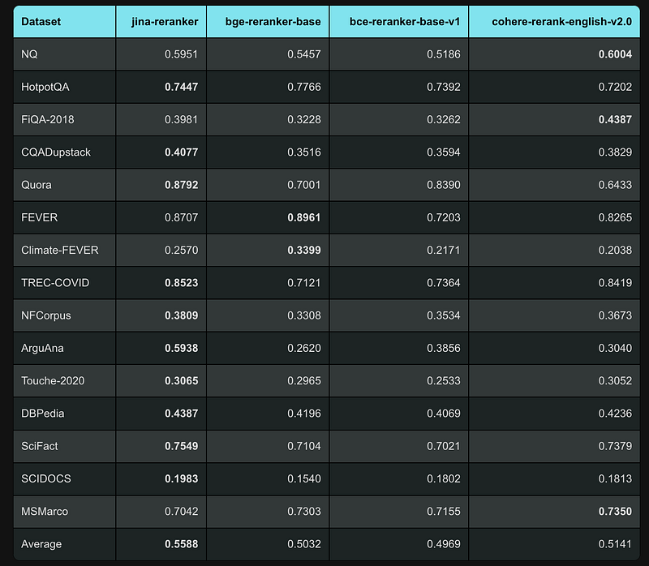 | BEIR. |
| 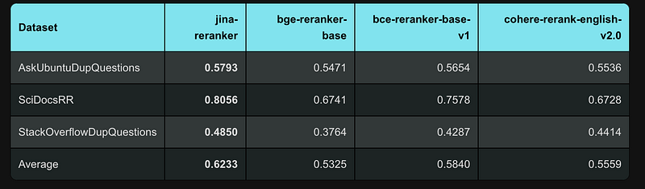 | MTEB. |
| 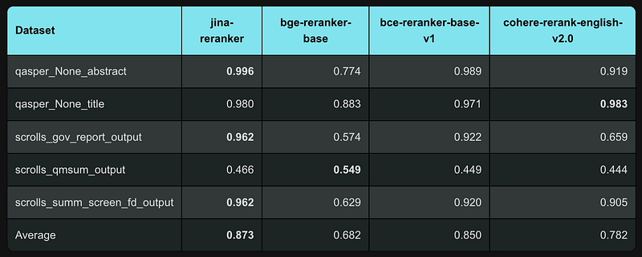 | LoCo. |
| 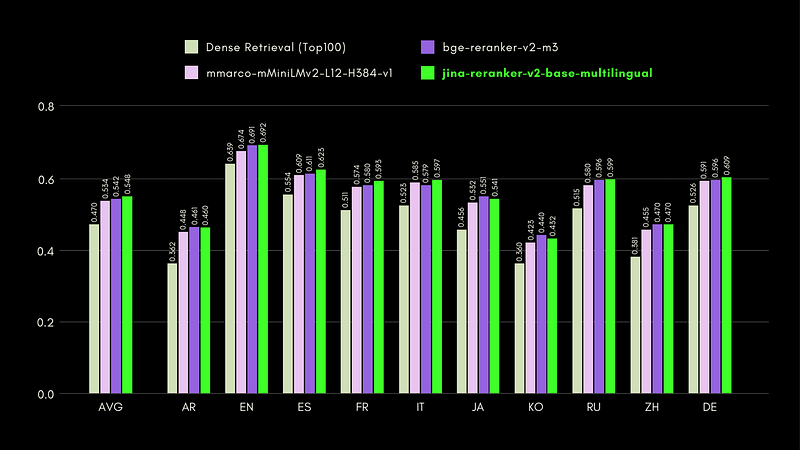 | Recall@10 scores reported for different reranking models for MKQA dataset. |
| 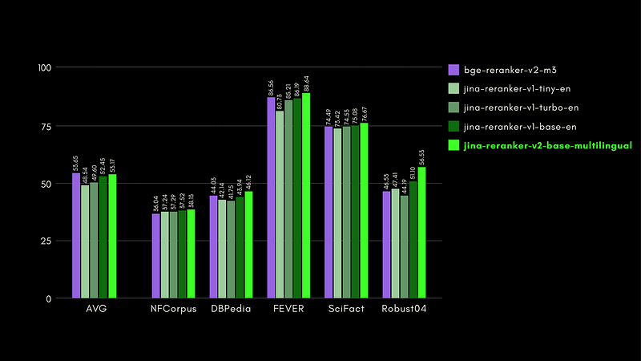 | NDCG@10 scores reported for different reranking models for Beir dataset. |
| 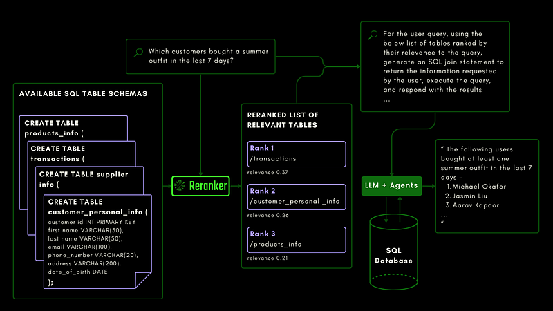 | BEIR: Heterogeneous Benchmark on Diverse IR Tasks. |
| 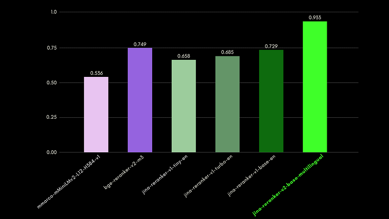 | Recall@3 scores reported for different reranking models for NSText2SQL dataset. |
| 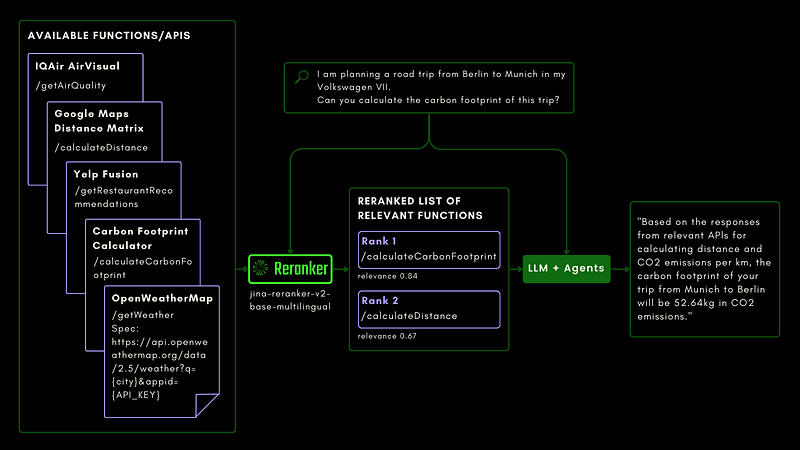 | BEIR: Heterogeneous Benchmark on Diverse IR Tasks. |
| 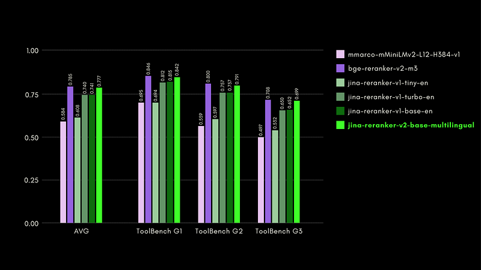 | Recall@3 scores reported for different reranking models for ToolBench dataset. |
| 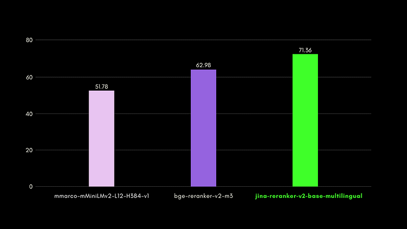 | MRR@10 scores reported for different reranking models for CodeSearchNet dataset. |
## Related

- [[Papers Explained Corpus]]
- [[Embedding and Retrieval]]
- [[Agentic AI]]
- [[Multilingual Models]]
- [[Code Models]]
- [[Papers Explained 266 - Jina Embeddings v3]]
- [[Paper Explained 268 - PaliGemma2]]

#summary #topic
