# Papers Explained 269 - Eagle

This work systematically investigates the mixture-of-vision-encoders design space for improved MLLM perception and leads to several interesting new findings:

This page ingests the source article into the wiki and connects it to [[Papers Explained Corpus]], [[Mixture of Experts]], [[Vision Language Models]], [[Safety and Alignment]], [[Embedding and Retrieval]], [[Large Language Models]].

## Source Metadata

- Source file: `raw/2024-12-10_Papers-Explained-269--Eagle-09c21e549395.md`
- Source title: Papers Explained 269: Eagle
- Published: 2024-12-10
- Canonical: [https://medium.com/@ritvik19/papers-explained-269-eagle-09c21e549395](https://medium.com/@ritvik19/papers-explained-269-eagle-09c21e549395)

## Key Ideas

- Unlocking vision encoders during MLLM training is crucial.
- Simple channel concatenation outperforms complex fusion strategies.
- Incorporating additional vision experts consistently improves performance.
- Pre-alignment of non-text-aligned experts significantly enhances performance.
- The project is available at [GitHub](https://github.com/NVlabs/Eagle/).

## Notes

This work systematically investigates the mixture-of-vision-encoders design space for improved MLLM perception and leads to several interesting new findings:

- Unlocking vision encoders during MLLM training is crucial.

- Simple channel concatenation outperforms complex fusion strategies.

- Incorporating additional vision experts consistently improves performance.

- Pre-alignment of non-text-aligned experts significantly enhances performance.

The project is available at [GitHub](https://github.com/NVlabs/Eagle/).

## Design space exploration

*Figure: Overview of the Eagle exploration pipeline.*

The basic CLIP encoder is extended to a set of vision experts with different architectures, pre-training tasks, and resolutions. Different fusion architectures and methods are compared, and pre-training strategies are optimized given more encoders.

### Base setup

LLaVA’s model architecture is used as the basis, which consists of an LLM, a vision encoder, and a projection layer. The projection layer projects the visual embedding from the vision encoder into the text embedding space.

The same pre-training data as LLaVA-1.5, which consists of 595k image text pairs is used. For the supervised fine-tuning stage, data is collected from a series of tasks and convert them into multimodal conversations, including: LLaVA-1.5, Laion-GPT4V, ShareGPT-4V, DocVQA, synDog-EN, ChartQA, DVQA, and AI2D, resulting in 934k samples.

Firstly, the model is pre-trained with image-text pairs for one epoch, where the whole model is frozen and only the projector layer is updated. In the second stage, the model is finetuned on the supervised fine-tuning data for one epoch. For this exploration, Vicuna-7B is used as the underlying language model.

### Stronger CLIP encoder

To effectively adapt the CLIP model for higher-resolution input images in multimodal learning tasks, different strategies are compared, with frozen/unfrozen vision encoders under different resolutions:

- Tiling: input images are divided into tiles and encoded separately.

- Directly scaling up the input resolution and interpolating the position embeddings of the vision transformer model if needed.

*Figure: Comparison of different high-resolution adaption methods.*

- Unfreezing the CLIP encoder leads to significant improvement when interpolating to a higher MLLM input resolution that is different from the CLIP pre-training resolution. There is also no performance degradation when resolutions remain the same.

- When the CLIP encoder is frozen, directly adapting it to a higher MLLM input resolution considerably hurts the performance.

- Among the compared strategies, directly interpolating to 448 × 448 with an unfrozen CLIP encoder is shown to be both effective and efficient in terms of performance and cost.

- The best CLIP encoder gets close to InternVL in performance despite the significantly smaller model size (300M vs. 6B) and less pre-training data.

### Vision experts

To better establish the foundation for multi-vision expert fusion, vision experts pre-trained on different tasks and resolutions are experimented, and findings are verified on high-resolution adaptations.

*Figure: Detailed setting of the pre-trained vision experts.*

*Figure: Comparison between different vision experts as the MLLM encoders.*

MLLMs with the task-specific vision encoders achieve optimal performance in their pre-training domains:

- EVA-02 excels in the object hallucination evaluation benchmark POPE and general visual question answering benchmark GQA.

- CLIP and ConvNeXt perform well across all benchmarks, benefiting from their training on large-scale image- text pairs using contrastive loss.

- Conversely, while Pix2Struct excels in text recognition, it shows limited capability in object recognition and general VQA tasks, like POPE and GQA.

- DINOv2 and SAM, pre-trained with self-supervised learning and semantic segmentation respectively, struggle with text recognition tasks.

### Fusion strategy

The existing popular fusion strategies, despite their variations in designs, can be broadly represented by the following several categories:

- Sequence Append: directly appending the visual tokens from different backbones as a longer sequence.

- Channel Concatenation: concatenating the visual tokens along the channel dimension without increasing the sequence length.

- LLaVA-HR: injecting high-resolution features into low-resolution vision encoders using a mixture- of-resolution adapter.

- Mini-Gemini: using the CLIP tokens as the low resolution queries to cross-attend another high-resolution vision encoder in the co-located local windows.

- Deformable Attention: a new baseline we introduce on top of Mini-Gemini, where the vanilla window attention is replaced with deformable attention.

To study these, “CLIP+ConvNeXt” and “CLIP+ConvNeXt+SAM” are used as the base multi-encoder combinations to perform comparisons.

*Figure: Comparison of different fusion methods for different vision experts.*

- Channel Concatenation achieves the best average performance while maintaining better throughput compared to sequence append.

- The “injection-based” methods, such as LLaVA-HR, Mini-Gemini and Deformable Attention, are in general less competitive on TextVQA and OCRBench, performing worse than using ConvNeXt alone as the vision encoder. A plausible explanation is that the CLIP features continue to play a dominant role in the visual tokens.

- Although sequence append shows comparable performance to channel concatenation, it faces the challenge to handle more vision encoders due to the increasing sequence length.

### Vision-Language Pre-Alignment

Instead of training a projector to simultaneously align multiple vision experts as in LLaVA’s original pre-training strategy, Pre-Alignment first aligns the representation of each individual expert with a smaller language model (Vicuna-7B in practice) using next-token-prediction supervision.

*Figure: The proposed training strategy of Eagle.*

- training each pre-trained vision expert with their own projector on SFT data, while keeping the language model frozen

- combining all the vision experts from the first step and training only the projector with image-text pairs data

- training the whole model on the SFT data.

*Figure: Experiments to show the effectiveness of Pre-Align.*

- Although unfreezing the vision experts during SFT helps improve performance by updating the vision experts to fit the language model, the Pre-Align strategy more effectively mitigates the inherent biases of each vision expert and stabilizes the training process, subsequently improving overall performance.

### Extension to multi-experts

CLIP, ConvNeXt, SAM, DINOv2, Pix2Struct, and EVA-02-L are marked as A, B, C, D, E, and F, respectively.

*Figure: Results of vision expert selection process.*

- Generally, introducing additional vision encoders enhances the performance. This indicates that the distinct advantages of different encoders can be preserved and utilized.

- Although individual metrics may vary, the aggregated performance shows an upward trend, as evidenced by normalized average metrics, suggesting that the overall efficacy of the system is enhanced with more encoders.

- The best combination of vision experts are CLIP, ConvNeXt, SAM, Pix2Struct, and EVA-02.

## Experiments

Language Models

- Vicuna-v1.5–7B

- Llama3–8B

- Vicuna-v1.5–13B

Vision Encoders

- Model with four vision encoders: CLIP, ConvNeXt, Pix2Struct and EVA-02 is denoted as Eagle-X4

- The model with an additional SAM vision encoder is denoted as Eagle-X5.

The following data is used for fine tuning:

*Figure: The advanced training data used in the supervised fine-tuning stage.*

To better perform an apple-to-apple comparison with recent open-source MLLM projects, Eagle-X5 is also trained with the same data as Cambrian-1, including 2.5M and 7M data for pre-training and supervised fine-tuning.

### Main results

*Figure: Results with the advanced training data recipe.*

- VQA: Eagle-X5 achieves state-of-the-art results on GQA and VQAv2 benchmarks.

- OCR and Document Understanding: Eagle significantly outperforms competitors on TextVQA, demonstrating strengths in high-resolution adaptation and integration of vision encoders.

- Multimodal Benchmarks: Eagle consistently surpasses existing models on SEED and MME benchmarks, showcasing comprehensive knowledge and reasoning abilities.

- POPE Benchmark: Eagle achieves the best performance on the POPE benchmark, benefiting from vision encoders specialized in object-centric tasks.

### Comparison with Cambrian-1

*Figure: Results using Cambrian-1 training data.*

- Eagle outperforms the Cambrian-1 counterparts considerably on the OCR and Chart category.

- Consistent improvements are also observed on the General, Knowledge and Vision-Centric categories.

## Paper

Eagle: Exploring The Design Space for Multimodal LLMs with Mixture of Encoders [2408.15998](https://arxiv.org/abs/2408.15998)

Recommended Reading [Multi Modal Transformers](https://ritvik19.medium.com/list/multi-modal-transformers-67453f215ecf)

## Figures

Figures from the Medium HTML export (`raw/2024-12-10_Papers-Explained-269--Eagle-09c21e549395.md`); local copies under `wiki/assets/papers-explained-269-eagle/` when download succeeded.

| Figure | Caption |
|--------|---------|
| 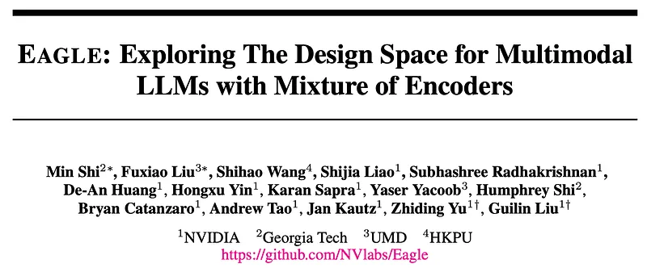 | Title card: Eagle. |
| 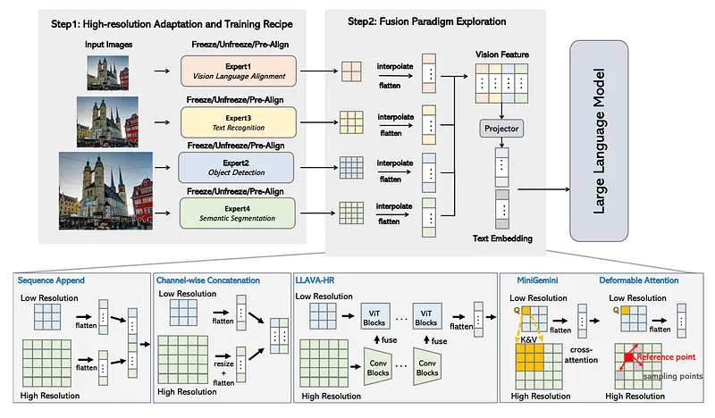 | Overview of the Eagle exploration pipeline. |
| 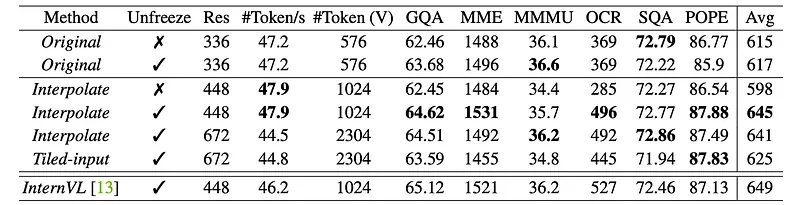 | Comparison of different high-resolution adaption methods. |
| 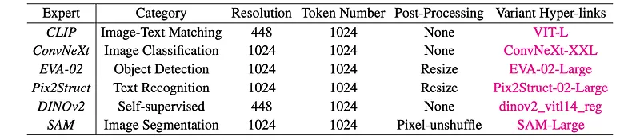 | Detailed setting of the pre-trained vision experts. |
| 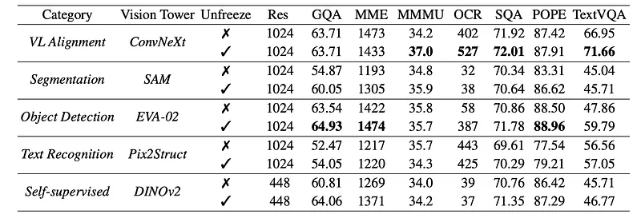 | Comparison between different vision experts as the MLLM encoders. |
| 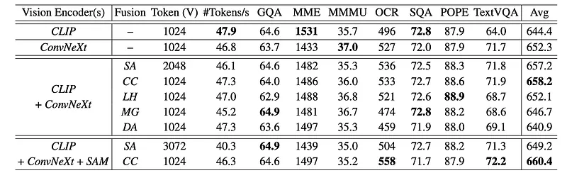 | Comparison of different fusion methods for different vision experts. |
| 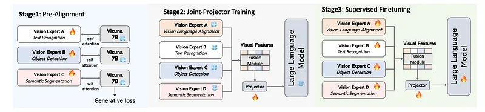 | The proposed training strategy of Eagle. |
| 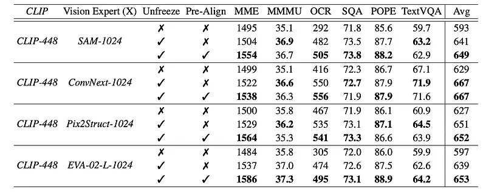 | Experiments to show the effectiveness of Pre-Align. |
| 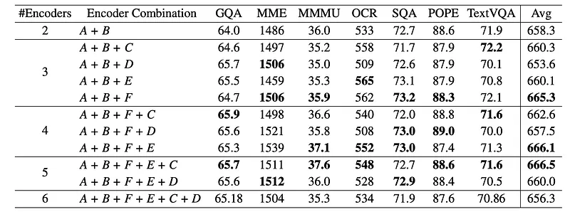 | Results of vision expert selection process. |
| 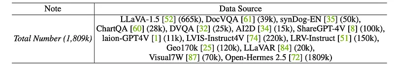 | The advanced training data used in the supervised fine-tuning stage. |
| 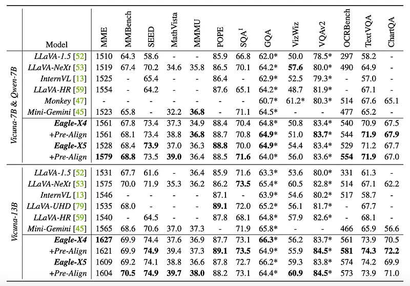 | Results with the advanced training data recipe. |
| 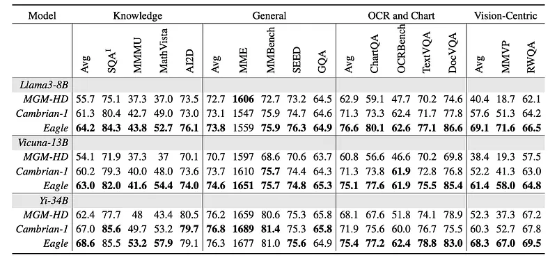 | Results using Cambrian-1 training data. |
## Related

- [[Papers Explained Corpus]]
- [[Mixture of Experts]]
- [[Vision Language Models]]
- [[Safety and Alignment]]
- [[Embedding and Retrieval]]
- [[Large Language Models]]
- [[Paper Explained 268 - PaliGemma2]]
- [[Papers Explained 270 - OLMoE]]

#summary #topic
