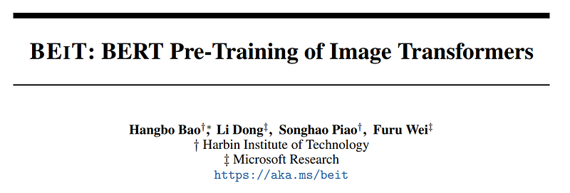
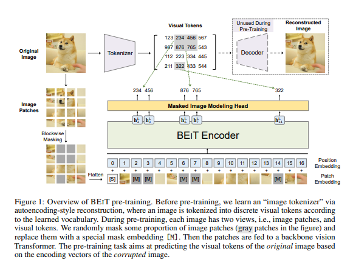

# Papers Explained 27 - BEiT

The images have two views of representations in our method, namely, image patch, and visual tokens. The two types serve as input and output representations during pre-training, respectively.

This page ingests the source article into the wiki and connects it to [[Papers Explained Corpus]], [[Large Language Models]], [[Computer Vision]], [[Embedding and Retrieval]].

## Source Metadata

- Source file: `raw/2023-02-09_Papers-Explained-27--BEiT-b8c225496c01.html`
- Source title: Papers Explained 27: BEiT
- Published: 2023-02-09
- Canonical: [https://medium.com/@ritvik19/papers-explained-27-beit-b8c225496c01](https://medium.com/@ritvik19/papers-explained-27-beit-b8c225496c01)

## Key Ideas

- The 2D image is split into a sequence of patches, so that a standard Transformer can directly accept image data.
- In experiments, a 224 × 224 image is split into a 14 × 14 grid of image patches, where each patch is 16 × 16.
- Similar to natural language, we represent the image as a sequence of discrete tokens obtained by an “image tokenizer”, instead of raw pixels. Specifically, we tokenize the image into z= [z1, …zN] ∈ V^h×w, where the vocabulary V contains discrete token indices.
- In experiments the image tokenizer learned by discrete variational autoencoder is used.
- There are two modules during visual token learning namely, tokenizer and decoder the Tokenizer maps image pixels into discrete tokens according to a visual codebook (vocabulary). The decoder learns to reconstruct the input image based on visual tokens.

## Notes

It is challenging to directly apply BERTstyle pre-training for image data. First of all, there is no pre-exist vocabulary for vision Transformer’s
input unit, i.e., image patches. So we cannot simply employ a softmax classifier to predict over all possible candidates for masked patches. In contrast, the language vocabulary, such as words and BPE, is well-defined and eases auto-encoding prediction. A straightforward alternative is regarding the task as a regression problem, which predicts the raw pixels of masked patches.
However, such pixel-level recovery task tends to waste modeling capability on pre-training shortrange dependencies and high-frequency details. The goal of BEiT is to overcome the above issues for pre-training of vision Transformers.

### Image Representations

The images have two views of representations in our method, namely, image patch, and visual tokens.
The two types serve as input and output representations during pre-training, respectively.

### Image Patch

The 2D image is split into a sequence of patches, so that a standard Transformer can directly accept image data. Formally, we reshape the image x ∈ R^ H×W×C into N = HW /P2 patches x^p ∈ R^ N×(P²C), where C is the number of channels, (H, W) is the input image resolution,and (P, P) is the resolution of each patch. The image patches are flattened into vectors and are linearly projected, which is similar to word embeddings in BERT. Image patches preserve raw pixels and are used as input features in BEIT.

In experiments, a 224 × 224 image is split into a 14 × 14 grid of image patches, where each patch is 16 × 16.

### Visual Token

Similar to natural language, we represent the image as a sequence of discrete tokens obtained by an “image tokenizer”, instead of raw pixels. Specifically, we tokenize the image into z= [z1, …zN] ∈ V^h×w, where the vocabulary V contains discrete token indices.

In experiments the image tokenizer learned by discrete variational autoencoder is used.

There are two modules during visual token learning namely, tokenizer and decoder the Tokenizer maps image pixels into discrete tokens according to a visual codebook (vocabulary). The decoder learns to reconstruct the input image based on visual tokens.

Each image is tokenized into a 14 x 14 grid of visual tokens, and the vocabulary size is set to 8192.

### Backbone Network: Image Transformer

Following ViT, the standard Transformer is used as the backbone network. So the results can be directly compared with previous work in terms of the network architecture.

- The input of Transformer is a sequence of image patches.

- The patches are then linearly projected to obtain patch embeddings.

- Moreover, a special token [S] is prepend to the input sequence.

- A standard learnable 1D position embeddings is also added to patch embeddings.

- The input vectors H0 = [e[S], Exp i, . . . , Exp N ] + Epos is fed into Transformer.

- The encoder contains L layers of Transformer blocks.

- The output vectors of the last layer are used as the encoded representations for the image patches.

## Pre-Training BEiT: Masked Image Modeling

The authors propose a masked image modeling (MIM) task, where they randomly mask some percentage of image patches, and then predict the visual tokens that are corresponding to the masked patches.

### Pre-Training Setup

The BEiT is pretrained on the training set of ImageNet-1K, which contains about 1.2M images. The augmentation policy includes random resized cropping, horizontal flipping, color jittering. Notice that we do not use the labels for self-supervised learning.

In the experiments the 224 × 224 resolution is used. So the input is split to 14 × 14 image patches, and the same amount of visual tokens. At most 75 patches (i.e., roughly 40% of total image patches) arer masked.

## Fine-Tuning BEiT on Downstream Vision Tasks

### Image Classification

For image classification tasks, we directly employ a simple linear classifier as the task layer. Specifically, we use average pooling to aggregate the representations, and feed the global to a softmax classifier. The category probabilities are computed as softmax.

BEiT is evaluated on the ILSVRC-2012 ImageNet dataset with 1k classes and 1.3M images

### Sementic Segmentation

For semantic segmentation, we use pretrained BEIT as a backbone encoder, and incorporate several deconvolution layers as decoder to produce segmentation. The model is also end-to-end fine-tuned similar to image classification.

BEiT is evaluated on the ADE20K benchmark with 25K images and 150 semantic categories. We report the metric of mean Intersection of Union (mIoU) averaged over all semantic categories.

## Paper

BEiT: BERT Pre-Training of Image Transformers [2106.08254](https://arxiv.org/abs/2106.08254)

Recommended Reading [Vision Transformers](https://ritvik19.medium.com/list/vision-transformers-61e6836230f1)

## Figures

Figures from the Medium HTML export (`raw/2023-02-09_Papers-Explained-27--BEiT-b8c225496c01.html`); local copies under `wiki/assets/papers-explained-27-beit/` when download succeeded.

| Figure | Caption |
|--------|---------|
|  | Title card: BEiT. |
|  | It is challenging to directly apply BERTstyle pre-training for image data. |
## Related

- [[Papers Explained Corpus]]
- [[Large Language Models]]
- [[Computer Vision]]
- [[Embedding and Retrieval]]
- [[Papers Explained 26 - Swin Transformer]]
- [[Papers Explained 28 - Masked AutoEncoder]]

#summary #topic
