# Papers Explained 271 - Spreadsheet LLM

where S ∈ Rm,n denotes the spreadsheet, T ∈ R1 denotes the text representation of a cell, and i, j, m, n respectively represent the row and column in- dex of the cell and the row and column range of S.

This page ingests the source article into the wiki and connects it to [[Papers Explained Corpus]], [[Document AI]], [[Large Language Models]], [[Reasoning Models]], [[Model Compression and Efficiency]].

## Source Metadata

- Source file: `raw/2024-12-12_Papers-Explained-271--Spreadsheet-LLM-25b9d70f06e3.html`
- Source title: Papers Explained 271: Spreadsheet LLM
- Published: 2024-12-12
- Canonical: [https://medium.com/@ritvik19/papers-explained-271-spreadsheet-llm-25b9d70f06e3](https://medium.com/@ritvik19/papers-explained-271-spreadsheet-llm-25b9d70f06e3)

## Key Ideas

- A Markdown-like style representation is used:
- The inclusion of cell format information (such as background color, bold font, borders, etc.) into each cell’s representation was also explored.
- This method identifies heterogeneous rows and columns at the edges of table bound- aries — termed structural anchors using heuristics:
- where rp = {Celli,j}i=p,j∈n and cq = {Celli,j}i∈m,j=q. Using these anchor points, the method discards rows and columns that are located more than k units away from any anchor point, because they rarely serve as table boundaries.
- The extracted rows and columns can be expressed as:

## Notes

Spreadsheet LLM introduces an efficient encoding method designed to unleash and optimize LLMs’ powerful understanding and reasoning capability on spreadsheets. SheetCompressor, an innovative encoding framework, effectively compresses spreadsheets for LLMs. It comprises three modules: structural-anchor-based compression, inverse index translation, and data-format-aware aggregation. Finally, Chain of Spreadsheet is proposed for downstream tasks of spreadsheet understanding and validated in a new and demanding spreadsheet QA task.

*Figure: The Spreadsheet LLM pipeline.*

## Sheet Compressor

*Figure: Sheet Compressor Framework.*

### Vanilla Spreadsheet Encoding with Cell Value, Address, and Format

A Markdown-like style representation is used:

where S ∈ Rm,n denotes the spreadsheet, T ∈ R1 denotes the text representation of a cell, and i, j, m, n respectively represent the row and column in- dex of the cell and the row and column range of S.

The inclusion of cell format information (such as background color, bold font, borders, etc.) into each cell’s representation was also explored. However, these experiments demonstrated that such detailed encoding adversely affects model performance due to rapid token limit exceedance and LLMs’ inadequate capability to process format information effectively.

### Structural-anchor-based Extraction

This method identifies heterogeneous rows and columns at the edges of table bound- aries — termed structural anchors using heuristics:

where rp = {Celli,j}i=p,j∈n and cq = {Celli,j}i∈m,j=q. Using these anchor points, the method discards rows and columns that are located more than k units away from any anchor point, because they rarely serve as table boundaries. The parameter k serves as a threshold to control the scope of neighborhood retention, effectively eliminating areas predominantly filled with homogeneous data that do not contribute to an understanding of the spreadsheet’s layout and structure.

The extracted rows and columns can be expressed as:

where the extracted “skeletons” are defined as: rp+ = {Celli,j}|i−p|≤k,j∈n and cq+ = {Celli,j}i∈m,|j−q|≤k. Then the extracted compact spreadsheet is obtained:

Based on the compressed spreadsheet Se, extremely shorter text representation Te can be obtained.

### Inverted-index Translation

The inverted-index-based Translation method involves two stages. The first stage converts the traditional matrix-style encoding into a dictionary format, where cell values serve as keys indexing the addresses. In the second stage, cells sharing the same value are merged, with empty cells excluded and cell addresses noted as ranges. This method effectively reduces the number of required tokens by eliminating redundancies and simplifying the representation of repeated and empty cells.

### Data-format-aware Aggregation

Number Format String (NFS), a built-in cell attribute in spreadsheets, is used to describe the format of cell data as a string. Spreadsheet users do not always explicitly add NFSs to cells, so NFSs are sometimes absent. As a complement, a rule-based recognizer is proposed to map a cell value to a specific predefined data type: Year, Integer, Float, Percentage, Scientific notation, Date, Time, Currency, Email, and Others. Finally, based on the NFSs and data type, the aggregator aggregates the cells by Algorithm 1. This process can be represented as follows:

## Chain of Spreadsheet

To extend the applicability of SpreadSheetLLM to a broader range of downstream tasks, the Chain of Spreadsheet (CoS) is introduced, which unfolds two stages:

- Table Identification and Boundary Detection: Leveraging the advances in spreadsheet table detection, the model identifies the table that is relevant to the query and determines the precise boundaries of the relevant content.

- Response Generation: The query and the identified table section are re-input into the LLM. The model then processes this information to generate an accurate response to the query.

## Experiments

### Compression Ratio

To quantitatively assess the effectiveness of the encoding process in reducing spreadsheet data size, Compression ratio (r = n/n′) is used to measure the effectiveness, where ’n’ is the original data size and ‘n′ is the encoded data size.

*Figure: Average Compression Ratio on test datasets.*

- The encoding methodology achieved a 25× compression ratio on the test set, significantly reducing computational load for large datasets.

### Spreadsheet Table Detection

*Figure: Results of various Model & Method configurations on spreadsheet table detection.*

Significant Performance Improvement:

- Fine-tuned GPT4 model with the encoding method achieved an F1 score of approximately 79%, surpassing the SOTA by 13% and establishing a new benchmark.

- Open-source models like Llama3 and Mistral-v2 also showed substantial improvements (F1 score of approximately 72%) after applying the encoding method.

Benefits for Larger Spreadsheets:

- The encoding method significantly boosted performance on larger spreadsheets, where token limits pose a challenge for LLMs.

Enhanced In-Context Learning (ICL):

- The encoding method improved ICL capabilities of GPT4 by nearly 26%.

Cost Reduction:

- The encoding method reduced the computational cost by almost 96% compared to using LLMs without compression.

### Spreadsheet QA

*Figure: The results for Spreadsheet QA.*

- The CoS method significantly improved model accuracy by 22% compared to the baseline GPT4 model.

- Fine-tuning the model on the spreadsheet table detection task led to a 6% accuracy improvement and outperformed TAPEX and Binder by 37% and 12%, respectively.

- The table-splitting algorithm improved accuracy by 3% and 5% on ICL and fine-tuning, respectively.

- These findings demonstrate the effectiveness of the CoS method, fine-tuning, and table-splitting algorithm in enhancing Spreadsheet QA performance.

## Paper

SpreadsheetLLM: Encoding Spreadsheets for Large Language Models [2407.09025](https://arxiv.org/abs/2407.09025)

## Figures

Figures from the Medium HTML export (`raw/2024-12-12_Papers-Explained-271--Spreadsheet-LLM-25b9d70f06e3.html`); local copies under `wiki/assets/papers-explained-271-spreadsheet-llm/` when download succeeded.

| Figure | Caption |
|--------|---------|
| 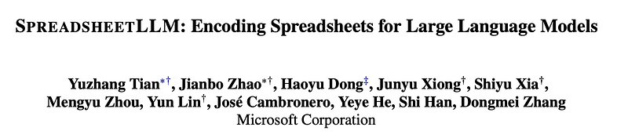 | Title card: Spreadsheet LLM. |
| 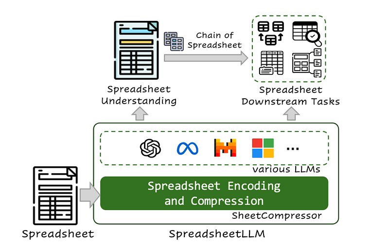 | The Spreadsheet LLM pipeline. |
| 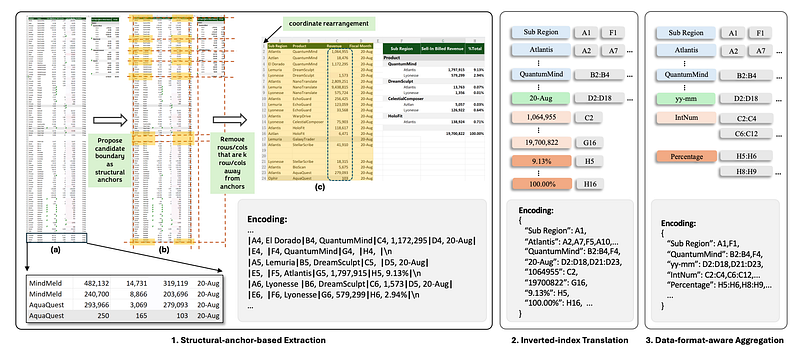 | Sheet Compressor Framework. |
| 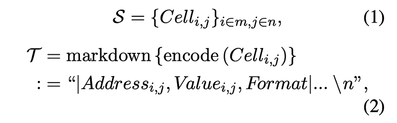 | A Markdown-like style representation is used. |
|  | This method identifies heterogeneous rows and columns at the edges of table bound- aries — termed structural anchors using heuristics. |
|  | The extracted rows and columns can be expressed as. |
| 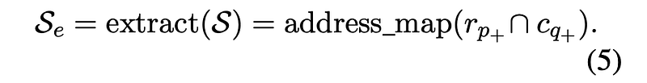 | where the extracted “skeletons” are defined as: rp+ = {Celli,j}|i−p|≤k,j∈n and cq+ = {Celli,j}i∈m,|j−q|≤k. Then the extracted compact spreadsheet is obtained. |
| 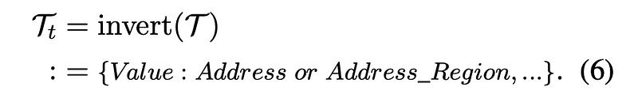 | The inverted-index-based Translation method involves two stages. |
| 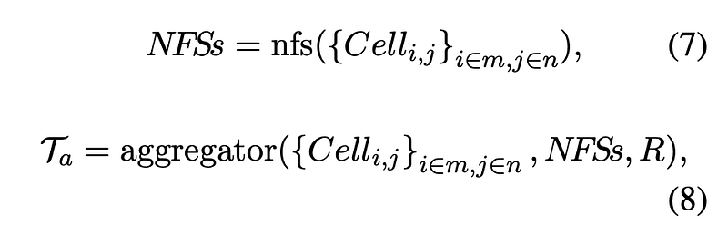 | Number Format String (NFS), a built-in cell attribute in spreadsheets, is used to describe the format of cell data as a string. |
| 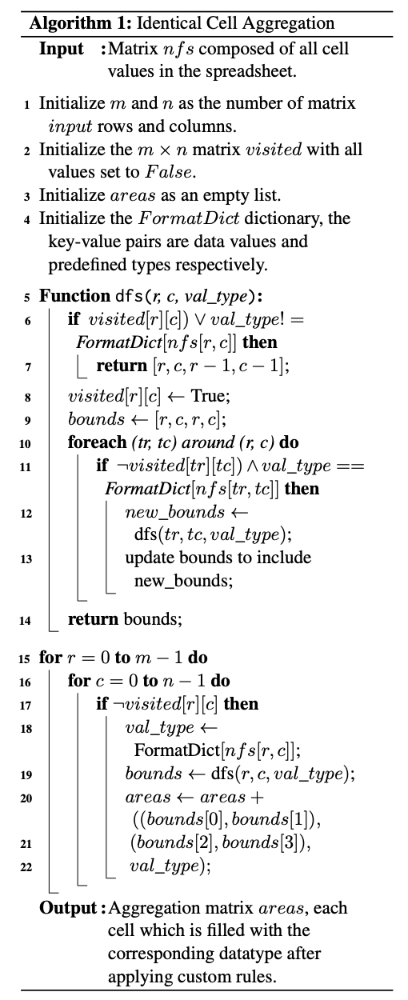 | Number Format String (NFS), a built-in cell attribute in spreadsheets, is used to describe the format of cell data as a string. |
| 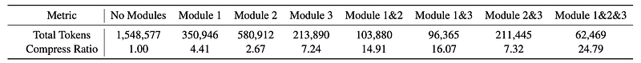 | Average Compression Ratio on test datasets. |
| 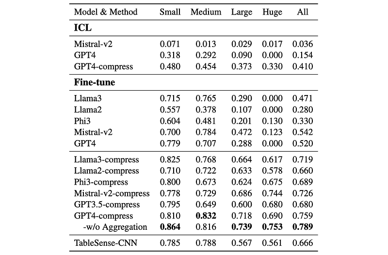 | Results of various Model & Method configurations on spreadsheet table detection. |
| 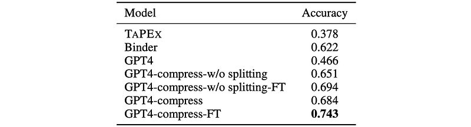 | The results for Spreadsheet QA. |
## Related

- [[Papers Explained Corpus]]
- [[Document AI]]
- [[Large Language Models]]
- [[Reasoning Models]]
- [[Model Compression and Efficiency]]
- [[Papers Explained 270 - OLMoE]]
- [[Papers Explained 272 - RAFT]]

#summary #topic
