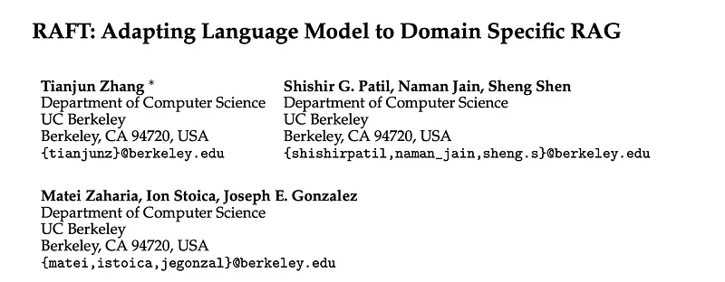
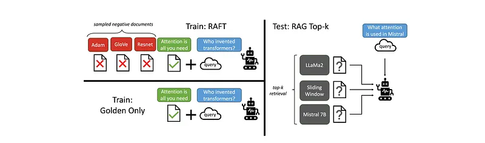
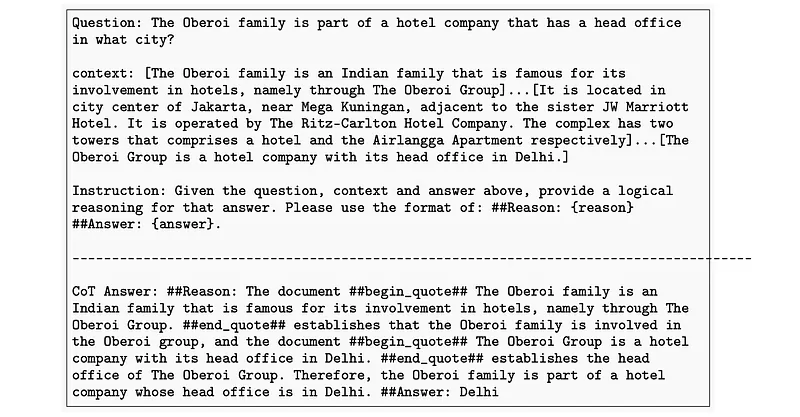
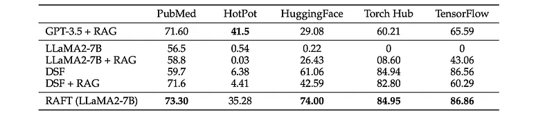
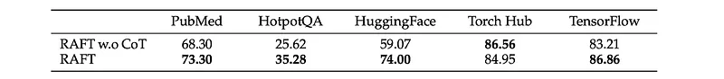
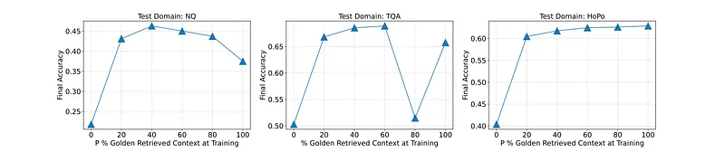
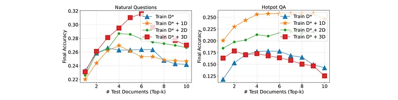

# Papers Explained 272 - RAFT

Retrieval Augmented Fine Tuning (RAFT) is a training method designed to enhance the performance of LLMs for “open-book” in-domain question answering tasks. Given a context and a set of retrieved documents, RAFT trains the model to ignore irrelevant documents and focus on the most pertinent information.

This page ingests the source article into the wiki and connects it to [[Papers Explained Corpus]], [[Document AI]], [[Embedding and Retrieval]], [[Synthetic Data]], [[Reasoning Models]], [[Large Language Models]], [[Supervised Fine-Tuning]].

## Source Metadata

- Source file: `raw/2024-12-16_Papers-Explained-272--RAFT-5049520bcc26.md`
- Source title: Papers Explained 272: RAFT
- Published: 2024-12-16
- Canonical: [https://medium.com/@ritvik19/papers-explained-272-raft-5049520bcc26](https://medium.com/@ritvik19/papers-explained-272-raft-5049520bcc26)

## Key Ideas

- Retrieval Augmented Fine Tuning (RAFT) is a training method designed to enhance the performance of LLMs for “open-book” in-domain question answering tasks.
- In the classical SFT setting, the model is trained to improve its ability to answer questions based on its knowledge — obtained either during pre-training, or during the SFT training phase.
- In RAFT, training data is prepared such that each data point contains a question (Q), a set of documents (Dk), and a corresponding Chain-of-though style answer (A∗) generated from one of the document (D∗).
- (Dk) has two types of documents: ‘golden’ documents (D∗) i.e. the documents from which the answer to the question can be deduced, and ‘distractor’ documents (Di) that do not contain answer- relevant information.
- For P fraction of the questions (qi) in the dataset, the golden document (di∗) is retained along with distractor documents (dk−1).

## Notes

Retrieval Augmented Fine Tuning (RAFT) is a training method designed to enhance the performance of LLMs for “open-book” in-domain question answering tasks. Given a context and a set of retrieved documents, RAFT trains the model to ignore irrelevant documents and focus on the most pertinent information. This is achieved by citing verbatim the relevant sequence from the chosen document to help answer the question, promoting logical reasoning and coherent responses.

## Method

*Figure: Overview of the RAFT method.*

In the classical SFT setting, the model is trained to improve its ability to answer questions based on its knowledge — obtained either during pre-training, or during the SFT training phase. The model so trained can also be used at test-time with Retrieval Augmented Generation (RAG) setting, where additional documents can be introduced in the prompt to help the model answer the question.

In RAFT, training data is prepared such that each data point contains a question (Q), a set of documents (Dk), and a corresponding Chain-of-though style answer (A∗) generated from one of the document (D∗).

(Dk) has two types of documents: ‘golden’ documents (D∗) i.e. the documents from which the answer to the question can be deduced, and ‘distractor’ documents (Di) that do not contain answer- relevant information. The ‘golden’ document doesn’t need to be a single document, but can be more than one document.

For P fraction of the questions (qi) in the dataset, the golden document (di∗) is retained along with distractor documents (dk−1).

For (1 − P) fraction of the questions (qi) in the dataset, no golden document is included and only distractor documents (dk) are included.

The language model is then fine-tuned using standard supervised training (SFT) technique, training it to generate answers from the provided documents and questions.

By removing the golden documents in some instances, the model is compelled to memorize answers instead of deriving them from the context. Subsequently, for the test scenario, the model is provided with the Q and top-k documents retrieved by the RAG pipeline.

Creating a full reasoning chain and in-addition, clearly citing sources enhances the model’s accuracy in answering questions.

*Figure: Sample RAFT training example*

## Evaluation

### Main Results

- RAFT with RAG significantly improves information extraction and robustness against distractors compared to Llama2–7B-chat with RAG.

- RAFT excels on tasks like Hotpot QA and HuggingFace, achieving gains of 30.87% and 31.41% respectively.

- While DSF with RAG improves performance, RAFT demonstrates a greater advantage, suggesting its effectiveness in both answering style alignment and context processing.

- RAFT even surpasses GPT-3.5 in certain tasks.

### Effect of COT

The performance of a model trained with and without the Chain-of-Thought prompting technique are compared.

*Figure: Ablation on Chain-of-Thought*

- Simply providing the answer to a question can lead to overfitting.

- Incorporating a reasoning chain (Chain-of-Thought) improves the model’s accuracy and prevents overfitting.

- The Chain-of-Thought approach enhances the training robustness of the model.

### How many golden documents to involve?

LLMs are trained with varying proportions of golden documents in the context (P%) and their performance is evaluated.

*Figure: How many golden documents to involve?*

- Incorporating a portion of the training data without the golden document (P = 80%) can enhance LLM performance on RAG tasks, challenging the assumption that golden documents should always be included (P = 100%).

- The optimal proportion (P%) of golden documents varies across datasets, ranging from 40% to 100%.

### RAFT Generalizes to Top-K RAG

The number of distractor documents is varied during training and the model’s performance is evaluated using the top-k retrieved documents.

*Figure: Test-Time Documents Varying.*

- Training with only golden documents often led to poorer performance compared to models trained with a mix of golden and distractor documents.

- The optimal number of distractor documents varied depending on the dataset (Natural Questions vs. Hotpot QA).

- Models trained with distractor documents demonstrated greater resilience to fluctuations in the number of documents presented at test time.

## Paper

RAFT: Adapting Language Model to Domain Specific RAG [2403.10131](https://arxiv.org/abs/2403.10131)

## Figures

Figures from the Medium HTML export (`raw/2024-12-16_Papers-Explained-272--RAFT-5049520bcc26.md`); local copies under `wiki/assets/papers-explained-272-raft/` when download succeeded.

| Figure | Caption |
|--------|---------|
|  | Title card: RAFT. |
|  | Overview of the RAFT method. |
|  | In RAFT, training data is prepared such that each data point contains a question (Q), a set of documents (Dk), and a corresponding... |
|  | By removing the golden documents in some instances, the model is compelled to memorize answers instead of deriving them from the context. |
|  | Sample RAFT training example. |
|  | Creating a full reasoning chain and in-addition, clearly citing sources enhances the model’s accuracy in answering questions. |
|  | Ablation on Chain-of-Thought. |
|  | How many golden documents to involve? |
|  | Test-Time Documents Varying. |
## Related

- [[Papers Explained Corpus]]
- [[Document AI]]
- [[Embedding and Retrieval]]
- [[Synthetic Data]]
- [[Reasoning Models]]
- [[Large Language Models]]
- [[Supervised Fine-Tuning]]
- [[Papers Explained 271 - Spreadsheet LLM]]
- [[Papers Explained 273 - LongCite]]

#summary #topic
